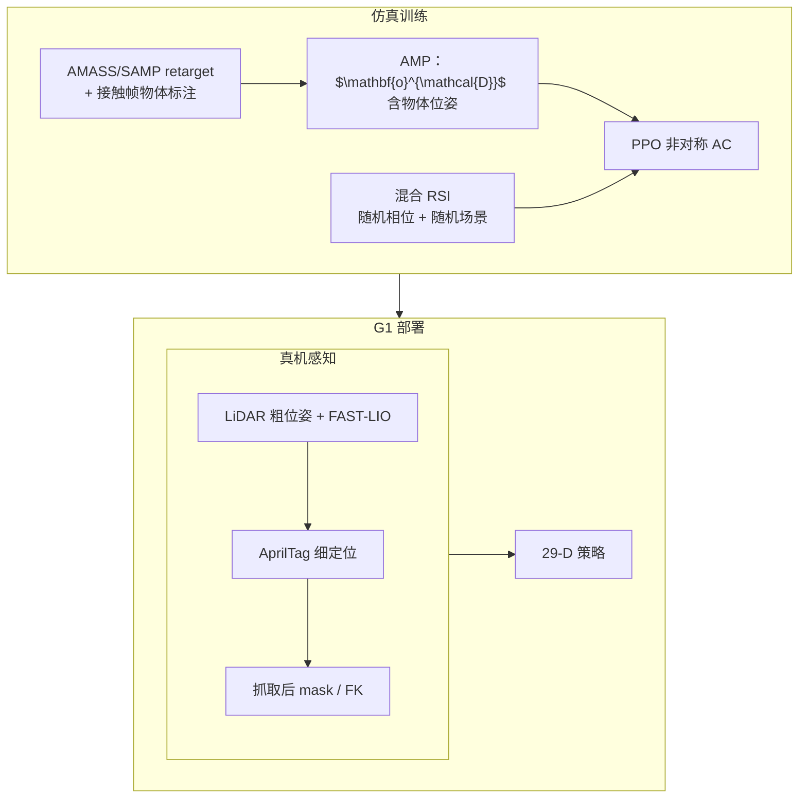

# PhysHSI：可部署的真实世界人形–场景交互

**PhysHSI**（*Towards a Real-World Generalizable and Natural Humanoid-Scene Interaction System*，arXiv:2510.11072）收录于 [AMP 运动先验专题](https://mp.weixin.qq.com/s/YZsm3855iP3TNTTt1aou7w) **第 15/19** 篇。核心命题：把 AMP 从 **「走路更好看」** 推到 **「在真实场景里搬、坐、躺、起」**——仿真里用 **物体感知的对抗先验 + 混合 RSI** 学泛化，真机里用 **粗–细 onboard 定位** 闭环。

## 一句话定义

**在含物体轨迹的 retarget MoCap 上用 AMP 训练四类长时程 HSI 策略，判别器观测包含物体位姿以隐式阶段感知；部署时 LiDAR 里程计与 AprilTag 分层定位，使 G1 在室内外以自然动作完成搬箱与坐躺站起。**

## 英文缩写速查

| 缩写 | 英文全称 | 简要说明 |
|------|----------|----------|
| AMP | Adversarial Motion Prior | 风格奖励 $r^S$ 与任务/正则奖励联合优化 |
| HSI | Humanoid-Scene Interaction | 人形与椅子、床、箱子等场景物体交互 |
| RSI | Reference State Initialization | 从参考轨迹随机相位初始化以改善探索 |
| Sim2Real | Simulation to Real | 域随机化 + 观测 mask 对齐真机感知 |
| G1 | Unitree G1 Humanoid | 29 DoF；Mid-360 LiDAR + D455 相机 |
| PPO | Proximal Policy Optimization | 仿真策略优化算法 |

## 为什么重要

- **系统级而非单技能：** 同一管线覆盖 **Carry / Sit / Lie / Stand Up** 与 **风格化行走**（恐龙步、高抬腿）——AMP 作为 **跨任务自然性底座**。
- **物体进判别器：** $\mathbf{p}^{o_t}_{b_t}$ 写入 $\mathbf{o}^{\mathcal{D}}_t$，使判别器区分接近/抓取/搬运阶段——长时程 HSI 的关键设计，区别于平地 AMP。
- **真机感知工程：** FAST-LIO 粗定位 + AprilTag 细定位 + 抓取后 mask；全栈 **Jetson Orin NX onboard**，非实验室 MoCap 依赖。
- **下游锚点：** [SplitAdapter](./paper-splitadapter-load-aware-loco-manipulation.md) 以 PhysHSI 类 **冻结 AMP 搬箱策略** 为基线做负载感知适配。

## 流程总览

## 核心机制（归纳）

### 1）数据与 AMP

- Post-annotation：先 retarget 得 $M_{\text{Robo}}$，再标接触关键帧 $\phi_1,\phi_2$ 规则生成物体轨迹。
- Actor 观测：5 步本体 + 任务观测（物体尺寸、位姿 6D、目标点）；动作 29-D 关节目标 + PD。
- 风格权重 $w^S$ **课程增大** + L2C2 平滑正则，抑制后期「刷分式」抽搐动作。

### 2）混合 RSI

- 从参考采样相位 $\phi$，随机化 $(\phi,1]$ 段场景（如搬箱目标点可与演示不同）。
- 部分 episode 从默认站姿 + 全随机场景启动，防止过拟合演示布局。

### 3）粗–细定位与 sim2real

| 阶段 | 方法 |
|------|------|
| 远距 | 手动 LiDAR 粗位姿 + 里程计传播（式 (6)） |
| 近距 | AprilTag → 自动切细定位 |
| 丢检 | 保留最近观测 + 里程计传播（式 (7)） |
| 动态箱 | 抓取后超阈值则 mask 物体位姿，靠本体完成 |
| 训练对齐 | 位姿噪声/延迟 + 与真机一致的 mask 规则 |

## 常见误区

1. **≠ 纯 MoCap 跟踪：** AMP 学 **风格分布**，任务奖驱动物体交互；不是逐帧硬跟踪 AMASS。
2. **≠ DIMOS：** [DIMOS](./paper-dimos-human-scene-motion-synthesis.md) 为 **SMPL 运动学合成**；PhysHSI 是 **物理 G1 + RL + 真机**。
3. **判别器见物体 ≠ actor 作弊：** 非对称训练；部署 actor 仅见 onboard 可观测量（含可能 mask 的物体估计）。
4. **单机器人：** 多智能体协作见 [TeamHOI #17](./paper-amp-survey-17-teamhoi.md)。

## 实验与评测

- **仿真 Table I：** 相对无 AMP、无 RSI、无物体判别等基线，PhysHSI 在四类任务 **成功率 $R_{\text{succ}}$** 与 **自然度 $S_{\text{human}}$** 双高。
- **真机：** 室内外搬箱、坐椅、躺床、站起；多样物体尺寸与目标位置。
- **风格化行走：** 证明同一 AMP 管线可承载非任务必需的表现力动作。

## 与其他页面的关系

- AMP 专题：[humanoid-amp-motion-prior-survey.md](../overview/humanoid-amp-motion-prior-survey.md)（#15/19）
- 任务：[loco-manipulation.md](../tasks/loco-manipulation.md)、[sim2real.md](../concepts/sim2real.md)
- 协作对照：[TeamHOI #17](./paper-amp-survey-17-teamhoi.md)
- 动态平台对照：[HUSKY #14](./paper-amp-survey-14-husky.md)
- 下游：[paper-splitadapter-load-aware-loco-manipulation.md](./paper-splitadapter-load-aware-loco-manipulation.md)

## 参考来源

- [physhsi_arxiv_2510_11072.md](../../sources/papers/physhsi_arxiv_2510_11072.md)
- [humanoid_amp_survey_15_physhsi_towards_a_real_world_generalizable_and_n.md](../../sources/papers/humanoid_amp_survey_15_physhsi_towards_a_real_world_generalizable_and_n.md)
- [humanoid_amp_survey_19_catalog.md](../../sources/papers/humanoid_amp_survey_19_catalog.md)
- [wechat_embodied_ai_lab_humanoid_amp_motion_prior_survey.md](../../sources/blogs/wechat_embodied_ai_lab_humanoid_amp_motion_prior_survey.md)

## 推荐继续阅读

- [PhysHSI 项目页](https://why618188.github.io/physhsi)
- [arXiv:2510.11072](https://arxiv.org/abs/2510.11072)
- [SplitAdapter（负载感知适配）](./paper-splitadapter-load-aware-loco-manipulation.md)
