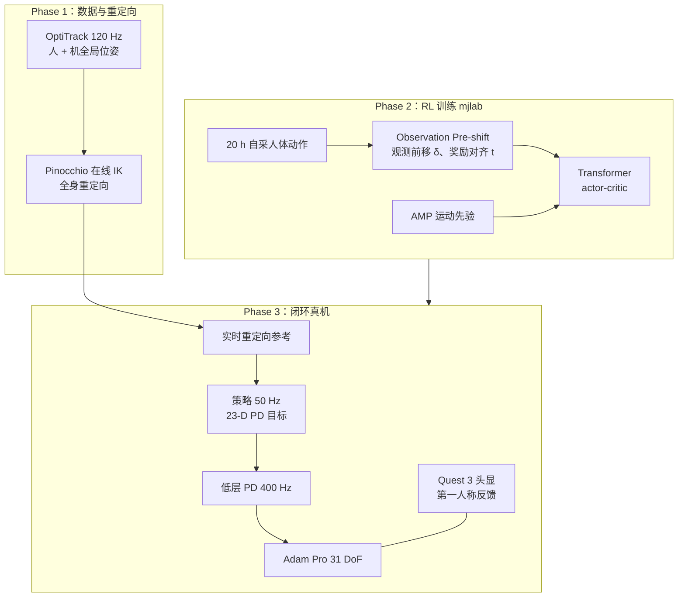

---

type: entity
tags: [paper, humanoid, amp, motion-prior, teleoperation, whole-body-control, motion-tracking, transformer, sim2real, pndbotics-adam-pro, shanghai-ai-lab, sjtu]
status: complete
updated: 2026-07-06
arxiv: "2602.15060"
venue: "arXiv"
code: https://github.com/zhutengjie/CLOT
summary: "CLOT：闭环全局位姿反馈的长时程全身遥操作——Observation Pre-shift 解耦观测/奖励、Transformer+PPO+AMP，在 Adam Pro 全尺寸人形上实现无漂移 mimicry。"
related:
  - ../overview/humanoid-motion-cerebellum-technology-map.md
  - ../overview/motion-cerebellum-category-06-cross-embodiment-teleop.md
  - ../overview/humanoid-amp-motion-prior-survey.md
  - ../overview/humanoid-rl-motion-control-body-system-stack.md
  - ../tasks/teleoperation.md
  - ../tasks/loco-manipulation.md
  - ../concepts/motion-retargeting.md
  - ../methods/motion-retargeting-gmr.md
  - ./paper-twist2.md
  - ./paper-twist.md
sources:
  - ../../sources/papers/clot_arxiv_2602_15060.md
  - ../../sources/papers/humanoid_amp_survey_16_clot_closed_loop_global_motion_tracking_for_whol.md
  - ../../sources/papers/humanoid_amp_survey_19_catalog.md
  - ../../sources/sites/clot-project.md
  - ../../sources/repos/clot.md
  - ../../sources/blogs/wechat_embodied_ai_lab_humanoid_amp_motion_prior_survey.md
  - ../../sources/papers/motion_cerebellum_64_catalog.md
  - ../../sources/blogs/wechat_embodied_ai_lab_humanoid_motion_cerebellum_survey.md
---

# CLOT

**CLOT**（*Closed-Loop Global Motion Tracking for Whole-Body Humanoid Teleoperation*，arXiv:2602.15060）是上交与上海 AI Lab 提出的 **实时全身人形遥操作系统**：用 **高频全局定位反馈** 闭环同步操作员与机器人位姿，配合 **Observation Pre-shift**、**Transformer** 策略与 **AMP** 运动先验，在 **PNDbotics Adam Pro**（31 DoF）上实现 **长时程无漂移** 全身 mimicry 与 loco-manipulation。

> **官方入口：** 项目页 <https://zhutengjie.github.io/CLOT.github.io/>（论文写作 `CLOT.github.io`）；裸域 clot.github.io **非官方**。

## 英文缩写速查

| 缩写 | 英文全称 | 简要说明 |
|------|----------|----------|
| AMP | Adversarial Motion Prior | 用对抗判别约束状态转移接近专家运动分布的先验 |
| RL | Reinforcement Learning | 通过与环境交互最大化长期回报来学习策略的范式 |
| IK | Inverse Kinematics | 满足末端/姿态约束求解关节角的运动学逆解 |
| PPO | Proximal Policy Optimization | 常用 on-policy 策略梯度 RL 算法 |
| WBT | Whole-Body Tracking | 全身参考运动跟踪控制接口 |
| CoM | Center of Mass | 质心；全尺寸人形漂移与安全风险的关键量 |

## 为什么重要

- 在 [运动小脑 64 篇技术地图](../overview/humanoid-motion-cerebellum-technology-map.md) 中归类为 **F 跨本体与遥操作**（46/64）：遥操作：闭环全局运动跟踪用于全身遥操作。
- **局部帧跟踪的结构性缺陷**：[TWIST2](./paper-twist2.md) 等便携方案擅长 **局部关节级 mimicry**，但忽视 **全局位姿反馈** 时，长时程必然 **漂移**——对全尺寸人形（高质心）尤危险。
- **闭环全局同步**：OptiTrack 同时捕获人与机 **全局位姿**，在线重定向后单一 **全局身体跟踪策略** 即可兜底上层 VLA/AGI 犯错时的 **身体分布边界**（AMP 专题导读语境）。
- **训练技巧可复用**：**Observation Pre-shift** 把「激进全局纠错」变成 **数据驱动的平滑插值学习**；与 **Transformer 长上下文**、**AMP 风格正则** 组合，在仿真与真机均验证。

## 流程总览

## 核心机制（归纳）

### 1）闭环全局遥操作

- **动捕**：OptiTrack **120 Hz** 全身 + Hi5 手套 **60 Hz** 手指。
- **重定向**：**Pinocchio** 解全身 IK（速度级优化 + 安全 clamp）。
- **执行**：策略 **50 Hz** 输出 23 关节 PD 目标；机载 PD **400 Hz**；头载相机 → **Quest 3** 沉浸反馈。

### 2）Observation Pre-shift

- 训练时以概率将 actor 观测中 **未来参考窗口随机前移** $\delta$，但 **跟踪奖励仍对应当前时刻** $t$。
- 迫使策略学习 **跨时间间隙的平滑插值**，避免全局误差大时 **力矩/速度尖峰** 式硬纠。
- **仅训练启用**，部署关闭。

### 3）Transformer + AMP

- **Actor 观测**：未来 10 步目标 + 本体 + 10 步历史（非对称 critic 设计）。
- **Transformer** 对各分量 token 化后 self-attention；大 pre-shift 下 **MLP 难收敛**。
- **复合奖励** $r=\lambda_{\text{style}} r_{\text{amp}}+\lambda_{\text{task}} r_{\text{task}}$：任务跟踪 + 对抗运动先验抑制不自然行为。
- 训练约 **1300 GPU 小时**；自采 **20 h** 人体数据（严格排除踮脚、过大 CoM 偏移等不稳定模式）。

## 常见误区或局限

- **不是纯软件方案**：依赖 **光学动捕全局定位** 与动捕室级部署，便携性不及 PICO 类 [TWIST2](./paper-twist2.md)。
- **平台特定**：主真机为 **Adam Pro**；G1 仿真对比有报告，跨形态迁移需重训。
- **clot.github.io 易混淆**：官方页为 [zhutengjie.github.io/CLOT.github.io](https://zhutengjie.github.io/CLOT.github.io/)。

## 与其他页面的关系

- 局部帧便携对照：[paper-twist2.md](./paper-twist2.md)（论文仿真基线）
- 前序跟踪范式：[paper-twist.md](./paper-twist.md)
- AMP 专题：[humanoid-amp-motion-prior-survey.md](../overview/humanoid-amp-motion-prior-survey.md)（19 篇第 16/19）
- 任务：[teleoperation.md](../tasks/teleoperation.md)、[loco-manipulation.md](../tasks/loco-manipulation.md)

## 实验与评测

| 设置 | 要点 |
|------|------|
| G1 仿真 vs TWIST2 | 全局/局部体误差、根/关节误差 **降一个数量级以上**（如 $E_{mgbp}$ 5.094→0.056） |
| Adam Pro 消融 | 仅 Transformer 误差与力矩波动仍大；**pre-shift + AMP** 关键 |
| 大偏差恢复 | 有 pre-shift 时 AMJT / AMDV 波动与平滑度显著优于无 pre-shift |
| 真机长时程 | 多步 loco-manipulation 保持与人 **恒定世界系偏移**；单操作员连续任务 |

## 参考来源

- [clot_arxiv_2602_15060.md](../../sources/papers/clot_arxiv_2602_15060.md) — arXiv 一手摘录
- [clot-project.md](../../sources/sites/clot-project.md) — 官方项目页
- [clot.md](../../sources/repos/clot.md) — GitHub 仓库
- [humanoid_amp_survey_16_clot_closed_loop_global_motion_tracking_for_whol.md](../../sources/papers/humanoid_amp_survey_16_clot_closed_loop_global_motion_tracking_for_whol.md)
- [wechat_embodied_ai_lab_humanoid_amp_motion_prior_survey.md](../../sources/blogs/wechat_embodied_ai_lab_humanoid_amp_motion_prior_survey.md)
- 论文：<https://arxiv.org/abs/2602.15060>

## 推荐继续阅读

- [CLOT 项目页](https://zhutengjie.github.io/CLOT.github.io/)
- [CLOT GitHub](https://github.com/zhutengjie/CLOT)
- [TWIST2（局部帧便携遥操作对照）](./paper-twist2.md)
- [机器人论文阅读笔记：CLOT](https://imchong.github.io/Humanoid_Robot_Learning_Paper_Notebooks/papers/07_Teleoperation/CLOT__Closed-Loop_Global_Motion_Tracking_for_Whole-Body_Humanoid_Teleoperation/CLOT__Closed-Loop_Global_Motion_Tracking_for_Whole-Body_Humanoid_Teleoperation.html)
- [AMP 专题长文（微信公众号）](https://mp.weixin.qq.com/s/YZsm3855iP3TNTTt1aou7w)
