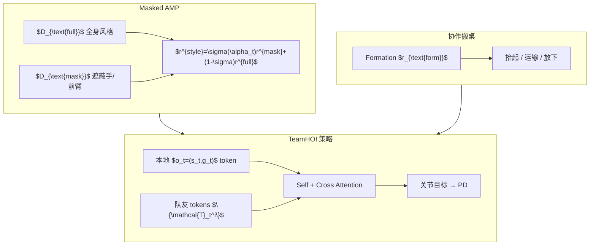

# TeamHOI：任意队形的协作人–物交互统一策略

**TeamHOI**（*Learning a Unified Policy for Cooperative Human-Object Interactions with Any Team Size*，arXiv:2603.07988，**CVPR 2026**）收录于 [AMP 运动先验专题](https://mp.weixin.qq.com/s/YZsm3855iP3TNTTt1aou7w) **第 17/19** 篇。核心命题：协作搬桌缺 **多人体 MoCap**，但不能因此放弃 **自然步态**——用 **masked AMP** 让单人参考约束非交互肢体，用 **任务奖** 塑造手–桌接触，再用 **Transformer 队友 token** 让 **同一参数化策略** 适配 2–8 人。

## 一句话定义

**去中心化 Transformer 策略读本地观测与队友 token，训练时混合多队形环境并分队形归一化 advantage；交互相用遮蔽手/前臂的 $D_{\text{mask}}$，非交互相用 $D_{\text{full}}$，在可变桌面几何的协作搬桌上单一 checkpoint 泛化。**

## 英文缩写速查

| 缩写 | 英文全称 | 简要说明 |
|------|----------|----------|
| AMP | Adversarial Motion Prior | 本文扩展为 **full + masked 双判别器** |
| HOI | Human-Object Interaction | 多 humanoid 协作搬运大型物体 |
| PPO | Proximal Policy Optimization | 多智能体并行仿真优化 |
| CVPR | IEEE/CVF Conference on Computer Vision and Pattern Recognition | 2026 会议 venue |
| RL | Reinforcement Learning | 物理仿真中的协作策略学习 |
| NUS | National University of Singapore | 合作机构之一 |

## 为什么重要

- **可扩展协作：** 相对 CooHOI 每队形一策略 / 无显式队友状态，TeamHOI **单策略任意 N**（训练见 2–8 人，测试 OOD 队形）。
- **masked AMP 范式：** 协作 MoCap 稀缺时，**遮蔽交互部位** 再靠任务奖学搬抬——与 [Goalkeeper #13](./paper-amp-survey-13-humanoid_goalkeeper.md) 区域判别、[MoRE #08](./paper-amp-survey-08-more.md) gait 判别同属 **条件化/分部位先验**。
- **Formation 奖励可迁移：** 角向均匀 + 主轴覆盖对 **桌形与人数 agnostic**——工程上可复用的协作几何先验。
- **与 PhysHSI 分工：** [PhysHSI #15](./paper-amp-survey-15-physhsi.md) 真机单人 HSI；TeamHOI 主攻 **仿真多智能体协作扩展律**。

## 流程总览

## 核心机制（归纳）

### 1）Transformer 去中心化策略

- 主智能体 token 序列 $\mathbf{X}_t=[e,\mathbf{T}^s_t,\mathbf{T}^g_t]$；$L$ 层 self-attention + 对队友的 cross-attention。
- 并行实例化 **不同人数** 环境；**按队形分别归一化 PPO advantage** 稳定混合训练。
- 输出：各 DoF 目标关节角 → PD 力矩。

### 2）Masked AMP

- $D_{\text{full}}$：标准全身转移 $(s,s')$ 判别。
- $D_{\text{mask}}$：**剔除** 与物体接触的身体部位特征后再判别。
- $\alpha_t$：连续交互指示（如人–桌距离）经 sigmoid 混合两路风格奖。
- 直觉：侧身行走参考可 **重定向为侧身抬桌**，手部由任务奖塑形。

### 3）协作搬桌与 formation

- **无 oracle 手位：** 桌缘 64 候选接触点，智能体自主围桌。
- $r_{\text{ang}}$：相邻队友角间隔趋近 $2\pi/m$。
- $r_{\text{cov}}$：支撑凸包相对桌 CoM **主轴覆盖**；$r_{\text{form}}=0.25 r_{\text{ang}}+0.75 r_{\text{cov}}$。

## 常见误区

1. **不是 centralized critic 指挥：** 每 agent **独立执行同一参数策略**，仅通过 **局部可观测量 + 队友 token** 协调。
2. **masked AMP ≠ 无 AMP：** 去掉先验肢体僵硬；全身 AMP  alone 又限制协作手部位多样性——必须 **分部位混合**。
3. **仿真为主：** 与 PhysHSI 真机 HSI 互补；勿当作已解决硬件多机部署。
4. **Garena/Sea AI Lab：** 机构 tag 用 `sea-ai-lab`（注册表含 garena alias）、`nus`。

## 实验与评测

- **队形：** 2 / 4 / 8 人训练；OOD 队形测试；方形/矩形/圆桌。
- **对照：** CooHOI-*2/4/8 三独立策略；TeamHOI 单策略跨配置更稳（项目页视频）。
- **消融：** Transformer vs MLP 固定维；无 masked AMP 时协作多样性下降。

## 与其他页面的关系

- AMP 专题：[humanoid-amp-motion-prior-survey.md](../overview/humanoid-amp-motion-prior-survey.md)（#17/19）
- 单人 HSI：[PhysHSI #15](./paper-amp-survey-15-physhsi.md)
- 多判别器家族：[MoRE #08](./paper-amp-survey-08-more.md)、[Goalkeeper #13](./paper-amp-survey-13-humanoid_goalkeeper.md)
- 方法：[amp-reward.md](../methods/amp-reward.md)

## 参考来源

- [teamhoi_arxiv_2603_07988.md](../../sources/papers/teamhoi_arxiv_2603_07988.md)
- [humanoid_amp_survey_17_teamhoi_learning_a_unified_policy_for_cooperativ.md](../../sources/papers/humanoid_amp_survey_17_teamhoi_learning_a_unified_policy_for_cooperativ.md)
- [humanoid_amp_survey_19_catalog.md](../../sources/papers/humanoid_amp_survey_19_catalog.md)
- [wechat_embodied_ai_lab_humanoid_amp_motion_prior_survey.md](../../sources/blogs/wechat_embodied_ai_lab_humanoid_amp_motion_prior_survey.md)

## 推荐继续阅读

- [TeamHOI 项目页](https://splionar.github.io/TeamHOI/)
- [GitHub: sail-sg/TeamHOI](https://github.com/sail-sg/TeamHOI)
- [arXiv:2603.07988](https://arxiv.org/abs/2603.07988)
