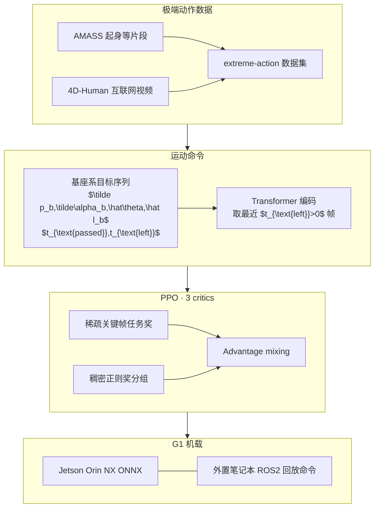

# Embrace Collisions：可部署的接触无关人形 Shadowing

**Embrace Collisions**（*Humanoid Shadowing for Deployable Contact-Agnostics Motions*，arXiv:2502.01465，**CoRL 2025**）收录于 [AMP 运动先验专题](https://mp.weixin.qq.com/s/YZsm3855iP3TNTTt1aou7w) **第 19/19** 篇——专题 **收束篇**。核心命题：人形不应被简化为 **双足移动操作台**；膝、髋、肘、躯干触地时，传统 **倾倒终止** 与 **速度命令** 全部失效——本文用 **基座系关键帧命令 + 稀疏目标奖励 + 多 critic mixing** 在简化碰撞体上学会 **拥抱随机接触** 的 shadowing。

## 一句话定义

**以可变长度基座系运动目标序列（关节、连杆、基座位姿 + 时间元数据）驱动 Transformer 编码器与 PPO 策略，用相对目标的终止条件与 advantage mixing 桥接稀疏任务奖与稠密安全正则，在 G1 机载零样本复现起身、地面交互与站立舞蹈等接触无关动作。**

## 英文缩写速查

| 缩写 | 英文全称 | 简要说明 |
|------|----------|----------|
| RL | Reinforcement Learning | GPU 并行仿真 + 零样本 sim2real |
| CoRL | Conference on Robot Learning | 2025 会议发表 venue |
| FK | Forward Kinematics | 部署时 ONNX 加速连杆误差计算 |
| G1 | Unitree G1 Humanoid | 简化凸碰撞体 + 域随机化真机 |
| PPO | Proximal Policy Optimization | 结合 advantage mixing 训练 |
| WBC | Whole-Body Control | 29 维关节级低层全身控制 |

## 为什么重要

- **AMP 专题收束但非经典 AMP：** 不用对抗判别器，而解决同一母题——**任务完成后仍像身体**——在 **极端姿态与随机接触** 下的命令接口与训练技巧。
- **终止条件重写：** 跪/躺/翻滚不再是 fail state；仅在 **应到达目标帧** 检查与参考的位姿/关节偏差（式 (3)–(5)）——全身技能 RL 的基础设施。
- **Advantage mixing：** 稀疏关键帧任务奖 vs 稠密力矩/能量正则；三 critic 分组估计 advantage 再加权混合，避免到达目标帧时 **动作尖峰**（Table I：multi-critic 起身 **94.3%** vs single-critic **65.1%**）。
- **Project Instinct 基石：** 与 [Deep Parkour](./paper-deep-whole-body-parkour.md) 组成 **地面多接触 × 障碍感知** 双翼；读 [project-instinct.md](./project-instinct.md) 应从此文入门。

## 流程总览

## 核心机制（归纳）

### 1）基座系关键帧命令

- 所有目标在 **当前机器人基座系** 表达，站立/躺卧统一接口。
- 每帧含目标与 **当前误差**、$t_{\text{passed}}$、$t_{\text{left}}$；序列可变长 → Transformer 编码。
- 训练加 **state-target** token 防命令序列耗尽。

### 2）稀疏奖励与 advantage mixing

- 任务奖仅在 $t_{\text{left}}=0$ 期望到达帧计算；正则奖（动作率、能量、限位等）每步稠密。
- 三组 reward → 三 critic 独立 TD 误差；policy gradient 用 **分组归一化后加权 advantage**（式 (2)）。

### 3）Sim2real 与部署

| 项目 | 内容 |
|------|------|
| 碰撞 | 简化凸包；仿真不建模橡胶手 |
| 终止 | 相对目标偏差，非绝对高度/倾角 |
| 部署 | 策略在 G1 机载；命令由笔记本 rosbag 回放 |
| 里程计 | 不依赖全局 MoCap；基座目标用仿真录制基座系轨迹 + IMU yaw 对齐 |
| FK | PyTorch Kinematics → ONNX  onboard |

## 常见误区

1. **不是 AMP / 对抗先验：** 专题 #19 强调的是 **接触无关 shadowing 系统**；勿在文中强行写成判别器方法。
2. **≠ 实时上层规划：** 高层命令可非实时生成/回放；低层 50 Hz 级跟踪执行。
3. **参考可不物理可行：** 宽松终止 + RL 探索填补人与 G1 尺度差；依赖 **extreme-action** 而非纯 AMASS。
4. **与 CLOT 对比：** [CLOT #16](./paper-amp-survey-16-clot.md) 用 **AMP + 全局闭环遥操作**；本文 **无 AMP**，面向 **离散命令序列 + 全身触地**。

## 实验与评测

- **Table I（同迭代/同奖励配置）：** Multi-critic + 精选动作：起身 **94.3%**、地面交互 **98.3%**、站立舞 **100%**；全 AMASS multi-critic 起身仅 **1.45%**。
- **定性：** breaking 舞等膝/肘/髋/手触地；仿真刚体手 vs 真机橡胶手差异在讨论中说明。
- **CoRL 2025 +** [embrace-collisions 项目页](https://project-instinct.github.io/embrace-collisions)。

## 与其他页面的关系

- AMP 专题收束：[humanoid-amp-motion-prior-survey.md](../overview/humanoid-amp-motion-prior-survey.md)（#19/19）
- Instinct：[project-instinct.md](./project-instinct.md)、[Deep Parkour](./paper-deep-whole-body-parkour.md)
- 概念：[whole-body-control.md](../concepts/whole-body-control.md)、[sim2real.md](../concepts/sim2real.md)
- 平台：[unitree-g1.md](./unitree-g1.md)

## 参考来源

- [embrace_collisions_arxiv_2502_01465.md](../../sources/papers/embrace_collisions_arxiv_2502_01465.md)
- [humanoid_amp_survey_19_embrace_collisions_humanoid_shadowing_for_deploy.md](../../sources/papers/humanoid_amp_survey_19_embrace_collisions_humanoid_shadowing_for_deploy.md)
- [humanoid_amp_survey_19_catalog.md](../../sources/papers/humanoid_amp_survey_19_catalog.md)
- [wechat_embodied_ai_lab_humanoid_amp_motion_prior_survey.md](../../sources/blogs/wechat_embodied_ai_lab_humanoid_amp_motion_prior_survey.md)
- 原始抓取：[wechat_humanoid_amp_19_survey_2026-05-26.md](../../sources/raw/wechat_humanoid_amp_19_survey_2026-05-26.md)

## 推荐继续阅读

- [Embrace Collisions 项目页](https://project-instinct.github.io/embrace-collisions)
- [Project Instinct 门户](https://project-instinct.github.io/)
- [arXiv:2502.01465](https://arxiv.org/abs/2502.01465)
- [AMP 专题长文（微信公众号）](https://mp.weixin.qq.com/s/YZsm3855iP3TNTTt1aou7w)
