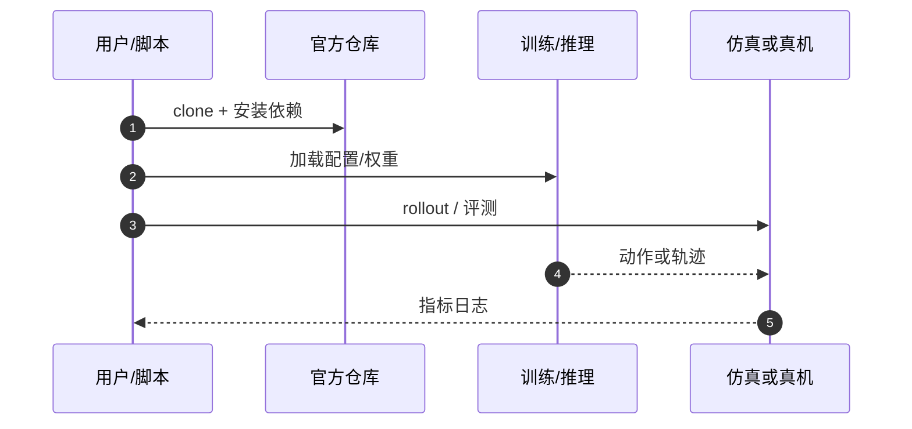

# Amplify（arXiv:2609.28377）

**Amplify: A Lightweight Library for Reproducible Nonlinear Programming Problems in Robotics**（[代码](https://github.com/nr-codes/Amplify)，[arXiv:2609.28377](https://arxiv.org/abs/2609.28377)）来自 [具身智能小站 · 13 篇盘点](../../sources/blogs/wechat_embodied_13_papers_forgetmimic_2026-09-24.md)（2026-09-24）。

## 一句话定义

**用声明式 AMPL 模型表达机器人 NLP 问题，核心库 **537 行**，便于跨求解器复现轨迹优化基准。**

## 英文缩写速查

| 缩写 | 英文全称 | 简要说明 |
|------|----------|----------|
| VLA | Vision-Language-Action | 视觉–语言–动作策略 |
| RL | Reinforcement Learning | 强化学习 |
| TO | Trajectory Optimization | 轨迹优化 |
| HITL | Human-in-the-Loop | 人在回路 |

## 为什么重要

- 轨迹优化代码常把动力学、代价与求解器细节耦合，复现实验与公平对比困难。
- 纳入 [13 篇技术地图](../overview/embodied-13-papers-technology-map.md) 阅读坐标。
- 开源结论（步骤 2.5，2026-09-24）：**已开源**。

## 核心机制

| 项 | 内容 |
|----|------|
| **arXiv** | [2609.28377](https://arxiv.org/abs/2609.28377) |
| **开源** | **已开源** |
| **要点** | AMPL 声明动力学/轨迹/参考运动；统一接口跑双足行走与抓取规划等 benchmark。 |
| **文内指标** | 核心 **537 LOC**；纳入跨库基准比较（文内表格以 PDF 为准）。 |

## 源码运行时序图

## 实验与评测

- 核心 **537 LOC**；纳入跨库基准比较（文内表格以 PDF 为准）。
- **读法：** 公众号归纳；逐项 baseline 与协议以 arXiv PDF 为准。

## 与其他工作对比

- 横向索引见 [13 篇技术地图](../overview/embodied-13-papers-technology-map.md)。

## 结论

**把问题声明与求解器实现分离** — 适合作为 TO/MPC 教学与 benchmark 起点。

1. 开源边界：**已开源** — 以项目页/仓库实际链接为准（入库日 2026-09-24）。
2. 核心机制：AMPL 声明动力学/轨迹/参考运动；统一接口跑双足行走与抓取规划等 benchmark。…
3. 部署前核对任务协议与硬件条件，勿直接横比公众号摘录数字。

## 关联页面

- [Trajectory Optimization](../methods/trajectory-optimization.md)
- [Model Predictive Control](../methods/model-predictive-control.md)
- [Locomotion](../tasks/locomotion.md)
- [Embodied 13 Papers Technology Map](../overview/embodied-13-papers-technology-map.md)

## 参考来源

- [13 篇盘点（公众号）](../../sources/blogs/wechat_embodied_13_papers_forgetmimic_2026-09-24.md)
- [Amplify: A Lightweight Library for Reproducible Nonlinear Programming Problems in Robotics](../../sources/papers/amplify-robotics_arxiv_2609_28377.md)

## 推荐继续阅读

- [arXiv:2609.28377](https://arxiv.org/abs/2609.28377) — 原文
