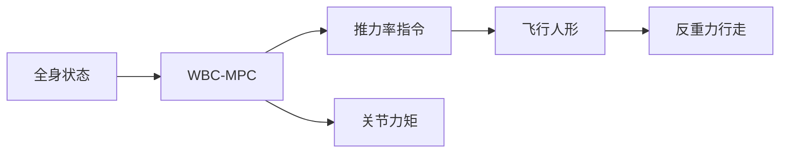

# Anti-Gravity Flying Humanoid（arXiv:2609.07544）

**Anti-Gravity Flying Humanoid**（*Anti-Gravity Walking by a Flying Humanoid Robot via Thrust-Rate Input Whole-Body Model Predictive Control*，[arXiv:2609.07544](https://arxiv.org/abs/2609.07544)）由 **东京大学（The University of Tokyo）** 提出（公众号周更 ingest 见 [策展索引](../../sources/blogs/wechat_shenlan_weekly_humanoid_quadruped_2026-09-14.md)）。

## 一句话定义

基于推力变化率输入全身MPC的飞行人形机器人反重力行走 — thrust-rate as WBC-MPC input for continuous thrust at contact switch。

## 英文缩写速查

| 缩写 | 英文全称 | 简要说明 |
|------|----------|----------|
| MPC | Model Predictive Control | 模型预测控制 |
| WBC | Whole-Body Control | 全身控制 |
| WBC-MPC | Whole-Body MPC | 全身 MPC 栈 |

## 为什么重要

飞行人形在足端接触切换时推力不连续会导致失稳；推力率输入是连续化关键。

## 核心信息

| 项 | 内容 |
|----|------|
| **机构** | 东京大学（The University of Tokyo） |
| **开源** | **未见/待发布**（步骤 2.5 核查：截至 2026-09-14 无可运行官方仓库） |

## 核心原理

WBC-MPC 优化关节与推力率；接触切换约束下平滑法向力下界；仿真训练后真机反重力行走。

### 流程总览

## 源码运行时序图

**不适用** — 截至 **2026-09-14** arXiv 与常见项目页 **未见** 官方可运行代码仓库。

## 工程实践

| 项 | 说明 |
|----|------|
| 开源状态 | 未见官方仓库；以 arXiv 为准 |
| 复现入口 | 论文方法与超参；代码发布后再补 `sources/repos/` |
| 部署注意 | MPC 时域与推力率限幅需匹配推进器动力学；接触检测延迟敏感。 |

## 实验与评测

仿真与真机反重力行走稳定性；接触切换平滑度。

## 结论

推力率输入 WBC-MPC 使飞行人形在接触切换时仍能保持反重力行走。

1. 推力率比直接推力更连续。
2. 法向力下界平滑抑制冲击。
3. WBC-MPC 统一腿与推进器。
4. 真机验证反重力步态可行。
5. 推进器饱和是主要约束。

## 与其他工作对比

| 对照 | 差异读法 |
|------|----------|
| 位置级推力控制 | 切换时不连续 |
| 纯腿式 MPC | 无飞行推力自由度 |

## 局限与风险

续航与推进器故障未深入；户外风扰未报。

## 关联页面

- [whole-body-control](../concepts/whole-body-control.md)
- [humanoid-locomotion](../tasks/humanoid-locomotion.md)
- [./paper-golem-humanoid.md](./paper-golem-humanoid.md)

## 参考来源

- [anti_gravity_flying_humanoid_arxiv_2609_07544.md](../../sources/papers/anti_gravity_flying_humanoid_arxiv_2609_07544.md)
- [公众号周更策展](../../sources/blogs/wechat_shenlan_weekly_humanoid_quadruped_2026-09-14.md)

## 推荐继续阅读

- [https://arxiv.org/abs/2609.07544](https://arxiv.org/abs/2609.07544)
