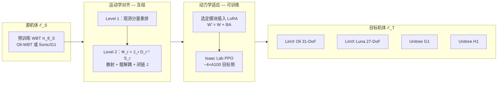

# Any2Any：跨机体人形全身跟踪迁移

**Any2Any**（LimX Dynamics，arXiv:2605.23733）研究 **后训练式 cross-embodiment 迁移**：给定在 **源人形** 上已训好的 **whole-body tracking（WBT）专家**，如何以 **极少目标侧数据与算力** 在 **目标人形** 上复用其平衡、协调与跟踪先验，而非从零训练或全参微调导致遗忘。

## 为什么重要

- **WBT 已是人形「运动基础模型」接口：** [SONIC](../methods/sonic-motion-tracking.md) 等路线投入 **亿级帧 + 万 GPU 小时**；新机台重复成本过高。
- **缺口在 embodiment，不仅是 retarget：** MoCap 重定向解决 **参考轨迹几何**；源策略的 **观测布局、DoF、髋轴、并联踝** 与 **质量/摩擦/接触** 仍使直接部署不可靠。
- **可操作的分解：** **运动学对齐（固定映射）** + **动力学 PEFT（LoRA 等）** 与经典「规划参考 + WBC 跟踪」分层一致，且贴合现代 WBT 的 **Encoder（偏运动语义）/ Decoder（偏机体动力学）** 结构。

## 流程总览

## 核心机制（归纳）

### 1）运动学对齐：统一关节语义空间

- 以源机 **$T$ 维关节布局** 为语义基准；目标机 $N_r$ DoF 通过 **注入映射 $\pi_r$** 散射到源空间，多余源关节置零。
- **髋解耦矩阵 $D_r$：** 源机斜置髋 pitch 轴时，左右髋用 $2\times2$ 块做坐标变换，避免「轴不一致」导致策略误读关节角。
- **闭链 $J_r$：** 目标机并联踝/腰等 **执行器角 ≠ 运动学角** 时，在 $\Phi_r$ 中乘闭链 Jacobian，保证 $\Phi_r^+\Phi_r = I_{N_r}$。
- 对齐后：**参考动作、关节观测、动作历史** 进 frozen backbone；**策略输出** 经 $\Phi_r^+$ 映回目标机关节指令。

### 2）动力学适应：低秩残差而非全参覆盖

- 刚性动力学 $M\ddot q + C\dot q + G = \tau + \tau_{\text{ext}}$：同轨迹下源/目标 **$\Delta M,\Delta C,\Delta G$** 与摩擦/接触构成 **$\Delta\eta$**；对齐后主要由 **LoRA** 学习紧凑修正（亦实验 Adapter / Prefix）。
- **假设：** $\Delta\eta$ 相对全网络 $\theta_{\mathcal{S}}$ **低维**；全参微调易 **覆盖** 源先验中的跟踪与平衡结构。
- 训练除对齐与 PEFT 外，**奖励、DR、PPO 超参、参考采样** 与源预训练 **保持一致**，以隔离迁移因素。

### 3）实验与规模叙事

| 源骨干 | 典型迁移 |
|--------|----------|
| Sonic（G1 预训练） | → LimX Oli、LimX Luna |
| Oli-WBT（MLP/Transformer） | → G1、H1、Luna |

- 相对 **from scratch**：收敛更快、跟踪指标 competitive 或更优；**~1%** 全量训练算力与数据完成 Sonic→Oli/Luna 叙事。
- **真机：** 多下游任务部署（论文图示含跨平台跟踪演示）。

## 常见误区

1. **≠ 遥感 Any2Any（arXiv:2603.04114）：** 同名不同领域；本文仅 **人形 WBT + 机器人学 embodiment**。
2. **对齐不能替代 PEFT：** 仅重排 obs 无法消除 **质量/惯量/执行器** 差；动力学模块仍须适应。
3. **≠ 多机体联合 generalist：** HOVER 类方法要 **多机体大数据预训练**；本文是 **单机体专家的后训练迁移**。
4. **LoRA 位置需实验：** Encoder 偏可迁移、Decoder 偏敏感——但 **具体插层** 因骨干（MLP / Transformer / Sonic）而异，不宜照搬 NLP 默认「只改最后几层」。

## 参考来源

- [Any2Any（arXiv:2605.23733）](../../sources/papers/any2any_arxiv_2605_23733.md)
- He et al., *SONIC: Supersizing Motion Tracking…* — G1 源骨干
- Hu et al., *LoRA* (2022) — 动力学适应默认机制

## 关联页面

- [SONIC](../methods/sonic-motion-tracking.md)、[人形运动跟踪方法选型](../queries/humanoid-motion-tracking-method-selection.md)
- [人形并联关节解算](../concepts/humanoid-parallel-joint-kinematics.md)、[Neural Motion Retargeting](../methods/neural-motion-retargeting-nmr.md)
- [Unitree G1](./unitree-g1.md)、[FastStair（LimX Oli LoRA 另一用法）](./paper-faststair-humanoid-stair-ascent.md)
- [SLowRL（同机 sim2real LoRA）](./paper-slowrl-safe-lora-locomotion.md)

## 推荐继续阅读

- [GEAR-SONIC 项目页](https://nvlabs.github.io/GEAR-SONIC/) — 源 WBT 骨干公开材料
- [LimX Dynamics GitHub](https://github.com/limxdynamics) — Oli 训练/部署生态
- arXiv:2605.23733 — <https://arxiv.org/abs/2605.23733>
