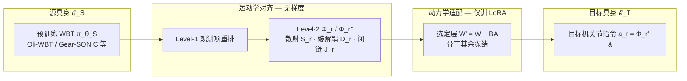

# Any2Any：跨具身高效全身跟踪迁移

**Any2Any**（arXiv:2605.23733，LimX Dynamics）研究 **已有 whole-body tracking（WBT）专家如何迁到新的人形**：不从头重训亿级 MoCap 策略，而是把差距拆成 **运动学接口对齐** 与 **动力学残差适配**。在 **Gear-SONIC / Oli-WBT** 等源骨干上，用约 **1%** 全量预训练的算力与数据，将跟踪能力迁到 **LimX Oli、LimX Luna、Unitree G1/H1** 等目标机，并报告多组真机下游表现。

## 英文缩写速查

| 缩写 | 英文全称 | 简要说明 |
|------|----------|----------|
| WBT | Whole-Body Tracking | 全身参考运动跟踪控制 |
| LoRA | Low-Rank Adaptation | 低秩增量微调，低成本适配大模型 |
| MoCap | Motion Capture | 动作捕捉，参考动作与演示数据的主要来源 |
| G1 | Unitree G1 Humanoid | 宇树入门级教育科研人形平台 |
| DoF | Degrees of Freedom | 自由度，人形通常 20–50+ 关节 |
| WBC | Whole-Body Control | 协调全身关节满足多任务/约束的控制基础设施 |
| Isaac Lab | NVIDIA Isaac Lab | 基于 Omniverse 的机器人学习训练框架 |
| PPO | Proximal Policy Optimization | 人形/足式 locomotion 中最常用的 on-policy 策略梯度算法 |
| DR | Domain Randomization | 训练时随机化仿真参数以提升跨域鲁棒迁移 |
| MLP | Multi-Layer Perceptron | 多层感知机，处理本体向量等低维输入 |
| GMR | General Motion Retargeting | 把人体/视频动作重定向为机器人可执行参考 |
| Sim2Real | Simulation to Real | 把仿真中学到的策略迁移落地真机的工程主线 |
| BFM | Behavior Foundation Model | 大规模行为数据预训练的可复用全身行为先验 |

## 为什么重要

- 在 [运动小脑 64 篇技术地图](../overview/humanoid-motion-cerebellum-technology-map.md) 中归类为 **F 跨本体与遥操作**（42/64）：跨本体：把预训练 whole-body tracker 迁到新身体。
- **WBT scaling 的下一站：** [SONIC](../methods/sonic-motion-tracking.md) 等路线证明「大规模 tracking 预训练」可行，但策略与 **源机 DoF、观测顺序、动力学** 强绑定；Any2Any 给出 **后训练迁移范式**，降低新机部署的重复烧卡。
- **运动学–动力学解耦可操作化：** 与经典「参考运动 + 分层 WBC」一致，现代 WBT 的 **Reference Encoder vs Action Decoder** 分工使 **局部 PEFT** 有结构依据——_encoder 偏可迁移，_decoder 更需动力学修正。
- **与多机 generalist 互补：** 联合多具身从头训通用控制器需要大数据；本文假设 **你已有单源成熟专家**，只需对齐 + 低秩动力学补丁。

## 流程总览

## 核心机制（归纳）

### 1）运动学对齐（Kinematic Alignment）

- **Level-1：** 将目标机观测向量（投影重力、关节位、上步动作等）重排为与 **源策略训练时一致的语义顺序**。
- **Level-2：** 在源机统一关节语义空间 $T$ 维上，用 $\Phi_r = J_r D_r^{-1} S_r$ 把目标 $N_r$ 维关节量嵌入；处理 **关节对应、髋 pitch 轴倾斜解耦、并联踝/腰闭链 Jacobian**；策略输出经 $\Phi_r^+$ 映回目标执行空间。
- **效果：** 冻结骨干始终在 **同一「语义关节」坐标** 下读写，结构性 gap 由对齐层吸收，**不消耗** 预训练行为先验容量。

### 2）动力学适配（Dynamic Adaptation）

- 对齐后残差主要是 $\Delta\eta = \eta_{\mathcal{T}} - \eta_{\mathcal{S}}$（惯量、摩擦、执行器、接触等），论文视为 **相对全参 $\theta_{\mathcal{S}}$ 低维**。
- 在 **动力学敏感模块**（实验上偏 Action Decoder 等）插入 [LoRA](../concepts/lora.md)：$W' = W + BA$，只训 $A,B$；rank $k$ 控制可吸收的动力学 gap 容量。
- **训练：** Isaac Lab + PPO；奖励、DR、参考采样等与 **对应源预训练设置一致**，仅增加对齐与 PEFT 组件——便于公平对比「从头训」基线。

### 3）实验与骨干

- **平台：** Oli（31-DoF）、Luna（27-DoF）、G1、H1；**5 组** source→target 迁移对。
- **源骨干：** 自研 **Oli-WBT**（Transformer / MLP，500+ h 运动数据）与 **Gear-SONIC**（G1 预训练大模型）；展示 **Sonic → Oli/Luna** 等跨厂商迁移。
- **骨干结构：** 统一 proprio + reference 观测；含 MLP、因果 Transformer Decoder、Sonic 的 Robot Motion Encoder + FSQ + dynamics decoder 等实例。

## 常见误区

1. **「对齐等于 retarget」：** $\Phi_r$ 解决的是 **控制接口与关节语义**，不替代 MoCap **轨迹几何** retarget（仍依赖既有参考管线，见 [GMR](../methods/motion-retargeting-gmr.md)）。
2. **「全参微调一定更好」：** 全参易 **覆盖** 源机平衡与协调先验；局部 LoRA 旨在学 **$\Delta\eta$ 残差** 而非重学 tracking 任务结构。
3. **「等于 SONIC 再训一版」：** SONIC 是 **单平台 scaling**；Any2Any 是 **跨平台 post-training**，数据与算力量级不同。
4. **「任意机器人零样本」：** 仍需目标机 **少量** 跟踪数据与正确 $\pi_r$ 式关节映射；闭链与髋轴特殊结构必须进 $J_r,D_r$。

## 实验与评测

- 量化指标、消融与 sim2real / 实机结果见 **原文 PDF** 与 [参考来源](#参考来源)；本页正文侧重方法结构与知识库交叉引用。

## 与其他工作对比

- 正文已给出与相邻路线 / baseline 的 **定性对照**；定量表格与 ablation 见原文（[参考来源](#参考来源)）。

## 参考来源

- [Any2Any（arXiv:2605.23733）](../../sources/papers/any2any_arxiv_2605_23733.md)
- Yang et al., *Any2Any: Efficient Cross-Embodiment Transfer for Humanoid WBT* (2026)
- [Gear-SONIC 项目页](https://nvlabs.github.io/GEAR-SONIC/) — 论文中 G1 源骨干公开材料

## 关联页面

- [SONIC](../methods/sonic-motion-tracking.md)、[人形运动跟踪方法选型](../queries/humanoid-motion-tracking-method-selection.md)
- [Whole-Body Control](../concepts/whole-body-control.md)、[Unitree G1](./unitree-g1.md)
- [BFM 人形基础模型](./paper-behavior-foundation-model-humanoid.md)、[FastStair](./paper-faststair-humanoid-stair-ascent.md)（LimX Oli 工程线）

## 推荐继续阅读

- [arXiv:2605.23733](https://arxiv.org/abs/2605.23733) — 五组迁移对与模块消融
- [SONIC 论文 / 官网](https://nvlabs.github.io/GEAR-SONIC/) — 源 WBT scaling 背景
- [LimX Dynamics](https://www.limxdynamics.com/) — Oli / Luna 平台语境
