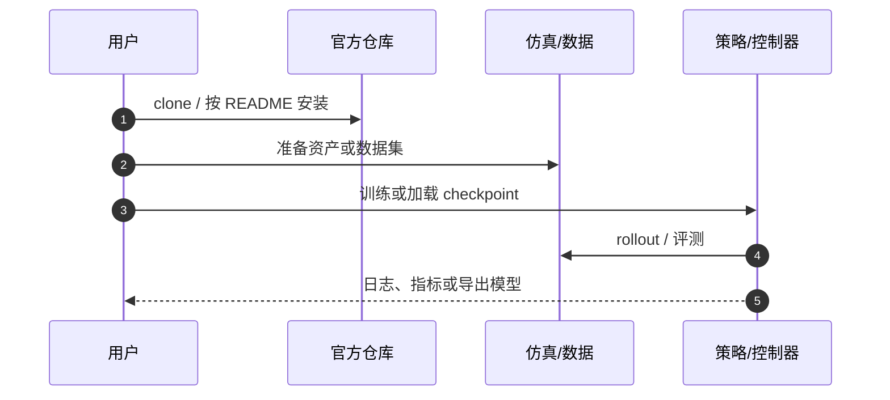

# AnyBody（HMI P039）

**AnyBody**（*AnyBody: Free-Form Whole-Body Humanoid Control from Arbitrary Keypoint Guidance*，2026，[arXiv:2606.29209](https://arxiv.org/abs/2606.29209)）收录于具身智能研究室 [论文与项目总索引](https://github.com/RealXiaoze/humanoid-motion-intelligence/blob/main/%E8%AE%BA%E6%96%87%E4%B8%8E%E9%A1%B9%E7%9B%AE/README.md) **P039**，主分类为 **动作跟踪与全身控制**。本页为本库独立详情节点（编译自策展解读与公开元数据，非原文镜像）。

## 一句话定义

把物理技能压入潜在解码器，再用关键点条件补全器从任意稀疏关键点子集推断可行全身意图并执行。

## 英文缩写速查

| 缩写 | 英文全称 | 简要说明 |
|------|----------|----------|
| WBC | Whole-Body Control | 全身控制 |
| CVAE | Conditional Variational Autoencoder | 常见潜变量补全结构族 |
| RL | Reinforcement Learning | 物理技能预训练 |
| IK | Inverse Kinematics | 关键点到全身的几何关联 |

## 为什么重要

- 特权teacher在大规模无结构动作库上做全身tracking。在线蒸馏时，deterministic encoder把完整运动目标编码到单位球面latent，decoder读取latent与当前本体状态并拟合teacher动作。球面约束固定latent尺度，降低不同动作表示的漂移；更重要的是decoder始终看到当前状态，因此包含接触与平衡反馈，不是静态pose解码器。
- 在 HMI 六条技术路线中属于 **动作跟踪与全身控制**，补齐「总索引有条目、本库无下钻页」的缺口。
- 与相邻方法对照时，优先看问题设定与接口，而不是只记算法名。

## 核心信息

| 字段 | 内容 |
|------|------|
| HMI ID | P039 |
| 年份 | 2026 |
| 分组 | 动作跟踪与全身控制 |
| 开源状态 | 已开源（hazel-hammer/Anybody） |
| 原文 | https://arxiv.org/abs/2606.29209 |

## 核心原理

已有稀疏控制器通常预先规定输入是头和双手，或限定若干command mask。AnyBody希望部署时才决定给哪些身体关键点：这次只给双手，下次增加脚和头，甚至不同时间使用不同子集。方法先建立统一latent motion space，再训练一个masked Transformer把任意关键点集合投到这个空间。

### 流程直觉

模块边界与符号定义以原文为准；上图只固定阅读骨架。

## 工程实践

第二阶段冻结latent空间和decoder。每个关键点目标被当作token，缺失点通过masked self-attention自然忽略；Transformer encoder根据任意子集预测teacher latent。训练中随机抽取子集，才使部署时的自由组合成为分布内问题。最终同一decoder把不同输入组合转成全身动作。

| 检查项 | 建议 |
|--------|------|
| 一手来源 | 回 arXiv / DOI / 项目页核对数值与声明 |
| 开源边界 | 已开源（hazel-hammer/Anybody） |
| 本库定位 | 详情编译页；深入公式与实验表读原文 |

## 源码运行时序图

关键复现路径以官方 README 为准；上图仅标出通用入口顺序。

## 实验与评测读法

- 把「仿真指标 / 真机证据 / 仅项目演示」分开记账。
- 对照同组相邻工作（见关联页面）时，对齐任务定义与观测接口，再比成功率。
- 综述类条目关注分类框架与缺口，不把引用列表当作选型排名。

## 结论

**AnyBody 应作为 HMI「动作跟踪与全身控制」线上的独立知识节点阅读：先抓住其真正改变的问题接口，再决定是否进入复现或对比实验。**

- 核心贡献是问题表达或管线接口，而不只是单一网络结构名。
- 开源状态：已开源（hazel-hammer/Anybody）。
- 与本库已有相邻页交叉阅读，避免重复造页。
- 数值、消融与许可以一手来源为准；本页是编译索引。
- 若官方后续补齐代码/数据，应回写 `sources/` 与本节开源字段。

## 局限与风险

- 每个token至少要携带“哪个身体点、目标在什么坐标系、目标位置/姿态是什么以及对应时间”这些信息；否则集合式注意力无法区分左手目标和右脚目标。decoder除latent外还读取当前关节状态、机身运动与历史动作，输出机器人全身关节目标，所以同一个稀疏目标在站立失稳和稳定站立时会产生不同补偿。完整动作teacher提供的不是一条离线补全轨迹，而是每个闭环状态下可执行的动作标签。
- 勿把 HMI 解读中的工程判断直接写成论文作者承诺。
- 经典控制论文与现代 RL/VLA 论文的「可复现」标准不同，选型时分开评估。

## 与其他工作对比

| 维度 | 本工作（AnyBody） | [MaskedMimic](./paper-bfm-17-maskedmimic.md) | [GMT](./paper-gmt.md) |
|------|-------------------|----------------------------------------------|-----------------------|
| 方法族 | 潜在解码器 + 关键点条件 masked Transformer 补全器 | 掩码式动作填补/条件控制 | 通用运动跟踪控制器 |
| 约束形式 | 部署时任意稀疏关键点子集，缺失点靠注意力忽略 | 部分约束（关键帧/关节）驱动全身补全 | 以完整或密集运动目标为跟踪对象 |
| 关键假设 | 子集在训练中随机抽取，使自由组合成为分布内问题 | 掩码分布覆盖需匹配部署使用方式 | 需较完整参考轨迹以获得高保真跟踪 |
| 输入/输出 | 关键点 token（身体点+坐标系+位姿+时间）→ 全身关节目标 | 部分观测约束 → 全身动作 | 完整运动目标 → 全身关节动作 |
| 关系/取舍 | 强调输入接口自由度，换取对稀疏/缺失的鲁棒 | 同为掩码/部分约束思路，但接口预设更固定 | 跟踪保真更高，但对稀疏自由指定支持较弱 |

底层执行的通用背景见 [全身控制](../concepts/whole-body-control.md) 与 [BeyondMimic](../methods/beyondmimic.md)。

## 关联页面

- [HMI 论文覆盖导读](../queries/hmi-papers-coverage.md)
- [Humanoid Motion Intelligence](./humanoid-motion-intelligence.md)
- [paper-bfm-17-maskedmimic](./paper-bfm-17-maskedmimic.md)
- [beyondmimic](../methods/beyondmimic.md)
- [whole-body-control](../concepts/whole-body-control.md)
- [paper-gmt](./paper-gmt.md)

## 参考来源

- [sources/papers/hmi_p039_anybody-keypoint-humanoid-control.md](../../sources/papers/hmi_p039_anybody-keypoint-humanoid-control.md)
- [sources/repos/humanoid-motion-intelligence.md](../../sources/repos/humanoid-motion-intelligence.md)
- [HMI 论文总索引](https://github.com/RealXiaoze/humanoid-motion-intelligence/blob/main/%E8%AE%BA%E6%96%87%E4%B8%8E%E9%A1%B9%E7%9B%AE/README.md)

## 推荐继续阅读

- [arXiv:2606.29209](https://arxiv.org/abs/2606.29209)
- [代码](https://github.com/hazel-hammer/Anybody)
- [HMI 逐篇解读 P039](https://github.com/RealXiaoze/humanoid-motion-intelligence/blob/main/%E8%AE%BA%E6%96%87%E4%B8%8E%E9%A1%B9%E7%9B%AE/%E8%AE%BA%E6%96%87%E9%80%90%E7%AF%87%E8%A7%A3%E8%AF%BB/P039.md)
