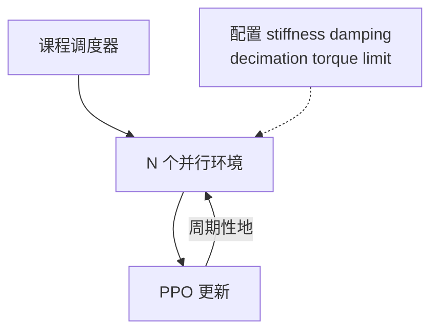

---

type: entity
tags: [quadruped, anymal, reinforcement-learning, isaac-gym, legged-gym, sim2real, eth]
status: stable
summary: "ANYmal：单机 GPU 上千并行环境与课程式地形，在分钟级训练出行走策略；开源 legged_gym，成为 RL+PD 配置与消融的教科书入口。"
updated: 2026-05-22
arxiv: "2109.11978"
related:
  - ../entities/legged-gym.md
  - ../entities/anymal.md
  - ../queries/legged-humanoid-rl-pd-gain-setting.md
  - ../tasks/locomotion.md
sources:
  - ../../sources/papers/rl_pd_action_interface_locomotion.md
---

# Learning to Walk in Minutes Using Massively Parallel Deep Reinforcement Learning

**一句话定义**：用 **Isaac Gym 大规模并行** 与 **游戏式课程地形**，在 **数分钟（平地）/ 约二十分钟（粗糙地形）** 内为 ANYmal 训出可迁移策略，并开源 **legged_gym** 作为可复现工程栈。

## 英文缩写速查

| 缩写 | 英文全称 | 简要说明 |
|------|----------|----------|
| Sim2Real | Simulation to Real | 把仿真中学到的策略迁移落地真机的工程主线 |
| ANYmal | ANYbotics Quadruped | ANYbotics 的四足机器人研究平台 |
| GPU | Graphics Processing Unit | 图形处理器，大规模并行仿真训练的算力基础 |
| legged_gym | Legged Gym | 足式机器人 RL 训练的常用开源框架 |
| RL | Reinforcement Learning | 通过与环境交互最大化长期回报来学习策略的范式 |
| PD | Proportional–Derivative | 关节位置/阻抗底层控制，策略输出常为其 setpoint |
| Isaac Gym | NVIDIA Isaac Gym | GPU 并行刚体仿真训练环境 |
| Kp | Proportional Gain | PD 控制的位置误差增益，影响刚度与响应 |
| Kd | Derivative Gain | PD 控制的速度误差增益，抑制振荡 |
| Isaac Lab | NVIDIA Isaac Lab | 基于 Omniverse 的机器人学习训练框架 |

## 为什么重要

- 把 **「并行度 × 课程 × 网络结构」** 对样本效率的影响拆给读者看，是后续大量 **legged_gym 系论文与仓库** 的共同起点。
- 与 **Kp/Kd** 直接相关：`legged_gym` 中 `control.stiffness` / `control.damping` 与 `decimation` 的默认组合，应与此文 **同一假设族** 对照阅读。

## 核心机制（提炼）

- **Massively parallel**：单工作站 GPU 上并行数千环境，极大缩短 wall-clock。
- **Curriculum**：按表现升降地形难度，稳定早期探索。

## 与 Kp / Kd 设置的关系

- 扫增益与消融时，固定 **随机种子、地形课程阶段、decimation**，只改 `stiffness`/`damping` 分组，才能对齐论文 **ablation 精神**。
- **易混文献号**：本文 arXiv 为 **[2109.11978](https://arxiv.org/abs/2109.11978)**；**2212.03238** 对应的是 [Walk These Ways](./paper-walk-these-ways-quadruped-mob.md)。

## 实验与评测

- 量化指标、消融与 sim2real / 实机结果见 **原文 PDF** 与 [参考来源](#参考来源)；本页正文侧重方法结构与知识库交叉引用。

## 与其他工作对比

- 正文已给出与相邻路线 / baseline 的 **定性对照**；定量表格与 ablation 见原文（[参考来源](#参考来源)）。

## 参考来源

- [RL+PD 动作接口与增益设计论文索引](../../sources/papers/rl_pd_action_interface_locomotion.md)
- Rudin et al., *Learning to Walk in Minutes Using Massively Parallel Deep Reinforcement Learning*, [arXiv:2109.11978](https://arxiv.org/abs/2109.11978)

## 关联页面

- [legged_gym](./legged-gym.md)
- [ANYmal](./anymal.md)
- [Legged / Humanoid RL 中 Kp/Kd 设置](../queries/legged-humanoid-rl-pd-gain-setting.md)
- [Isaac Gym / Isaac Lab](./isaac-gym-isaac-lab.md)

## 推荐继续阅读

- [机器人论文阅读笔记：Learning to Walk in Minutes Using Massively Parallel Deep Reinforcement Learning](https://imchong.github.io/Humanoid_Robot_Learning_Paper_Notebooks/papers/05_Locomotion/Learning_to_Walk_in_Minutes/Learning_to_Walk_in_Minutes.html)
- [legged_gym 项目页](https://leggedrobotics.github.io/legged_gym/)
