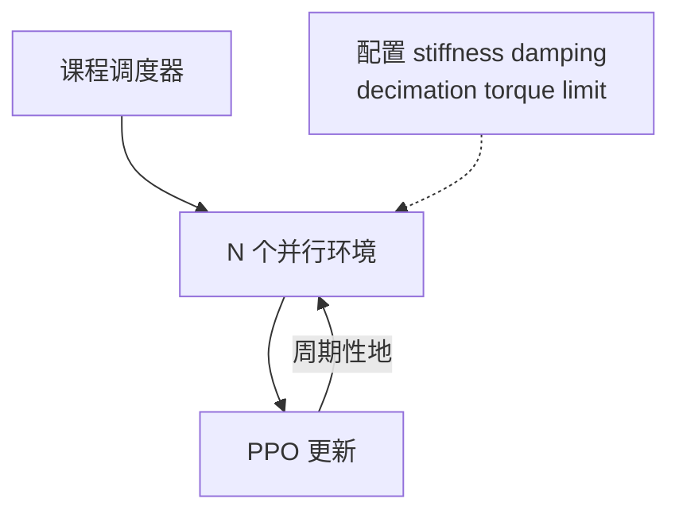

# Learning to Walk in Minutes Using Massively Parallel Deep Reinforcement Learning

**一句话定义**：用 **Isaac Gym 大规模并行** 与 **游戏式课程地形**，在 **数分钟（平地）/ 约二十分钟（粗糙地形）** 内为 ANYmal 训出可迁移策略，并开源 **legged_gym** 作为可复现工程栈。

## 为什么重要

- 把 **「并行度 × 课程 × 网络结构」** 对样本效率的影响拆给读者看，是后续大量 **legged_gym 系论文与仓库** 的共同起点。
- 与 **Kp/Kd** 直接相关：`legged_gym` 中 `control.stiffness` / `control.damping` 与 `decimation` 的默认组合，应与此文 **同一假设族** 对照阅读。

## 核心机制（提炼）

- **Massively parallel**：单工作站 GPU 上并行数千环境，极大缩短 wall-clock。
- **Curriculum**：按表现升降地形难度，稳定早期探索。

## 与 Kp / Kd 设置的关系

- 扫增益与消融时，固定 **随机种子、地形课程阶段、decimation**，只改 `stiffness`/`damping` 分组，才能对齐论文 **ablation 精神**。
- **易混文献号**：本文 arXiv 为 **[2109.11978](https://arxiv.org/abs/2109.11978)**；**2212.03238** 对应的是 [Walk These Ways](./paper-walk-these-ways-quadruped-mob.md)。

## 参考来源

- [RL+PD 动作接口与增益设计论文索引](../../sources/papers/rl_pd_action_interface_locomotion.md)
- Rudin et al., *Learning to Walk in Minutes Using Massively Parallel Deep Reinforcement Learning*, [arXiv:2109.11978](https://arxiv.org/abs/2109.11978)

## 关联页面

- [legged_gym](./legged-gym.md)
- [ANYmal](./anymal.md)
- [Legged / Humanoid RL 中 Kp/Kd 设置](../queries/legged-humanoid-rl-pd-gain-setting.md)
- [Isaac Gym / Isaac Lab](./isaac-gym-isaac-lab.md)

## 推荐继续阅读

- [legged_gym 项目页](https://leggedrobotics.github.io/legged_gym/)
