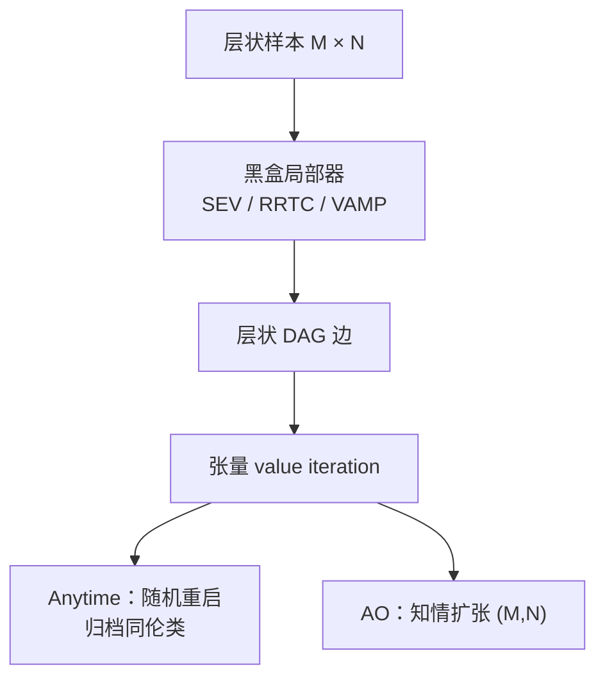
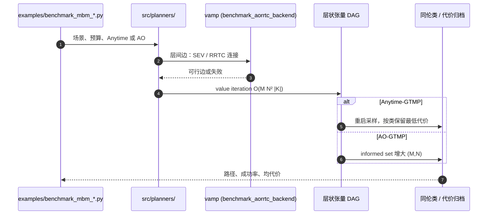

# Anytime GTMP：批量全局张量运动规划

**Anytime GTMP**（*Anytime Global Tensor Motion Planning*，[arXiv:2608.25830](https://arxiv.org/abs/2608.25830)，[代码](https://github.com/CoMMALab/anytime_gtmp)）由 **普渡大学 CS** Sai Coumar、Zachary Kingston 与 **VinUniversity / TU Darmstadt IAS** An T. Le 提出：把 GTMP 的层状张量图接到任意黑盒局部规划器上，给出覆盖同伦类的 Anytime 策略和知情扩张的渐近最优策略。

## 一句话定义

**全局层用固定层状 DAG 做张量 value iteration，局部层把相邻样本交给直线 / RRT-Connect / VAMP 等连接器；重启覆盖路径类，扩张 (M,N) 压代价——不要把它当「1 秒内出第一条路」的采样器。**

## 英文缩写速查

| 缩写 | 英文全称 | 简要说明 |
|------|----------|----------|
| GTMP | Global Tensor Motion Planning | 层状张量图上的批量全局规划前身 |
| Anytime-GTMP | Anytime Global Tensor Motion Planning | 固定 (M,N,s) 随机重启，几乎必然覆盖同伦类 |
| AO-GTMP | Asymptotically Optimal GTMP | 知情集合内增大 (M,N)，几乎必然收敛代价 |
| SEV | Straight-line Edge Validity | 最便宜的局部连接器：直线可行性 |
| MBM | MotionBenchMaker | 机械臂运动规划基准（Panda / UR5 / Fetch） |
| VAMP | Vector-Accelerated Motion Planning | 本仓默认局部连接后端之一 |
| FCIT | Fast-CIT 类采样规划器 | 1 s 内出路径的对照；60 s 成功率对齐对象 |
| DAG | Directed Acyclic Graph | 层间完全二分、层内无边的搜索图 |

## 为什么重要

- **把「全局同伦覆盖」和「局部连接器」拆开：** 换 RRT-Connect / 轨迹优化 / 生成采样不必重写全局搜索。
- **两条 anytime 叙事不要混：** Anytime-GTMP 卖的是类覆盖；AO-GTMP 卖的是共同可解集上的均路径代价。
- **60 s 才是它的主战场：** MotionBenchMaker 上 Anytime-GTMP (SEV) 终态成功率约 **85%**，对齐 FCIT；**1 s 内不如 AORRTC/FCIT** 快出第一条路径。

## 核心信息

| 项 | 内容 |
|----|------|
| **机构** | 普渡大学（Purdue）；荣大学（VinUniversity）；达姆施塔特工业大学（TU Darmstadt）IAS |
| **开源** | **已开源**（MIT）：`src/planners/` + `examples/benchmark_mbm_*.py` |
| **规范仓名** | [CoMMALab/anytime_gtmp](https://github.com/CoMMALab/anytime_gtmp)（README 亦写 `commalab/anytime_gtmp`） |
| **复杂度** | 层状 DAG 张量 value iteration \(O(M N^2 |K|)\) |

## 核心原理（方法）

层间完全二分、层内无边。相邻层边由局部规划器在查询椭球内实现。一层采样图以高概率覆盖每个有界长度、δ-clear、端点固定的同伦类（Thm.1）：每层多样本指数降低 miss；更强局部器只**亚线性**减少所需层数。

| 策略 | 固定什么 | 变什么 | 保证 |
|------|----------|--------|------|
| Anytime-GTMP | \((M,N,s)\) | 随机重启 + 按同伦类归档最低代价 | 几乎必然类覆盖（Thm.2） |
| AO-GTMP | 局部器预算 \(s\) | 单调增大 \((M,N)\)，informed set 采样 | 几乎必然代价收敛（Thm.3） |

## 源码运行时序图

复现：`git submodule update --init --recursive`，vamp 切到 `benchmark_aorrtc_backend`，`uv pip install -e ./pyroffi ./vamp -r requirements.txt`，再跑 `examples/benchmark_mbm_anytime_*.py` 或 `benchmark_mbm_ao_time_budget_*.py`。

## 工程实践

| 项 | 说明 |
|----|------|
| 局部器预算 | 约 400–600 次 RRT-Connect 迭代后收益变平 |
| SEV 先跑通 | 直线连接器足够对齐 60 s 成功率；先别上最贵局部器 |
| 子模块 | 漏 `pyroffi` / 错 vamp 分支会直接跑不起来 |
| 对照 GPU 规划 | 低延迟出第一条路仍看 [cuRobo](./curobo.md)；ROS 2 宿主看 [MoveIt 2](./moveit2.md) |

## 实验与评测

MotionBenchMaker **60 s** 预算：

- Anytime-GTMP (SEV) 终态成功率约 **85%**，与 FCIT 对齐。
- AO-GTMP 在共同可解集上常拿最低均路径代价：Panda **5/7**、UR5 **7/7**、Fetch **5/7**。
- **1 s** 内第一条路径慢于 AORRTC / FCIT。
- 2D 街道图：Anytime 覆盖最多同伦类；AO-GTMP / FCIT 会收缩到 1–2 类。

## 结论

**Anytime-GTMP 值得用的场景是「给足几十秒、要多样可行同伦类或压均代价」；把它当毫秒级采样规划器会读错论文。**

1. **85% @ 60 s 对齐 FCIT**，不是 1 s SOTA。
2. **Anytime ≠ AO：** 前者覆盖类，后者压代价；2D 上 AO 会丢掉多样性。
3. **局部器变强只亚线性减层数**——钱应花在层样本，而不是无限加长 RRT。
4. **RRT-Connect 400–600 iter 后变平**，继续加迭代是浪费。
5. **已开源可跑**，但 vamp 分支与 submodule 是复现门槛。

## 与其他工作对比

| 对比轴 | Anytime / AO-GTMP | [cuRobo](./curobo.md) | [MoveIt 2](./moveit2.md) / OMPL |
|--------|-------------------|------------------------|----------------------------------|
| 卖点 | 批量张量全局图 + 黑盒局部器 | GPU 并行 IK / 轨迹优化 | 规划宿主 + 插件生态 |
| 时间尺度 | 秒～分钟预算 | 毫秒～亚秒出轨迹 | 视规划器插件 |
| 多样性 | Anytime 显式归档同伦类 | 不以此为指标 | 取决于后端 |
| 开源 | **已开源** MIT | **已开源** | **已开源** |

## 局限与风险

- **冷启动慢：** 需要「几乎马上有一条路」时选 AORRTC/FCIT/cuRobo。
- **安装面脆：** 错 vamp 分支或未拉 submodule 会看起来像算法失败。
- **局部器预算不是免费的：** 超过平台区只烧 CPU/GPU。
- **评测是仿真 MBM / 2D 占用栅格**，不是真机闭环。

## 关联页面

- [cuRobo](./curobo.md) — GPU 低延迟规划对照
- [MoveIt 2](./moveit2.md) — ROS 2 规划宿主
- [Manipulation](../tasks/manipulation.md) — 抓取–放置规划任务面
- [轨迹优化](../methods/trajectory-optimization.md) — 可作为本框架的局部连接器

## 参考来源

- [Anytime GTMP 论文摘录](../../sources/papers/anytime_gtmp_arxiv_2608_25830.md)
- [Anytime GTMP 仓归档](../../sources/repos/anytime_gtmp.md)

## 推荐继续阅读

- 论文 — <https://arxiv.org/abs/2608.25830>
- 代码 — <https://github.com/CoMMALab/anytime_gtmp>
