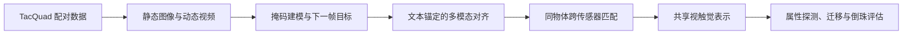
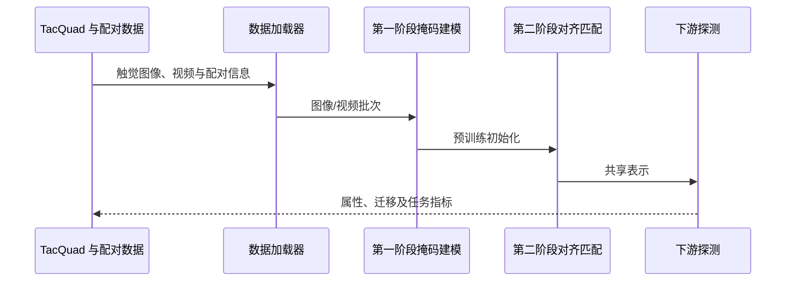

# AnyTouch：跨传感器统一静态–动态视触觉表征（ICLR 2025）

**AnyTouch**（*Learning Unified Static-Dynamic Representation across Multiple Visuo-tactile Sensors*）研究不同视觉触觉传感器之间的共享表征。它不是一个可直接执行动作的策略，而是面向静态属性与动态接触理解的预训练表示。

| 项目 | 内容 |
|---|---|
| 作者 | Ruoxuan Feng, Jiangyu Hu, Wenke Xia, Tianci Gao, Ao Shen, Yuhao Sun, Bin Fang, Di Hu |
| 单位 | 中国人民大学、武汉科技大学、北京邮电大学 |
| 发表 | ICLR 2025 |
| 论文 | [arXiv:2502.12191](https://arxiv.org/abs/2502.12191) · [ICLR 论文页](https://proceedings.iclr.cc/paper_files/paper/2025/hash/4d893f766ab60e5337659b9e71883af4-Abstract-Conference.html) |
| 项目与代码 | [项目、代码与数据入口](#项目资源与工程补充) |

## 英文缩写速查

| 缩写 | 全称 | 含义 |
|---|---|---|
| SSL | Self-Supervised Learning | 自监督学习 |
| MAE | Masked Autoencoder | 掩码自编码器 |
| TacQuad | Tactile Quadruple | AnyTouch 构建的多传感器触觉数据 |

| CUDA | Compute Unified Device Architecture | NVIDIA GPU 计算平台 |
| HF | Hugging Face | 模型与数据托管平台 |

## 要解决的问题

GelSight Mini、DIGIT、DuraGel、Tac3D 等传感器在成像外观、空间结构和采集设置上存在差异。单一传感器内训练出的表示容易把传感器特性当成接触语义；同时，静态触觉图像与动态接触视频的学习目标并不相同。AnyTouch 通过配对和自监督目标，把表征同时对准传感器不变的接触信息、物体语义与时间变化。

## 方法：数据与学习目标

论文构建 TacQuad，包含四类视触觉传感器。精细时空对齐子集有 17,524 个接触帧、25 个物体；较粗粒度空间配对部分有 55,082 帧、99 个物体。这两种数据粒度提供互补监督，不应被简写成所有样本均为完全时空对齐。

训练由三类目标组成：

1. **图像 / 视频掩码建模**：从遮挡的触觉观测学习静态接触结构和时间变化，动态目标还预测后续帧。
2. **多模态语义对齐**：把触觉、视觉和文本描述纳入共同语义空间，并利用文本锚点处理模态缺失。
3. **跨传感器匹配**：以相同物体和接触位置的观测作为匹配信号，抑制传感器外观造成的域偏移。

## 评测与含义

论文报告跨传感器迁移、静态/动态属性感知以及真实机器人倒珠验证。倒珠实验在特定初始质量与目标质量条件下进行了 10 次测试。结果支持该表示可迁移到下游感知/操作输入；它本身不证明模型能独立规划或控制机器人，也不能据此推断任意传感器零校准迁移。

## 结论

AnyTouch 的核心是把静态图像、动态视频、语义信息和跨传感器对应关系放进同一表示学习流程。TacQuad 支撑了传感器迁移与下游属性/任务验证；论文结果说明共享表征有用，但不等于传感器即插即用，也不提供完整动作策略。

## 对比

- **AnyTouch 2**：从 TacQuad 与静态–动态统一，扩展到 ToucHD 的分层动态触觉和显式力变化监督，见[对比论文页](./paper-anytouch2.md)。
- **Sparsh**：同属自监督视觉触觉表示学习；AnyTouch 更强调语义锚定与跨传感器同物体匹配，见 [Sparsh](./paper-sparsh.md)。

## 表征训练逻辑

## 与后续工作的关系

[AnyTouch 2](./paper-anytouch2.md) 延伸了通用光学触觉表示学习，将重点推进到动态接触、金字塔式 ToucHD 数据和显式力变化监督。其[项目实现与数据入口](paper-anytouch2.md)单独记录。与 [Sparsh](./paper-sparsh.md) 的关系是共享“传感器无关触觉表征”目标，但 AnyTouch 额外突出静态与动态统一、文本语义对齐及同物体跨传感器匹配。

## 项目资源与工程补充

| 资源 | 入口 | 说明 |
|---|---|---|
| 官方项目站 | [gewu-lab.github.io/AnyTouch](https://gewu-lab.github.io/AnyTouch/) | 项目概览与论文材料 |
| 代码 | [GeWu-Lab/AnyTouch](https://github.com/GeWu-Lab/AnyTouch) | 训练、评估及数据处理代码 |
| 论文 | [arXiv:2502.12191](https://arxiv.org/abs/2502.12191) | 本页论文方法与评测 |
| TacQuad 数据集 | [项目页](https://gewu-lab.github.io/AnyTouch/) | 项目论文/页面介绍的数据集 |
| 相关开放数据 | [TacQuad on Hugging Face](https://huggingface.co/datasets/xxuan01/TacQuad) | 数据卡与下载入口 |
| 预训练权重 | [Google Drive](https://drive.google.com/file/d/1L4jGUjIHNBMzOiD33Rv0jxWYKHBORD1R/view?usp=sharing) | 仓库 README 提供的权重入口 |

### 项目组成

- **传感器覆盖**：GelSight Mini、DIGIT、DuraGel、Tac3D。
- **训练代码**：官方仓库 README 描述两阶段流程：先做图像/视频掩码建模，再做语义对齐与跨传感器匹配。
- **下游评估**：仓库包含静态/动态属性探测和跨传感器评估入口；真实机器人倒珠是论文实验，需结合论文设置理解。
- **环境信息**：README 所列验证环境为 Ubuntu 20.04、PyTorch 2.1、CUDA 11.8。运行前应以当前仓库 README 和依赖文件为准。

## 源码运行时序图

### 使用边界

仓库公开程度、数据条款和权重链接可能变化；实际复现请查看上游 README 与各数据卡。TacQuad Hugging Face 页面标注 MIT 许可。论文中的机器人任务需要相应硬件与传感器，不能仅凭训练脚本复现。

### 模态与重定向就绪度

- **模态**：视触觉图像/视频、配对文本与视觉语义。
- **重定向就绪度**：原始代码与权重入口见 README；部署到新传感器仍需按传感器协议处理数据并评估迁移。

## 关联页面

- [AnyTouch 2 论文与项目](./paper-anytouch2.md)、[项目页](paper-anytouch2.md)
- [触觉感知](../concepts/tactile-sensing.md) · [视触觉融合](../concepts/visuo-tactile-fusion.md)
- [Sparsh](./paper-sparsh.md)

- [AnyTouch 2 项目](paper-anytouch2.md) 与 [AnyTouch 2 论文](./paper-anytouch2.md)
- [触觉感知主题](../concepts/tactile-sensing.md)

## 参考来源

- [论文来源摘录：AnyTouch](../../sources/papers/anytouch_arxiv_2502_12191.md)
- [arXiv](https://arxiv.org/abs/2502.12191) · [ICLR 2025](https://proceedings.iclr.cc/paper_files/paper/2025/hash/4d893f766ab60e5337659b9e71883af4-Abstract-Conference.html)

- [官方项目页](https://gewu-lab.github.io/AnyTouch/) · [代码仓库](https://github.com/GeWu-Lab/AnyTouch) · [TacQuad 数据卡](https://huggingface.co/datasets/xxuan01/TacQuad)
