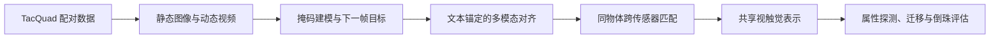

# AnyTouch：跨传感器统一静态–动态视触觉表征（ICLR 2025）

**AnyTouch**（*Learning Unified Static-Dynamic Representation across Multiple Visuo-tactile Sensors*）研究不同视觉触觉传感器之间的共享表征。它不是一个可直接执行动作的策略，而是面向静态属性与动态接触理解的预训练表示。

| 项目 | 内容 |
|---|---|
| 作者 | Ruoxuan Feng, Jiangyu Hu, Wenke Xia, Tianci Gao, Ao Shen, Yuhao Sun, Bin Fang, Di Hu |
| 单位 | 中国人民大学、武汉科技大学、北京邮电大学 |
| 发表 | ICLR 2025 |
| 论文 | [arXiv:2502.12191](https://arxiv.org/abs/2502.12191) · [ICLR 论文页](https://proceedings.iclr.cc/paper_files/paper/2025/hash/4d893f766ab60e5337659b9e71883af4-Abstract-Conference.html) |
| 项目与代码 | 独立的[项目详情页](./project-anytouch.md) |

## 要解决的问题

GelSight Mini、DIGIT、DuraGel、Tac3D 等传感器在成像外观、空间结构和采集设置上存在差异。单一传感器内训练出的表示容易把传感器特性当成接触语义；同时，静态触觉图像与动态接触视频的学习目标并不相同。AnyTouch 通过配对和自监督目标，把表征同时对准传感器不变的接触信息、物体语义与时间变化。

## 数据与学习目标

论文构建 TacQuad，包含四类视触觉传感器。精细时空对齐子集有 17,524 个接触帧、25 个物体；较粗粒度空间配对部分有 55,082 帧、99 个物体。这两种数据粒度提供互补监督，不应被简写成所有样本均为完全时空对齐。

训练由三类目标组成：

1. **图像 / 视频掩码建模**：从遮挡的触觉观测学习静态接触结构和时间变化，动态目标还预测后续帧。
2. **多模态语义对齐**：把触觉、视觉和文本描述纳入共同语义空间，并利用文本锚点处理模态缺失。
3. **跨传感器匹配**：以相同物体和接触位置的观测作为匹配信号，抑制传感器外观造成的域偏移。

## 评测与含义

论文报告跨传感器迁移、静态/动态属性感知以及真实机器人倒珠验证。倒珠实验在特定初始质量与目标质量条件下进行了 10 次测试。结果支持该表示可迁移到下游感知/操作输入；它本身不证明模型能独立规划或控制机器人，也不能据此推断任意传感器零校准迁移。

## 表征训练逻辑

## 与后续工作的关系

[AnyTouch 2](./paper-anytouch2.md) 延伸了通用光学触觉表示学习，将重点推进到动态接触、金字塔式 ToucHD 数据和显式力变化监督。其[项目实现与数据入口](./project-anytouch2.md)单独记录。与 [Sparsh](./paper-sparsh.md) 的关系是共享“传感器无关触觉表征”目标，但 AnyTouch 额外突出静态与动态统一、文本语义对齐及同物体跨传感器匹配。

## 入口

- [AnyTouch 项目详情](./project-anytouch.md) — 官方网站、代码仓库、TacQuad、权重与运行入口
- [触觉感知](../concepts/tactile-sensing.md)
- [视触觉融合](../concepts/visuo-tactile-fusion.md)
- [AnyTouch 论文来源摘录](../../sources/papers/anytouch_arxiv_2502_12191.md)
