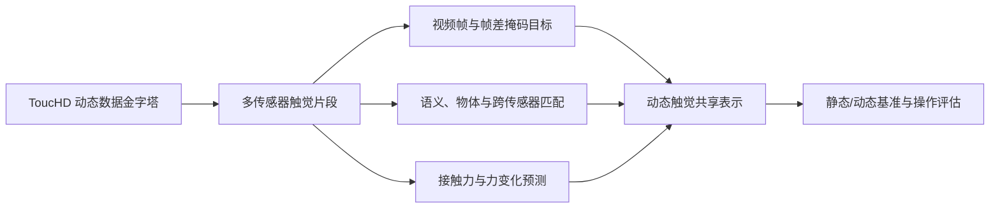
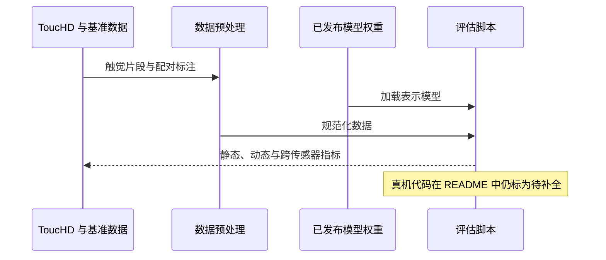

# AnyTouch 2：动态光学触觉通用表征（ICLR 2026）

**AnyTouch 2**（*General Optical Tactile Representation Learning For Dynamic Tactile Perception*）将视觉触觉预训练重心从静态属性扩展至动态接触与力学相关表示。它提出 ToucHD 数据金字塔，并通过多类自监督与力监督目标训练表征。

| 项目 | 内容 |
|---|---|
| 作者 | Ruoxuan Feng, Yuxuan Zhou, Siyu Mei, Dongzhan Zhou, Pengwei Wang, Shaowei Cui, Bin Fang, Guocai Yao, Di Hu |
| 发表 | ICLR 2026 |
| 论文 | [arXiv:2602.09617](https://arxiv.org/abs/2602.09617) · [ICLR 论文页](https://proceedings.iclr.cc/paper_files/paper/2026/hash/073c8584ef86bee26fe9d639ec648e28-Abstract-Conference.html) |
| 项目与代码 | [项目、代码与数据入口](#项目资源与工程补充) |

## 英文缩写速查

| 缩写 | 全称 | 含义 |
|---|---|---|
| MAE | Masked Autoencoder | 掩码自编码器 |
| ToucHD | Tactile Understanding through Contact Hierarchy Dataset | AnyTouch 2 的动态触觉数据集 |
| RMSE | Root Mean Squared Error | 均方根误差 |

| HF | Hugging Face | 模型与数据托管平台 |

## ToucHD：由受控接触到真实操作

ToucHD 汇总 2,426,174 个触觉样本，划分为 Sim（1,118,896）、Mani（584,842）和 Force（722,436）。Sim 包含五类传感器、六种原子动作和 1,043 个物体；Mani 汇总 46 项真实操作任务；Force 配对触觉观测与接触力。数据金字塔涵盖不同动态层级：受控按压、指定滑动/旋转、预设接触动作、真实操作以及力监督。不同子集的采集协议并不相同。

## 方法：表征学习目标

1. **时序视频掩码建模**：重建触觉视频帧，并学习帧间变化。
2. **语义和匹配监督**：对齐语义描述、同物体数据及跨传感器样本。
3. **显式力目标**：预测接触力和力变化，补充仅靠视觉外观难以识别的动力学线索。

## 评测覆盖

论文覆盖静态属性、动态物理属性、传感器泛化及真实操作场景，任务包含触觉抓取、白板擦拭、USB 插入和芯片移动。指标必须连同输入帧、传感器与数据划分一起比较。AnyTouch 2 的贡献是更丰富的动态数据和目标；它不等同于可直接部署的通用操作策略。

## 方法流程

## 对比：AnyTouch 前作与 Sparsh

[AnyTouch（ICLR 2025）](./paper-anytouch.md)聚焦静态–动态统一表示、TacQuad 和文本锚定多模态对齐。AnyTouch 2 把监督范围拓展到更大规模动态接触层级和显式力变化目标。对应的软件实现、数据集和权重入口另列在[AnyTouch 2 项目页](#项目资源与工程补充)。

## 结论

AnyTouch 2 以更丰富的动态接触数据和力变化监督推进通用光学触觉表征，评测覆盖静态、动态、跨传感器与真实操作情境。仓库资产仍不等于完整真机部署栈，读取分数时应保留每个任务、传感器和输入设定。

## 项目资源与工程补充

| 资源 | 入口 | 说明 |
|---|---|---|
| 官方项目站 | [gewu-lab.github.io/AnyTouch2](https://gewu-lab.github.io/AnyTouch2/) | 方法、数据与实验概览 |
| 代码 | [GeWu-Lab/AnyTouch2](https://github.com/GeWu-Lab/AnyTouch2) | 数据预处理与评估代码 |
| 论文 | [arXiv:2602.09617](https://arxiv.org/abs/2602.09617) | 本页论文方法与评测 |
| ToucHD 数据集 | [BAAI Hugging Face collection](https://huggingface.co/collections/BAAI/touchd) | 包含 Mani、Force、Sim 数据集入口 |
| 预训练模型 | [AnyTouch2-Model](https://huggingface.co/xxuan01/AnyTouch2-Model) | 模型访问需按模型卡说明申请/提交联系信息 |
| ToucHD-Force | [BAAI/ToucHD-Force](https://huggingface.co/datasets/BAAI/ToucHD-Force) | 页面设有访问表单 |

### 数据资产

- **Sim**：1,118,896 帧；项目论文统计包含 5 类传感器、6 种原子动作及 1,043 个物体。
- **Mani**：584,842 帧、46 项操作任务。
- **Force**：722,436 个触觉-力样本；该子集下载需查看 Hugging Face 页面当前访问条件。
- 三部分总计 2,426,174 个样本。来源、协议及样本定义见[论文归档](../../sources/papers/anytouch2_arxiv_2602_09617.md)。

### 仓库可用性

截至本页整理时，README 标记数据预处理和 Sparsh 评估代码已提供，并将 real-world code 标为待补全；仓库 quick-start 文案还出现 “Coming Soon”，运行前请以代码仓库当前说明为准。公开评估结果可在 README 查看，但具体分数应与任务、传感器及帧采样设定一起引用。不要把论文中的真机实验误当成当前仓库已公开的部署代码。

## 源码运行时序图

下图只概括仓库公开的**数据处理/预训练权重评估路径**，不表示仓库已提供完整真机训练与部署管线：

### 模态与重定向就绪度

- **模态**：多传感器触觉视频、语义/物体配对和力信号。
- **重定向就绪度**：表征权重和评估需遵循 Hugging Face 访问流程；真机部署代码在上游 README 中尚未完成。

## 关联页面

- [AnyTouch 论文与项目](./paper-anytouch.md) · [项目实现](paper-anytouch.md)
- [触觉感知](../concepts/tactile-sensing.md) · [视触觉融合](../concepts/visuo-tactile-fusion.md)
- [Sparsh](./paper-sparsh.md)

- [AnyTouch 前作项目](paper-anytouch.md)与[论文](./paper-anytouch.md)
- [触觉感知主题](../concepts/tactile-sensing.md)

## 参考来源

- [论文来源摘录：AnyTouch 2](../../sources/papers/anytouch2_arxiv_2602_09617.md)
- [arXiv](https://arxiv.org/abs/2602.09617) · [ICLR 2026](https://proceedings.iclr.cc/paper_files/paper/2026/hash/073c8584ef86bee26fe9d639ec648e28-Abstract-Conference.html)

- [官方项目页](https://gewu-lab.github.io/AnyTouch2/) · [代码仓库](https://github.com/GeWu-Lab/AnyTouch2) · [ToucHD 数据入口](https://huggingface.co/collections/BAAI/touchd)
