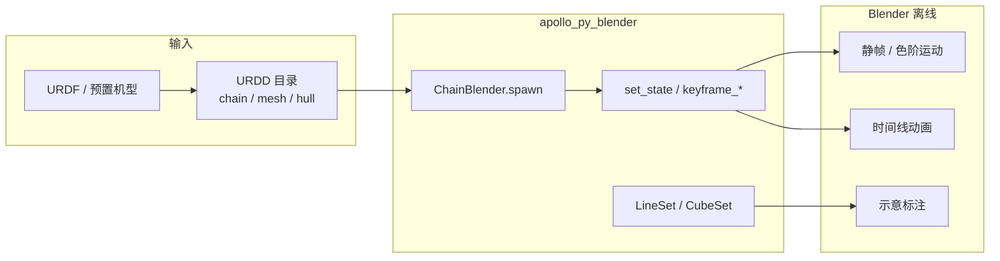
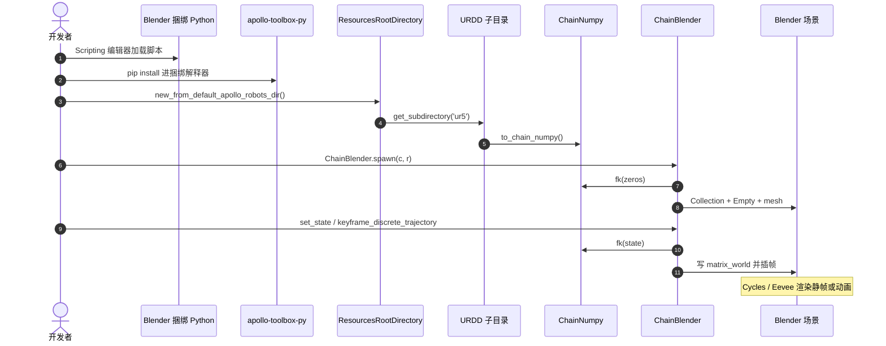

# APOLLO Blender

**APOLLO Blender**（*A Robotics Library for Visualization and Animation in Blender*，[arXiv:2512.23103v2](https://arxiv.org/abs/2512.23103v2)，[代码](https://github.com/Apollo-Lab-Yale/apollo-py)）由 **Peter Messina** 与 **Daniel Rakita**（[耶鲁大学](https://apollo-lab-yale.github.io/research/) APOLLO Lab）提出：把 **URDD/URDF 导入、关节/材质关键帧、线与立方体图元** 接到 [Blender](./blender.md) 的离线渲染，让研究者用短 Python 脚本出论文图、投稿视频和教学示意，而不必先成为 Blender 专家。

## 一句话定义

**在 Blender 捆绑 Python 里用 URDD 链 + `ChainBlender` 脚本出图**：导入标准机器人描述，关键帧位形与外观，再叠线/盒标注——专做沟通层，不做物理仿真。

## 英文缩写速查

| 缩写 | 英文全称 | 简要说明 |
|------|----------|----------|
| URDD | Universal Robot Description Directory | 从 URDF 派生的模块化目录；本库的导入载体 |
| URDF | Unified Robot Description Format | 统一机器人描述；可自动转成 URDD |
| FK | Forward Kinematics | `set_state` 时用链上 FK 写各 link 位姿 |
| DOF | Degree of Freedom | 关节数组长度须对齐 `dof_module` |
| RGBA | Red Green Blue Alpha | 链接色与透明度；alpha 0 全透、1 不透 |
| DCC | Digital Content Creation | Blender 作为建模/动画/渲染宿主 |

## 为什么重要

- **对准真实出图摩擦：** 仿真器画质一般、游戏引擎为实时牺牲灯光、教学可视化工具域窄。论文图和投稿视频真正要的是 **可复现的离线渲染**，不是接触求解。
- **和 URDD 同一实验室：** 导入层吃的是 [URDD](./paper-urdd-universal-robot-description-directory.md) 里已经算好的链、网格、凸包与凸分解，避免在 Blender 里再解析一遍 URDF。
- **脚本即图：** 场景、关键帧、材质都在代码里，适合版本控制和改机型后重渲；作者称该库版本已服务 RelaxedIK、CollisionIK、PROXIMA 等多篇既有配图。

## 核心信息

| 字段 | 内容 |
|------|------|
| 机构 | 耶鲁大学（Yale University）计算机科学系 / APOLLO Lab |
| 宿主 | Blender（捆绑 Python + `bpy`）；pip 进该解释器 |
| 描述格式 | **URDD**（可由 URDF 自动构造）；预置机型如 UR5 |
| 三能力 | 导入链与网格；`set_state` / 关键帧；`BlenderLineSet` / `BlenderCubeSet` |
| 可视化档 | plain mesh（`.obj` / `.glb`）、凸包、凸分解；默认真网格、关近似 |
| 代码 | **已开源** MIT：[apollo-py](https://github.com/Apollo-Lab-Yale/apollo-py) / PyPI `apollo-toolbox-py` 0.0.13 |
| 论文 import | `blender_robot_toolbox_py` **不在 PyPI**；仓内模块是 `apollo_py_blender` |

## 流程总览

## 核心原理

1. **资源根目录** 指向本机 URDD 集合；`get_subdirectory('ur5')` → `to_chain_numpy()` 得到带 `dof_module` / `plain_meshes_module` 的链。
2. **`ChainBlender.spawn`** 为零位做 FK，为每个 link 建 Empty，再挂 plain / 凸包 / 凸分解网格；网格跟父 Empty，改关节只写 Empty 的 `matrix_world`。
3. **关键帧** 对 Empty 的 `location` / `rotation_euler` 插帧；`keyframe_discrete_trajectory` 按列表顺序铺时间线。材质 alpha/颜色也可按帧插值。
4. **图元** 按帧出现：线表示力/运动方向，立方体表示包围盒或工作空间。

仓内最短入口（[`scripts/test.py`](https://github.com/Apollo-Lab-Yale/apollo-py/blob/main/apollo_toolbox_py/apollo_py_blender/scripts/test.py)）已改用 `new_from_default_apollo_robots_dir()`，不要死抄论文打印的 `new_from_default()`。

## 源码运行时序图

官方可运行入口在 [apollo-py](https://github.com/Apollo-Lab-Yale/apollo-py) 的 `apollo_py_blender/`（归档见 [sources/repos/apollo-lab-yale-apollo-py.md](../../sources/repos/apollo-lab-yale-apollo-py.md)）：

- **最短复现路径：** 用 Blender 捆绑 `python -m pip install apollo-toolbox-py`（需要 `bpy`/`easybpy` 时加 extra）→ 备好 URDD（可从 [apollo-resources](https://github.com/Apollo-Lab-Yale/apollo-resources) 或 [apollo-rust](https://github.com/Apollo-Lab-Yale/apollo-rust) 生成）→ 在 Scripting 里跑 `scripts/test.py` 同类脚本。
- **包名：** 论文 `from blender_robot_toolbox_py.prelude import *` 已过时；现用 `from apollo_toolbox_py.prelude import *`，Blender 侧再引 `ChainBlender`。

## 工程实践

| 项 | 建议 |
|----|------|
| 装哪里 | **必须**装进 Blender 自带 Python，不是系统 Python |
| 模型从哪来 | 优先现成 URDD；只有 URDF 时先走 [URDD](./paper-urdd-universal-robot-description-directory.md) 预处理 |
| 出静帧运动 | 多份 `spawn` + 关节/颜色插值（论文 §IV-A，<100 行） |
| 看碰撞近似 | `set_convex_hull_meshes_visibility(True)` 并关 plain mesh，避免叠两套几何 |
| 动画 | 外部规划/遥操作轨迹喂 `keyframe_discrete_trajectory`，不要指望默认插值像动力学 |
| 灯光相机 | 库不管构图；出版级结果仍要在 Blender 里调 Cycles / 相机 |

## 实验与评测

论文没有仿真精度或用户研究表，评测是 **可复现图例**：

- **色阶静帧：** UR5 起止配置之间拷贝 9 份，灰→红插值（Fig. 20）。
- **组合平台示意：** Robotiq 140 + Unitree Z1 + Unitree B1（Fig. 21）；文中另述 xArm7+夹爪+导轨。
- **凸包教学图：** 按 link 开凸包并统一青蓝半透明（Fig. 22）。
- **使用史：** 指向 RelaxedIK、CollisionIK、PROXIMA、ad-trait 等既有论文配图，而不是新数值 benchmark。

## 结论

**这是 Blender 上的机器人出图脚本层，不是又一个仿真器；真正省时间的是 URDD 导入 + 关节/材质关键帧，不是再学一遍 Cycles。**

1. **先分清层：** 物理与接触仍走 MuJoCo / Isaac / Gazebo；本库只负责论文图、视频和示意。
2. **导入走 URDD，不要在 Blender 里手拼 URDF 树** — 凸包/凸分解已经在派生目录里。
3. **复现用 `apollo-toolbox-py`，不要 pip 论文里的 `blender_robot_toolbox_py`。**
4. **默认插值是运动学的** — 要「像真机」必须喂外部轨迹。
5. **色阶拷贝适合一张图讲完一段运动**；时间线关键帧适合视频。
6. **出版级画面仍要会打光和构图**；库只把机器人放进场景。
7. **高面数与密凸分解会拖渲染** — 示意用凸包，照片级再用 plain mesh。

## 与其他工作对比

| 路线 | 优化目标 | 和本库的关系 |
|------|----------|----------------|
| Unity / Unreal | 实时交互、HRI、田间视觉 | 本库放弃实时，换离线画质与短脚本 |
| Gazebo / CoppeliaSim / Webots | 物理与接触 | 互补：仿真出轨迹，这里出图 |
| RobotDraw / RoboAnalyzer / GraspIt! | 教学或窄域可视化 | 本库绑在大众 DCC，画质上限更高 |
| [Robot Viewer](./robot-viewer.md) / URDD Three.js | 浏览器里看模型 | Web 检视 vs 出版渲染，不是替代 |
| [机器人关键帧编辑器](./robot-motion-keyframe-editors.md) | 改 CSV/MJCF/NPZ 再训练 | 那些改 **数据**；本库改 **画面** |
| [Manim](./manim.md) | 公式与 2D 讲解片 | 公式走 Manim，3D 机型走本库 |
| [Blender](./blender.md) 本体 | 通用网格/骨骼/USD | 本库是其上的机器人脚本，不是另一套 DCC |

## 局限与风险

- **不是物理引擎：** 无接触、无闭环；关键帧之间默认线性/Blender 插值。
- **依赖合格描述：** 残缺 URDF 要先修，再生成 URDD。
- **安装面：** 必须命中 Blender 捆绑解释器；`bpy` extra 还钉在 Python 3.11。Snap/只读安装目录会更烦。
- **文档债：** 仓 README 几乎是空的；实验室研究页不给直链。以 `apollo_py_blender/` 源码和论文 §III 为准。
- **许可：** 库 MIT；Blender 本体 GPL；网格资产各跟厂商。

## 关联页面

- [Blender（开源 3D 创作套件）](./blender.md)
- [URDD（Beyond URDF）](./paper-urdd-universal-robot-description-directory.md)
- [URDF（统一机器人描述格式）](../concepts/urdf-robot-description.md)
- [机器人关键帧与运动编辑工具](./robot-motion-keyframe-editors.md)
- [Robot Viewer](./robot-viewer.md)
- [Manim（程序化数学动画）](./manim.md)
- [机器人描述目录选型](../comparisons/robot-description-catalogs.md)

## 参考来源

- [APOLLO Blender 论文摘录](../../sources/papers/apollo_blender_arxiv_2512_23103.md)
- [apollo-py 仓库归档](../../sources/repos/apollo-lab-yale-apollo-py.md)
- [APOLLO Lab 研究页归档](../../sources/sites/apollo-lab-yale-research.md)
- [URDD 论文摘录](../../sources/papers/urdd_beyond_urdf_arxiv_2512_23135.md)

## 推荐继续阅读

- Messina & Rakita, *APOLLO Blender*, [arXiv:2512.23103v2](https://arxiv.org/abs/2512.23103v2)
- 工程入口：[Apollo-Lab-Yale/apollo-py](https://github.com/Apollo-Lab-Yale/apollo-py) · PyPI [`apollo-toolbox-py`](https://pypi.org/project/apollo-toolbox-py/)
- 姊妹规格：[URDD, arXiv:2512.23135](https://arxiv.org/abs/2512.23135)
