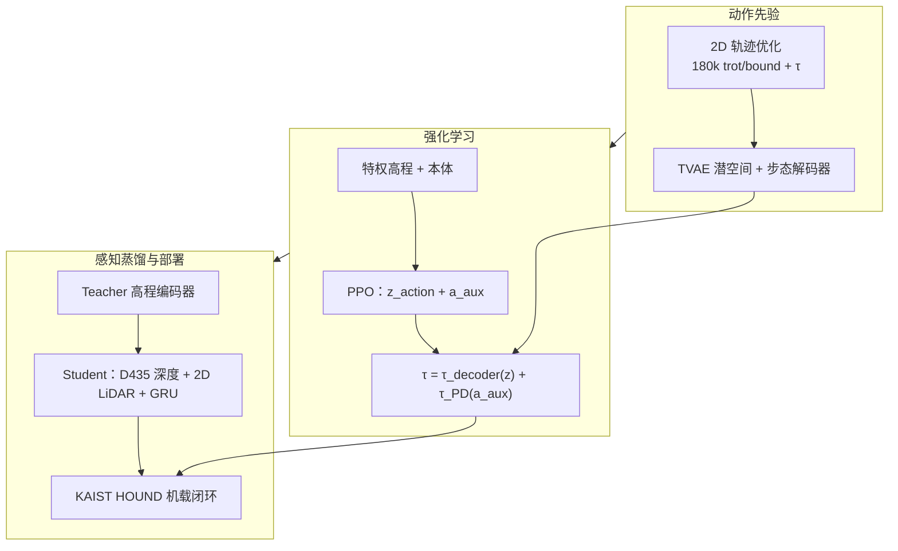

# APT-RL：野外敏捷感知多技能四足 Locomotion

**Agile perceptive multi-skill locomotion for quadrupedal robots in the wild**（Jun-Gill Kang / Jaehyun Park 等，ADD · KAIST · DIDEN Robotics · 高丽大学，**Science Robotics 2026 封面**，[DOI:10.1126/scirobotics.adz7397](https://doi.org/10.1126/scirobotics.adz7397)，[arXiv:2607.13579](https://arxiv.org/abs/2607.13579)）提出 **APT-RL**（Action Pretrained Transformer-based Reinforcement Learning）：以 **2D 轨迹优化** 大规模生成 **trot/bound 力矩先验**，经 **TVAE 表征学习 → PPO 潜/辅助动作 RL → 深度+LiDAR 感知蒸馏**，在 **KAIST HOUND** 上用 **单策略、仅机载感知** 完成校园 **1.1 km** 与森林 **0.34 km** 野外路线，并演示 **6 m/s** 瞬时峰值、**60 cm 高台** 与多级楼梯等离散障碍。

## 一句话定义

**先把轨迹优化出的 trotting/bounding 力矩模式压进 Transformer 潜空间作动作先验，再让 RL 用「潜动作 + 辅助力矩」在复杂 3D 地形上扩展技能，并用深度/LiDAR 蒸馏掉仿真特权地图，使四足在野外按地形与速度命令自动选 trot 或 bound 并完成跳攀等机动。**

## 英文缩写速查

| 缩写 | 英文全称 | 简要说明 |
|------|----------|----------|
| APT-RL | Action Pretrained Transformer-based RL | 本文统一框架：TO 先验 + TVAE + RL + 感知蒸馏 |
| TVAE | Transformer Variational Autoencoder | 从 TO 轨迹学潜空间与步态力矩解码器 |
| TO | Trajectory Optimization | 2D 单刚体动力学生成 flat trot/bound 数据集 |
| PPO | Proximal Policy Optimization | Isaac Gym 中策略训练算法 |
| Sim2Real | Simulation to Real | 零样本迁移至 HOUND 野外长程 |
| LiDAR | Light Detection and Ranging | 2D 扫描转 45-bin 高程，远距与楼梯场景更稳 |
| RL | Reinforcement Learning | 潜动作与辅助动作联合优化 |
| COT | Cost of Transport | 运输成本；与成功率、速度跟踪一并评测 gait |

## 为什么重要

- **封面级野外实证：** 不只实验室障碍课，而是在 **真实校园与森林** 完成 **公里级** 路线，且 **无动捕/外部位姿**，对 [Sim2Real](../concepts/sim2real.md) 与 [Terrain Adaptation](../concepts/terrain-adaptation.md) 是强数据点。
- **「先验 + 扩展」而非纯模仿：** 预训练仅 **2D flat trot/bound**，靠 **辅助力矩** 在 RL 中生成 **跳木、腿损恢复、偏航** 等 OOD 行为——比固定 residual 基策略更紧密地 **联合学习** 潜动作与修正项。
- **步态切换可解释：** 同楼梯、同几何障碍上，策略按 **障碍高度** 与 **命令速度** 在 **trot ↔ bound** 间切换，而非手工规则表；与 [Learning to Adapt](./paper-learning-to-adapt-bio-inspired-quadruped-gait.md) 的 **πG 生物力学指标**、[Walk These Ways](./paper-walk-these-ways-quadruped-mob.md) 的 **人类调 b** 形成对照轴。
- **感知–速度–动态工程耦合：** **深度 + LiDAR** 双模态蒸馏；**>4 m/s** 为 LiDAR 加装 **减振器** 抑制 **>10 g** 冲击——把高速 bound 落地的 **传感可靠性** 写进系统论文而非附录脚注。

## 流程总览

## 核心机制（提炼）

| 模块 | 作用 | 备注 |
|------|------|------|
| **2D TO 数据集** | 15.5 h、180k 轨迹，含 **τ** | 8 min 生成；仅 sagittal flat |
| **TVAE** | **z∈R^16**；trot/bound **力矩解码器** | 3 帧本体历史重建 |
| **RL 策略** | 输出潜动作 + **辅助动作** | 课程地形：rough、楼梯、高台、垫脚石、沟等 |
| **Auto vs 固定 gait** | 策略自选 trot/bound | 优于固定 trot 或 bound 控制器 |
| **感知蒸馏** | 特权 2.5D 高程 → depth+LiDAR | LiDAR 45 bins（0.6–5 m）；DAgger |
| **减振 LiDAR** | 高速冲击隔离 | **>4 m/s** 启用 3D 打印减振机构 |

**与相邻工作的差异：**

| 维度 | APT-RL | Learning to Adapt | Walk These Ways | SWAP / Extreme Parkour |
|------|--------|-------------------|-----------------|------------------------|
| 感知 | **深度 + LiDAR** | 仅本体 | 部署期可调参，非地形编码 | 深度 / scandots 蒸馏 |
| 步态数 | **trot + bound（Auto）** | 8 gait + πG | MoB 连续 **b** | 跑酷技能为主 |
| 先验来源 | **TO + TVAE 力矩** | BGS 参考轨迹 | 平地多行为嵌入 | WM / 特权地图 |
| 野外长程 | **1.1 km 校园 + 0.34 km 森林** | 多类实机地形 | OOD 试参 | 跑酷课 / 纪录跳跃 |

## 实验与评测

- **仿真：** Isaac Gym；命令 **x∈[-1,7] m/s**；五 gait 解码器消融后选 **trot+bound**；与 **AMP**、**vanilla PPO** 比成功率与 **1/COT**。
- **实机（HOUND）：** RealSense D435 + 2D LiDAR；**零样本** 野外；峰值 **6 m/s**（三级楼梯下落）、**4.25 m/s**（60 cm 高台）；障碍含楼梯、栏、垫脚石、沟、倒枝等。
- **传感消融：** 双模态 > 仅 LiDAR > 仅深度（任务相关：LiDAR 擅楼梯/沟/高台，深度擅栏/垫脚石）。

## 局限与风险

- **代码：** 截至入库日项目页 **未列 GitHub**；[Zenodo:20645964](https://zenodo.org/records/20645964) 仅含 **数据与作图代码**，**完整训练/部署栈不可直接复现**。
- **运动覆盖：** 先验与部署侧重 **矢状面前后**；**横向行走/急转** 为未来工作；仅 **两种 gait**（虽论文对比过 pace/gallop/pronk）。
- **平台绑定：** 实机为 **自研 HOUND**，迁移至 Unitree / ANYmal 需重训感知与动力学辨识。
- **高速传感：** 减振器缓解 LiDAR 失效，但 **>10 g** 冲击下感知仍是最脆弱环节。

## 工程实践

- **可借鉴管线：** **廉价 TO 大数据 → VAE/TVAE 力矩先验 → RL 辅助扩展 → 特权地图蒸馏到 depth/LiDAR**；适合已有 Isaac Gym 栈、希望 **单策略覆盖多障碍+步态** 的团队。
- **硬件提示：** 高速 bound 落地务必评估 **外感知安装刚度**；本文用 **3D 打印减振** 作为最低成本方案。
- **数据入口：** 复现图表可从 [Zenodo](https://zenodo.org/records/20645964) 获取；训练代码需等待作者后续发布或自行复现三阶段栈。

## 参考来源

- [APT-RL 论文归档（Science Robotics 2026）](../../sources/papers/apt_rl_science_robotics_2026.md)
- [skillquadsr.github.io 项目页](../../sources/sites/skillquadsr-github-io.md)
- Kang et al., *Agile perceptive multi-skill locomotion for quadrupedal robots in the wild*, [Science Robotics 2026](https://doi.org/10.1126/scirobotics.adz7397) · [arXiv:2607.13579](https://arxiv.org/abs/2607.13579)

## 关联页面

- [楼梯与障碍 Locomotion（感知中心节点）](../tasks/stair-obstacle-perceptive-locomotion.md)
- [Locomotion 任务页](../tasks/locomotion.md)
- [四足机器人](./quadruped-robot.md)
- [Learning to Adapt（Nature MI 2025 四足多步态）](./paper-learning-to-adapt-bio-inspired-quadruped-gait.md)
- [Walk These Ways（MoB）](./paper-walk-these-ways-quadruped-mob.md)
- [SWAP（四足感知跑酷）](./paper-swap-parkour.md)
- [Extreme Parkour](./extreme-parkour.md)
- [Privileged Training](../concepts/privileged-training.md)

## 推荐继续阅读

- [APT-RL 项目页与演示视频](https://skillquadsr.github.io/)
- [Science Robotics 论文页](https://doi.org/10.1126/scirobotics.adz7397)
