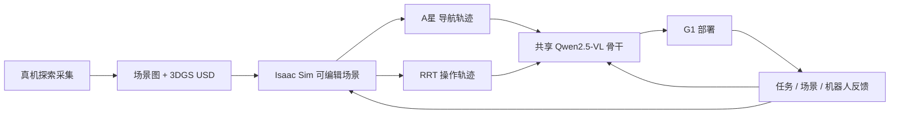
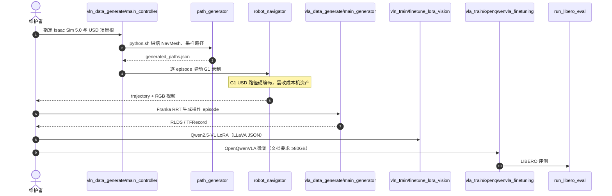

# Arcadia（具身终身学习全生命周期）

**Arcadia**（*Toward a Full-Lifecycle Framework for Embodied Lifelong Learning*，[arXiv:2512.00076](https://arxiv.org/abs/2512.00076)，浙江大学 / 宇树 / 北大 / 南大 / 群核 / 字节 Seed / 阿德莱德）把具身学习写成 **不可拆的四段闭环**：在部署环境里自主采集，生成可编辑仿真资产，用共享多模态骨干同时训 VLN 与 VLA，再把真机轨迹拆成结构化反馈写回仿真。作者报告仿真导航/操作相对基线平均约 **+7.07% / +11.08%**；Unitree G1 + Dex-3 上完成 **46/100** 导航与 **27/100** 操作（NaVILA 导航 13、OpenVLA 操作 9）。官方仓 [EmbodiedKit](https://github.com/Embodied-Arcadia/EmbodiedKit) 是 **部分开源**：子目录有数据生成与训练入口，根 README 仍是占位，探索 / 3DGS / 反馈写回与权重未发布。

## 一句话定义

**把「采集 → 生成仿真 → 共享 VLN/VLA 表征 → 真机反馈写回」锁成同一条生命周期，而不是再做一个更强的单任务模型。**

## 英文缩写速查

| 缩写 | 英文全称 | 简要说明 |
|------|----------|----------|
| VLN | Vision-and-Language Navigation | 语言条件视觉导航；本文与 VLA 共享骨干 |
| VLA | Vision-Language-Action | 语言条件操作策略；本文用 7D action de-tokenizer |
| VLN-CE | VLN in Continuous Environments | 连续空间导航协议；仿真数据按此格式组织 |
| R2S2R | Real-to-Sim-to-Real | 真机经验重建仿真、再部署回真机 |
| 3DGS | 3D Gaussian Splatting | 论文重建器；公开仓未包含该段 |
| SR | Success Rate | 到达/完成比例；仿真与真机口径不同 |
| SPL | Success weighted by Path Length | 成功且惩罚绕路 |
| NE | Navigation Error | 终点到目标的距离 |

## 为什么重要

- **诊断的是耦合断裂，不是又一个榜分数：** GRUtopia 扩仿真、NaVILA 把执行拉到真机，都只连上生命周期的一条边。Arcadia 的主张是：外源数据、预渲染场景、导航/操作分家、部署只记成败——四件事会一起卡住持续改进。
- **共享骨干是工程假设，不是刷分技巧：** 消融里换掉联合训练掉点最小，说明 VLN 的全局布局与 VLA 的局部 affordance 可以住在同一 VLM 潜空间；这和「各训各的导航 VLA / 操作 VLA」是相反方向。
- **真机数字要当上限读，不当部署证明：** 46% / 27% 高于对照，但组合指令只剩约 17%，且操作侧对桌面四物块做了专用微调。生命周期叙事成立，不等于家庭任务可交付。
- **开源状态必须拆开看：** 有仓 ≠ 能复现论文闭环。能跑的是 Isaac 数据脚本和 Qwen 系训练；不能跑的是探索、重建和反馈写回。

## 核心信息

| 字段 | 内容 |
|------|------|
| 机构 | 浙江大学（ZJU）；宇树科技（Unitree）；北京大学（PKU）；南京大学（NJU）；群核科技（Manycore Tech）；字节跳动 Seed（ByteDance Seed）；阿德莱德大学（University of Adelaide） |
| arXiv | [2512.00076](https://arxiv.org/abs/2512.00076)（v1） |
| 项目页 / 代码 | **部分开源**：[EmbodiedKit](https://github.com/Embodied-Arcadia/EmbodiedKit)（无独立项目页、无 License；根 README 为 TODO） |
| 骨干 | Qwen2.5-VL；导航沿 [NaVILA](./paper-notebook-navila-legged-robot-vision-language-action-model.md) 分层；操作加 OpenVLA 风格 7D de-tokenizer |
| 仿真 | Isaac Sim；导航数据 VLN-CE 格式；操作数据 RLDS；场景导入 USD |
| 真机 | Unitree G1 + Dex-3；导航 **零样本**；操作对四物块桌面任务微调双臂模型 |
| 主要基线 | Tuning / NaVILA（VLN）；OpenVLA（VLA） |

## 核心原理

### 输入 / 输出

| 侧 | 内容 |
|------|------|
| 采集 | 部署环境中的 RGB-D、LiDAR、IMU、里程计与位姿（论文；仓内未见探索栈） |
| 重建 | 多视图 → 场景图 \(G=(V,E)\) → Gaussian splat USD（论文；仓内未见 3DGS） |
| 导航监督 | 起终点采样 + A\*；7 类离散运动原语，语言格式对齐 VLN-CE |
| 操作监督 | RRT 可行轨迹；语言格式对齐 BridgeData V2；输出 7D 动作 |
| 反馈 | 任务 \(F_t^T\)、场景扰动、硬件约束 \(F^R\)，写回资产与策略 |

### 流程总览

四段作者称为 **non-decomposable**：去掉采集就退回外源数据；去掉生成式重建就退回检索式静态场景；去掉共享表征就无法跨任务传监督；去掉反馈就只剩一次性训练。

### 关键机制（压缩）

1. **任务对齐采集：** frontier 按期望熵减打分，在 **同一物理环境** 里采数据，而不是拿 YouTube / 四足视角硬迁到人形。
2. **生成式资产而不是检索网格：** SpatialLM 出物体–空间关系，splat 直接合成 simulator-ready USD，再经管理接口进 Isaac Sim。
3. **共享编码器 + 轻量任务头：** 导航与操作走同一感知/状态编码器，各自解码；联合训练把「去哪」和「怎么抓」放进同一潜空间。
4. **密集反馈，不只成败：**
   \[
   F_t^{T}=\lambda_1 R_t+\lambda_2\|s_{t+1}-s_t\|+\lambda_3\mathcal{L}_{\mathrm{conf}}(o_t,\hat o_t)+\lambda_4\mathcal{L}_{\mathrm{goal}}(s_t,s_g)
   \]
   再叠加低光/新物体等场景日志，以及步高、负载等 \(F^R\) 安全门。

## 源码运行时序图

公开仓 **没有** 论文 §3.1 / §3.2 / §3.4 的探索、3DGS 与反馈写回。下面只对齐 [EmbodiedKit](../../sources/repos/embodiedkit.md) 里能指到的训练/数据入口。

关键复现路径：先自备 Isaac 场景与 G1/Franka 资产，分别跑 `vln_data_generate` / `vla_data_generate`，再进 `vln_train` 或 `vla_train`。不要指望根目录有一键闭环；`scene_replace/` 只做 InternUtopia 检索式替换，对应论文消融里的弱对照，不是 3DGS 重建。

## 工程实践

| 项 | 建议 / 论文设定 |
|----|----------------|
| 生命周期选型 | 若目标是「部署经验能否改仿真」，读本页；若只想跑通室内 VLN，走 [四范式开源栈](../overview/vln-open-source-repro-paradigms.md) |
| 导航栈 | 高层 Qwen2.5-VL + 低层机器人 API；仿真数据按 VLN-CE 组织，便于和 NaVILA 对照 |
| 操作栈 | 同一 VLM + 7D de-tokenizer；数据 RLDS；LIBERO / BridgeData V2 |
| 真机口径 | 导航零样本；操作不是零样本（四物块双臂微调）。100 条人工评测，不是标准 LIBERO 协议 |
| 公开仓 | 子 README 可跑，根 README 不能当安装文档；无 License、无权重 |
| 算力 | VLA 训练文档写 H20、预训练/微调 ≥80 GB；评测 ≥30 GB |
| 硬编码 | `robot_navigator.py` 的 G1 USD 必须改成本机路径，否则导航录制直接失败 |

## 实验与评测

| 设置 | 结果要点 |
|------|----------|
| VLN-CE-Isaac（Table 1） | Tuning SR 44.9 / NaVILA 45.1 / w/o feedback **48.7** / w/ feedback **50.1**；SPL 38.5 → **45.0** |
| R2R Val-Unseen | NaVILA SR 51.6 → Arcadia **55.9**；NE 5.30 → **5.03** |
| RxR Val-Unseen | NaVILA SR 42.6 → **45.7**；SPL 57.8 → **60.1** |
| ScanQA | Meteor 16.3（NaVILA）→ **19.1** |
| 导航平均口径 | 作者称相对基线约 **+7.07%**；同架构下仅换自采数据平均 SR **+2.7 pp** |
| LIBERO 消融（Table 2） | 骨干 76.5 → Arcadia **87.2**；静态集 72.9；检索场景 81.4；联合训练 87.0；稀疏反馈 85.3 |
| 操作平均口径 | 作者称相对 OpenVLA 约 **+11.08%**；BridgeData V2 上反馈对长程更明显（分项表未在 HTML 抽出） |
| 真机 100+100 | 导航 **46**、操作 **27**；对照 13 / 9；多目标+多物体约 **17%** |
| 消融读法 | 静态数据与检索场景伤害最大；联合训练几乎不掉——共享骨干不是主风险 |

Table 1 的 NaVILA 分数是 **本文 Isaac 协议下的复现**，不要和 NaVILA 原文 Habitat R2R-CE SR 54% 直接横比。

## 结论

**Arcadia 真正要买的是「四段锁在一起」这个系统假设：自采数据已经能涨点，反馈再涨一截；共享 VLN/VLA 骨干几乎不付钱。公开仓目前只兑现了数据生成和训练脚本，没有兑现完整生命周期。**

1. **先看 w/o feedback 的 +2.7 pp** — 这是「任务对齐采集 vs 外源数据」的独立证据；全闭环分数不要单独当卖点。
2. **消融里最贵的是静态集和检索场景** — 换 ScaleVLN/RLBench 或资产库检索，导航/操作都明显掉；3DGS 生成式重建是论文主赌注，也是公开仓缺口。
3. **联合训练几乎免费** — VLN-CE-Isaac 49.8 vs 50.1、LIBERO 87.0 vs 87.2，说明共享 Qwen2.5-VL 可行，不必一上来拆成两套大模型。
4. **真机 46%/27% 是对照优势，不是可部署性** — 组合指令 17%，操作还做了任务微调；读「强于 NaVILA/OpenVLA」，不要读成家庭可用。
5. **EmbodiedKit ≠ 论文闭环** — 能复现的是 Isaac 录数据 + Qwen 微调；探索、splat、反馈写回和权重都还没来。当方法坐标，不当一键栈。

## 局限与风险

- **平台窄：** 作者自述目前钉在 Unitree G1 + Isaac Sim，评测 VLM 停在 7B。
- **部分开源：** 无 License、无权重、无数据集；根 README 仍是 TODO；`robot_navigator.py` 硬编码本机路径。
- **真机协议不标准：** 100 条人工任务，导航零样本、操作微调，不能和 LIBERO 官方分直接比。
- **重建与反馈不可复现：** 论文主贡献的 3DGS 资产环和三通道反馈不在仓内。
- **误区：** 把 Arcadia 当成「又一个更强的 NaVILA/OpenVLA」——它赌的是生命周期耦合，单榜增益是副产品。
- **误区：** 看见 GitHub 就写「已开源可复现」。按步骤 2.5，这是 **部分开源**。

## 与其他工作对比

| 路线 | 生命周期覆盖 | 表征 | 开源 / 真机 |
|------|--------------|------|-------------|
| **NaVILA** | 仿真训 + 真机执行；外源视频补数据 | 分层语言动作 → 腿式低层 | [已开源](./paper-notebook-navila-legged-robot-vision-language-action-model.md)；Go2/T1 |
| **OpenVLA** | 单阶段操作 BC | Prismatic + 动作 token | [已开源](./openvla.md)；桌面臂 |
| **GRUtopia** | 大规模仿真场景与 agent | 检索式资产库 | 仿真平台；本文批评其生成式不足 |
| **SimFoundry / Agentic Real2Sim** | 视频 → 孪生场景，偏操作 Real2Sim | 场景生成 | 见 [SimFoundry](./paper-simfoundry-real2sim-scene-generation.md) |
| **HumanoidVLN** | 人形物理 VLN 基准 | 分本体步态 + 现成 VLA | [待开源](./paper-humanoidvln.md) |
| **DA-Nav** | 户外方向指令 + 恢复 | 图像平面网格 + CoT | [未开源](./paper-da-nav.md)；有真机 |
| **Arcadia（本文）** | **采集+生成仿真+共享骨干+反馈** | **VLN/VLA 共享 Qwen2.5-VL** | **部分开源**；G1+Dex-3 |

## 关联页面

- [视觉–语言导航（VLN）](../tasks/vision-language-navigation.md) — 本页补 **生命周期闭环 + 共享操作骨干** 分支
- [VLA](../methods/vla.md) — 导航与操作共用编码器的系统假设
- [Sim2Real](../concepts/sim2real.md) — Real2Sim2Real：资产与策略一起更新
- [数据飞轮](../concepts/data-flywheel.md) — 部署失败写回采集/仿真
- [NaVILA](./paper-notebook-navila-legged-robot-vision-language-action-model.md) — 分层导航 VLA 基线与开源对照
- [OpenVLA](./openvla.md) — 操作基线与 7D de-tokenizer 来源
- [VLN 四范式开源复现](../overview/vln-open-source-repro-paradigms.md) — 可跑通栈；本文仓不能替代
- [操作](../tasks/manipulation.md) — LIBERO / BridgeData / 桌面真机
- [Awesome-Real2Sim2Real](./awesome-real2sim2real.md) — R2S2R 文献地图
- [SimFoundry](./paper-simfoundry-real2sim-scene-generation.md) — 另一条真机视频 → sim-ready 孪生
- [HumanoidVLN](./paper-humanoidvln.md) — 人形物理 VLN 评测协议对照
- [DA-Nav](./paper-da-nav.md) — 户外 VLN；同样强调闭环恢复，但无生成式仿真环

## 参考来源

- [Arcadia 论文摘录（arXiv:2512.00076）](../../sources/papers/arcadia_arxiv_2512_00076.md)
- [EmbodiedKit 仓库归档](../../sources/repos/embodiedkit.md)

## 推荐继续阅读

- Gao, Li et al., *Arcadia: Toward a Full-Lifecycle Framework for Embodied Lifelong Learning* — [arXiv:2512.00076](https://arxiv.org/abs/2512.00076)
- [EmbodiedKit](https://github.com/Embodied-Arcadia/EmbodiedKit) — 部分开源脚本
- Cheng et al., *NaVILA* — [arXiv:2412.04453](https://arxiv.org/abs/2412.04453)（导航基线）
- Kim et al., *OpenVLA* — [arXiv:2406.09246](https://arxiv.org/abs/2406.09246)（操作基线）
- Wang et al., *GRUtopia* — [arXiv:2407.10943](https://arxiv.org/abs/2407.10943)（大规模仿真对照）
