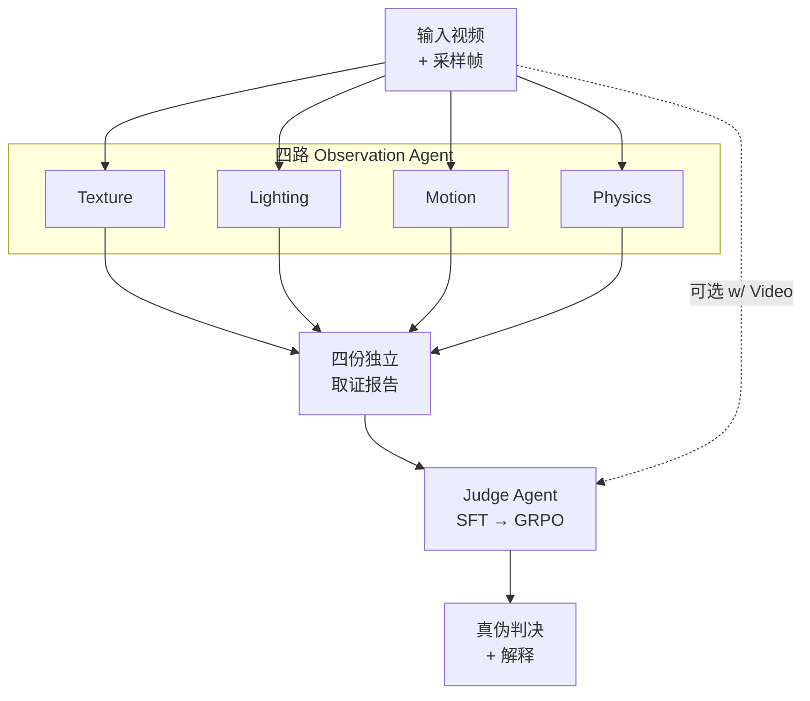
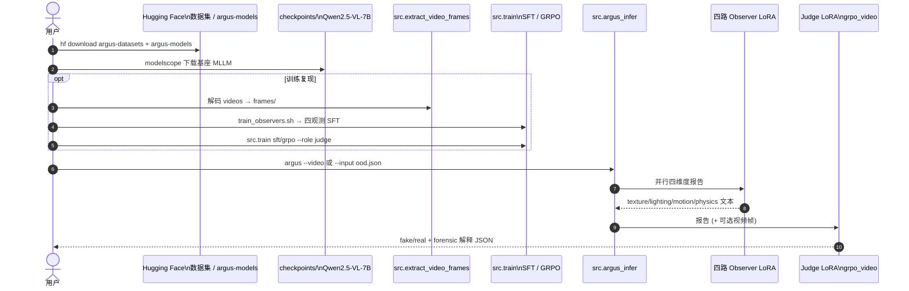

# ARGUS：可泛化深度伪造视频检测的多智能体取证推理

**ARGUS**（*Multi-Agent Forensic Reasoning for Generalizable Deepfake Video Detection*，[arXiv:2608.06865](https://arxiv.org/abs/2608.06865)，Xuechao Zou / Shun Zhang / Kai Li 等 · **北京交通大学 / 清华大学 / 蚂蚁集团**；[项目页](https://xavierjiezou.github.io/ARGUS/) · [代码](https://github.com/XavierJiezou/ARGUS) · [数据](https://huggingface.co/datasets/XavierJiezou/argus-datasets) · [权重](https://huggingface.co/XavierJiezou/argus-models) · [Demo](https://huggingface.co/spaces/XavierJiezou/ARGUS)）针对「单模型 / 单视角 MLLM 抓不住细微伪迹、OOD 泛化差」的痛点，发布 **FaceVid-Forensics-100K** 基准，并提出 **四路专业化观测 + Judge 汇总** 的多智能体取证框架。

> **命名注意：** 本页 ARGUS 指 **deepfake 视频鉴伪**；与 [机器人对称性 ARGUS（Sci. Robotics）](./paper-argus-dynamic-symmetry.md) 无关。

## 一句话定义

用 **四个独立取证视角（纹理 / 光照 / 运动 / 物理）的小开源 MLLM 观测 Agent 先各自写报告，再由 Judge Agent  reconcile 证据并判决真伪**——在 OOD 深度伪造视频上超过闭源 GPT/Gemini 与专用检测器。

## 英文缩写速查

| 缩写 | 英文全称 | 简要说明 |
|------|----------|----------|
| ARGUS | Multi-Agent Forensic Reasoning framework | 本文四观测 + Judge 鉴伪系统 |
| MLLM | Multimodal Large Language Model | 视频–语言联合推理底座（如 Qwen2.5-VL） |
| OOD | Out-of-Distribution | 训练未见的生成器 / 身份协议测试集 |
| LoRA | Low-Rank Adaptation | 观测者与 Judge 的参数高效微调方式 |
| GRPO | Group Relative Policy Optimization | Judge 阶段强化学习微调（相对组内优势） |
| SFT | Supervised Fine-Tuning | 观测者与 Judge 的监督微调阶段 |
| HF | Hugging Face | 数据集、权重与在线 Demo 托管平台 |

## 为什么重要

- **机器人 / 具身上游「视频可信度」：** [机器人视觉感知栈选型闭环](../queries/robot-perception-stack-selection-loop.md) 常假设相机流真实；ARGUS 提供 **可解释、可拆分视角** 的 deepfake 筛查接口，与 [SIDA](./sida.md)（图像鉴伪）形成互补。
- **基准覆盖新兴生成器：** FaceVid-Forensics-100K 含 **Seedance 2.0** 等近期全脸生成法，并带 **细粒度文本观测 + 判决一致解释**，弥补旧基准「只有二分类标签」的缺口。
- **架构洞见：** 项目页定性案例表明 **多 Agent 独立观测** 优于「单 MLLM 更长链式自对话」——对设计 **模块化感知 / 安全护栏** 有直接参考。
- **工程可复现：** 代码、20.9 GB 级数据、LoRA 权重、HF Space 均已公开；OOD 7,636 视频批量评测脚本齐全。

## 核心信息

| 项 | 内容 |
|----|------|
| 机构 | 北京交通大学（BJTU）；清华大学（Tsinghua）；蚂蚁集团（Ant Group） |
| 数据 | **FaceVid-Forensics-100K** — 100K 视频（21,075 real + 78,925 fake），33 合成法 |
| 方法 | 4× Observation Agent（texture / lighting / motion / physics）+ 1× Judge Agent |
| 基座 | 开源 MLLM（主结果 Qwen2.5-VL-7B + LoRA）；README 亦列 InternVL3.5-8B 等 |
| 代码 | [XavierJiezou/ARGUS](https://github.com/XavierJiezou/ARGUS) |
| 开源核查 | **已开源**（2026-09-07）：训练 / 推理 / 数据 / 权重 / Demo |

## 核心原理（方法）

### FaceVid-Forensics-100K

- **覆盖：** face swapping、face reenactment、entire-face synthesis 三大类，共 **33** 种方法。
- **协议：** train / in-domain test / **OOD test**（7,636 视频，**20** 个训练外生成器）。
- **标注管线：** 多开闭源 MLLM 独立写维度观测 → 聚合与冲突消解 → 产出与最终判决一致的 forensic explanation。

### ARGUS 多智能体取证

1. **Observe independently：** 四路 Agent 各盯一条 forensic 维度，**不提前下最终判决**，避免单一路解释锚定全部分析。
2. **Reconcile evidence：** Judge 读四份报告（可选再加采样视频帧），权衡一致与冲突线索，而非只看最显眼 artifact。
3. **Explain the verdict：** 输出 binary prediction + 简短取证理由。

### 流程总览

## 源码运行时序图

节点对齐 [`sources/repos/argus-deepfake.md`](../../sources/repos/argus-deepfake.md) 与官方 README。

关键复现路径：推理侧最短为 **基座 + HF LoRA + `src.argus_infer argus --with-video`**；全量训练需先落盘 `frames/` 与 derived JSONL。

## 工程实践

| 项 | 建议 |
|----|------|
| 环境 | `conda create -n argus python=3.12` + `bash create_env.sh` |
| 数据 | `hf download XavierJiezou/argus-datasets` → `data/FaceVid-Forensics-100K/`；再跑帧抽取 |
| 权重 | `hf download XavierJiezou/argus-models` → `weights/`；主结果 Judge 用 `grpo_video/lora/judge` |
| 单视频 | `python -m src.argus_infer argus --video samples/example.mp4 --with-video ...` |
| OOD 评测 | `--input splits/ood.json --dataset-root ... --output outputs/argus/...` |
| Demo | [HF Space](https://huggingface.co/spaces/XavierJiezou/ARGUS) 零安装冒烟 |
| 部署读法 | 四观测可并行；latency 受 4× MLLM 前向 + Judge 影响，产品侧宜缓存观测或蒸馏 |

## 实验与评测

### OOD 主表（7,636 视频，项目页）

| 方法 | Acc | Recall | F1 |
|------|-----|--------|-----|
| TFCU (CVPR'25) | 64.28 | 33.44 | 45.20 |
| Gemini-2.5-Pro | 63.78 | 75.29 | 47.45 |
| Gemini-3.5-Flash | 63.34 | 58.75 | 46.22 |
| GPT-5-mini | 59.31 | 38.70 | 39.00 |
| VideoVeritas (ICML'26) | 57.87 | 78.96 | 43.22 |
| **ARGUS w/o Video** | **67.41** | **65.00** | **51.01** |
| **ARGUS w/ Video** | **69.87** | **81.82** | **53.28** |

### 关键现象

1. **全开源小 MLLM 组合登顶 reported OOD 指标**，超过闭源 GPT / Gemini 与 forensics-tuned MLLM。
2. **Judge 读帧（w/ Video）** 相对仅读报告显著提升 Recall（65.00 → 81.82），说明部分伪迹需回到像素级时序证据。
3. **独立观测 > 更长单链**：附录定性显示单 MLLM 多轮自洽对话会强化错误先验；分工观测 + Judge 更能抓到运动 / 物理不一致。
4. **F1 仍适中（53.28%）**：高 Recall 伴随精度权衡；落地需按场景调阈值，不能当法律级证据。

## 结论

**一句话总判：ARGUS 用「分工取证 + Judge 汇总」把开源小 MLLM 的 OOD deepfake 检测推到闭源大模型之上，但 F1 仍有限——适合作为可解释筛查层，而非单独终审。**

1. **真影响指标是 OOD Acc/Recall 与 w/ Video 增益** — 专用检测器 Acc 相近但 Recall 常崩盘；Judge 看帧是拉高 Recall 的关键开关。
2. **架构选择比堆单模型上下文更重要** — 四路独立观测防止 early anchoring，优于加长单链推理。
3. **数据资产价值不亚于模型** — FaceVid-Forensics-100K 覆盖 33 法 + 细粒度解释，可支撑后续 forensics MLLM 训练。
4. **全栈开源降低复现门槛** — 代码 / 数据 / LoRA / Space 齐全；基座 MLLM 仍需自备算力与 checkpoint。
5. **具身侧读法是上游可信度护栏** — 与 SIDA（图像）、感知栈闭环互补；高分 ≠ 机器人策略安全。
6. **勿与机器人 ARGUS 混名** — 检索与选型时核对 arXiv 与仓库 URL。

## 与其他工作对比

| 工作 | 模态 / 任务 | 核心机制 | 与 ARGUS |
|------|-------------|----------|----------|
| **ARGUS** | 视频 deepfake 检测 + 解释 | 四观测 + Judge 多 Agent | 本文 |
| [SIDA](./sida.md) | 社交媒体 **图像** 鉴伪 + 掩码 | VLM DET/SEG 特殊 token | 同安全域；无视频多 Agent |
| [Daily-Omni](./paper-daily-omni.md) | 日常 **AV 时序对齐** MCQA | 半自动 AVQA 基准 | 同属 MLLM 评测；任务正交 |
| Gemini / GPT 单模型 | 通用视频理解 | 单 pass 问答 | OOD 表上低于 ARGUS 组合 |
| TFCU / Effort 等 | 专用 deepfake 检测器 | 视觉 backbone + 分类头 | Acc 接近但 Recall / 解释性弱于 ARGUS w/ Video |

## 局限与风险

- **算力与延迟：** 四观测 + Judge 多路 MLLM 推理成本高；实时机器人闭环需蒸馏或早退策略。
- **域外仍困难：** OOD Acc ≈70% 说明仍有约三成错误；高 Recall 可能带来误报，需业务侧校准。
- **解释可信度：** 自然语言理由可能看似合理却与真实伪迹不对齐——与 SIDA 同类，**不能单独作法律证据**。
- **伦理：** 论文动机是 **对抗恶意 deepfake**；技术亦可能被误用于过度审查，部署需合规审查。
- **生成器漂移：** Seedance 2.0 等已纳入，但更新生成法仍会持续 OOD；需定期扩库与重训。

## 关联页面

- [SIDA](./sida.md) — 图像鉴伪 MLLM（DET/SEG）
- [多模态基础](../concepts/multimodality-basics.md)
- [多模态 LLM 发展路线](../overview/multimodal-llm-development.md)
- [Daily-Omni](./paper-daily-omni.md) — omni-modal MLLM 评测基准
- [机器人 ARGUS（对称性）](./paper-argus-dynamic-symmetry.md) — **不同论文**，避免混名
- [机器人视觉感知栈选型闭环](../queries/robot-perception-stack-selection-loop.md) — 感知可信度上游
- [具身大模型评测基准选型闭环](../queries/embodied-eval-benchmark-selection-loop.md) — FaceVid-Forensics-100K 属 ① 认知层评测：OOD 协议（20 个训练外生成器）是「可复现性 vs 真实代表性」取舍的样板；判对真伪 ≠ 下游策略安全

## 参考来源

- [`sources/papers/argus_arxiv_2608_06865.md`](../../sources/papers/argus_arxiv_2608_06865.md)
- [`sources/sites/argus-deepfake-github-io.md`](../../sources/sites/argus-deepfake-github-io.md)
- [`sources/repos/argus-deepfake.md`](../../sources/repos/argus-deepfake.md)
- 论文：<https://arxiv.org/abs/2608.06865>

## 推荐继续阅读

- [ARGUS 项目页](https://xavierjiezou.github.io/ARGUS/)
- [GitHub: XavierJiezou/ARGUS](https://github.com/XavierJiezou/ARGUS)
- [HF Space 在线 Demo](https://huggingface.co/spaces/XavierJiezou/ARGUS)
- [SIDA (arXiv:2412.04292)](https://arxiv.org/abs/2412.04292) — 图像鉴伪对照
