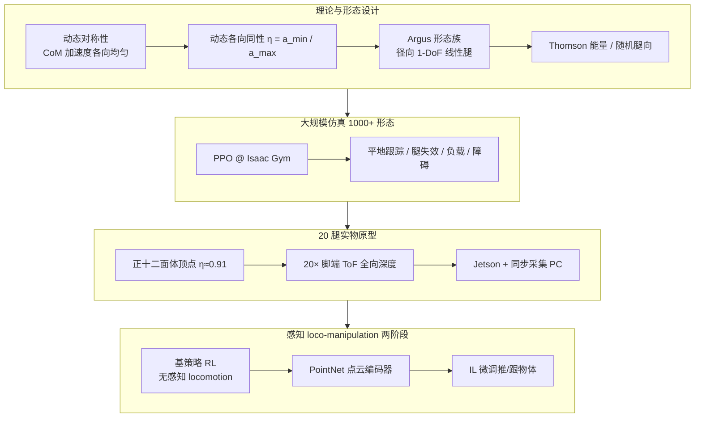

# Argus（Dynamic Symmetry / Dynamic Isotropy）

**Argus**（*Extreme dynamic symmetry enables omnidirectional and multifunctional robots*，Jiaxun Liu / Boxi Xia / Boyuan Chen，杜克大学 General Robotics Lab，**Science Robotics 2026**，[DOI:10.1126/scirobotics.aec1725](https://doi.org/10.1126/scirobotics.aec1725)）把机器人设计中的 **对称性** 从 **几何形态** 推进到 **动态驱动能力**：用 **动态各向同性 η** 量化质心可获加速度的各向均匀性，并系统证明 **η 越高，腿式移动、鲁棒性与能效越好**；实物 **20 腿正十二面体** 原型（η≈0.91）展示全向、多功能球形腿式平台在复杂地形与感知交互中的潜力。

## 一句话定义

**用动态各向同性 η 度量「各方向加速质心的能力是否均匀」，并以 Argus 径向线性腿球形机器人族证明：把动态对称性推向极限，可同时获得无朝向偏好 locomotion、扰动/失效鲁棒与运动中全向感知交互。**

## 英文缩写速查

| 缩写 | 英文全称 | 简要说明 |
|------|----------|----------|
| CoM | Center of Mass | 质心；本文动态对称性针对 CoM 可获加速度 |
| η | Dynamic Isotropy | 动态各向同性：$a_{\min}/a_{\max}$，越接近 1 越各向均匀 |
| ToF | Time-of-Flight | 飞行时间深度相机；Argus 每脚节点 1 个，共 20 路 |
| IL | Imitation Learning | 感知任务第二阶段：在基策略上用点云–状态对微调 |
| PPO | Proximal Policy Optimization | Isaac Gym 中 locomotion 主训练算法 |
| COT | Cost of Transport | 运输成本；仿真中随 η 升高而降低 |
| DoF | Degrees of Freedom | 自由度；Argus 每腿 1-DoF 线性驱动 |

## 为什么重要

- **设计原则升维：** 不只模仿生物 **外形**，而是抽取自然界 **对称性组织原则**，落到 **力与加速度能力** 层面——为「形态–控制–感知」共设计提供可计算指标。
- **可跨平台比较的统一度量：** 同一 η 框架可对比四旋翼、张拉整体、四足/人形与 Argus（Fig. 2），揭示「几何对称 ≠ 动态对称」（如共面旋翼机动性强但瞬时横向加速权威偏低）。
- **大规模形态–性能规律：** >1000 仿真形态 + 1536 随机腿向变体表明：**固定腿数下 η 仍主导任务表现**，全对称 Argus 位于 Pareto 前沿——**冗余腿数 alone 不能替代均匀驱动布局**。
- **非常规但工程完整的实物栈：** 20 腿缆驱线性执行器 + 分布式 ToF + Jetson/辅助 PC 同步；开源 [Isaac Gym 训练代码](https://github.com/generalroboticslab/Argus) 与预训练 checkpoint 可复现 PPO locomotion 与两阶段感知 IL。
- **与腿式/人形主线的互补坐标：** 非人形、非轮式，但直接回答 [Locomotion](../tasks/locomotion.md) 中「**各向机动权威、失效容错、感知–运动一体化**」问题，并与 [操作鲁棒性综述](./paper-robustness-robotic-manipulation-survey.md) 的「容忍变异 / 失败恢复」原则同构。

## 流程总览

## 核心机制（归纳）

### 1）动态对称性与动态各向同性

- **动态对称性：** 机器人在各方向上 **加速质心** 的权威是否均衡——「无特权驱动方向」，而非仅身体外观对称。
- **形式化：** $\mathbf{a}_c = A(\mathbf{q})\boldsymbol{\tau}$；对单位方向 $u \in \mathbb{S}^2$ 求 $a_{\max}(u)$，在 2048 个方向上采样得可达加速度云。
- **η 定义：** $\eta = a_{\min}/a_{\max}$；$\eta \to 1$ 时云近球形均匀。多数现有机器人 η **< 0.9**；Argus 设计可达 **0.91–0.97**（仿真更高）。
- **理论收益（高 η）：** 加速度映射良条件、**朝向不变稳定裕度**、各向均匀扰动鲁棒、控制努力均衡（详见论文 Supplementary）。

### 2）Argus 形态族

- **架构：** 球形框架 + **径向向外线性腿**；每腿仅沿自身轴施力，腿向空间分布直接塑造可达加速度集。
- **构造策略：**
  - **Thomson 能量最小化** — 腿向在球面近似均匀，几何对称；
  - **球面随机采样** — 探索非对称布局，η 可低至 ~0.25。
- **腿数饱和：** 6→40 腿时 η 与任务指标在 **~16–22 腿** 后边际收益递减；实物选 **20 腿正十二面体**（η≈0.91），兼顾结构刚度、布线腔体与制造性。

### 3）仿真：η ↔ 四项任务表现

| 任务 | 设置要点 | η 相关性 |
|------|----------|----------|
| 平地速度跟踪 | $v_{\mathrm{cmd}}=0.8$ m/s，5 s | 跟踪误差↓、COT↓ |
| 腿失效鲁棒 | 10% 腿禁用 | 成功率↑ |
| 负载搬运 | 0–20 kg | 成功率↑、COT↓ |
| 离散障碍 | 最高 10 cm | 穿越成功率↑ |

1536 个变体（12/20/32 腿各 512 随机腿向）显示：**同腿数下 η 仍是主导因子**；对称 Thomson 布局位于性能前沿。

### 4）20 腿实物与分布式感知

- **驱动：** 模块化 **缆驱鼓轮线性执行器** 装于十二面体顶点；中心舱容纳电源与计算。
- **感知：** 20× MaixSense-A010 ToF（脚端 70°×60° FOV）；融合为机体坐标系 **全局点云**，支持 **运动中** 物体状态估计。
- **真机演示：** 草地/沙地/树皮/铺装/窄廊；快速自稳定；单/多腿失效仍行走；推拒扰动；**边推边跟** 1 m 立方体；模拟 **月重力双墙攀爬**。
- **部署痛点：** 真机 IL 成功率下降主因是 **ToF 过热导致延迟与 20 路不同步**，而非控制策略失效——对未来 **分布式深度传感共设计** 有警示意义。

### 5）训练与开源工程栈

- **Locomotion：** Isaac Gym（[boxiXia fork](https://github.com/boxiXia/isaacgym)）+ PPO + 域随机化；Hydra 配置、WandB 日志。
- **感知任务两阶段：**
  1. `argus_object_pushing_base` — 无感知 RL 基策略；
  2. 收集 (点云, 物体状态) → **PointNet** 监督编码器 → IL 微调 `argus_object_pushing_IL` / `argus_object_tracking_IL`。
- **仓库：** [generalroboticslab/Argus](https://github.com/generalroboticslab/Argus) — `install.sh`、预训练 checkpoint、`envs/run.sh` 一键 play。

## 常见误区

1. **η 高 = 整体机动性最强：** η 度量 **瞬时 CoM 线性加速度各向均匀性**；四旋翼可通过 **姿态重定向** 实现敏捷 3D 运动，但共面旋翼布局使某些瞬时推力方向受限，η 反而偏低。
2. **腿越多越好：** 仿真显示 **16–22 腿后饱和**；盲目增腿不改善 η 时，冗余对平坦/负载任务帮助有限。
3. **形态对称即动态对称：** 几何重复布局是 η 的 **充分非必要** 条件；随机腿向可低 η，Thomson 对称布局才近极限。
4. **球形机器人 = 玩具平台：** Argus 把球形腿式平台推到 **Science Robotics 级系统验证**（真机多地形 + 感知 loco-manipulation + 月面攀爬仿真），是 **非常规形态严肃研究** 而非纯概念。

## 与其他页面的关系

- **任务层：** [Locomotion](../tasks/locomotion.md) — 无朝向偏好移动、地形适应与能效；[Loco-Manipulation](../tasks/loco-manipulation.md) — 运动中推/跟物体；[Balance Recovery](../tasks/balance-recovery.md) — 快速自稳定与推拒恢复。
- **方法层：** [Reinforcement Learning](../methods/reinforcement-learning.md) — PPO 训基策略；[Imitation Learning](../methods/imitation-learning.md) — 点云感知第二阶段。
- **概念层：** [Motion Data Quality](../concepts/motion-data-quality.md) — **Morphology gap** 与形态共设计语境；本文从 **驱动能力对称** 侧补充形态设计维度。
- **对照实体：** [Digit 人形 RL Locomotion](./paper-digit-humanoid-locomotion-rl.md) — 传统双足形态 + 盲走 RL；[操作鲁棒性综述](./paper-robustness-robotic-manipulation-survey.md) — 「容忍变异 / 失败恢复」原则与 Argus 腿失效实验同构。

## 核心信息

| 字段 | 内容 |
|------|------|
| 机构 | 杜克大学（Duke University）General Robotics Lab |
| 期刊 | Science Robotics, Vol. 11, Issue 114, eaec1725（2026-05-27） |
| 项目页 | <https://generalroboticslab.com/Argus> |
| 代码 | <https://github.com/generalroboticslab/Argus> |
| PDF | <https://generalroboticslab.com/assets/files/papers/argus.pdf> |

## 参考来源

- [argus_dynamic_symmetry_scirobotics_2026.md](../../sources/papers/argus_dynamic_symmetry_scirobotics_2026.md)
- [argus_general_robotics_lab.md](../../sources/repos/argus_general_robotics_lab.md)
- Liu et al., *Extreme dynamic symmetry enables omnidirectional and multifunctional robots*, Science Robotics, eaec1725, 2026

## 推荐继续阅读

- Spiny（IEEE）/ Mochibot（IEEE）/ HAGAMOSphere — 论文 Fig. 2 对照的 **球形/非常规移动** 平台（动态 η 较低）
- [ANYmal 系列](./paper-notebook-anymal-parkour-robust-perceptive-locomotion.md) — 传统四足 **几何对称 + 感知 locomotion** 对照轴
- [项目视频](https://youtu.be/Nd-I4YNQEuY) — 真机全向行走与 loco-manipulation 演示
- IEEE Spectrum «Video Friday: Extreme Omnidirectional Robot» — 媒体解读与工程背景
