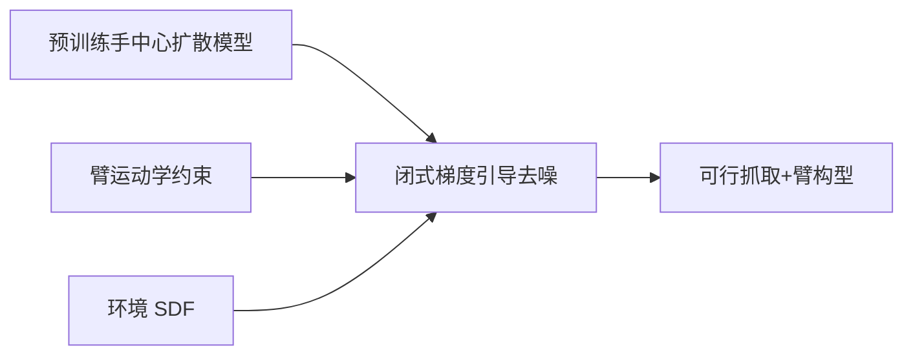

# Arm-Aware DexGrasp：推理时臂约束的灵巧抓取生成

**Arm-Aware Guided Dexterous Grasp Generation**（[arXiv:2608.16351](https://arxiv.org/abs/2608.16351)，[项目页](https://arm-aware-dexgrasp.github.io/)）将 **机械臂无关** 的灵巧手扩散抓取模型，在 **推理时** 接入臂运动学与环境 **SDF** 约束，把近可行样本引导进可行域，避免拒绝采样在强约束下的低效。

## 一句话定义

**把整机约束作为推理时引导，可让同一手部生成模型迁移到不同机械臂与环境——「手的姿态合理」不等于「整机动作可执行」。**

## 英文缩写速查

| 缩写 | 英文全称 | 简要说明 |
|------|----------|----------|
| SDF | Signed Distance Field | 环境碰撞几何的符号距离场 |
| IK | Inverse Kinematics | 逆运动学，腕姿态可达性 |
| PD | Primal–Dual | 原对偶优化，对应引导扩散 |
| DexGrasp | Dexterous Grasping | 多指灵巧手抓取 |

## 为什么重要

- 手中心模型忽略 **臂体碰撞、工作空间边界、连续抓取效率**。
- 拒绝采样在走廊/货架等 **高障碍覆盖** 场景丢弃大量近可行样本。
- 纳入 [九篇盘点](../../sources/blogs/wechat_embodied_station_9_papers_vla_predict_grasp_2026-08-24.md) 的「抓取回到整机可执行性」主线。

## 核心信息

| 项 | 内容 |
|----|------|
| **形式** | RA-L 2026 投稿（匿名页） |
| **手/臂** | LEAP Hand + UR5；亦报 Franka 等 |
| **评测** | 1 万物体 × 6 场景；走廊/货架/边界抓取 |
| **开源** | **待发布**（截至 2026-08-24 无 GitHub） |

## 核心原理

三类约束闭式梯度：**碰撞避免**、**手部可达性**、**关节接近度**（连续抓取效率）。

## 源码运行时序图

**不适用** — 截至 **2026-08-24** 无可运行官方代码。

## 工程实践

| 项 | 建议 |
|----|------|
| 何时引用 | 已有手中心 DexGrasp 扩散模型，部署到 **强约束** 场景 |
| vs 拒绝采样 | 近可行样本可被修正而非丢弃 |
| vs 按臂重训 | 同一手模型 + 不同臂/环境 SDF 即可切换 |

## 实验与评测

- **仿真** — 1 万物体、6 场景；可行抓取概率显著高于拒绝采样。
- **真机** — Azure Kinect 点云；走廊/货架八物体；工作空间边界案例。

## 结论

**灵巧抓取部署应把臂与环境约束前移到生成阶段，而非执行后过滤。**

1. **引导 ≡ 联合优化** — 梯度引导扩散采样等价于手姿+臂构型联合优化。
2. **闭式约束** — 碰撞/可达/关节接近度均有解析梯度。
3. **强约束增益大** — 走廊/货架场景优势最明显。
4. **跨臂迁移** — 预训练手模型可复用，换臂不重训抓取网络。
5. **待开源** — 复现需跟踪 RA-L 录用后代码。

## 与其他工作对比

| 对照 | 差异读法 |
|------|----------|
| 拒绝采样 | 低效丢弃近可行样本；本文修正 |
| 臂+手联合训练数据 | 泛化受限于训练臂；本文推理时接入 |
| [GOAG](./paper-goag.md) | 物体无关接触流形；本文强调 **臂可行性** |

## 局限与风险

- **代码待发布** — 引导实现与 SDF 管线未公开。
- **SDF 建模成本** — 需环境解析/预建模几何。
- **手模型前提** — 依赖质量足够的预训练手中心扩散模型。

## 关联页面

- [Manipulation](../tasks/manipulation.md)
- [Manipulation](../tasks/manipulation.md)
- [GOAG](./paper-goag.md)
- [VLA·预测·抓取 9 篇技术地图](../overview/vla-predict-grasp-9-papers-technology-map.md)

## 参考来源

- [arm_aware_dexgrasp_arxiv_2608_16351](../../sources/papers/arm_aware_dexgrasp_arxiv_2608_16351.md)
- [arm-aware-dexgrasp-github-io](../../sources/sites/arm-aware-dexgrasp-github-io.md)
- [具身智能小站 9 篇盘点（2026-08-24）](../../sources/blogs/wechat_embodied_station_9_papers_vla_predict_grasp_2026-08-24.md)

## 推荐继续阅读

- [arXiv:2608.16351](https://arxiv.org/abs/2608.16351)
- [项目页](https://arm-aware-dexgrasp.github.io/)
