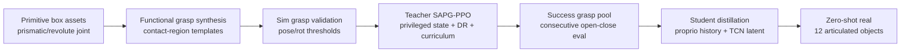
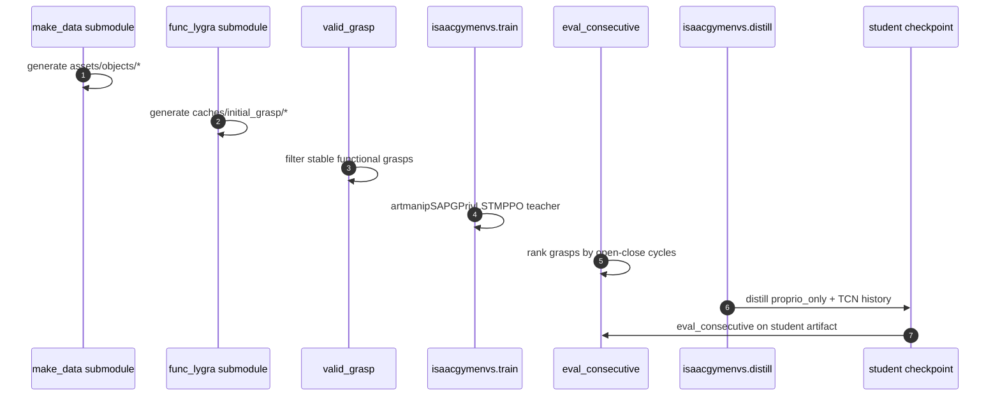

# ArtManip：类别级铰接物体手内操作

**ArtManip**（*ArtManip: Category-Level Articulated In-Hand Manipulation*，[arXiv:2609.12498](https://arxiv.org/abs/2609.12498)，[项目页](https://artmanip.github.io/)）由 **浙江大学**、**北京通用人工智能研究院（BIGAI）**、**清华大学**、**北京大学** 联合提出：在灵巧手上对 **铰接物体** 做 **类别级 in-hand 操作**——物体没有桌面或夹具固定，整件 **自由漂浮在掌内**，策略必须 **一边抓稳、一边推动/驱动内部关节**（开合、滑动等），并泛化到 **同类未见实例** 与 **多样初始抓取**，最终实现 **零样本 sim2real**。

## 一句话定义

**手内铰接操作 = 抓稳自由漂浮基座 + 驱动内部关节；ArtManip 用程序化物体/功能抓取扩训练分布，再以 Teacher–Student RL 解耦特权动力学与部署观测。**

## 英文缩写速查

| 缩写 | 英文全称 | 简要说明 |
|------|----------|----------|
| DoF | Degree of Freedom | 自由度；铰接物体含内部关节 DoF + 掌内 6D 漂浮 |
| RL | Reinforcement Learning | Teacher/Student 均基于 PPO 族训练 |
| Sim2Real | Simulation to Real | 仿真策略零样本部署到 12 个真机铰接物体 |
| SAPG | Sample-efficient Actor-critic with Parallel Gradients | Teacher 训练配置 `artmanipSAPGPrivLSTMPPO` |
| TCN | Temporal Convolutional Network | Student 侧 `--custom_tcn` 编码 proprio 历史 |
| DR | Domain Randomization | 铰接关节物理参数随机化以鲁棒接触-关节耦合 |

## 为什么重要

- **「既要抓稳也要推动」是核心难点：** 与纯 [手内重定向](../methods/in-hand-reorientation.md)（改物体整体 6D 位姿）不同，铰接操作要在 **不丢 grasp** 的前提下对 **内部关节** 施力；接触力同时承担 **防滑移约束** 与 **关节驱动**，属于典型的 [接触丰富操作](../concepts/contact-rich-manipulation.md) 混合动力学。
- **类别级 + 初始抓取敏感：** 换同类 knife/stapler/tong 实例或初始指位，接触拓扑与力闭合都会变；人工标抓取无法规模化，ArtManip 用 **程序化资产 + 功能抓取合成** 自动扩分布。
- **可复现开源：** 截至 **2026-09-15**，官方代码 [ArtGym](https://github.com/youngcv/artgym) 已发布完整 sim 管线（验证抓取 → Teacher → 蒸馏 Student → 连续开合评测），见 [`sources/repos/artgym.md`](../../sources/repos/artgym.md)。

## 核心信息

| 项 | 内容 |
|----|------|
| **机构** | 浙江大学（ZJU）、北京通用人工智能研究院（BIGAI）、清华大学、北京大学 |
| **平台** | **Sharpa** 灵巧手；**Isaac Gym**（IsaacGym_TacSL）仿真 |
| **物体类别（文内/页内）** | knife、stapler、tong 等 **四类**；两连杆 + 单 prismatic/revolute 关节原语 |
| **指标（项目页口径）** | 四类仿真泛化；**12 个真实物体** 零样本迁移 |
| **开源** | **已开源** — [youngcv/artgym](https://github.com/youngcv/artgym)；真机部署细节以仓库更新为准 |

## 核心原理

### 双瓶颈：抓稳 vs 推动

1. **内部 DoF 控制 ⟷ 漂浮基座稳定：** 手指对铰接部件施力会改变整体接触力分布；过度推动 → 滑移/掉落，过保守 → 关节不动。策略必须在 **掌内力闭合** 与 **关节目标** 之间动态折中。
2. **初始构型与类别泛化：** 功能抓取决定后续可施加的力矩方向；ArtManip 用 **类别级接触区域模板** 批量合成 **任务导向** 初始抓取，而非手工示教。

### 流程总览

### Teacher–Student 分工

| 阶段 | 观测 | 训练要点 |
|------|------|----------|
| **Teacher** | 特权状态（含仿真侧完整动力学线索） | **铰接物理随机化**、**奖励课程**、LSTM-PPO；学复杂接触-关节耦合 |
| **Student** | 可部署 proprio + 历史 | **潜表示蒸馏**（余弦项 `--cosine-coef`）；`proprio_only` checkpoint 用于评测与部署 |

**读法：** Teacher 解决「抓稳 + 推动」在仿真里的可学性；Student 把特权动力学 **压缩进历史潜变量**，支撑真机 **部分观测** 下的零样本执行。

## 源码运行时序图

图下说明：真机部署路径在论文中验证，仓库当前主线为 **仿真训练与 Student 评测**；复现前需按 README 准备 `assets/hands`、`assets/objects` 与 `caches/initial_grasp`。

## 工程实践

| 项 | 建议 |
|----|------|
| 克隆 | `git clone --recursive`；缺子模块则 `make_data` / `func_lygra` 无法生成资产与初始抓取 |
| 抓取池 | 先 `validate_all_instances.sh` + `--unique` 去重，再 `eval_consecutive` 导出 `success` split |
| Teacher 规模 | 默认 `numEnvs=16000`/GPU；多卡用 `torchrun` + `multi_gpu=True` |
| Student | RTX 50 系需 `--custom_tcn`；`--cosine-coef` 控制潜表示对齐强度 |
| 评测 | `--goal-switch-interval-secs` 控制开合目标切换；用 consecutive 周期衡量 **抓稳前提下能否持续推动关节** |
| 与手内重定向对照 | 若任务只需改物体 6D 位姿、无铰接 DoF，优先 [UHAS](../methods/uhas-unified-hand-action-space.md) / [WM-Craftnet](./paper-wm-craftnet.md) 路线 |

## 实验与评测

| 项 | 文内/页内口径 |
|----|----------------|
| 仿真 | **四类** 铰接物体类别；未见实例 + 多样初始抓取 |
| 真机 | **12 个** 真实物体，**零样本** sim2real；多样形状与关节机构 |
| 定性 | 项目页视频：knife / stapler / tong 等开合与手内操作 |

- **读法：** 定量 baseline 与逐项成功率以 **原文 PDF** 为准；开源后可用 ArtGym `eval_consecutive` 复现 **连续开合** 指标。

## 与其他工作对比

- **[手内重定向](../methods/in-hand-reorientation.md)** — 改 **整体位姿**；ArtManip 改 **内部关节角/位移**，且物体 **无外部支撑**，「抓稳」约束更硬。
- **[WM-Craftnet](./paper-wm-craftnet.md)** — 同为 Sharpa + sim2real 手内 RL；WM-Craftnet 聚焦 **刚体旋转** + 世界模型上下文，ArtManip 聚焦 **铰接动力学 + 功能抓取生成**。
- **[STAR](./paper-star-vtla.md)（同批）** — STAR 用 **真机视触数据 + VTLA** 求泛化；ArtManip 用 **仿真程序化分布 + 特权蒸馏**，不动传感配置。
- **[域随机化](../concepts/domain-randomization.md) / [课程学习](../concepts/curriculum-learning.md)** — 本工作的 DR 打在 **铰接物理参数**，课程打在 **接触-关节任务难度**；是通用机制在铰接 in-hand 场景的组合实例。
- **[接触丰富操作](../concepts/contact-rich-manipulation.md)** — 机制层解释为何「推关节」与「防滑移」不可分；ArtManip 给出 **类别级泛化** 的一条 RL 工程路径。

## 结论

**铰接手内操作的可部署策略，关键不在更大网络，而在「抓稳 + 推动」耦合下的训练分布与特权–部署表征对齐。**

1. **任务本质** — 自由漂浮基座上同时满足 **力闭合稳定** 与 **内部关节驱动**；比刚体手内重定向多一层关节动力学。
2. **数据管线** — 程序化两连杆资产 + **功能抓取合成**  scalable 初始 configuration，缓解对人工示教与单一抓型的依赖。
3. **训练配方** — Teacher 用 **特权状态 + 铰接 DR + 奖励课程** 啃接触-关节耦合；Student 用 **历史潜表示蒸馏** 落到 proprio-only 部署。
4. **泛化证据** — 四类仿真 + **12 真机零样本**；验证类别级与初始抓取双维度泛化。
5. **工程入口** — [ArtGym](https://github.com/youngcv/artgym) 已开源 sim 全流程；复现从子模块资产与 `success` grasp pool 开始，勿跳过验证抓取阶段。
6. **选型读法** — 有 **铰接 DoF** 且物体 **全程在掌内** 选手内铰接路线；仅刚体位姿调整选手内重定向/旋转专用方法。

## 关联页面

- [Manipulation（操作任务）](../tasks/manipulation.md)
- [In-hand Reorientation（手内重定向）](../methods/in-hand-reorientation.md)
- [Contact-Rich Manipulation（接触丰富操作）](../concepts/contact-rich-manipulation.md)
- [11 篇 VLA/TAMP 技术地图](../overview/vla-tamp-planning-11-papers-technology-map.md)

## 参考来源

- [artmanip_arxiv_2609_12498.md](../../sources/papers/artmanip_arxiv_2609_12498.md)
- [artmanip-github-io.md](../../sources/sites/artmanip-github-io.md)
- [artgym.md](../../sources/repos/artgym.md)
- [wechat_embodied_station_11_papers_vla_tamp_planning_2026-09-14.md](../../sources/blogs/wechat_embodied_station_11_papers_vla_tamp_planning_2026-09-14.md)
- [arXiv:2609.12498](https://arxiv.org/abs/2609.12498)

## 推荐继续阅读

- [arXiv PDF](https://arxiv.org/pdf/2609.12498)
- [项目页](https://artmanip.github.io/)
- [ArtGym 官方仓库](https://github.com/youngcv/artgym)
