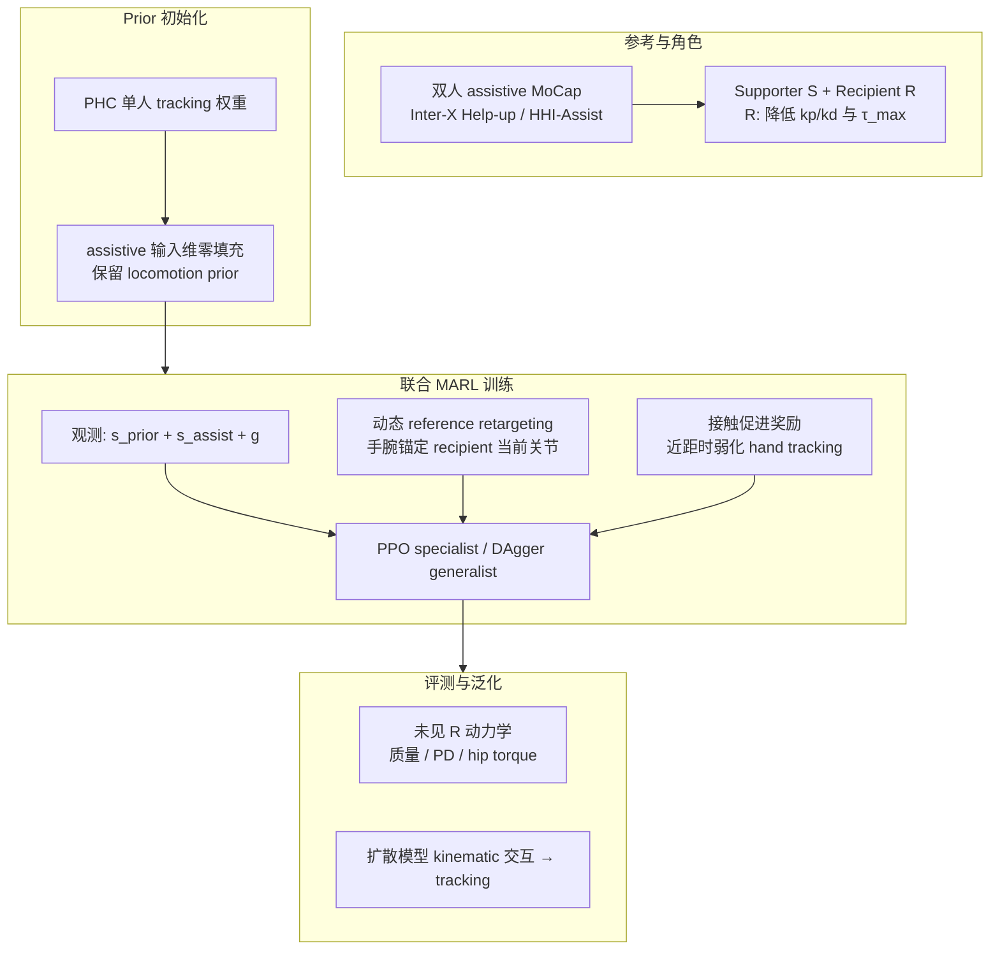

# AssistMimic（Learning to Assist: Physics-Grounded Human-Human Control）

**AssistMimic** 是 CMU 与庆应等团队的 **物理仿真双人 assistive 交互 tracking** 论文（arXiv:2603.11346，项目页标注 **CVPR 2026**）：把 **扶起、床椅护理** 等 **力交换、紧密接触** 的人–人 MoCap 序列，从「单人 GMT + kinematic replay」推进到 **supporter 与 recipient 联合优化的 MARL**，并报告在 **Inter-X Help-up** 与 **HHI-Assist** 基准上 **首次** 稳定复现 assistive 参考。

## 英文缩写速查

| 缩写 | 英文全称 | 简要说明 |
|------|----------|----------|
| MoCap | Motion Capture | 动作捕捉，参考动作与演示数据的主要来源 |
| MDP | Markov Decision Process | 状态–动作–奖励–转移的标准序贯决策建模框架 |
| PPO | Proximal Policy Optimization | 人形/足式 locomotion 中最常用的 on-policy 策略梯度算法 |
| DAgger | Dataset Aggregation | 迭代收集策略诱导状态下的专家标注以纠偏的模仿学习方法 |
| Sim2Real | Simulation to Real | 把仿真中学到的策略迁移落地真机的工程主线 |
| HOI | Human–Object Interaction | 人与物体接触交互的技能场景 |

## 为什么重要

- **填补 GMT 的交互空白**：现有 motion tracking 多在 **无接触社交动作** 或 **单人孤立动作** 上成功；护理场景需要 **持续 partner awareness** 与 **双向力协调**。
- **否定 kinematic replay 范式**：recipient 在物理上 **无法独立执行** 参考时，冻结轨迹会导致 **独立站起、穿透、虚假恢复力**——assistive 任务必须 **joint policy learning**。
- **可复用的工程组件**：**PHC prior 零填充初始化**、**动态 hand retargeting**、**contact-promoting reward** 对任何 **高接触、MoCap 噪声大** 的双人/人–机物理控制都有参考价值。

## 流程总览

## 核心机制（归纳）

### Multi-agent MDP 与 asymmetric dynamics

- 两策略 $\pi_S, \pi_R$ **独立采样动作**，环境转移包含 **真实物理接触**。
- **Recipient 物理限制**（Table 1）：如下肢 $k_p/k_d$ 缩放 0.5、$\tau_{max}$ 80 Nm 等，模拟 **需要外部支撑** 的 impaired 动力学。
- 基础奖励：各 agent 对参考 $\hat{\mathbf{q}}^{(m)}_t$ 的 **指数 tracking**；recipient 另含 power / assist stability 项。

### Partner-aware 策略（基于 PHC）

- **$s_{\mathrm{prior}}$**：本体状态（关节位姿/速度、root 高度）。
- **$s_{\mathrm{assist}}$**：伙伴 root/关节观测（ego frame）、双方 hand contact 指示、**14 点接触力**、上一步动作。
- **$g$**：下一帧参考 **delta state**（goal-conditioned tracking，与 PHC 同族）。

### 三大训练稳定器

| 组件 | 作用 | 去掉后的典型现象（论文 ablation） |
|------|------|-----------------------------------|
| **PHC weight init** | 零填充 assistive 维，保留站立/行走 prior | Inter-X SR **→ 0%** |
| **Dynamic retargeting** | root 近距时手腕目标跟随 recipient **当前** 锚点 | unseen 动力学 SR 明显下降 |
| **Contact-promoting reward** | 近距用 **力×距离** 替代不可靠 hand tracking | HHI-Assist unseen hip torque SR **27.7%**（易 reward hack） |

### 训练与部署形态

- **Specialist**：按 subject 聚类，每簇一条 PPO 策略；**PSI** 初始化、0.25 m early termination。
- **Generalist**：DAgger 蒸馏多 specialist，覆盖 Inter-X 30 条多样 **扶起策略**。
- **下游**：可将 **运动扩散模型** 输出的 kinematic 双人交互 **落地为 physics rollout**（站点演示）。

## 常见误区或局限

- **仿真 avatar 主证据**：论文在 **physics engine 人形** 上验证；与 **真机 humanoid 护理部署** 之间仍有 sim2real、感知与安全层 gap。
- **非视觉策略**：观测以 **本体 + 伙伴 kinematics/力** 为主，不解决 **视觉遮挡下的 online 估计**。
- **MoCap 质量依赖**：方法针对 **遮挡噪声** 设计 contact reward，但 **极端错误参考** 仍可能失败。
- **Ablation 读数需分数据集**：去掉 contact reward 在 HHI-Assist 上 **seen SR 反而升高**（97.7%），站点标注 **reward hacking**——不能简单理解为「contact 项有害」。

## 与其他工作对比

| 路线 | 交互建模 | 物理一致性 | 典型失败（assistive） |
|------|----------|------------|------------------------|
| **Kinematic-Recipient / Human-X 式** | recipient 轨迹回放 | 弱 | 独立站起、穿透 |
| **Frozen-Recipient（解耦）** | 先训 R 再冻住训 S | 中 | recipient 无法 co-adapt |
| **Phys-Reaction 类** | 单人 tracker rollout R | — | R 无法独立跟踪时 **不适用** |
| **AssistMimic** | **联合 MARL** | 强 | 首次在 Inter-X / HHI-Assist 稳定 SR |

与 [InterMimic](./paper-bfm-15-intermimic.md) / [InterPrior](./paper-interprior.md) 的对照：**Inter-line** 聚焦 **人–物（HOI）** 物理控制；AssistMimic 聚焦 **人–人 assistive 力交换**，共享 **PHC 式 tracking + PPO + DAgger** 工具链但 **问题 formulation 与奖励** 不同。

与 [Rhythm](./paper-rhythm-dual-humanoid-interaction.md) 的对照：二者均为 **双人 MARL + 接触丰富交互**，但 AssistMimic 强调 **非对称护理角色** 与 **仿真 avatar 主证据**；Rhythm 强调 **对称双 humanoid 社交交互**、**IAMR 解耦重定向 + 图奖励**，并在 **双 G1 真机** 报告拥抱/共舞等 sim2real。

## 关联页面

- [Multi-Agent Reinforcement Learning (MARL)](../methods/marl.md)
- [Whole-Body Tracking Pipeline](../concepts/whole-body-tracking-pipeline.md)
- [PHC](./paper-bfm-22-phc.md)
- [Imitation Learning](../methods/imitation-learning.md)
- [DAgger](../methods/dagger.md)
- [InterMimic](./paper-bfm-15-intermimic.md)

## 推荐继续阅读

- Inter-X 数据集：<https://github.com/Inter-X-Generation/Inter-X>
- HHI-Assist：<https://github.com/keio-isogawa/HHI-Assist>（论文引用 [19]）
- PHC 仓库：<https://github.com/ZhengyiLuo/PHC>

## 实验与评测

- **Success Rate**：双 agent 与参考距离均 < **0.5 m** 的 episode 比例。
- **Specialist（论文摘要级）**：Inter-X SR **74.9%**（generalist **83%**）；HHI-Assist SR **85.8%**（generalist **73%**）。
- 完整 ablation、MPJPE 与扰动实验见 **原文 PDF** 与 [参考来源](#参考来源)。

## 参考来源

- [AssistMimic 论文摘录](../../sources/papers/assistmimic_arxiv_2603_11346.md)
- [AssistMimic 项目页归档](../../sources/sites/yutoshibata07-assistmimic-github-io.md)
- Shibata et al., *Learning to Assist: Physics-Grounded Human-Human Control via Multi-Agent Reinforcement Learning*, arXiv:2603.11346, 2026. <https://arxiv.org/abs/2603.11346>
