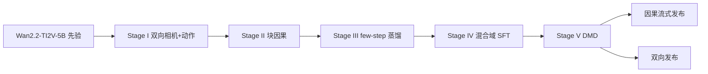
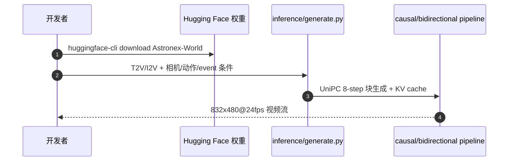

# Astronex-World 1.0（arXiv:2609.20034）

**Astronex-World 1.0**（*Real-Time Interactive World Model Foundation*，Astronex Robotics / 南京信息工程大学，[arXiv:2609.20034](https://arxiv.org/abs/2609.20034)，[项目页](https://world.astronex.com.cn)，[代码](https://github.com/Astronex-Robotics/Astronex-World)）是在 **Wan2.2-TI2V-5B** 视觉先验上 post-train 的 **开源可控视频世界模型**：同一 5B 权重支持双向全上下文与 **块因果流式** 生成，帧对齐相机、64-D 动作/embodiment 与中途 **text event** 插入。

## 一句话定义

**5B 视频 DiT 上加 PRoPE 相机与 64-D 动作调制，五阶段 post-train 成块因果 KV 流式世界模型——2×L20 训完、1×L20 832×480@24fps 实时。**

## 英文缩写速查

| 缩写 | 英文全称 | 简要说明 |
|------|----------|----------|
| DiT | Diffusion Transformer | 扩散 Transformer 骨干 |
| PRoPE | Projective Positional Encoding | 相机内外参注入自注意力 |
| T2V | Text-to-Video | 文本生成视频 |
| I2V | Image-to-Video | 首帧条件续写 |
| KV | Key-Value Cache | 因果块缓存加速自回归扩散 |
| DMD | Distribution Matching Distillation | 分布匹配蒸馏（Stage V） |
| WM | World Model | 环境前向预测模型 |

## 核心信息

| 字段 | 内容 |
|------|------|
| **机构** | Astronex Robotics、南京信息工程大学（NUIST） |
| **作者** | Xin Zhou、Cong Miao |
| **参数量** | 5.351B（bf16）；30 层 DiT，Wan2.2-TI2V-5B 先验 |
| **开源** | **已开源** Apache-2.0：GitHub 推理/后训练 + [HF 权重](https://huggingface.co/Astronex-Lab/Astronex-World) |
| **训练** | 五阶段全在 **2× NVIDIA L20 48GB** |
| **推理** | 因果模型 **1× L20** 实时 832×480 @ 24fps（1280×704 同权重 preset） |
| **WBench** | Full **70.0**、Navi **73.5**；5B 高于 13.6B LongCat-Video、14B Helios |

## 为什么重要

- **低成本实时交互 WM：** 相对 Helios 64–128×H100 级训练，证明 **强视频先验 + 分阶段 post-train** 可在 L20 级硬件做出竞争力世界模型。
- **统一控制接口：** 相机（PRoPE）、连续动作（64-D + 32 embodiment）、timed event 文本——预留 embodied / 自动驾驶 post-train 头。
- **双向 vs 因果同权重：** 监督/全上下文用双向；部署流式用块因果 + sink frame，工程切换清晰。

## 方法

| 组件 | 机制 |
|------|------|
| **条件** | 文本；首帧 VAE latent（I2V）；逐帧相机 K/E（**PRoPE**）；64-D action + embodiment ID MLP 调制各层 |
| **因果结构** | 块内双向、块间只看历史；**20 帧局部窗 + 4 持久 sink**；可选 frustum-overlap 历史检索 |
| **采样** | UniPC 默认 **8 step**（4 step 支持但质量降）；CFG 3.0；每块 8 latent frames |
| **五阶段训练** | I 双向控制 → II 块因果 → III 轨迹蒸馏 → IV 混合域 SFT → V 非对称 DMD/DMD2 |

### 流程总览

### 源码运行时序图

节点对齐 [`sources/repos/astronex-world.md`](../../sources/repos/astronex-world.md) 与 README（`inference/generate.py`、`post_train/train.py`）。

## 工程实践

| 项 | 读法 |
|----|------|
| 环境 | `pip install -r requirements.txt`；权重默认 `../Astronex` 或 `ASTRONEX_WEIGHTS` |
| 校验 | `python scripts/check_weights.py` 检查 denoiser/VAE/text_encoder |
| 消费级 GPU | `inference/causal_consumer.yaml` 面向 24GB 卡 |
| Post-train | `post_train/train.py --recipe camera|action|sft`；数据 LMDB latent |
| 动作接口 | 64-D 输入/输出预留 **embodied / driving** 后训练，1.0 以视频控制为主 |

## 实验与评测

| Benchmark | Headline |
|-----------|----------|
| WBench Full 289 | Avg **70.0**；Quality 78.3；Physical 68.1 |
| WBench Navi 158 | **73.5** |
| 对比 | 5B 高于 LongCat-Video 13.6B、Helios 14B；距 LTX-2.3 22B **0.9** 分 |
| VBench 1.0 | T2V/I2V 分项见项目页（Imaging ~0.72–0.74，Temporal Flickering ~0.99） |
| 长程 | 33 s 单 take causal rollout；仍有关强转弯/低光 drift 失败例 |

## 结论

**Astronex-World 1.0 的工程判据是「L20 实时 + WBench 70 + Apache 权重」——适合作为可控视频 WM post-train 基线，而非直接当机器人动力学 sim。**

1. **先验 + 阶段化：** 不必重训 5B 视频；PRoPE/动作 LoRA 与块因果转换是分阶段验收点。
2. **实时路径：** 因果 + KV + 8-step UniPC 是默认部署形态；双向用于监督/teacher。
3. **Benchmark 读法：** Full 70 对表 13–22B 模型——注意 WBench 与机器人任务成功率 **不同口径**。
4. **Embodied 后 train：** 64-D action 头已预留但 **1.0 未训机器人闭环**；DROID/NVIDIA PhysicalAI 等只在 Stage IV–V 混合域出现。
5. **局限诚实：** 无显式物理状态/深度/碰撞；DMD 可能抑 motion amplitude——长程仍 drift。
6. **复现入口：** GitHub `generate.py` + HF 权重即可跑 T2V/I2V/动作 demo；post-train 看 `post_train/configs/`。

## 局限与风险

- **物理保真：** 纯视频 DiT，无 3D 状态/碰撞约束——不宜直接替代 MuJoCo/Isaac 做 contact-rich 规划。
- **长程 drift：** 强转弯、循环、低光仍 color shift / 结构重绘；sink 延迟但不消除。
- **Event 接口：** 单次插入 text event；多独立 timed event 仍弱。
- **动作 post-train：** 驾驶/机器人 adherence 需另训与另评。

## 与其他工作对比

| 对照 | 差异读法 |
|------|----------|
| [Matrix-Game 3.0](./paper-sa-2604-08995-matrix-game-3-0-real-time-and-streaming-interact.md) | 同 **实时流式 WM** 赛道；Astronex 强调 **相机 PRoPE + 64-D 动作 + L20 训练成本** |
| [Generative World Models](../methods/generative-world-models.md) | 概念谱系入口；本文属 **开源 5B 可控视频 WM 基座** |
| [Model-Based RL](../methods/model-based-rl.md) | 可作 imagined rollout **视觉层**；需另接 action post-train 才进 MBRL 闭环 |
| YUME 1.5 / LongCat / Helios | 同 Wan 系或更大模型；Astronex 用 **更少 GPU** 换接近的 WBench Full |

## 关联页面

- [Generative World Models](../methods/generative-world-models.md)
- [Model-Based RL](../methods/model-based-rl.md)
- [Awesome WM 技术地图](../overview/sun-awesome-wm-technology-map.md)
- [Matrix-Game 3.0](./paper-sa-2604-08995-matrix-game-3-0-real-time-and-streaming-interact.md)
- [Locomotion](../tasks/locomotion.md)

## 参考来源

- [astronex_world_arxiv_2609_20034.md](../../sources/papers/astronex_world_arxiv_2609_20034.md)
- [astronex-world.md（项目页）](../../sources/sites/astronex-world.md)
- [astronex-world.md（仓库）](../../sources/repos/astronex-world.md)
- [arXiv:2609.20034](https://arxiv.org/abs/2609.20034)

## 推荐继续阅读

- [项目页](https://world.astronex.com.cn)
- [GitHub](https://github.com/Astronex-Robotics/Astronex-World)
- [Hugging Face 权重](https://huggingface.co/Astronex-Lab/Astronex-World)
