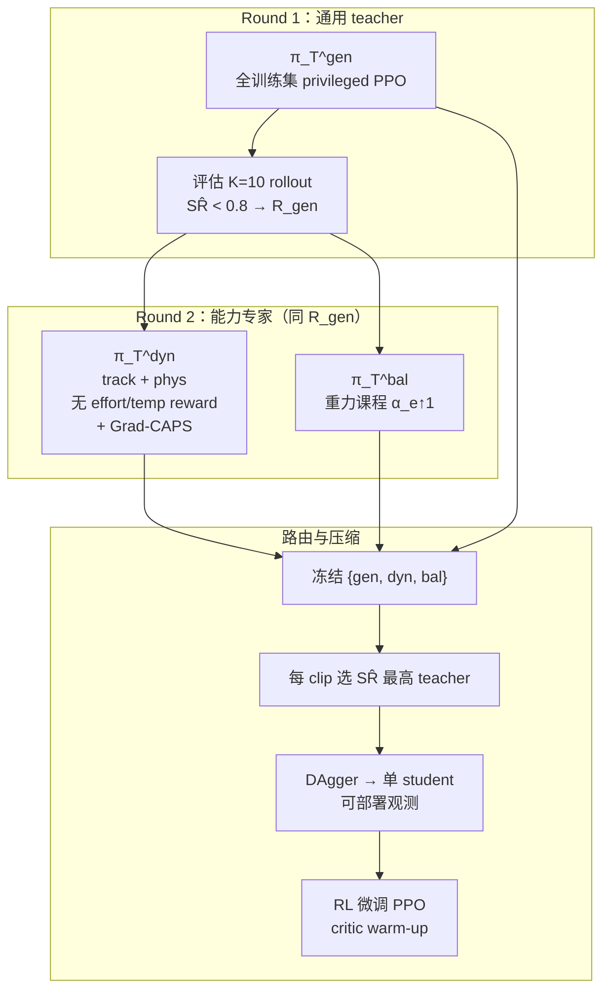

# Athena-WBC：面向人形全身控制长尾的能力对齐策略专家

**Athena-WBC**（*Capability-Aligned Policy Experts for Long-Tail Humanoid Whole-Body Control*，arXiv:2607.04837，2026-07-06，**XPENG Robotics**）研究 **高覆盖率人形 motion tracking** 中常被忽视的 **训练集长尾残余失败**：在强基线（SONIC 配方）已覆盖绝大多数动作后，仍有少量 **高动态过渡** 与 **平衡关键** 片段学不会——且部分片段 **仅对失败子集加训仍无法过拟合**，说明瓶颈在 **策略能力（capability）** 而非单纯数据曝光。

## 一句话定义

**两阶段紧凑 teacher–student 管线：全量通用 privileged teacher → 挖掘残余失败集并并行训练 dynamic（去保守奖励 + Grad-CAPS 辅助平滑）与 balance（重力课程）专家 → 按 rollout 成功率路由每段动作的最佳 teacher → DAgger 蒸馏为可部署单策略 → RL 微调，在 80 kg 小鹏人形上相对同平台 SONIC-Base 改善长尾恢复与 held-out 跟踪。**

## 英文缩写速查

| 缩写 | 英文全称 | 简要说明 |
|------|----------|----------|
| WBC | Whole-Body Control | 人形全身运动跟踪与协调控制 |
| SONIC | Supersizing Motion Tracking for Natural Humanoid WBC | 规模化 tracking 基线配方（本文在同平台重实现） |
| STC | Success–Tolerance Curve | 随跟踪容差缩放的成功率曲线 |
| TIS | Threshold-Integrated Success | 对 STC 的标量积分，衡量跨阈值鲁棒性 |
| MPJPE-W | Motion-Salience Weighted MPJPE | 按动作显著性加权的关节跟踪误差 |
| DAgger | Dataset Aggregation | 在 learner 状态上查询 expert 动作的蒸馏范式 |
| Grad-CAPS | Gradient-based CAPS | 对策略均值施加梯度时序正则的辅助损失 |
| SR | Success Rate | 基于根高/偏航/关键点误差的二元成功率 |

## 为什么重要

- **问题视角新：** 将 **训练集 residual coverage** 与 held-out 泛化失败区分开；高平均 SR 仍可能隐藏 **结构化长尾**（dynamic / balance 子集）。
- **能力瓶颈 vs 数据分配：** 实验证明去掉 effort/temporal **奖励惩罚**（No-smoothness）可显著提升跟踪，但 **Action Rate 暴涨** 不可部署——说明保守奖励是 **真实 capability 限制**，而非「再多采样就能解决」。
- **专家按能力对齐而非按动作聚类：** dynamic 与 balance expert **看同一残余集**、用 **不同 acquisition recipe**；最终 **按 rollout SR 路由**，避免手工标注动作类型。
- **蒸馏与 RL 分工清晰：** **multi-teacher 蒸馏** 主要负责 **训练集长尾恢复**；**RL 微调** 主要负责 **held-out TIS/MPJPE 与部署平滑度**（微调后 balance 子集 SR 可能略降）。
- **评测工具可复用：** STC/TIS/MPJPE-W 针对「策略已很强、单阈值 SR 难区分」的高覆盖率 regime，可与 [SONIC](../methods/sonic-motion-tracking.md)、[Humanoid-GPT](./paper-humanoid-gpt.md) 等 scaling 路线对照使用。
- **产业样本：** 与 [DeepInsight](./deepinsight.md)、[ROVE](./paper-rove-humanoid-vla-intervention.md) 同属小鹏机器人栈；本文聚焦 **System 0 WBC 长尾**，尚无公开项目页与系统真机定量。

## 流程总览

## 核心机制（归纳）

### 1）Capability bottleneck 操作化

奖励分解 $r_t = r^{\mathrm{track}}_t + r^{\mathrm{phys}}_t + r^{\mathrm{effort}}_t + r^{\mathrm{temp}}_t$：

- $r^{\mathrm{phys}}$：关节限位、速度/力矩限、脚滑等 **物理可行性**（应保留）。
- $r^{\mathrm{effort}}/r^{\mathrm{temp}}$：力矩、DoF 速度/加速度、动作率等 **保守控制偏好**（高动态长尾上可能有害）。

**Dynamic expert** 令 $r^{\mathrm{effort}}=r^{\mathrm{temp}}=0$，用 **Grad-CAPS** 在策略均值上约束二阶差分，分离「可激进跟踪」与「高频抖动」。

**Balance expert** 用 $g_e=\alpha_e g_0$ **重力课程**，让未训练策略在弱重力下存活足够长以学到支撑/恢复信号。

### 2）Motion-routed distillation

两专家 **不迭代挖掘**（仅两轮 teacher 训练，保持专家库紧凑）。路由 $k^*(m)=\arg\max_k \widehat{\mathrm{SR}}(\pi_T^k,\tau_m)$ 在蒸馏时选定监督源；student 仅见 **可部署观测**。

### 3）RL fine-tuning

遵循 [Parkour in the Wild](https://doi.org/10.1177/02783649251347436)：**冻结 actor + 加噪 rollout 训 critic** → 渐解冻 actor 继续 PPO；teacher 特权量与课程变量 **全部关闭**。

### 4）实验设定要点

| 项 | 内容 |
|----|------|
| 平台 | **80 kg** 行星滚柱丝杠 + 闭链 **小鹏人形**（非 Unitree G1） |
| 训练数据 | **55,482 clips / 175.88 h**（AMASS、Bones-Seed、BEAT、策展 mocap） |
| 基线 | **SONIC-Base**（同平台重实现 SONIC 配方，非 NVIDIA 发布权重） |
| 算力 | 8×GPU，每 GPU 2048 env；主训 **40k iter** |
| Held-out | AMASS-eval（10 h IID）；Omni-eval（227 clips 难动作） |

## 主要结果（相对 SONIC-Base）

**Held-out（RL 微调最终策略）：**

| 集合 | SR | TIS | MPJPE (mm) |
|------|-----|-----|------------|
| AMASS-eval | 98.18→**99.26%** | 0.7631→**0.8034** | 68.26→**63.63** |
| Omni-eval | 91.81→**94.89%** | 0.7123→**0.7449** | 70.39→**65.11** |

**长尾训练子集（multi-teacher student vs SONIC-Base）：** balance 子集 SR **90.60→94.73%**，MPJPE-W **101.99→88.61 mm**。

**平滑度：** No-smoothness 诊断基线 Action Rate **1.46**；SONIC-Base **0.54**；RL 微调 **1.03**——在保留大部分无平滑跟踪收益的同时避免不可部署的高频抖动。

## 常见误区

1. **「长尾 = 再加难样本采样」：** 论文显示部分 clip **targeted retrain 仍失败**；需改 **奖励/课程/辅助正则** 等 capability 配方。
2. **「去掉平滑奖励就够用」：** No-smoothness 跟踪最好但 **不可部署**；最终策略靠 **Grad-CAPS + 蒸馏 + RLFT** 折中。
3. **「RL 微调解决一切长尾」：** 训练集长尾恢复主要来自 **能力专家 + 多 teacher 蒸馏**；RLFT 更偏 **held-out 与部署质量**。
4. **「可与 SONIC 论文数字直接比」：** 本文在 **不同硬件与重实现配方** 上对比；绝对 SR 不与 G1 发布 checkpoint 对齐。
5. **「与 OmniTrack 结论矛盾」：** OmniTrack 靠 **参考物理修正** 可单策略覆盖许多难动作；本文在 **80 kg 闭链平台** 上仍有残余，需 **能力专家**——二者 **互补且部分对立**。

## 与其他页面的关系

- **Scaling 对照：** [SONIC](../methods/sonic-motion-tracking.md)（亿级帧 + 统一 token）、[Humanoid-GPT](./paper-humanoid-gpt.md)（2B 帧 + Transformer 专家蒸馏）、[EGM](../methods/egm-efficient-general-mimic.md)（bin 课程 + CDMoE，偏数据效率）
- **专家蒸馏先例：** BumbleBee（语义/运动聚类专家）、Parkour in the Wild（地形专家 → DAgger → RLFT）
- **小鹏栈：** [DeepInsight](./deepinsight.md)（全栈评测）、[ROVE](./paper-rove-humanoid-vla-intervention.md)（VLA 后训练）
- **概念：** [Whole-Body Control](../concepts/whole-body-control.md)、[Whole-Body Tracking Pipeline](../concepts/whole-body-tracking-pipeline.md)
- **选型：** [humanoid motion tracking 方法选型](../queries/humanoid-motion-tracking-method-selection.md)

## 参考来源

- [Athena-WBC（arXiv:2607.04837）](../../sources/papers/athena_wbc_arxiv_2607_04837.md)

## 推荐继续阅读

- [机器人论文阅读笔记：Athena-WBC](https://imchong.github.io/Humanoid_Robot_Learning_Paper_Notebooks/papers/04_Loco-Manipulation_and_WBC/Athena-WBC__Capability-Aligned_Policy_Experts_for_Long-Tail_Humanoid_Whole-Body_Control/Athena-WBC__Capability-Aligned_Policy_Experts_for_Long-Tail_Humanoid_Whole-Body_Control.html)
- [arXiv:2607.04837](https://arxiv.org/abs/2607.04837) — 全文与 STC/TIS/MPJPE-W 定义
- [SONIC（arXiv:2511.07820）](https://arxiv.org/abs/2511.07820) — 本文基线配方来源
- [OmniH2O（CoRL 2024）](https://proceedings.mlr.press/v270/he25a.html) — privileged teacher 观测设计参照
- [Parkour in the Wild（IJRR 2026）](https://doi.org/10.1177/02783649251347436) — 蒸馏后 RL 微调流程参照
- [Humanoid-GPT 实体页](./paper-humanoid-gpt.md) — 另一路「数百 PPO expert → 通才」scaling 对照
