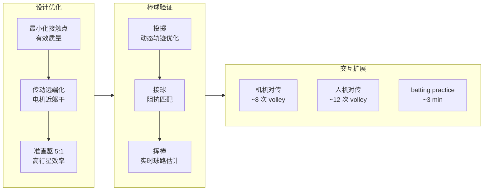
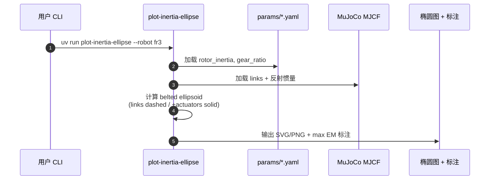

# AthenaZero：低惯量双臂动态操作平台

**AthenaZero**（*A low-inertia, bimanual robot for dynamic manipulation*，[*Science Robotics* 11(118)，2026-09-16](https://doi.org/10.1126/scirobotics.aee1868)）由 **机器人与人工智能研究所（RAI Institute）**（现代汽车集团资助）提出：首款强调 **有效质量（effective mass）** 与 **力透明** 的双臂操作原型，通过 **准直驱（多数 5:1）** 与 **传动远端化** 把接触点惯量压到人臂量级，并以 **棒球式投/接/打** 与人机对传展示 **毫秒级** 动态交互。

> **同平台软件线：** [Robot Juggling（arXiv:2608.26800）](./paper-robot-juggling-athenazero.md) — 正则化记忆学习 + 三球抛接；**学习栈仍确认未开源**，硬件设计以本页与 SciRob 论文为准。

## 一句话定义

**把协作臂一个数量级的有效质量降下来，仍保留 >3 kg 负载与快速加速能力——让机器人像人一样在接触里借力，而不是靠高减速比硬顶。**

## 英文缩写速查

| 缩写 | 英文全称 | 简要说明 |
|------|----------|----------|
| DoF | Degree of Freedom | 躯干 1 + 双臂各 7 + 双手各 6（27 关节 / 22 执行器） |
| QDD | Quasi-Direct Drive | 低减速比 + 高效率行星传动，接近直驱力透明 |
| FT | Force-Torque | 六维力矩传感器；AthenaZero **未使用** |
| MJCF | MuJoCo XML Format | 开源分析仓提供的简化动力学模型 |
| EM | Effective Mass | 接触方向力/加速度比；本文核心设计指标 |

## 为什么重要

- **硬件指标可量化：** 腕部有效质量 **3.97 kg** vs 人 **2.76 kg** vs FR3 **29.21 kg** vs UR5e **34.72 kg** — 把「柔顺动态操作」从口号变成 **可复现对比**（[effective_mass_analysis](https://github.com/rai-opensource/effective_mass_analysis) + Zenodo）。
- **human cadence 测试床：** 投 **>30 m/s**、7.3 m 内接/打 **>14 m/s**、82% 挥棒接触 — 任务刻意选在 **人类业余棒球** 速度带，检验 **加速/减速** 而不仅是准静态抓取。
- **接触策略反转：** 低惯量 + 反驱 → **主动利用接触**（对传、装配柔顺）而非工业臂常见的 **回避接触**；与 [Contact-Rich Manipulation](../concepts/contact-rich-manipulation.md) 方向一致。
- **RAI 动态操作线硬件锚点：** 与 [ZEST](./paper-zest.md)（全身技能迁移）、[Sumo](../methods/sumo.md)（MPC-over-RL 全身推物）、[Robot Juggling](./paper-robot-juggling-athenazero.md)（分钟级抛接学习）共享 **低惯量 / 动态接触** 叙事，但本页是 **平台论文** 而非单算法。

## 核心信息

| 项 | 内容 |
|----|------|
| **机构** | 机器人与人工智能研究所（RAI Institute）；现代汽车集团资助 |
| **构型** | 1-DoF 躯干 + 2×7-DoF 臂 + 2×6-DoF 欠驱动三指手；高 ~1.6 m，臂展 ~1.8 m |
| **执行器** | 四套定制 QDD；多数 **5:1**；行星效率 **≥97%**；负载 **>3 kg** |
| **传感** | **仅** 电机电流力矩估计；**无** 腕/臂 FT |
| **控制要点** | 力矩控制 + 轨迹 **加速度 feedforward**；接球 **task readiness impedance**（非单纯 minimum jerk） |
| **开源（2026-09-17）** | **部分开源**：有效质量分析 MIT 仓 + Zenodo Fig.5–6 数据；**无** 完整 CAD/真机控制 |

## 流程总览

## 核心原理

### 动态操作臂三条路线（选型对照）

| 路线 | 代表 | 优势 | 短板 |
|------|------|------|------|
| **高减速协作臂** | Franka / UR / iiwa | 高静态扭矩、工业精度 | 反射惯量 ∝ ratio² → 高 EM；软件限矩难改撞击瞬间冲量 |
| **柔性改造** | SEA、软体手、缓冲垫 | 形变吸收碰撞 | 闭环带宽↓；难高功率投掷 |
| **低惯量 QDD** | WAM、AMBIDEX、**AthenaZero** | 物理层降 EM、背驱/力透明 | 静态扭矩↓、结构复杂；Bowden/皮带摩擦 |

> 文内强调：虚拟降惯/力反馈受 **带宽与采样延迟** 约束，只能在接触 **之后** 生效；毫秒级高速冲击仍由 **硬件 EM** 决定。

### 有效质量为何是主指标

协作臂 **>80:1** 减速比使 **反射惯量 ∝ ratio²** 主导接触点「重量感」。高有效质量 → 同样力矩下 **加减速慢**，控制器只能 **降速** 换柔顺。AthenaZero 把 **链接惯量 + 反射惯量** 一起压下，使 **人类 cadence**（快速 wind-up / 接触缓冲）在控制上可行。

### 准直驱 + 远端化

| 手段 | 作用 |
|------|------|
| **低减速比（5:1）** | 降低反射惯量；保留 **反驱**（外力可回传） |
| **97%+ 行星齿轮** | 电流力矩估计可用；省 FT 传感器 |
| **电机收向躯干** | 摆臂时 ** distal 运动质量** 更小（类比棒球 kinetic chain 近端供能） |
| **并联腕（构型相关 ratio）** | 电机收至肘关节；腕部 **LUT + 双线性插值** 正解 **~3 μs**/查询 @ **1 kHz**；分析仓给中性 workspace 参数 |
| **Bowden 三指手** | 躯干内电机 + **1.8 m** 缆绳；气压触觉 **200 Hz**；摩擦限制夹持力/手速 |

### 摆锤冲击与刚度标定

| 实验 | AthenaZero | FR3（对照） | 读法 |
|------|------------|-------------|------|
| **1 kg 摆锤撞击 EM** | **0.83 kg** | **3.3 kg** | 短距冲击实验；与 belted ellipsoid 叙事一致 |
| **撞击峰值力** | **124.1 N** | **208.3 N** | FR3 更易把摆锤 **弹回** |
| **主动刚度（30 位姿）** | 空载平均偏移 **~3 mm** | — | 闭环位置误差，非纯结构刚度 |
| **+1.8 kg 载荷** | 平均偏移 **~12 mm** | — | **RJ7** 腕关节扭矩最低，伸展姿态力臂放大 |

### 棒球三项（评测摘要）

**实验设置：** **7.3 m** 固定距离实验室；**OptiTrack 240 Hz** 球轨迹；机机/人机对传与 batting practice。

| 任务 | 报告性能 | 读法 |
|------|----------|------|
| **投掷（单臂网球）** | **30.8 m/s** | 博客亦报 **70 mph** 级高速 |
| **投掷（双臂棒球）** | **21.4 m/s** 投入 **0.25×0.25 m** 框 | 释放时序/打滑是瓶颈 |
| **接球** | 7.3 m 最高 **18.3 m/s**；外推 mound **46.1 m/s** | 轨迹需 **≥3** 个采样点才够反应 |
| **挥棒** | 最高来球 **13.9 m/s**；标准场地等效 **35 m/s**；**82%** 接触 @ **>14 m/s**（33 试） | 业余击球带 |
| **对传** | 机机 **8** volley；人机 **12** volley | 轨迹不确定性 + 柔顺 |
| **batting practice** | 机机 / 人机均 **~3 min** 连续 | 实时 swing 调整 |

## 源码运行时序图

论文 **Fig.5–6 有效质量椭圆** 可通过官方分析仓复现（非真机 demo 栈）：

**入口：** [`effective_mass_analysis`](../../sources/repos/effective_mass_analysis.md) — `uv sync` → `uv run plot-inertia-ellipse --robot <fr3|iiwa14|ur5e|wam>` 或 AthenaZero 自定义 YAML。

## 工程实践

| 项 | 建议 |
|----|------|
| **对比复现** | 先跑分析仓四基线 + 简化 AthenaZero MJCF；Zenodo CSV 对照 Fig.5 冲击曲线 |
| **参数敏感** | 制造商动力学常不完整；**转子惯量 / 减速比** 是跨文献 EM 差异主因 — 用仓内 disclosed 值 |
| **腕部并联** | 有效 mass 随 wrist 构型变；论文中性点参数外推需留 margin |
| **控制** | 需 **力矩层 + 动力学 feedforward**；纯 kinematic / position FF 不够 |
| **任务选型** | 适合 **动态接触 / 短 burst**；不适合 **>1 min 静态持重** 或 **高刚度轨迹跟踪**（焊接） |
| **与抛接论文** | 硬件读本页；学习看 [Robot Juggling](./paper-robot-juggling-athenazero.md) — **勿混为同一开源包** |

## 实验与评测

- **有效质量：** 腕部中性构型 **3.97 kg**；上臂接触热图仍低于协作臂 **远端 link** 水平 — 支持 **整臂接触** 操作扩展。
- **刚度 / 冲击：** Zenodo 含 FR3 vs AthenaZero 冲击与控制器误差 CSV — 支撑「透明 + 柔顺」叙事。
- **棒球闭环：** 机机 / 人机对传与 batting practice 证明 **估计 + 阻抗** 在不确定球路上的 **在线适应**。
- **运动生成：** 作者强调 **非** 通用 minimum jerk；投掷用 **kinetic chain**，接球用 **task readiness impedance**。

## 结论

**AthenaZero 用可测量的有效质量证明：当代电机 + 低减速比 + 质量布局，已经能把双臂做到「像人一样在接触里工作」的物理前提；棒球只是最严的公开考卷。**

1. **设计先看 EM，不先看 payload 峰值。** 动态操作的上限常卡在 **反射惯量**，不是电机峰值力矩。
2. **5:1 级 QDD 是数量级分水岭。** FR3/UR5e 的 EM 差距主要来自 **ratio²**，不是链接铝重 alone。
3. **可去掉 FT，但不能去掉力矩控制。** 电流估力矩 + 97% 传动是配套假设。
4. **human cadence 需要 feedforward 动力学。** 仅 jerk 最小化不足以解释/复现投接动作。
5. **开源先给「对比公平性」。** 分析仓 + Zenodo 解决 **跨臂 EM 不可比**；真机栈仍闭源。
6. **选型：** 动态接触 / 对传 / 抛接 → 本硬件线；长静态持重 / 高刚度轨迹 → 仍用传统协作臂。
7. **下一步读 [Robot Juggling](./paper-robot-juggling-athenazero.md)** — 同一平台上的 **分钟级学习** 软件证据。

## 与其他工作对比

| 对照 | 差异读法 |
|------|----------|
| FR3 / UR5e / iiwa | 高减速比协作臂；EM 高一个数量级；精静态任务强 |
| [Robot Juggling](./paper-robot-juggling-athenazero.md) | 同 AthenaZero；本文 **硬件 + 棒球**，彼文 **学习 + 抛接** |
| [ZEST](./paper-zest.md) | 同 RAI；ZEST 是 **腿式全身** 技能迁移，非操作臂 EM 设计 |
| [Sumo](../methods/sumo.md) | 同 RAI **动态 loco-manip**；Sumo 偏 **MPC-over-RL 推物** |
| Barrett WAM | 经典低惯量研究臂；AthenaZero 双臂 + 手 + 远端化 + 公开 EM 工具链 |

## 局限与风险

- **部分开源：** 无法按仓库复现 **真机棒球 demo** 或制造完整硬件。
- **热与持续力矩：** 像人一样 **不适合** 长时间 distal 静态持重。
- **高刚度跟踪：** 焊接类 **严格轨迹** 非设计 sweet spot。
- **腕并联近似：** 分析仓 EM 在 wrist 中性有效；极限构型需额外验证。
- **棒球外推：** 速度外推 mound 距离是 **作者解读**；独立第三方尚未复现全部数字。
- **Bowden 手摩擦：** **1.8 m** 缆绳损耗限制夹持力与手速 — 为整体低惯量的工程取舍。
- **抛接栈分离：** arXiv:2608.26800 **仍无代码** — 勿因本仓开源误以为 juggling 可复现。
- **落地 gap（文内）：** 机载高速视觉、缆绳摩擦、热管理仍是走向现实部署的待解项。

## 关联页面

- [Robot Juggling · AthenaZero 学习](./paper-robot-juggling-athenazero.md)
- [ZEST](./paper-zest.md) — RAI × BD 全身技能
- [Sumo](../methods/sumo.md) — RAI 动态全身操作框架
- [Manipulation](../tasks/manipulation.md)
- [Contact-Rich Manipulation](../concepts/contact-rich-manipulation.md)
- [Whole-Body Control](../concepts/whole-body-control.md)

## 参考来源

- [AthenaZero SciRob 论文归档](../../sources/papers/athenazero_scirobotics_aee1868.md)
- [深蓝具身智能 · SciRob 封面导读（2026-09-22）](../../sources/blogs/wechat_shenlan_athenazero_scirob_cover_2026-09-22.md)
- [RAI AthenaZero 博客归档](../../sources/sites/rai-athenazero-blog.md)
- [effective_mass_analysis 仓库归档](../../sources/repos/effective_mass_analysis.md)
- [Science Robotics DOI](https://doi.org/10.1126/scirobotics.aee1868)

## 推荐继续阅读

- [Science PDF](https://www.science.org/doi/pdf/10.1126/scirobotics.aee1868)
- [RAI 博客](https://rai-inst.com/resources/blog/bimanual-robot-for-dynamic-manipulation/)
- [GitHub · effective_mass_analysis](https://github.com/rai-opensource/effective_mass_analysis)
- [Zenodo 数据](https://doi.org/10.5281/zenodo.21939225)
