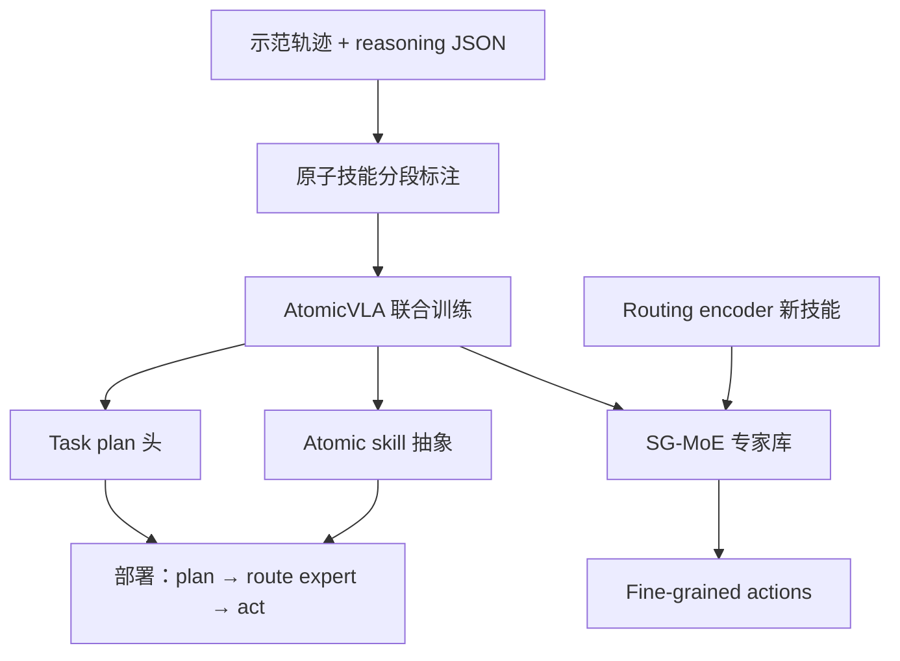
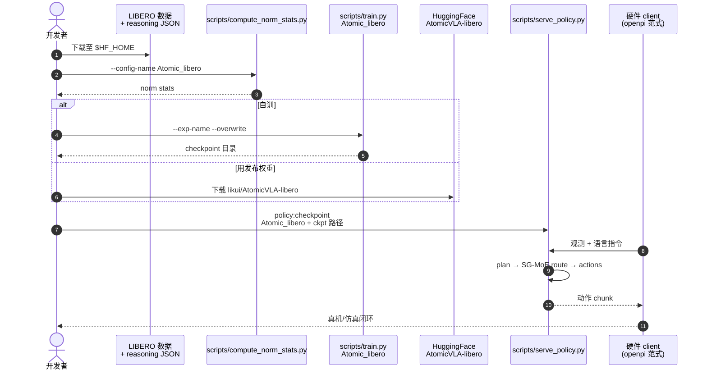

# AtomicVLA：原子技能学习的统一规划–执行 VLA

**AtomicVLA**（*AtomicVLA: Unlocking the Potential of Atomic Skill Learning in Robots*，[arXiv:2603.07648](https://arxiv.org/abs/2603.07648)，[项目页](https://zhanglk9.github.io/atomicvla-web/)，[代码](https://github.com/zhanglk9/AtomicVLA)）由中山大学、鹏城实验室与引望智能等提出：**CVPR 2026**。在 [openpi / π₀](./paper-pi0.md) 栈上，把长程操纵从「单体 action decoder 拟合聚合轨迹」改为 **任务计划 + 原子技能 + 细粒度动作** 的统一生成，并用 **Skill-Guided MoE（SG-MoE）** 与 **routing encoder** 支撑技能库扩展与持续学习。

## 一句话定义

**长程 VLA 的关键不是更长 action chunk，而是可组合的原子技能库——计划、技能抽象与低层动作在同一模型里联合出，MoE 负责专精与扩技能。**

## 英文缩写速查

| 缩写 | 英文全称 | 简要说明 |
|------|----------|----------|
| VLA | Vision-Language-Action | 视觉–语言–动作多模态策略 |
| SG-MoE | Skill-Guided Mixture-of-Experts | 技能引导的专家混合：各 expert 对应原子技能 |
| MoE | Mixture of Experts | 多专家路由与组合 |
| CoT | Chain-of-Thought | 技能段级推理文本（annotation / 生成） |
| LIBERO-LONG | LIBERO long-horizon split | 长程 LIBERO 评测子集 |

## 为什么重要

- **直击单体解码器瓶颈：** 聚合数据上训练的 **monolithic action decoder** 难以 scale 到多步长程与 **continual skill acquisition**；AtomicVLA 把 **planning** 与 **execution** 收到同一框架。
- **原子技能是可维护的中间层：** 相对纯 end-to-end chunk，**atomic skill abstraction** 便于组合、诊断与增量扩库——与 [OrthoSkillVLA](./paper-orthoskillvla.md) 等持续技能学习线形成对照。
- **openpi 生态可复现：** MIT 代码 + HF [AtomicVLA-libero](https://huggingface.co/likui/AtomicVLA-libero)，训练/部署路径对齐 **π₀** 社区习惯（`serve_policy.py` + 硬件 client）。
- **长程与终身学习有定量增益：** 摘要报告 LIBERO-LONG **+10%**（对 π₀）、CALVIN 平均任务长度 **+0.22 / +0.25**（对 π₀ / π₀.₅）、真机长程 **+18.3%**、持续学习 **+21%**。

## 核心信息

| 项 | 内容 |
|----|------|
| **机构** | 中山大学（SYSU）、鹏城实验室（PCL）、引望智能科技等 |
| **会议** | CVPR 2026 |
| **基座栈** | [openpi](https://github.com/Physical-Intelligence/openpi)（Physical Intelligence π 系） |
| **开源** | **已开源** MIT 代码 + HF LIBERO checkpoint |

## 核心原理

### 统一规划–执行三输出

| 层级 | 内容 |
|------|------|
| **Task-level plan** | 长程任务的语言/结构化计划 |
| **Atomic skill abstraction** | 可复用原子技能类型与段级语义 |
| **Fine-grained actions** | 与 openpi 一致的连续低层控制 |

训练依赖 **结构化 reasoning annotation**：每个 demonstration episode 映射为若干 **segments**（起止帧、`primary_action_verb`、可选 `chain_of_thought`），见仓库 README JSON schema。

### SG-MoE 与 routing encoder

- **SG-MoE：** 构建 **scalable atomic skill library**；每个 expert 专精 **generic yet precise** 的原子技能。
- **Routing encoder：** 为新技能 **自动分配 dedicated expert**，支持 **continual learning** 而无需重训整库。
- **数据侧：** 论文致谢 [InternVideo](https://github.com/OpenGVLab/InternVideo) 与 [OneTwoVLA](https://github.com/Fanqi-Lin/OneTwoVLA) 的统一 VLA 建模启发；reasoning 标注管线以论文与项目页为准。

### 流程总览

## 源码运行时序图

节点对齐 [`sources/repos/atomicvla.md`](../../sources/repos/atomicvla.md) 与 README。

- **注意：** 缺 **reasoning annotation JSON** 时无法完整复现训练管线；推理可先用 HF checkpoint 验证 LIBERO 协议。
- **环境：** 推荐 `uv sync`；子模块含 openpi；LeRobot 依赖需 `GIT_LFS_SKIP_SMUDGE=1`。

## 工程实践

| 项 | 建议 |
|----|------|
| 起点 | 先跑 HF **AtomicVLA-libero** + `serve_policy.py`，再考虑自训 |
| 环境 | `uv` + CUDA；详见仓库 `INSTALL.md`（conda 可选） |
| 数据 | LIBERO 放 `$HF_HOME/`；按 README 准备 episode→segments JSON |
| 训练 | `compute_norm_stats.py` → `train.py Atomic_libero`；8 卡示例见 README |
| 部署 | Policy server + 硬件 client，与 [π₀](./paper-pi0.md) / openpi 栈一致 |
| 对照 | 长程/终身实验对齐 **π₀、π₀.₅** 与同一 benchmark 协议 |

## 实验与评测

| 基准 / 设定 | 相对基线（摘要口径） | 备注 |
|-------------|---------------------|------|
| **LIBERO** | **+2.4%** vs π₀ | 标准操纵套件 |
| **LIBERO-LONG** | **+10%** vs π₀ | 长程子集 |
| **CALVIN** | avg task length **+0.22 / +0.25** vs π₀ / π₀.₅ | 多步链式任务 |
| **真机长程** | **+18.3%** vs baselines | 论文/项目页 |
| **真机持续学习** | **+21%** vs baselines | routing + 新 expert |

## 局限与风险

- **标注成本：** 原子技能 **reasoning JSON** 需额外管线（InternVideo 等）；复现训练门槛高于纯 BC VLA。
- **发布范围：** 截至入库日 GitHub 以 **LIBERO** 训练/评测为主；CALVIN/真机细节以论文为准。
- **与 π 系绑定：** 基于 openpi，换骨干或动作契约需自行适配。

## 结论

**AtomicVLA 把长程 VLA 的可扩展性押在「显式原子技能 + SG-MoE 路由」上，而不是更大单体解码器——对 LIBERO-LONG、CALVIN 链长与真机终身学习均有摘要级增益。**

- **读论文盯三输出耦合：** plan / skill / action 是否联合训练，以及 **SG-MoE** 如何分配 expert——这是相对 π₀ 的核心差异。
- **长程增益集中在 LONG 与 CALVIN 链长：** LIBERO 标准集 **+2.4%** 边际较小，**+10% LIBERO-LONG** 更能代表方法价值。
- **持续学习看 routing encoder：** 新技能自动挂 expert 是工程上可扩展点；与 [OrthoSkillVLA](./paper-orthoskillvla.md) 的子空间/MoE 路线可对照选型。
- **复现先 HF 后自训：** [likui/AtomicVLA-libero](https://huggingface.co/likui/AtomicVLA-libero) + `serve_policy.py` 验证协议；完整训练需自备 reasoning JSON。
- **生态位：** openpi 用户的长程/技能库增强选项，而非替代 π₀ 预训练权重本身。

## 与其他页面的关系

- [VLA](../methods/vla.md) — 通才 VLA 与 plan-then-execute / 技能 MoE 谱系
- [π₀](./paper-pi0.md) — 基座与主要对照
- [π₀.₅](./paper-pi05-open-world-vla.md) — CALVIN 对照
- [OrthoSkillVLA](./paper-orthoskillvla.md) — 另一 VLA 持续技能学习
- [LIBERO](./libero-benchmark.md) / [CALVIN](./calvin-benchmark.md) — 主评测基准

## 参考来源

- [atomicvla_arxiv_2603_07648.md](../../sources/papers/atomicvla_arxiv_2603_07648.md)
- [atomicvla 项目页](../../sources/sites/atomicvla-zhanglk9-github-io.md)
- [atomicvla 仓库](../../sources/repos/atomicvla.md)

## 推荐继续阅读

- [AtomicVLA 项目页](https://zhanglk9.github.io/atomicvla-web/)
- [AtomicVLA GitHub](https://github.com/zhanglk9/AtomicVLA)
- [Physical Intelligence openpi](https://github.com/Physical-Intelligence/openpi)
