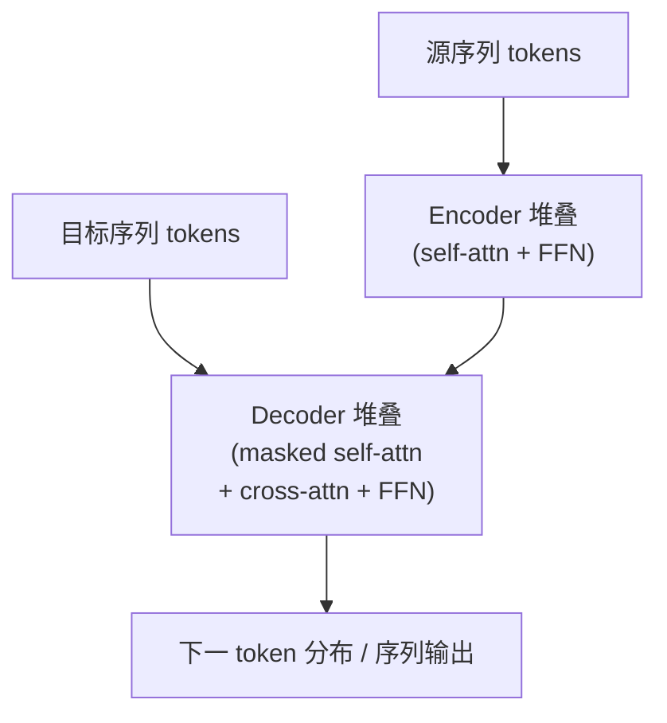
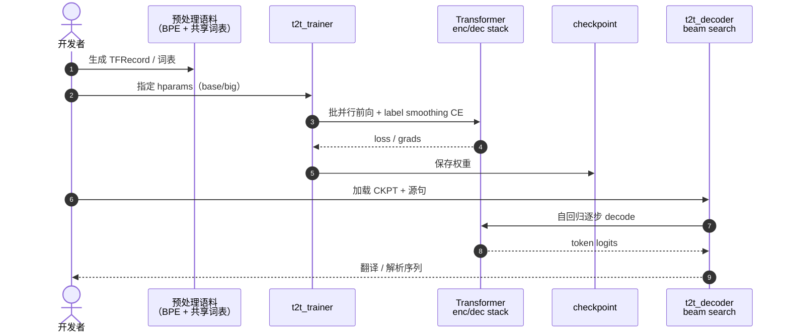

# Attention Is All You Need

**Attention Is All You Need**（Vaswani et al.，[arXiv:1706.03762](https://arxiv.org/abs/1706.03762)，NeurIPS 2017）提出 **Transformer**：encoder–decoder 完全由 **自注意力（self-attention）** 与 **逐位置前馈网络（FFN）** 堆叠，**去掉循环与卷积**。在 WMT 2014 英德翻译上达到 **28.4 BLEU**（单模型，较当时 ensemble SOTA 提升 **>2 BLEU**），英译法 **41.8 BLEU**（8×GPU 训练 3.5 天），并泛化到英语成分句法分析。

## 一句话定义

**用缩放点积多头自注意力把任意两 token 的交互路径压到 O(1)，整序列可并行训练，从而取代 RNN/CNN 成为现代序列与多模态（含机器人 VLA/ACT）的默认骨干。**

## 英文缩写速查

| 缩写 | 英文全称 | 简要说明 |
|------|----------|----------|
| MHA | Multi-Head Attention | 多子空间并行注意力，再拼接投影 |
| FFN | Feed-Forward Network | 逐 token 的两层 MLP（典型 4× 扩维） |
| PE | Positional Encoding | 正弦或可学习位置注入，补偿注意力置换不变性 |
| BLEU | Bilingual Evaluation Understudy | 机器翻译 n-gram 重叠评测指标 |
| VLA | Vision-Language-Action | 机器人多模态策略，常用 Transformer 骨干 |

## 为什么重要

- **并行训练：** 相对 RNN 逐步展开，Transformer 对整句/整段 **同时** 做注意力，GPU 利用率与吞吐显著提升。
- **长程依赖：** 任意位置对之间 **一跳** 可达（路径长度 O(1)），缓解 RNN 梯度衰减与有效记忆长度问题。
- **机器人迁移：** 同一「序列 in → 序列 out」范式支撑 [ACT](../methods/action-chunking.md)、[RT 系列](../methods/robotics-transformer-rt-series.md)、[BC+Transformer](../methods/bc-with-transformer.md) 与扩散 DiT 动作头——见 [Transformer 概念页](../concepts/transformer.md)。

## 核心信息

| 字段 | 内容 |
|------|------|
| **机构** | 谷歌（Google Brain / Google Research） |
| **任务** | WMT 2014 EN↔DE/FR 机器翻译；英语 constituency parsing |
| **基线模型** | base：$d_{model}=512$，8 头，6 层 enc/dec，$d_{ff}=2048$；big：$d_{model}=1024$，16 头 |
| **训练** | Adam，lr warmup + inverse sqrt decay；label smoothing 0.1；dropout 0.1 |
| **开源** | **已开源**：官方 [tensor2tensor](https://github.com/tensorflow/tensor2tensor)（归档 [sources/repos/tensor2tensor.md](../../sources/repos/tensor2tensor.md)） |

## 核心原理

### 1) 缩放点积注意力

$$
\text{Attention}(Q,K,V)=\text{softmax}\!\left(\frac{QK^\top}{\sqrt{d_k}}\right)V
$$

除以 $\sqrt{d_k}$ 防止点积过大导致 softmax 饱和、梯度变小。

### 2) 多头注意力

$h$ 组独立 $(Q_i,K_i,V_i)$ 并行计算后 **concat + 线性投影**；让不同头在不同表示子空间关注不同依赖模式。

### 3) Encoder / Decoder Block

每层：**MHA → Add&Norm → FFN → Add&Norm**（Post-LN 原版）。Decoder 额外 **masked self-attention**（因果）+ **encoder–decoder cross-attention**。

### 4) 位置编码

正弦/余弦函数注入绝对位置（或可学习 embedding）；因 self-attention 本身 **置换等变**，必须显式编码顺序。

### 流程总览

## 源码运行时序图

官方参考实现 [tensor2tensor](https://github.com/tensorflow/tensor2tensor)（归档 [tensor2tensor.md](../../sources/repos/tensor2tensor.md)）典型 **训练/推理** 路径：

- **复现读点：** 现代工程多迁移至 HuggingFace / PyTorch，但 **模块边界**（MHA、FFN、PE、causal mask）与论文一致。
- **机器人侧：** 推理时多为 **固定上下文窗口 + 动作 chunk 自回归或并行解码**，栈形态同 seq2seq，只是 token 为观测/语言/动作 patch。

## 工程实践

| 项 | 建议 |
|----|------|
| 选型 | 需要 **长历史融合 / 多模态 token 混排** 时优先 Transformer；极长上下文且算力紧则对照 [Mamba](../concepts/mamba.md) / TCN |
| 归一化 | 原版 Post-LN；许多机器人/VLA 实现改用 **Pre-LN** 换训练稳定（与 ResNet 后验一致） |
| 位置 | 机器人时序常用 **可学习 1D PE** 或 RoPE；视觉 patch 用 2D 扩展（ViT 路线） |
| 算力 | 自注意力 **O(n²)**；动作 chunk 较短时通常可接受；整段高分辨率视频需稀疏/分层 |
| 复现 | 读论文数值对照 T2T base/big hparams；新项勿混用 Post/Pre-LN 而不说明 |

## 实验与评测

- **WMT14 EN→DE：** Transformer (big) **28.4 BLEU**；训练成本约为文献最佳模型的 **一小部分**（8×P100，3.5 天量级叙述见原文）。
- **WMT14 EN→FR：** 单模型 **41.8 BLEU**（当时 SOTA）。
- **Parsing：** WSJ 与半监督设定均 **优于** 多数专用 parser，说明架构 **跨任务泛化**。
- **消融（论文 Fig/表）：** 减少头数/层数/FFN 维度均掉 BLEU；去掉 PE 严重退化——验证三要素缺一不可。

## 与其他工作对比

同为「把变长序列映射成变长序列」的三条路线，差别不在精度调参，而在 **顺序依赖如何被打断**（下表复杂度口径同原文 Table 1，$n$ 为序列长、$d$ 为表示维、$k$ 为卷积核宽）：

| 维度 | RNN / LSTM seq2seq | CNN seq2seq（膨胀卷积） | Transformer（本文） |
|------|--------------------|------------------------|---------------------|
| 顺序操作数 | $O(n)$，必须按时间步展开 | $O(1)$ | $O(1)$ |
| 任意两位置最长路径 | $O(n)$ | $O(\log_k n)$ | $O(1)$ |
| 每层主要复杂度 | $O(n\,d^2)$ | $O(k\,n\,d^2)$ | $O(n^2 d)$ |
| 长程依赖的失效方式 | 梯度衰减 / 有效记忆截断 | 需堆足够层才覆盖全程 | 不衰减，但 $n$ 大时显存/算力先崩 |
| 位置信息 | 结构自带 | 结构自带 | **必须显式注入 PE**，否则置换不变 |

- **不是「注意力更准」，是「代价换了地方」：** RNN 把代价付在 **时间串行**，CNN 付在 **层数**，Transformer 把它折进 **$O(n^2)$ 的一层全连接注意力**。短 action chunk 上这笔交换几乎白赚，长视频 token 流上则反过来——这也是 [Mamba](../concepts/mamba.md) 一类状态空间模型把复杂度拉回线性的动机。
- **与同期「结构 reformulation」类工作的关系：** 和 [ResNet](./paper-resnet-deep-residual-learning.md) 同属「换掉一条被默认为必需的结构假设」而非「加一个模块」——ResNet 打掉「深度必然难优化」，本文打掉「序列必然递归」。
- **机器人侧的横比口径：** [ACT / action chunking](../methods/action-chunking.md)、[RT 系列](../methods/robotics-transformer-rt-series.md)、[BC+Transformer](../methods/bc-with-transformer.md) 复用的是 **block 语义**（MHA + FFN + 残差/LN），不是本文的 MT 超参；读这些页的成功率时不要把 WMT14 的 BLEU 优势当作动作任务上的先验优势。

## 结论

**Transformer 的价值不在「注意力这一公式本身」，而在把 seq2seq 彻底 reformulate 成可并行的全局依赖建模，并用极简 block 重复堆叠即可 SOTA。**

1. **缩放点积 + 多头** 是稳定训练与表达力的最小组合；缺 $\sqrt{d_k}$ 或缺 PE 都会在长序列上迅速暴露。
2. **并行度** 是相对于 RNN 的一阶工程收益——同样算力下可训更大模型/更多数据，间接带来 BLEU 跃升。
3. **Encoder–decoder + cross-attn** 模板后来分裂为 **仅 encoder（BERT）**、**仅 decoder（GPT）**、**encoder-only 视觉（ViT）** 三支；机器人 VLA 多为 **decoder-only 或 encoder–decoder 混合**。
4. **O(n²) 注意力** 是部署主代价；短 action horizon 通常不是瓶颈，长视频 token 流才是。
5. **开源** 以 T2T 为历史锚点；新工程应对照模块语义而非绑定 TF1 栈。
6. 与 [ResNet](./paper-resnet-deep-residual-learning.md) 类似：一次 **结构 reformulation** 改变整个领域的默认假设（「必须递归」→「必须卷积」→「必须注意力」）。

## 局限与风险

- **二次复杂度** 限制极长序列；需局部窗口、线性注意力或 SSM 折中。
- **数据 hungry：** 小数据机器人任务常需预训练 + 微调或更强 inductive bias（CNN/MLP 低层）。
- **Post-LN 训练敏感：** 复现/改架构时注意 LN 位置与 warmup。
- **不等同于「理解」：** 在 MT 上的 BLEU 优势 **不自动** 迁移到接触丰富操控；仍需任务损失与数据闭环。

## 关联页面

- 概念：[transformer.md](../concepts/transformer.md)、[multi-head-attention.md](../concepts/multi-head-attention.md)
- 地图：[ai-architecture-map.md](../overview/ai-architecture-map.md)
- 机器人方法：[action-chunking.md](../methods/action-chunking.md)、[robotics-transformer-rt-series.md](../methods/robotics-transformer-rt-series.md)

## 参考来源

- [attention_is_all_you_need.md](../../sources/papers/attention_is_all_you_need.md) — 本库论文摘录
- [tensor2tensor.md](../../sources/repos/tensor2tensor.md) — 官方实现归档
- [ai_architecture_foundations.md](../../sources/papers/ai_architecture_foundations.md) — 架构地图论文簇
- 论文：<https://arxiv.org/abs/1706.03762>

## 推荐继续阅读

- 官方实现：<https://github.com/tensorflow/tensor2tensor>
- 图解：<https://jalammar.github.io/illustrated-transformer/>
- 机器人延伸：[bc-with-transformer.md](../methods/bc-with-transformer.md)
