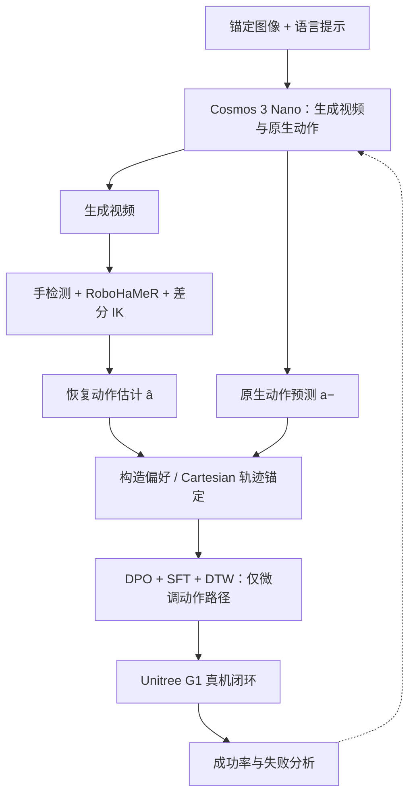
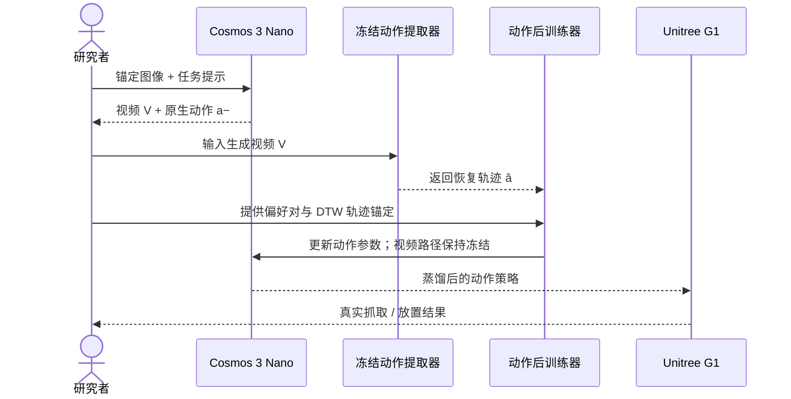

# AutodidactWAM：从生成视频到机器人动作的跨模态自蒸馏

**AutodidactWAM**（*AutodidactWAM: Cross-Modal Self-Distillation from Generated Video to Robot Actions*，arXiv:2610.08119，2026-10-06）由 **Skolkovo Institute of Science and Technology（Skoltech）** 与 **MWS R&D Center** 提出。它针对 world-action model 的一个关键断层：模型生成的视频在视觉上合理，但同一模型预测的机器人动作并不一定可执行。方法从模型自生成的视频恢复手部动作伪标签，再只对动作路径做偏好 / 轨迹后训练。

## 一句话定义

**把生成视频变成动作侧的自监督信号：冻结视频生成路径，用视觉手姿重建与差分 IK 从视频提取候选动作，再以 DPO、SFT 和 DTW 轨迹锚定校正原生动作分支。**

## 基本信息

| 项目 | 内容 |
|---|---|
| 作者 | Sergei Kurchev、Iaroslav Kolomiets、Miguel Altamirano Cabrera、Artem Lykov、Dzmitry Tsetserukou |
| 机构 | Skolkovo Institute of Science and Technology（Skoltech）；MWS R&D Center |
| 发布 | arXiv 预印本 v1，2026-10-06；论文注明投稿 ICRA 2027，不代表已接收 |
| 平台 | Cosmos 3 Nano → Unitree G1 + BrainCo 五指手（实验中使用右臂 / 手） |
| 任务 | 桌面 Oreo 包装拾取并放入托盘；粉色玩具、蓝球作 held-out 物体 |
| 项目页 / 代码 | arXiv 记录未列官方项目页或代码仓库链接 |
| 主要结果 | 混合 DPO+SFT+DTW 策略：Oreo 完整任务约 20%；held-out 粉色玩具 30%、蓝球 10%（每条件 N=20） |

## 为什么重要

- **揭示 WAM 的模态落差：** 联合生成视频和动作不保证两者一致。论文摘要报告预训练原生动作约 17% pre-grasp、10% grasp、7% 完整任务的汇总口径；按真机表格的 Oreo 单对象结果则为 20% / 10% / 0%，说明仅看生成视频会高估可执行性。
- **把模型自身视频变成监督：** 冻结手部检测、RoboHaMeR 与差分 IK 从视频估计动作，构造偏好对，而非为每个新任务重新采集一批动作演示。
- **动作 / 视频分路更新：** 视频路径 teacher-forced 并冻结，只更新动作侧张量与 LoRA，降低后训练破坏视频能力的风险。
- **结果需谨慎读：** 抽取器重放比学习策略更成功；它是伪标签上限参照，不是训练后的 WAM。混合方法对 Oreo 完整任务为 20%，而单独 Flow-DPO 为 0%。
- **不等于零遥操作：** 初始 G1 embodiment adaptation 使用混合遥操作语料；作者主张无新增 task-specific teleoperation 的是后续自蒸馏阶段。

## 方法与数据流

1. **先做 embodiment adaptation。** 将 Cosmos 3 Nano 以 LoRA 适配 Unitree G1 和 BrainCo 五指手。此阶段使用作者的混合 G1 teleoperation 数据。
2. **合成目标交互。** 用少量桌面锚定帧、Oreo 产品图像、随机摆放和语言提示，生成视频及其原生动作预测。作者描述约十张 G1 手桌面锚帧和约十张 Oreo 包装图像。
3. **从视频恢复动作。** 冻结的手检测器与 RoboHaMeR 估计手部姿态，再由差分 IK 映射为 G1 手臂 / 手部动作。恢复轨迹记作动作估计，而非 ground-truth。
4. **组建偏好与监督。** 将提取轨迹作为优选动作、原生动作作为较差候选；比较 SFT 重标注和 Diffusion-DPO，并用 DTW 对 Cartesian 轨迹作锚定。
5. **只调动作路径。** 视频路径 teacher-forced / 冻结，后训练聚焦动作相关参数。以真机 pre-grasp、grasp、完整拾取放置评价最终策略。

动作提取器用约 30k 合成渲染样本训练；论文称蒸馏目标构造不依赖 teleoperation ground-truth 标签。这里的“无演示”仅指任务特定自蒸馏数据阶段，不包括前置 embodiment adaptation。

### 方法流程图

### 自蒸馏训练时序

## 真机结果

每个对象 / 条件 N=20，比例以 5 个百分点为步长。完整表格和口径见[来源归档](../../sources/papers/autodidactwam_arxiv_2610_08119.md)。

| 方法 | Oreo：pre-grasp / grasp / 完整任务 | 粉色玩具：完整任务 | 蓝球：完整任务 |
|---|---:|---:|---:|
| 预训练原生动作 | 20% / 10% / 0% | 10% | 10% |
| 提取动作重放（不是学习策略） | 95% / 80% / 75% | 30% | 20% |
| SFT | 70% / 15% / 10% | 20% | 10% |
| Flow-DPO | 0% / 0% / 0% | 0% | 0% |
| DPO + SFT + DTW | 90% / 30% / 20% | 30% | 10% |

这组数据支持的结论是“视频动作自蒸馏值得进一步验证”，而不是“已实现通用 humanoid 操纵”。held-out 物体共享相近的桌面抓放任务，蓝球表现也显示迁移并不稳定。

## 解读与局限

- **伪标签不是独立真值。** 候选动作由同一模型生成的视频经过手部检测、姿态估计和 IK 得来；生成伪影或估计器的系统误差会直接塑造优化目标。
- **离线偏好分数不等于真机能力。** Flow-DPO 虽能得到很高的离线偏好验证准确率，单独部署的闭环完整任务成功率仍为 0%；应优先看真机闭环指标。
- **样本规模小。** 每对象 / 条件 N=20，单次变化即 5 个百分点；置信区间与多次独立训练结果不足以支持强泛化结论。
- **评测范围窄。** 单任务、单一 G1 右臂 / 手配置、一个训练对象；跨任务、跨 embodiment 与更广物体族尚未验证。
- **工程前提不可忽略。** 初始 embodiment adaptation 使用遥操作数据；节省的是后续任务专属采集，而非所有人类数据。
- **开源状态：** 论文记录未附项目页或代码链接，复现以论文所述配置为限。

## 关联页面

- [Cosmos 3](./cosmos-3.md) — 视频与动作生成骨干
- [World Action Models](../concepts/world-action-models.md) — WAM 的联合世界预测与动作控制背景
- [Manipulation](../tasks/manipulation.md) — 真机桌面交互任务
- [Sim2Real](../concepts/sim2real.md) — 闭环真实机器人验证
- [来源归档](../../sources/papers/autodidactwam_arxiv_2610_08119.md) — 论文细节、指标与方法记录

## 推荐继续阅读

- [arXiv:2610.08119](https://arxiv.org/abs/2610.08119) — 原论文、附录与局限讨论
- [Cosmos 3](./cosmos-3.md) — 论文采用的生成模型平台
- [World Action Models](../concepts/world-action-models.md) — world model 与 action model 的组合范式
