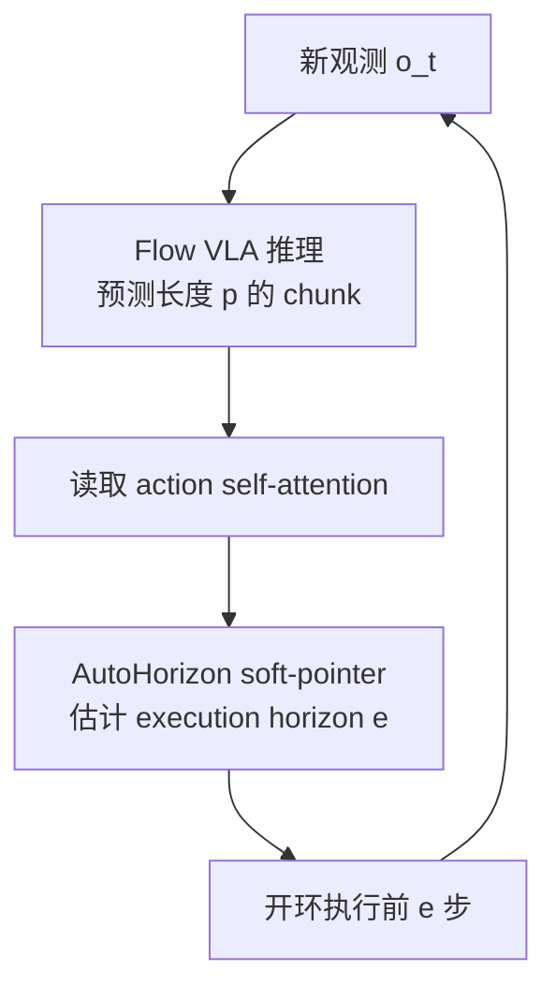
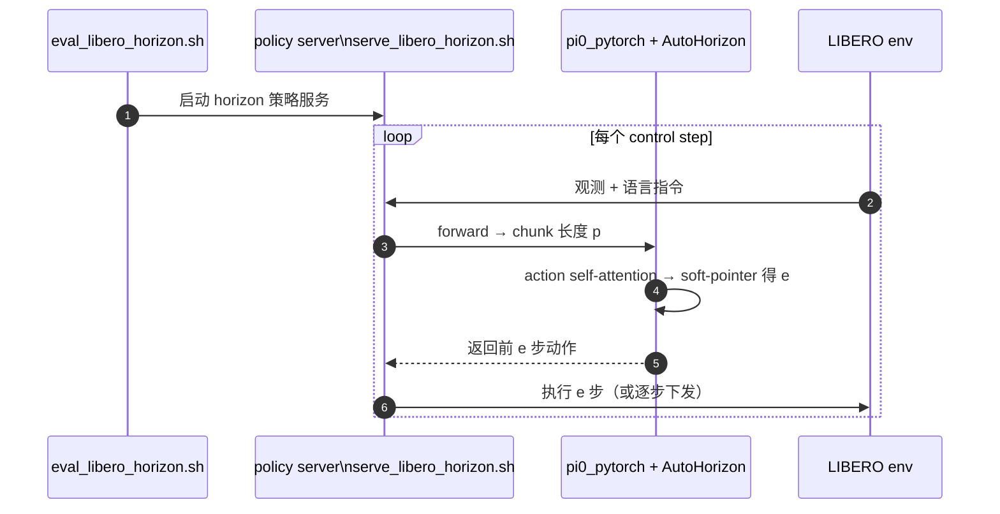

# AutoHorizon（VLA Knows Its Limits · arXiv:2602.21445）

**VLA Knows Its Limits: Adaptive Execution Horizons for Robot Policies**（[arXiv:2602.21445](https://arxiv.org/abs/2602.21445)，[项目页](https://hatchetproject.github.io/autohorizon/)，ECCV 2026）由 **伊利诺伊大学芝加哥分校（UIC）** 与 **思科研究（Cisco Research）** 提出 **AutoHorizon**：首个在 **test-time** 为每个 predicted action chunk **动态估计 execution horizon** 的方法，面向 **flow-based VLA**，几乎不增加推理开销。

## 一句话定义

**别用固定 \(e/p\) 开环播放 chunk**——读 action self-attention 当「模型还能信多远」的仪表，稳定段拉长 horizon 提速，接触段缩短 horizon 换反应性。

## 英文缩写速查

| 缩写 | 英文全称 | 简要说明 |
|------|----------|----------|
| VLA | Vision-Language-Action | 视觉–语言–动作策略 |
| FM | Flow Matching | π0.5 等 flow-based 动作头 |
| \(p\) | Prediction Horizon | 单次推理预测的 chunk 长度 |
| \(e\) | Execution Horizon | 两次重规划之间实际执行的步数 |
| RH | Receding Horizon | 滚动执行：只跑 chunk 前缀再 replan |
| LIBERO | Lifelong Benchmark for Robot Learning | 仿真 manipulation 基准套件 |

## 为什么重要

- **execution horizon 长期被默认化：** [Action Chunking](../methods/action-chunking.md) 与 [滚动预测执行](../concepts/receding-horizon-policy-execution.md) 都强调 \(T_e \le T_p\)，但 flow VLA 部署里常 **固定比例**（如 \(e{=}0.8p\)）——本文证明 **同一 \(p\) 下最优 \(e/p\) 随任务与子集变化**，固定值系统性地次优。
- **与「长 open-loop 为何存在」互补：** [Revisiting Open-Loop](../entities/paper-revisiting-open-loop-action-chunking.md) 从 **观测上下文长度** 解释 reactive vs open-loop；AutoHorizon 从 **模型内部 attention 结构** 在 **不改权重** 的前提下调 \(e\)——二者可叠加讨论。
- **区别于 human-in-loop：** [AutoIntervene](../entities/paper-autointervene.md) 在 **部署环** 用记忆分数 **切换操作员**；AutoHorizon **无额外传感器/人**，只改 replanning 策略。
- **工程落地轻：** 官方实现挂在 [OpenPI](https://github.com/Physical-Intelligence/openpi) π0.5 PyTorch 端口上，**Apache-2.0** 已发布；适合作为 VLA 真机 **replan 调度层** 的首个 attention-native baseline。

## 核心信息

| 项 | 内容 |
|----|------|
| **机构** | 伊利诺伊大学芝加哥分校（UIC）；思科研究（Cisco Research） |
| **发表** | ECCV 2026（arXiv v2，2026-06-20） |
| **arXiv** | [2602.21445](https://arxiv.org/abs/2602.21445) |
| **项目页** | <https://hatchetproject.github.io/autohorizon/> |
| **代码** | [hatchetProject/AutoHorizon](https://github.com/hatchetProject/AutoHorizon)（Apache-2.0） |
| **权重** | 无专用 HF；评测用 OpenPI **`pi05_libero`**（`gs://openpi-assets/checkpoints/pi05_libero`） |
| **开源** | **已开源**（方法 + LIBERO 评测）；VLA checkpoint **外部下载** |
| **主 backbone** | [π0.5](./paper-pi05-open-world-vla.md)（flow matching VLA） |

## 核心原理

### Attention 诊断（为何 horizon 要变）

1. **Chunk 内 VL 注意力近乎不变：** intra-chunk 各 action 对 vision–language token 的 cross-attention 权重 **跨步相似**，环境变化时 **中间步难以「重看」场景** → 开环过长会过期。
2. **首尾 anchor：** self-attention 显示 **chunk 首、尾 action token** 为稳定中心，中间动作围绕其组织 → attention 分布形状可反映 **「模型对后续步置信/耦合」**。
3. **AutoHorizon（Elastic）：** 将 **action self-attention** 作 predictive limit 的 proxy，经 **soft-pointer**（`pick_horizon_softpointer` / `bidir_soft_pointer`）输出本 chunk 的 \(e\)。

### Replanning 策略对照（仓库 CLI）

| 策略 | Flag | 机制 |
|------|------|------|
| **AutoHorizon** | `--elastic` | attention soft-pointer 动态 \(e\) |
| Fixed | `--replan_steps N` | 固定执行 \(N\) 步后 replan |
| Random | `--random` | chunk 内随机 \(e\) |
| Action trigger | `--action_trigger` | 连续 action delta 超阈 replan |
| Uncertainty | `--uncertainty` | 多样本 per-step std 超阈 replan |

### 流程总览

## 源码运行时序图

对齐 [AutoHorizon README](https://github.com/hatchetProject/AutoHorizon) 的 `serve_libero_horizon.sh` + `eval_libero_horizon.sh` + `--elastic` 路径：

图下说明：真机/其他 benchmark 复用同一 **「推理 chunk → attention 估 e → 前缀执行 → replan」** 环；超参 `attn_step_count`、`hold_thr`、`max_entropy_q` 在 `pi0_pytorch.py` 调。

## 实验与评测

### LIBERO（π0.5，项目页表）

| 设置 | 要点 |
|------|------|
| \(p{=}10\) | AutoHorizon **91.6% LIB-10** 等，**≥** 最优固定 \(e/p\) oracle |
| \(p{=}50\) | 固定 \(e{=}p\) 崩至 **~68–74% LIB-10**；AutoHorizon **92.1% LIB-10**，接近 **Static Oracle+**（任务调参上界） |
| 开销 | 论文强调 **negligible** 额外计算（仅读已有 attention） |

### RoboTwin（π0.5）

- 七任务（Adjust Bottle、Pick Bottles、Stack Bowls 等）：AutoHorizon **100% Adjust Bottle** 等，整体 **接近或超过** per-task static oracle。

### 真机（项目页视频）

- 抓取/放置等 **接触-rich** 阶段 estimated horizon **缩短**；reach/transport **拉长**——与 attention 叙事一致。

## 与其他工作对比

| 维度 | AutoHorizon | 邻近读法 |
|------|-------------|----------|
| **调什么** | 每 chunk 的 \(e\) | [Revisiting Open-Loop](./paper-revisiting-open-loop-action-chunking.md) 调 **context 长度** 与 encoder |
| **何时生效** | **Test-time**，不改权重 | [Why Action Chunking](./paper-why-action-chunking-improves-bc.md) 的 Delay/RDE 是 **部署技巧** |
| **人机** | 无 | [AutoIntervene](./paper-autointervene.md) **在线切换操作员** |
| **Backbone** | Flow VLA（π0.5） | [VLA 方法页](../methods/vla.md) 中 async chunk / 低层控制器融合 |

## 局限与风险

- **Flow VLA 专用叙事：** attention 结构分析针对 **flow-based** 架构；离散 FAST / 纯 diffusion head 是否同构需单独验证。
- **权重链：** 复现依赖 **OpenPI checkpoint 转换 + transformers patch**，环境摩擦高于「单 pip 权重」。
- **Oracle+ 仍略高：** LIBERO 上 Static Oracle+（per-task 调 \(e/p\)）在部分列仍是最强 **上界**；AutoHorizon 价值在 **免 per-task 网格搜索**。
- **无官方 HF：** 与 OpenPI 分发一致，企业内网部署需自建 artifact 镜像。

## 结论

**AutoHorizon 把 execution horizon 从静态超参变成 test-time 可读 attention 信号，在 π0.5 上用极小开销逼近 per-task oracle，是 flow VLA 部署 replan 层的直接可用模块。**

1. **先诊断再调参：** 若固定 \(e/p\) 在 LIBERO 子集上「先升后降」，优先试 **Elastic** 而非盲扫 replan 步数。
2. **开源路径：** clone [AutoHorizon](https://github.com/hatchetProject/AutoHorizon) → OpenPI checkpoint 转 PyTorch → `serve_libero_horizon.sh` + `eval_libero_horizon.sh --elastic`。
3. **与上下文加长互补：** 长 \(T_o\) reactive 策略（Revisiting Open-Loop）与 AutoHorizon **正交**——前者改模型输入，后者改执行协议。
4. **接触段缩短是特征不是 bug：** 真机视频里交互段小 \(e\) 对应 **提高 replan 频率**，勿与「策略变弱」混淆。
5. **超参默认可用：** README 称默认 `attn_step_count` / `hold_thr` / `max_entropy_q` 通常足够；极致性能再调 soft-pointer 变体。
6. **权重预期：** 无 AutoHorizon 专用 HF；计划部署时一并缓存 **pi05_libero**。
7. **跟进：** 关注是否扩展至 π0.7 / 其他 flow VLA 与 RoboTwin 以外真机栈。

## 关联页面

- [滚动预测执行](../concepts/receding-horizon-policy-execution.md)
- [Action Chunking](../methods/action-chunking.md)
- [VLA](../methods/vla.md)
- [π0.5](./paper-pi05-open-world-vla.md)
- [LIBERO](./libero-benchmark.md)
- [VLA 部署指南](../queries/vla-deployment-guide.md)

## 参考来源

- [autohorizon_arxiv_2602_21445.md](../../sources/papers/autohorizon_arxiv_2602_21445.md)
- [autohorizon-project.md](../../sources/sites/autohorizon-project.md)
- [autohorizon.md](../../sources/repos/autohorizon.md)
- [arXiv:2602.21445](https://arxiv.org/abs/2602.21445)

## 推荐继续阅读

- [AutoHorizon 项目页](https://hatchetproject.github.io/autohorizon/)
- [Physical Intelligence openpi](https://github.com/Physical-Intelligence/openpi)
- [Revisiting Open-Loop Execution 项目页](https://revisiting-open-loop-action-chunking.github.io/)
