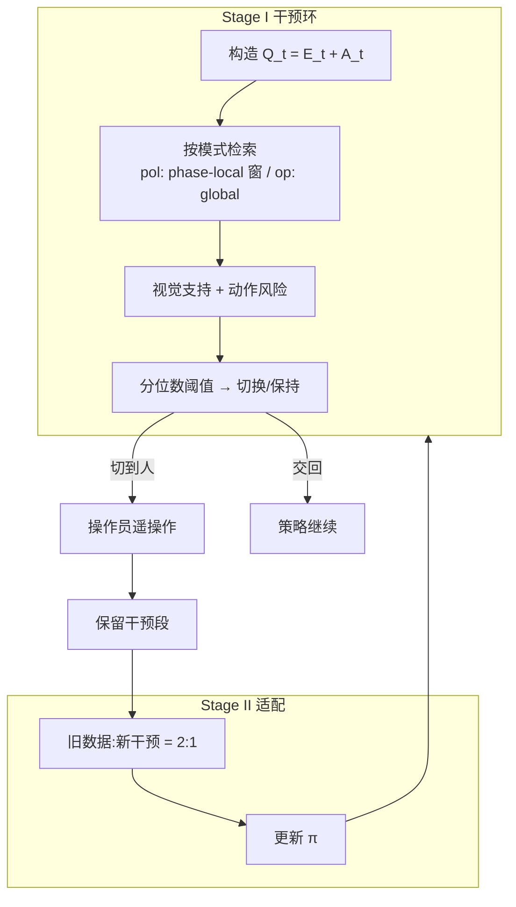

# AutoIntervene（Action Chunk 自动接管）

**AutoIntervene**（*Calibrated Intervention for Action-Chunking Imitation Learning Policies*，[arXiv:2608.07065](https://arxiv.org/abs/2608.07065)，[项目页](https://aus.bot/AutoIntervene/)）来自 **悉尼大学（The University of Sydney）** / **PAIR Lab** 与 **范德堡大学（Vanderbilt University）**：为 **action-chunking** 视觉运动策略提供 **在线、双向、分位数校准** 的人机控制权切换，并把干预片段变成下一轮针对性监督。

## 一句话定义

**别等 chunk 策略「平滑地做错」**——用成功轨迹的视觉–动作记忆打支持分，该接手时切操作员，恢复后再交回策略，只把关键失败段写进下一轮数据。

## 英文缩写速查

| 缩写 | 英文全称 | 简要说明 |
|------|----------|----------|
| AC | Action Chunking | 一次预测多步动作序列的策略族 |
| ACT | Action Chunking with Transformers | 本文主评测动作头之一 |
| DP | Diffusion Policy | 兼容的另一动作头 |
| FM | Flow Matching | 兼容的连续时间动作头 |
| DAgger | Dataset Aggregation | 在学习者状态上聚合专家标注的交互模仿范式 |
| HG-DAgger | Human-Gated DAgger | 由人决定何时接管的交互协议（本文对照叙事） |

## 为什么重要

- **对准 chunk 特有失败模式：** 分布外时仍输出平滑、时间一致但任务上错误的动作块——单靠轨迹平滑检测不够。
- **双向切换，而不只「喊救命」：** phase-local 支持管切入；global 支持管交回，允许恢复后从任意合法相位继续自治。
- **阈值可校准：** 用 held-out 成功专家演示估分位数，避免每任务手调 score cutoff。
- **数据更省：** 相对人工全程盯梢或追加全长演示，针对性干预用更少操作员时间换更高后适配成功率。
- **同实验室互补：** [NestDex](./paper-nestdex.md) 把 copilot 放在**采数环**（人控臂 + clutch，部署卸内层）；本文把监控放在**已训 chunk 策略的部署环**。

## 核心信息

| 字段 | 内容 |
|------|------|
| 机构 | 悉尼大学（The University of Sydney）/ Australian Center For Robotics / PAIR Lab；范德堡大学（Vanderbilt University） |
| 发表 | arXiv preprint（2026-08） |
| arXiv | [2608.07065](https://arxiv.org/abs/2608.07065) |
| 项目页 | <https://aus.bot/AutoIntervene/>；研究站 <https://aus.bot/research/autointervene/> |
| 代码 | **确认未开源**（截至 2026-08-11；静态页仓非训练栈） |
| 平台 | ALOHA 式双臂 leader–follower + TriPilot-FF 力反馈 |
| 监控输入 | 多相机 embedding（DINOv3 ConvNeXt-Base）+ 提议 chunk 前缀 |
| 主要基线 | Human intervention、Additional Full Data、LazyDAgger、RND-DAgger |

## 核心原理

### 输入 / 输出

| 侧 | 内容 |
|------|------|
| 策略输入 | 多相机图像 → embedding \(E_t\)；动作头出 chunk，取前 \(H_r\) 步为 \(A_t\) |
| 查询 | \(\mathcal{Q}_t=(E_t,A_t)\) |
| 记忆 | 当前策略训练轨迹展开的 visual-action entries |
| 分数 | 视觉支持 \(s\)（跨视角最小余弦）；动作风险 \(\bar r\)（按臂分组、滑动平均） |
| 输出 | 控制权 \(\beta\in\{\mathrm{pol},\mathrm{op}\}\)；保留的干预片段 |

### 流程总览

### 关键机制（压缩）

1. **联合查视觉与动作：** 相似画面可能对应不同相位动作；只比图像会错配。
2. **模式相关检索：** 策略控制时用前向相位窗防跨阶段误匹配；人控时用全库，便于恢复后从新相位交回。
3. **校准而非手调：** 每轮适配前在 \(\mathcal{D}_{\mathrm{cal}}\) 上重算 pol/op 两套 \((s,r)\) 阈值（文中 α 示例：pol 0.05 / op 0.30）。
4. **选择性 DAgger：** 只在「不支持」区间要人；成功 rollout 的恢复段进入下一轮，而不是全程专家标注。

## 源码运行时序图

**不适用**：截至 **2026-08-11**，[aus.bot/AutoIntervene](https://aus.bot/AutoIntervene/) 与研究站均无训练/推理入口；GitHub `123qwedsa123/AutoIntervene` 仅为项目页静态镜像。代码公开后再补本图。

## 工程实践

| 项 | 建议 / 论文设定 |
|----|----------------|
| 硬件接口 | Leader/Follower 对齐；策略控时双臂跟策略，接管时切跟踪 leader |
| Chunk / 监控频率 | \(H=100\)；策略执行 30 Hz，监控 5 Hz；人控监控 30 Hz |
| 检索超参 | \(J=K=16\)，\(B=H_r=40\)，\(M=3\)，\(W=5\)，\(U_{\mathrm{win}}=6\) |
| 切换迟滞 | 双向均需连续 \(L=2\) 次决策 |
| 混样 | 累积旧数据 : 本轮干预 = 2:1（\(\lambda_{\mathrm{mix}}=2/3\)） |
| 复现现状 | **未开源**；见 [项目页归档](../../sources/sites/aus-bot-autointervene.md) |

## 实验与评测

| 设置 | 结果要点（项目页表 / 论文） |
|------|---------------------------|
| 主七任务 Initial | 平均成功率 **30.9%**（演示时间 avg 977 s） |
| Human R2 | **68.6%**，操作员 Δt avg **179.9 s** |
| AutoIntervene R2 | **80.0%**，Δt avg **122.9 s** |
| Additional Full Data | **56.0%**（更多全长演示，仍低于 AutoIntervene R2） |
| 长程 R3 | Two-Towel Box Packing 28%→**88%**；Towels-and-Cable 8%→**48%** |
| 动作头 | ACT / DP / FM 三轮适配均可抬升（Two-Towel 上 ACT R3 88%） |
| Handoff 对照 | AutoIntervene cut-in/out 召回与精度均为 1.0、虚警 0；LazyDAgger/RND-DAgger 虚警高且难交回 |

## 结论

**对 action-chunking 部署，可靠度提升往往来自「知道何时不该信这块动作」以及「把恢复段变成下一轮数据」，而不是再堆同等时长的全演示。**

1. **先看成功率 vs 操作员时间** — 本文主故事是更高成功、更少盯梢；全数据对照说明「多录」不等于「录对地方」。
2. **双向切换是产品能力** — 只会切入不会交回，现场仍要人盯。
3. **校准流程可迁移** — 分位数阈值比每任务拍脑袋更工程化。
4. **监控层尽量与动作头解耦** — ACT/DP/FM 结果支持「先上监控、再换生成头」。
5. **消融提醒** — 去掉视觉支持或动作风险会破坏切入/交回；两者都要。
6. **选型边界** — 相对 [ROVE](./paper-rove-humanoid-vla-intervention.md)（人形全身 MoCap 干预噪声）与经典 HG-DAgger，本文专攻 **双臂桌面 chunk 策略的检索式支持监控**；代码未开前只作协议对照。

## 局限与风险

- **确认未开源：** 无法复现检索索引、标定脚本与真机栈。
- **记忆依赖训练分布：** 支持库来自当前策略数据；策略分布大变需重建 memory 与阈值。
- **相位窗启发式：** 依赖任务局部连续前进；强回溯/可逆步骤可能误匹配。
- **真机九任务仍属实验室桌面：** 不自动外推到移动操作或全身人形。
- **误区：** 把 AutoIntervene 当成「无需人」的完全自治，或当成已发布监控中间件。

## 与其他工作对比

| 路线 | 触发信号 | 交回策略 | 开源/复现 |
|------|----------|----------|-----------|
| HG-DAgger / 人工盯梢 | 人眼 | 人决定 | 协议级 |
| LazyDAgger | 策略–专家动作差 | 弱/难交回（本文表） | 视实现 |
| RND-DAgger | 状态新颖度 | 易虚警 | 视实现 |
| FAIL-Detect / Sentinel 等 | 不确定性或 VLM 进度 | 多为检测/暂停 | 视工作 |
| **AutoIntervene（本文）** | **视觉支持 + 动作风险（检索）** | **global 支持交回** | **未开源**；有项目页视频 |
| ROVE | 全身干预价值提取 | 三阶段标注 | 见 [ROVE](./paper-rove-humanoid-vla-intervention.md) |

## 关联页面

- [Action Chunking](../methods/action-chunking.md) — chunk 机制与部署
- [DAgger](../methods/dagger.md) — 交互模仿总览
- [Imitation Learning](../methods/imitation-learning.md) — 模仿学习坐标
- [VLA](../methods/vla.md) — 后训练与干预飞轮
- [双臂操作](../tasks/bimanual-manipulation.md) — 任务页
- [Why Action Chunking Improves BC](./paper-why-action-chunking-improves-bc.md) — chunk 收益机制对照
- [ROVE](./paper-rove-humanoid-vla-intervention.md) — 人形干预对照
- [NestDex](./paper-nestdex.md) — 同实验室：采数期手技能 copilot（arXiv:2608.13362）
- [VLA 真机部署指南](../queries/vla-deployment-guide.md) — 部署期监控入口

## 参考来源

- [AutoIntervene 论文摘录（arXiv:2608.07065）](../../sources/papers/autointervene_arxiv_2608_07065.md)
- [项目页归档](../../sources/sites/aus-bot-autointervene.md)

## 推荐继续阅读

- Tang & Zhi, *AutoIntervene* — [arXiv:2608.07065](https://arxiv.org/abs/2608.07065)
- [项目页](https://aus.bot/AutoIntervene/)
- [PAIR Lab 研究站条目](https://aus.bot/research/autointervene/)
- Zhao et al., *Learning Fine-Grained Bimanual Manipulation with Low-Cost Hardware*（ACT / ALOHA）
