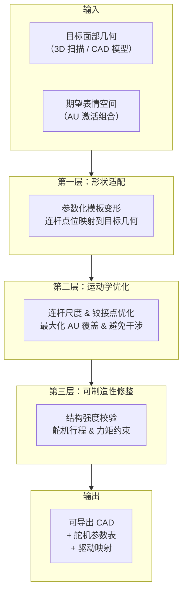
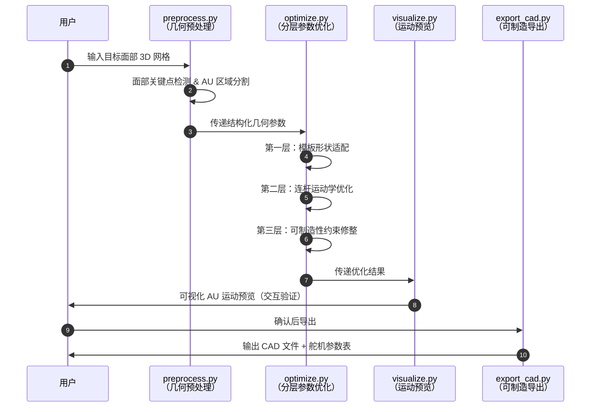

# 自动化面部机构合成（Automated Synthesis of Facial Mechanisms for Conversational Animatronic Robots）

**Automated Synthesis of Facial Mechanisms**（*Automated Synthesis of Facial Mechanisms for Conversational Animatronic Robots*，[arXiv:2607.11688](https://arxiv.org/abs/2607.11688)，清华 AIR / BAAI / IIIS / BUAA，[项目页](https://zzongzheng0918.github.io/automated-facial-mechanisms-synthesis/)，[代码](https://github.com/ZZongzheng0918/automated-facial-mechanisms-synthesis)，**RSS 2026 Finalist**）提出一套 **参数化连杆驱动机械面部模板** + **分层自动合成流水线**，能够针对任意给定的面部几何（人物肖像或角色造型）自动生成具有表情运动能力的可制造机构方案，服务于会话型 Animatronic 机器人的快速定制化部署。

## 一句话定义

**给定目标面部几何，自动输出可制造的连杆机构——参数化模板驱动分层优化，从单一框架跨越多样化人脸与角色造型。**

## 英文缩写速查

| 缩写 | 英文全称 | 简要说明 |
|------|----------|----------|
| AU | Action Unit | FACS 表情动作单元；面部表情的运动学分解基元 |
| DOF | Degree of Freedom | 自由度；机构单个可控运动轴数 |
| BAAI | Beijing Academy of Artificial Intelligence | 北京智源人工智能研究院；联合机构之一 |
| BUAA | Beihang University | 北京航空航天大学；联合机构之一 |
| AIR | Artificial Intelligence Research Institute | 清华大学人工智能研究院 |
| RSS | Robotics: Science and Systems | 本文投稿顶会；2026 年度 Finalist |

## 为什么重要

- **会话型机器人的工程瓶颈：** 制造能表达情感与说话状态的 Animatronic 面部机构目前极度依赖经验工匠手工定制，每款新面部设计需重新从零布局拉杆、铰链与舵机——研发周期长、成本高、难以复用。
- **参数化模板的系统化突破：** 本工作首次提出 **跨几何形状通用的连杆驱动面部模板**，将面部机构设计问题转化为结构化的参数优化，使设计过程可自动化、可批量化。
- **从数字到实物的闭环：** 流水线输出可直接送制造（3D 打印 + 舵机），项目页展示多款真实制作并可驱动的 Animatronic 头部，验证了系统端到端可行性。
- **RSS 2026 Finalist：** 在机器人顶会 RSS 2026 入围最终评审，代表方向在机构设计自动化与社会化机器人的交叉点上的前沿价值。

## 核心原理

### 参数化连杆面部模板

系统以 **连杆机构（linkage mechanism）** 为基本执行单元驱动面部皮肤/结构形变：

- 将人脸关键运动区域（眉毛、眼睑、颧骨、嘴角等）映射为 **FACS 动作单元（AU）** 组合。
- 设计一套 **参数化骨架模板**：通过调节连杆长度、铰接点位置、舵机安装座参数，适配不同面部宽高比与曲率。
- 每个 AU 由一个或多个连杆子机构独立或协同驱动，各子机构参数通过分层优化确定。

### 分层自动合成流水线

### 关键设计约束

| 约束类型 | 说明 |
|---------|------|
| 运动覆盖 | 所有目标 AU 在设计参数下可达且位移量足够 |
| 干涉回避 | 相邻连杆在全行程内无碰撞 |
| 舵机规格 | 行程角、峰值力矩与安装尺寸满足选型约束 |
| 皮肤兼容 | 驱动点位移与皮肤/外壳材料形变范围相容 |

## 工程实践

### 源码开放状态

项目主页与 GitHub（[ZZongzheng0918/automated-facial-mechanisms-synthesis](https://github.com/ZZongzheng0918/automated-facial-mechanisms-synthesis)）已**公开发布**代码，涵盖模板定义、参数优化脚本与示例几何。

### 源码运行时序图

关键复现路径：按照 README 准备目标几何 → `preprocess.py` → `optimize.py` → `visualize.py` 验证 → `export_cad.py` 导出，完整流程约数分钟内完成单套面部设计。

### 制造与硬件

- **材料：** 3D 打印（PLA/TPU 混合）机构骨架 + 硅胶/乳胶皮肤
- **执行器：** 标准舵机（如 Dynamixel MX/XL 系列）
- **验证平台：** 论文展示多个不同面部造型的 Animatronic 头部原型，能完成说话、微笑、皱眉等表情序列

## 局限与风险

- **皮肤-机构耦合建模简化：** 当前优化假设皮肤弹性均匀，真实硅胶皮肤的非线性形变可能导致部分 AU 位移与预测偏差，需后期手工微调。
- **AU 独立性假设：** 分层优化中各 AU 子机构相互独立建模，复杂联合表情（AU 组合）下可能出现意料外的机构干涉。
- **几何输入质量依赖：** 目标面部几何若含大量噪声或缺失区域（如低质 3D 扫描），形状适配层效果下降。
- **舵机数量上限：** 现有模板针对典型头部舵机布局（~10–16 路），超大自由度需求仍需手工扩展模板。
- **社会化机器人交互局限：** Animatronic 面部能传达表情，但与 LLM 对话驱动的实时表情映射（AU 时序生成）不在本文范围内，需外部接口。

## 关联页面

- [Manipulation（操作任务）](../tasks/manipulation.md) — 机构设计与运动控制的工程基础
- [MIDAS Hand（软体手部）](../entities/midas-hand.md) — 同类软/仿生机构的代表性工作

## 参考来源

- [量子位：RSS 2026 三项最佳论文报道](../../sources/blogs/wechat_qbitai_rss2026_awards_2026-07-16.md)
- [Automated Facial Mechanisms 论文摘录（arXiv:2607.11688）](../../sources/papers/automated_facial_mechanisms_rss2026.md)
- [项目页归档](../../sources/sites/automated-facial-mechanisms-github-io.md)
- [代码仓库索引](../../sources/repos/automated-facial-mechanisms-synthesis.md)

## 推荐继续阅读

- [arXiv:2607.11688](https://arxiv.org/abs/2607.11688) — 原始论文（PDF + HTML）
- [项目页与演示视频](https://zzongzheng0918.github.io/automated-facial-mechanisms-synthesis/) — 多款原型的真机表情演示
- [代码仓库](https://github.com/ZZongzheng0918/automated-facial-mechanisms-synthesis) — 参数化模板与优化脚本
- Deimel & Brock, [*A Novel Type of Compliant, Underactuated Robotic Hand*](../entities/paper-deimel-compliant-underactuated-robotic-hand.md) — 同为少驱多自由度柔顺机构的经典工作
