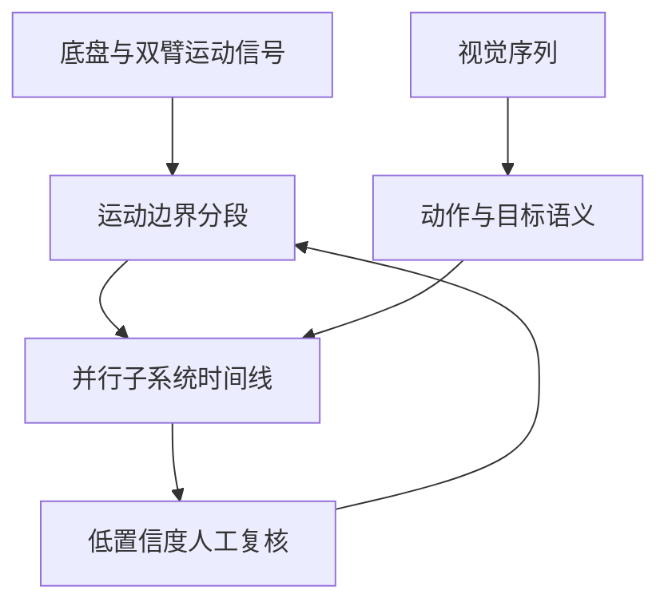

# Automatic Labelling for Bimanual Mobile Manipulation

## 一句话定义

这项工作自动把双臂移动操作示范切成带时间和语义的动作段，**分别保留底盘、左臂、右臂**并行的事件。

## 英文缩写速查

| 缩写 | 英文全称 | 简要说明 |
|------|----------|----------|
| BMM | Bimanual Mobile Manipulation | 底盘与双臂共同执行的任务 |
| VLM | Vision-Language Model | 用视频帧补充动作与目标物体语义 |
| EE | End Effector | 末端轨迹用于运动阶段检测 |

## 为什么重要

移动机器人可能一边靠近目标一边双臂调整。把全部行为压成一条互斥时间线会丢失并行动作和接触信息，损害后续数据检索与监督。

## 流程总览

以下按本页已归纳的机制与资料绘制，表示模块或阅读路径关系。

## 方法

坐标平滑和速度阈值从末端、底盘、躯干、夹爪信号确定候选时段；视觉模型读取对应视频帧，补充动作、物体、接触事件标签。运动信号负责**何时**，视觉负责**做什么**。

## 实验与评测

文章报告 87 段真实示范的聚合字段完全一致率 **87.4%**，人工审核的双臂标签公平率 **78.7%**。这些指标是标注质量，不是机器人策略任务成功率。

## 与其他工作对比

相较 [遥操作](../tasks/teleoperation.md) 中重在“采集动作”的系统，本工作处理采集后的**时序标注**；[双臂操作](../tasks/bimanual-manipulation.md) 是下游任务语境。

## 结论

**双臂移动示范应采用可重叠的多轨时间标签，以运动边界定位时间、以视觉语义补全内容。**

1. 底盘和左右臂分轨标注，避免并行动作被合并。
2. 把接触持续段与小幅调整列为人工复核高风险样本。
3. 标注一致率不能冒充策略学习收益。

## 工程实践

对每个子系统保留开始/结束时间戳、动作词、对象与接触状态；标记低置信度边界供人工复核。本文入口为 [arXiv](https://arxiv.org/abs/2609.24059)，官方代码状态未确认。

## 局限与风险

低速微调、遮挡和持续接触不易由速度阈值切分；视觉模型也可能误认物体和动作。

## 源码运行时序图

**不适用**：未核实官方可运行实现。

## 关联页面

- [双臂操作](../tasks/bimanual-manipulation.md)
- [遥操作](../tasks/teleoperation.md)

## 参考来源

- [Day 1 文章逐篇索引](../../sources/blogs/humanoid_motion_intelligence_day1_data_retargeting_2026_10_02.md)
- [论文](https://arxiv.org/abs/2609.24059)

## 推荐继续阅读

- [Automatic Labelling arXiv](https://arxiv.org/abs/2609.24059)
