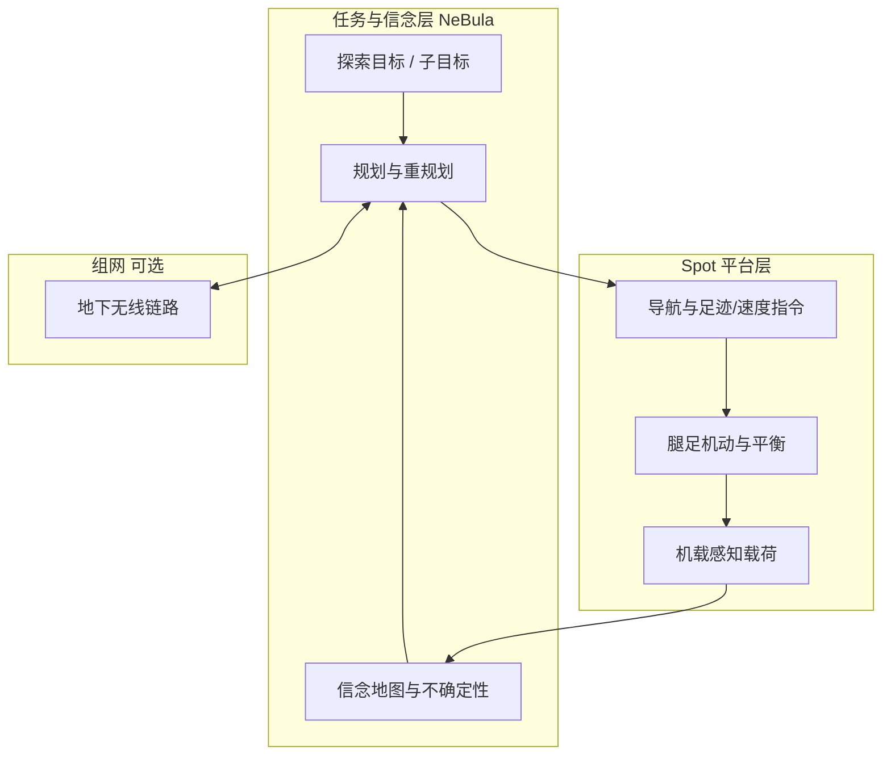

# Autonomous Spot（NeBula 长程探索）

**Autonomous Spot**（arXiv:2010.09259）系统论文描述如何将 **NeBula（Networked Belief-aware Perceptual Autonomy）** 与 **Boston Dynamics Spot** 集成，在 **DARPA Subterranean Challenge** 等 **极端、非结构化地下环境** 中实现 **长距离、长时程自主探索**——把 **足式机动性** 作为感知与决策栈的物理载体，而非仅讨论低层步态。

## 一句话定义

**在 Spot 上叠一层信念感知的网络化自主架构，使四足平台能在未知地下场景中连续探索数小时，而不只依赖出厂巡检脚本。**

## 英文缩写速查

| 缩写 | 英文全称 | 简要说明 |
|------|----------|----------|
| NeBula | Networked Belief-aware Perceptual Autonomy | JPL 团队提出的信念感知自主架构 |
| SubT | DARPA Subterranean Challenge | 美国防部地下环境机器人挑战赛 |
| SLAM | Simultaneous Localization and Mapping | 同步定位与建图 |
| Locomotion | Robot Locomotion | 腿足平台的地形穿越与平衡 |
| Spot | Boston Dynamics Spot | 商业化四足硬件平台 |
| RL | Reinforcement Learning | 强化学习；本文侧重系统级自主而非 RL 低层 |

## 为什么重要

- **平台标杆：** 较早系统论述 **第三方研究栈 × Spot 硬件** 的 **长时自主** 能力，区别于 BD 产品化 **AutoWalk** 的工业巡检叙事。
- **问题层级完整：** 同时覆盖 **mobility、感知、自主、组网**，对理解「四足 + 极端环境任务」的 **系统边界** 有参考价值。
- **与后续 RL 工作互补：** 同平台的 **低层 RL 高性能 locomotion** 见 [Spot RL 分布距离 Sim2Real](./paper-spot-rl-distributional-sim2real.md)；本页侧重 **任务级探索自主**。

## 核心结构

| 模块 | 作用 |
|------|------|
| **Spot 机动层** | 利用四足 **楼梯、碎石、狭窄通道** 等通过性作为探索物理基础 |
| **NeBula 感知—信念** | **Belief-aware** 处理感知不确定性，支撑在 GPS 拒止、低光照地下的决策 |
| **自主规划与任务** | 长程目标分解、回环与探索策略（论文强调 **state-of-practice 推进**） |
| **组网（简述）** | 多机器人/基站 **无线通信** 在地下场景的约束与对策 |
| **实场验证** | 在 **真实物理系统** 与 **相关场景** 中演示，而非纯仿真 |

### 流程总览（系统分层）

## 常见误区或局限

- **误区：「Spot 出厂即具备 SubT 级自主」。** 本文能力来自 **NeBula 研究集成**，非 Spot 默认软件栈。
- **局限：** 论文 **不展开低层力矩控制与专利级轨迹优化**；硬件执行器与在线优化细节见 [BD 足式控制专利栈](./patent-boston-dynamics-legged-control-stack.md)。
- **时效：** 2020 年 arXiv；地下探索自主栈此后仍有大量 SLAM / 语义地图进展，宜作 **历史系统参考** 而非 SOTA 算法目录。

## 关联页面

- [Boston Dynamics](./boston-dynamics.md)
- [四足机器人](./quadruped-robot.md)
- [Locomotion 任务](../tasks/locomotion.md)
- [Spot RL 分布距离 Sim2Real](./paper-spot-rl-distributional-sim2real.md)
- [BD 足式控制专利栈](./patent-boston-dynamics-legged-control-stack.md)

## 参考来源

- [Autonomous Spot 论文摘录（arXiv:2010.09259）](../../sources/papers/autonomous_spot_arxiv_2010_09259.md)

## 推荐继续阅读

- 论文 PDF：<https://arxiv.org/pdf/2010.09259>
- Boston Dynamics Spot 产品文档：<https://www.bostondynamics.com/products/spot>
- DARPA Subterranean Challenge：<https://www.subtchallenge.com/>
