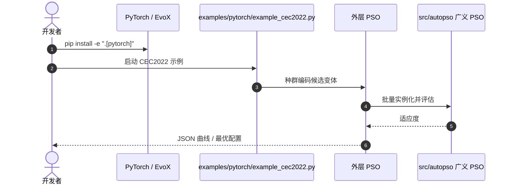

# AutoPSO：PSO 变体不要再手搓

**AutoPSO**（*A Metaframework for Automated Particle Swarm Optimization*；[arXiv:2608.07539](https://arxiv.org/abs/2608.07539)，[代码](https://github.com/EMI-Group/AutoPSO)）由 **南方科技大学 EMI-Group（EvoX）** 提出，IEEE TEVC 接收：把「选惯性、拓扑、更新规则」从论文手工设计改成可搜索的双层过程。

## 一句话定义

**外层搜一套 PSO 组件组合，内层把该变体实例化去解目标任务并回传成绩——优化器本身也被自动设计。**

## 英文缩写速查

| 缩写 | 英文全称 | 简要说明 |
|------|----------|----------|
| PSO | Particle Swarm Optimization | 被自动组装的元启发式 |
| AutoPSO | Automated PSO metaframework | 本文双层框架 |
| EvoX | EvoX | 种群张量化与批量评估后端 |
| CEC | Congress on Evolutionary Computation | 本文主数值基准 CEC2022 |
| GPU | Graphics Processing Unit | 等墙钟复现的硬约束 |

## 为什么重要

- 机器人控制里的优化器也在走自动化设计，不只是策略网络。
- 手工 PSO 变体跨任务差、设计空间大；CPU 实现评几千粒子太慢。
- 官方示例把 CEC2022 跑通，适合先验证双层接口再接到神经进化控制。

## 核心信息

| 项 | 内容 |
|----|------|
| **机构** | 南方科技大学（SUSTech） |
| **期刊** | IEEE TEVC（accepted） |
| **开源** | **已开源**（CEC 示例可运行） |

## 核心原理

### 方法栈

外层粒子编码：共享惯性 `weight`、两套加速系数、四类 exemplar、子群比例。内层广义 PSO 每步把种群切成两策略组，从九候选池（当前位置、pbest、gbest、中心、随机个体等）选 exemplar。EvoX 把内层评估张量化到 GPU。

### 流程总览

## 源码运行时序图

官方仓 [EMI-Group/AutoPSO](https://github.com/EMI-Group/AutoPSO)（归档见 [sources/repos/autopso.md](../../sources/repos/autopso.md)）：

- **最短复现：** GPU 环境确认 `torch.cuda.is_available()` → `python examples/pytorch/example_cec2022.py`。
- **墙钟：** README 默认 10D 60s / 20D 120s；CPU 会显著少迭代。

## 工程实践

| 项 | 建议 |
|----|------|
| 先 GPU | 等墙钟数字不能在 CPU 上对论文 |
| 组件池 | 外层搜索空间可换；先复现默认九 exemplar 池 |
| 机器人控制 | 神经进化任务是加分项，不是 CEC 替代 |

## 实验与评测

CEC2022 对六种经典 PSO，20D 每 run 120s、31 次平均。论文另报神经进化机器人控制上发现更强变体。仓内设置：外层/内层种群各 100，每次外层评估内层 800 iter。

## 与其他工作对比

相对手写 PSO：把设计闭环黑盒化。相对强化学习超参搜索：对象是种群更新规则，不是策略梯度。相对本专辑 [nav-ps-balance](./paper-nav-ps-balance.md)：后者调的是 RL cost 阈值，本页调的是优化器结构。

## 结论

**优化器变体的组合也可以搜索，前提是内层评估能张量化到 GPU。**

1. **双层接口** — 外层编码组件，内层真解任务。
2. **等墙钟** — 比等函数评价次数更接近部署。
3. **CPU 对不上论文** — 复现失败先查后端。
4. **机器人控制是下游** — 先 CEC 跑通再换控制目标。

## 局限与风险

- 无 SPDX 许可证文件，商用需自行确认。
- 组件池仍是作者策展，不是任意 PSO 文献的超集。
- 神经进化控制细节以论文正文为准，示例入口是 CEC。

## 关联页面

- [强化学习](../methods/reinforcement-learning.md)
- [接触–预测–适应 10 篇技术地图](../overview/contact-predict-adapt-10-papers-technology-map.md)
- [接近–安全跟随](./paper-nav-ps-balance.md)

## 参考来源

- [AutoPSO 论文摘录](../../sources/papers/autopso_arxiv_2608_07539.md)
- [官方仓归档](../../sources/repos/autopso.md)
- [具身智能小站 10 篇盘点（2026-08-18）](../../sources/blogs/wechat_embodied_station_contact_predict_adapt_10_papers_2026-08-18.md)

## 推荐继续阅读

- [EMI-Group/AutoPSO](https://github.com/EMI-Group/AutoPSO)
- [EvoX](https://github.com/EMI-Group/EvoX)
