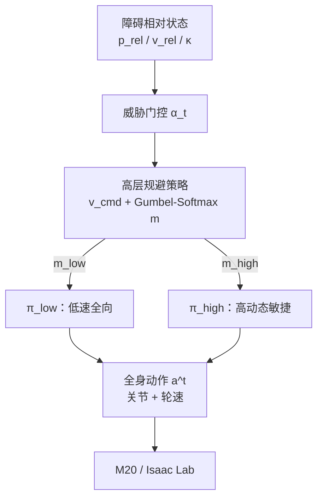

# AWARE：轮足高动态反射式避障

**AWARE**（*Adaptive Wheeled-Legged Avoidance and Reflexive Evasion*，[arXiv:2604.23761](https://arxiv.org/abs/2604.23761)）由 **天津大学（TJU）**、**新加坡国立大学（NUS）**、**北京中关村学院（Zhongguancun Academy）** 与 **云深处科技（Deep Robotics）** 提出：面向 **轮足** 平台在快速动态障碍下的 **反射式规避**，用 **分层强化学习** 解耦「威胁感知 + 速度/模态决策」与「双模态低层 locomotion 专家」，在 Isaac Lab 与 **M20** 真机上涌现前冲、侧闪等混合步态。

## 一句话定义

**把轮足高动态避障拆成「高层威胁路由 + 低层双专家硬切换」——导航级全向滚动/踏步与极限加速反射各用专用策略，避免单一网络在混合形态上模态混淆。**

## 英文缩写速查

| 缩写 | 英文全称 | 简要说明 |
|------|----------|----------|
| AWARE | Adaptive Wheeled-Legged Avoidance and Reflexive Evasion | 本文分层反射式避障框架 |
| RAR | Relative Approaching Rate | 相对距离负时间导数，量化逼近威胁 |
| ASR | Avoidance Success Rate | 无碰撞且不失稳的试验成功率 |
| AMD | Avoidance Maneuver Distance | 规避前后基座位移，衡量空间效率 |
| TEA | Transient Escape Acceleration | 启动窗口内平均逃逸加速度 |
| TNA | Torque-Normalized Acceleration | 相对怠速扭矩归一化的瞬态加速度 |
| PPO | Proximal Policy Optimization | 两阶段训练所用 on-policy 算法 |
| HRL | Hierarchical Reinforcement Learning | 高层决策 / 低层执行分层结构 |
| MPC | Model Predictive Control | 文中 RB-MPC 基线所属范式 |

## 为什么重要

- **轮足避障空白：** 既有敏捷反射（如 REBot）多针对纯足式；轮足还要处理 **非完整滚动约束 + 踏步/滚动切换**，直接移植易失败。
- **双专家硬切换可操作：** 相对 MoE 软混合，用 one-hot 路由 \(\pi_{\mathrm{low}}/\pi_{\mathrm{high}}\)，消融显示 **去双专家** 在极限威胁下最易失衡。
- **行为可解释：** 不靠密集动作启发式，也能涌现 Stepping / Rolling / Hybrid 与 Forward Lunge / Lateral Dodge，并用 t-SNE 验证运动学可分。
- **工程对照点：** 仿真短反应时间 ASR 可很高，真机反射 ASR **≈59%**——读数需同时看 **M20 硬件上限、动捕状态与 sim2real gap**。

## 核心信息

| 项 | 内容 |
|----|------|
| **机构** | 天津大学机械工程学院（TJU）；新加坡国立大学计算学院（NUS）；北京中关村学院（Zhongguancun Academy）；云深处科技（Deep Robotics） |
| **问题设定** | 球形障碍逼近；安全不变集 \(\min_i\mathrm{dist}(\mathcal{B}(q),\mathcal{O}_i)\ge\delta_{\mathrm{safe}}\)；成功 = 无碰撞 + 高机动不失稳 |
| **感知（真机）** | **动捕** 提供机器人与障碍位置/速度（非机载视觉闭环） |
| **平台** | Deep Robotics **M20** 轮足；仿真 **Isaac Lab** |
| **训练** | 两阶段 PPO；低层专家独立预训练 → 冻结后训高层；障碍速度课程 |
| **开源** | **确认未开源**（截至 2026-07-24：无项目页 / GitHub） |

## 核心原理

### 分层自适应避障

1. **威胁门控：** \(\alpha_t=\mathbb{I}(\|v_{\mathrm{rel}}\|>v_{\mathrm{th}}\lor\|p_{\mathrm{rel}}\|<d_{\mathrm{th}})\) 决定是否进入规避策略。
2. **RAR 特征：** \(\kappa=-(p_{\mathrm{rel}}^{\top}v_{\mathrm{rel}})/|p_{\mathrm{rel}}|\)，与 \(p_{\mathrm{rel}}\)、本体 \(x^t\) 一并输入高层。
3. **高层输出：** 连续 \(v_{\mathrm{cmd}}\in\mathbb{R}^3\) + Gumbel-Softmax one-hot \(m=[m_{\mathrm{low}},m_{\mathrm{high}}]^{\top}\)。
4. **低层执行：** \(a^t=m_{\mathrm{low}}\pi_{\mathrm{low}}(v_{\mathrm{cmd}}^{t-4:t},x^t)+m_{\mathrm{high}}\pi_{\mathrm{high}}(\ldots)\)。
   - \(\pi_{\mathrm{low}}\)：低速全向跟踪（导航避让）。
   - \(\pi_{\mathrm{high}}\)：高加速前/侧机动；历史指令支撑急减速时 pitch + 轮阻尼制动。

### 两阶段训练与奖励

| 阶段 | 训什么 | 要点 |
|------|--------|------|
| S1 | \(\pi_{\mathrm{low}}\)、\(\pi_{\mathrm{high}}\) 独立 | 加速度域不同（低速 \(\|a\|\le1.5\)；高速 \(a_x\) 至 5.5 m/s²） |
| S2 | 高层（冻结低层） | 按成功率升高障碍速度；任务成功/碰撞/假阳性 + 跟踪/平滑/能量正则 |

威胁指示 \(\xi=\mathbb{I}(\kappa>\kappa_{\mathrm{th}}\land d_{\min}^{\mathrm{pred}}<d_{\mathrm{safe}})\)：非威胁触发规避则罚 \(\|v_{\mathrm{cmd}}\|^2\)，抑制假阳性。

### 流程总览

## 源码运行时序图

**不适用** — 截至 2026-07-24 无官方可运行仓库或 README 入口；公开材料仅 arXiv。复现需自行在 Isaac Lab 实现双专家 PPO、高层模式选择与 TABLE II 域随机化，并对接 M20 真机接口。

## 工程实践

| 项 | 建议 |
|----|------|
| **何时用双专家** | 同一机体同时存在「平滑全向跟踪」与「极限加速逃逸」两套动力学时；避免单网络软混合 |
| **RAR / 假阳性** | 训练必须混入静/近静、非中心障碍，并对 \(\xi=0\) 时的规避加惩罚 |
| **历史指令** | 高动态专家保留 \(v_{\mathrm{cmd}}^{t-4:t}\)，利于急减速锁定轮矩与姿态回收 |
| **真机状态** | 本文用动捕；机载感知部署需另补障碍估计栈 |
| **Sim2Real** | TABLE II 式 DR（质量/惯量/摩擦/执行器增益/外扰）；真机 ASR 显著低于仿真时先查硬件与跟踪误差 |
| **源码运行时序图** | **不适用**（确认未开源） |

## 实验与评测

| 设定 | 主读数 |
|------|--------|
| 仿真 vs REBot / RB-MPC | AWARE 在 ASR、AMD 上更优；短反应时间优势更明显 |
| TABLE III（反应时间） | 0–1 s ASR **0.294**；1–2 s **0.931**；2–3 s **0.973** |
| 消融 | 去任务奖励 → ASR 崩溃；去双专家 → 极限威胁失衡；去课程 → 收敛慢且整体变差 |
| TEA / TNA | Rolling **4.13 / 3.678** vs Stepping **2.78 / 1.251**（滚动启动更「爆」） |
| 真机反射 | ASR **59%**，AMD **1.1 m**；抛箱 / 棍戳 / 脚踢；连续混合场景可导航→反射切换 |

## 结论

**一句话总判：AWARE 的真影响指标是「双专家硬切换 + RAR/课程」能否在轮足非完整约束下保住短反应时间 ASR；真机 59% 是硬件与感知边界下的部署读数，不是仿真同量级承诺。**

1. **对轮足选型** — 需要高速反射时，优先检查是否把 **导航专家** 与 **高动态专家** 分开训、硬路由；单策略易模态混淆。
2. **相对 REBot** — 足式反射框架不能直接当轮足解；本文基线对比说明 **混合滚动动力学** 必须显式进架构。
3. **相对 MUJICA** — MUJICA 主打盲走多技能（攀爬/恢复）；AWARE 主打 **外源快速障碍下的反射规避**——同属轮足，任务轴不同。
4. **指标读法** — 仿真看 ASR–反应时间曲线与 AMD；极限机动再看 TEA/TNA；真机 ASR 需并列硬件限制声明。
5. **部署边界** — 动捕依赖、障碍球形近似、M20 未能满开高动态能力时，勿外推到机载视觉密人群场景。
6. **复现成本** — 未开源；工程落地以 Isaac Lab 双阶段 PPO + DR 表为最小复现规格。

## 与其他工作对比

| 对照 | 差异读法 |
|------|----------|
| **REBot**（arXiv:2508.06229） | 同谱系反射规避；面向足式。AWARE 针对轮足混合与高速滚动，并加双专家路由 |
| **RB-MPC** | 优化式动态避障；高动态与模型失配时响应滞后，算力贵 |
| [MUJICA](./paper-mujica-wheel-legged-multi-skill.md) | 同轮足；对方是 **本体多技能盲走 + 电机包络**，本文是 **外感知威胁 + 反射逃逸** |
| MoE / teacher-student 多技能 | 本文刻意不用软混合，用 **离散专家 + 高层 one-hot** 降低模式混淆 |
| [Hybrid Locomotion](../tasks/hybrid-locomotion.md) / X2-N | 广义混合运动；AWARE 专精 **四足轮腿 + 动态障碍反射** 窄口 |

## 局限与风险

- **未开源：** 无法按官方脚本复现；数字与行为以 arXiv 为准。
- **真机感知：** 依赖动捕，非机载深度/视觉闭环。
- **硬件上限：** 作者明确 M20 限制导致高动态能力未完全激活，真机 ASR 低于仿真。
- **障碍模型：** 球形近似；复杂形状/多障碍交互未充分展开。
- **对比公平性：** REBot 移植到轮足表现差，说明形态差异大——读对比时勿忽略机体假设。

## 关联页面

- [轮足四足机器人](../concepts/wheel-legged-quadruped.md) — M20 等轮足形态与仿真入口
- [Hybrid Locomotion](../tasks/hybrid-locomotion.md) — 混合运动任务总览
- [Locomotion](../tasks/locomotion.md) — 运动控制总任务
- [Hierarchical RL](../methods/hierarchical-reinforcement-learning.md) — 分层决策/执行范式
- [Curriculum Learning](../concepts/curriculum-learning.md) — 障碍速度课程
- [Sim2Real](../concepts/sim2real.md) / [Domain Randomization](../concepts/domain-randomization.md) — 迁移与 DR 表
- [MPC](../methods/model-predictive-control.md) — RB-MPC 基线所属范式
- [MUJICA](./paper-mujica-wheel-legged-multi-skill.md) — 轮足多技能对照
- [robot_lab](./robot-lab.md) / [Isaac Lab](./isaac-lab.md) — M20 仿真与训练栈入口

## 参考来源

- [AWARE 论文摘录（arXiv:2604.23761）](../../sources/papers/aware_arxiv_2604_23761.md)

## 推荐继续阅读

- [AWARE 论文（arXiv:2604.23761）](https://arxiv.org/abs/2604.23761)
- [REBot（arXiv:2508.06229）](https://arxiv.org/abs/2508.06229) — 足式反射规避前作对照
- [Ce Hao 主页](https://cehao1.github.io/) — 同组 REBot / APREBot / UEREBot 谱系
- [MUJICA（轮足多技能）](https://arxiv.org/abs/2605.13058) — 同形态不同任务轴
