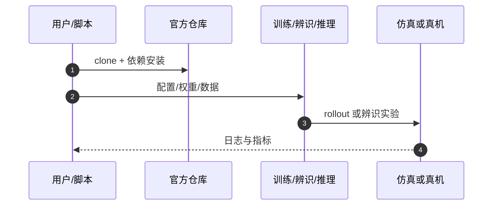

# Awesome Humanoid Robot Learning（FreeDof [44/44]）

**Awesome Humanoid Robot Learning**（GitHub 策展仓库）收录于 [自由度FreeDof · Sim2Real 四条路线梳理](../../sources/blogs/wechat_freedof_sim2real_four_routes_dr_to_residual_2026-08-23.md) 参考文献 **[44/44]**，归类 **资源**。

## 一句话定义

Yanjie Ze 维护的人形机器人学习论文与代码精选列表，Sim2Real 与人形 loco-manip 更新频繁。

## 英文缩写速查

| 缩写 | 英文全称 | 简要说明 |
|------|----------|----------|
| Sim2Real | Simulation to Real | 仿真到真机 |
| WBC | Whole-Body Control | 全身控制 |
| VLA | Vision-Language-Action | 视觉–语言–动作模型 |

## 为什么重要

- 文内人形方向持续更新资源索引。
- 在 [44 篇技术地图](../overview/freedof-sim2real-44-papers-technology-map.md) 与 [四条路线对比](../comparisons/sim2real-four-routes-identifiability.md) 中作为 **资源** 节点。
- 开源结论：**已开源**（步骤 2.5，2026-09-20）。

## 核心机制

| 项 | 内容 |
|----|------|
| **出处** | GitHub 策展仓库 |
| **文内章节** | 资源 |
| **要点** | 社区策展 README + 分类链接。 |
| **开源** | **已开源** |

## 源码运行时序图

## 结论

**作扩展阅读索引，与站内 awesome 实体互参而不重复造 survey 页。**

1. 文内角色：资源 路线上的参考节点，非重复 arXiv 页面。
2. 机制要点：社区策展 README + 分类链接。…
3. 部署/复现前请对照原文与项目页，勿直接外推公众号数字。

## 关联页面

- [Sim2Real 四条路线（可辨识性）](../comparisons/sim2real-four-routes-identifiability.md)
- [44 篇技术地图](../overview/freedof-sim2real-44-papers-technology-map.md)
- [Sim2Real](../concepts/sim2real.md)

## 参考来源

- [freedof_sim2real_44_awesome-humanoid-robot-learning.md](../../sources/papers/freedof_sim2real_44_awesome-humanoid-robot-learning.md)
- [wechat_freedof_sim2real_four_routes_dr_to_residual_2026-08-23.md](../../sources/blogs/wechat_freedof_sim2real_four_routes_dr_to_residual_2026-08-23.md)
- [freedof_sim2real_44_catalog.md](../../sources/papers/freedof_sim2real_44_catalog.md)

## 推荐继续阅读

- [https://github.com/YanjieZe/awesome-humanoid-robot-learning](https://github.com/YanjieZe/awesome-humanoid-robot-learning)
- [44 篇 Sim2Real 技术地图](../overview/freedof-sim2real-44-papers-technology-map.md)
