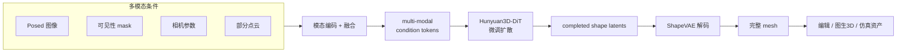

# Axolotl3D：保真 3D 形状补全统一框架

**Axolotl3D**（*a Unified Framework for Faithful 3D Shape Completion*，[arXiv:2607.20660](https://arxiv.org/abs/2607.20660)，[项目页](https://research.nvidia.com/labs/sil/projects/axolotl3d/)，ECCV 2026）由 **NVIDIA [Spatial Intelligence Lab](./nvidia-spatial-intelligence-lab.md)** Anita Hu、Maria Shugrina 提出：在 **图像、可见性 mask、相机参数与部分点云** 上联合条件，做 **遮挡感知、几何保真** 的 3D 形状 **补全与编辑**。各模态编码融合为 condition tokens，**微调 Hunyuan3D-DiT** 产出 shape latents，**ShapeVAE** 解码完整 mesh；**统一 on-the-fly 训练** 从大规模 mesh 模拟部分观测与遮挡，覆盖单视图、稀疏多视图与编辑。Toys4K / OmniObject3D（含合成遮挡）报告 SOTA 级几何精度；演示含 **Pi3X** 驱动的图生 3D 与真实场景 **物理仿真** 物体补全。

## 一句话定义

**用部分点云锚定几何、用相机对齐多视图，在 Hunyuan3D 扩散骨干上统一做单视图补全、遮挡补全与局部编辑。**

## 英文缩写速查

| 缩写 | 英文全称 | 简要说明 |
|------|----------|----------|
| DiT | Diffusion Transformer | Hunyuan3D 形状潜空间扩散骨干 |
| VAE | Variational Autoencoder | ShapeVAE 将 latents 解码为 mesh |
| SOTA | State of the Art | 论文在 Toys4K / OmniObject3D 上的对标结论 |
| RGB | Red-Green-Blue | 条件模态之一： posed 图像 |
| SIL | Spatial Intelligence Lab | NVIDIA 空间智能研究组 |
| Pi3X | Pi3 系列几何基础模型 | 提供稀疏视图相机与点预测，接 Axolotl3D 做图生 3D |
| Real2Sim | Real to Simulation | 真实场景网格补全后接入仿真管线 |

## 为什么重要

- **单视图 3D 生成不够：** [Hunyuan3D](https://github.com/tencent/Hunyuan3D-2) 等假设物体完全可见；机器人 Real2Sim、场景编辑与多相机重建常见 **遮挡与局部观测**。
- **统一框架而非拼凑：** 以往工作分别处理多视图、遮挡或编辑；Axolotl3D 用 **同一套多模态条件 + 统一训练合成** 覆盖多种 regime。
- **几何锚 vs 纯先验：** **部分点云** 显式约束未观测区域补全方向，降低「幻觉几何」——对 [SimFoundry](./paper-simfoundry-real2sim-scene-generation.md) 类管线中 **不完整扫描物体** 有直接意义。
- **与 SIL 栈衔接：** 同实验室 [Instant NuRec](./paper-instant-nurec.md) 做驾驶日志重建；Axolotl3D 偏 **物体级 mesh 补全/编辑**，可互补场景级资产。

## 核心信息

| 项 | 内容 |
|----|------|
| **机构** | 英伟达（NVIDIA）Spatial Intelligence Lab |
| **会议** | ECCV 2026 |
| **骨干** | Hunyuan3D-DiT（微调）+ ShapeVAE（解码） |
| **条件** | 图像、可见性 mask、相机外参/内参、部分点云 |
| **训练数据** | 大规模 3D mesh；on-the-fly 合成部分观测与遮挡 |
| **评测** | Toys4K、OmniObject3D（干净 + 合成遮挡；单/多视图） |
| **开源** | **待发布** — 项目页截至 2026-09-14 标注 Code Coming Soon，无公开仓库 |

## 核心原理

### 多模态条件与解码

1. **编码：** 各模态独立编码 → 融合为 **multi-modal condition tokens**。
2. **生成：** 在 **Hunyuan3D-DiT** 上微调，预测 **completed shape latents**。
3. **解码：** **ShapeVAE** 将 latents 还原为完整三角网格。
4. **角色分工：** 点云 = **几何锚**；相机 = **多视图坐标一致**；mask = **遮挡/可见性**；图像 = **外观与语义**。

### 统一训练策略

从完整 mesh **动态合成** 多种 conditioning regime：

- 部分点云（不同稀疏度）
- 合成遮挡与可见性 mask
- 单视图 / 稀疏多视图混合
- 编辑场景（保留未编辑区条件点）

使单一模型泛化跨 **补全、重建、编辑**，而非为每类任务单独训练。

### 流程总览

### 应用管线

| 应用 | 输入 | 读法 |
|------|------|------|
| **形状编辑** | Inpaint 单视图 + 未编辑区条件点 | 补全与编辑统一为条件补全 |
| **Image-to-3D** | [Pi3X](./paper-glob3r.md) 预测相机 + 稀疏噪声点 | 鲁棒点输入 → 保真 mesh |
| **物理仿真** | 真实场景部分观测物体 | 补全 mesh 后接入 Kaolin / 仿真栈 |

## 实验与评测

| 项 | 文内/项目页口径 |
|----|----------------|
| **基准** | Toys4K、OmniObject3D |
| **设定** | 干净 与 **合成遮挡** 两档 × 单视图 与 稀疏多视图 两档，共四种组合 |
| **指标方向** | 几何精度与重建保真；论文与项目页均称优于同期 SOTA |
| **难例** | 高遮挡类别（自行车、椅子、马、机器人）——靠几何相似的未遮挡区域外推 |
| **应用侧演示** | 形状编辑、Pi3X → Axolotl3D 图生 3D、真实捕获场景物体补全后接仿真 |

- **读法：** 上表为 **口径** 而非可横比的数字。项目页只给出「优于 SOTA」的定性结论与可视对比，未在归档里落下逐项数值；跨页引用时不要把它当成与 [MILO](./paper-milo.md)、[SimFoundry](./paper-simfoundry-real2sim-scene-generation.md) 等页数字同尺度的成绩。
- **评测域提醒：** 主基准是 **物体级** 数据集（Toys4K / OmniObject3D），不是机器人场景扫描；Real2Sim 落地前须在自己的扫描数据上重测。

## 源码运行时序图

截至入库日 **无官方可运行代码**（项目页 Code Coming Soon）。**不适用**（原因：权重与推理脚本未发布）。可关注 [nv-tlabs](https://github.com/nv-tlabs) 与 SIL 项目页更新；骨干可参考 [Hunyuan3D-2](https://github.com/tencent/Hunyuan3D-2) 自建微调实验。

## 工程实践

| 步骤 | 做法 |
|------|------|
| 选型 | 需要 **遮挡/部分扫描/局部编辑** 的 mesh 补全时优先考虑；纯单视图完整物体仍可用标准 Hunyuan3D |
| Real2Sim | 与 [SimFoundry](./paper-simfoundry-real2sim-scene-generation.md)、[EmbodiedGen V2](./paper-embodiedgen-v2-sim-ready-world-engine.md) 的 3D 资产后端对照 — Axolotl3D 强项是 **条件补全** 而非从零文生 3D |
| 几何前端 | 稀疏多视图可走 **Pi3X → Axolotl3D** 管线（项目页演示） |
| 许可 | 待代码发布后核对；Hunyuan3D 骨干有独立许可 |

## 局限与风险

- **代码未发布：** 截至 2026-09-14 无法复现；勿与已开源 [MILO](./paper-milo.md)（Hunyuan3D-2.0 + MIT 仓）混为同一开放程度。
- **绑定 Hunyuan3D 栈：** 微调与 ShapeVAE 解码依赖腾讯混元 3D 生态，迁移到其他 LRM 需重新对齐。
- **仿真就绪度：** 输出为 **外观 mesh**；碰撞体、关节与物性仍须 [EmbodiedGen](./paper-embodiedgen-v2-sim-ready-world-engine.md) / SimFoundry 式后处理。
- **评测域：** 主基准为 Toys4K / OmniObject3D 物体；真实机器人场景泛化待验证。

## 与其他工作对比

| 路线 | 输入假设 | 未观测区靠什么定 |
|------|----------|------------------|
| **Axolotl3D** | 图像 + mask + 相机 + 部分点云 | **部分点云当几何锚** + 扩散先验 |
| 标准 Hunyuan3D 类单视图生成 | 单视图、物体 **完全可见** | 纯生成先验 |
| [MILO](./paper-milo.md) | 单 / 少视图 | Hunyuan3D-2.0 作 LRM 脚手架 |
| [Glob3R / Pi3X](./paper-glob3r.md) | 稀疏多视图 | 不补全，只出 **相机与点** |
| [SimFoundry](./paper-simfoundry-real2sim-scene-generation.md) / [EmbodiedGen V2](./paper-embodiedgen-v2-sim-ready-world-engine.md) | 文本 / 场景描述 | 从零生成场景资产 |
| 传统点云补全 | 仅点云 | 几何先验，无外观语义 |

逐条读法：

- **标准 [Hunyuan3D](https://github.com/tencent/Hunyuan3D-2)** — 同一骨干；Axolotl3D 是它的 **条件补全微调**，物体完整可见时用原版更省事。
- **MILO** — 同栈不同用法；MILO **已开源（MIT）**，Axolotl3D 代码 **待发布**，开放程度勿混为一谈。
- **Glob3R / Pi3X** — 上游前端：Pi3X → Axolotl3D 是项目页演示的图生 3D 管线。
- **SimFoundry / EmbodiedGen V2** — 分工不同：那两条是 **生成新资产**，Axolotl3D 是 **补全已有的不完整观测**。
- **传统点云补全** — Axolotl3D 多了图像与 mask，能在高遮挡下用语义判断「这块该长成什么」。
- **最关键的分歧点：** 是否有 **显式几何锚**。纯生成路线在遮挡区容易「幻觉几何」，Axolotl3D 用部分点云把补全方向钉住——代价是点云质量差时反而被带偏，且整条链绑死在腾讯混元 3D 生态上。
- **读法：** 以上为 **路线级** 对照；与各 baseline 的逐项定量比较以 **原文 PDF** 为准（[参考来源](#参考来源)）。

## 关联页面

- [NVIDIA Spatial Intelligence Lab](./nvidia-spatial-intelligence-lab.md)
- [Instant NuRec](./paper-instant-nurec.md) — 同 SIL 驾驶场景重建
- [MILO](./paper-milo.md) — Hunyuan3D 作 LRM 脚手架的另一用法
- [Glob3R / Pi3X](./paper-glob3r.md) — 稀疏几何前端
- [SimFoundry](./paper-simfoundry-real2sim-scene-generation.md) — Real2Sim 网格生成
- [Text-to-CAD](../concepts/text-to-cad.md) — 3D 资产 vs 工业 CAD 分工

## 结论

**总判：Axolotl3D 把「单视图 3D 生成」推进到「多模态、遮挡感知的保真补全」，是 Real2Sim 与场景编辑里补全部分观测物体的统一框架；工程落地须等官方代码并接仿真后处理链。**

1. **先判断是否需要补全：** 物体完全可见且单视图足够时，标准 Hunyuan3D 更简单。
2. **部分点云 + 相机是核心输入** —— 不是可选 embellishment。
3. **统一训练是跨任务泛化的关键** —— 编辑与补全同一模型。
4. **Pi3X 管线是实用图生 3D 入口** —— 见项目页 Image-to-3D 演示。
5. **代码待发布** —— 跟进 SIL 项目页与 nv-tlabs。
6. **仿真使用前须 mesh→URDF/碰撞体** —— 勿直接把生成 mesh 当 sim-ready。

## 参考来源

- [Axolotl3D arXiv 2607.20660 归档](../../sources/papers/axolotl3d_arxiv_2607_20660.md)
- [NVIDIA Axolotl3D 项目页归档](../../sources/sites/nvidia-axolotl3d.md)

## 推荐继续阅读

- [arXiv:2607.20660](https://arxiv.org/abs/2607.20660)
- [NVIDIA SIL：Axolotl3D 项目页](https://research.nvidia.com/labs/sil/projects/axolotl3d/)
- [Hugging Face Papers 2607.20660](https://huggingface.co/papers/2607.20660)
