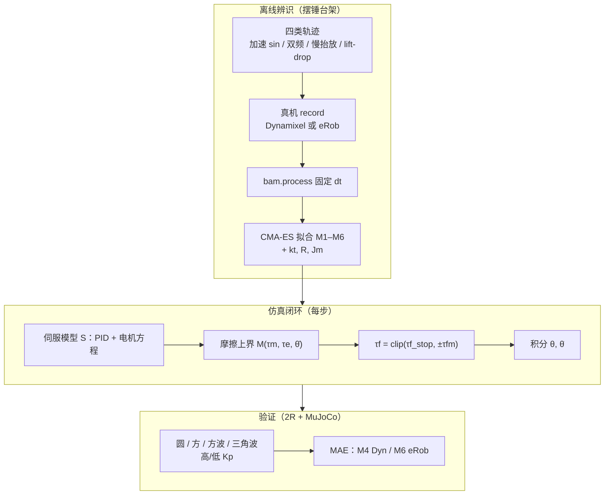

---

type: entity
tags: [paper, sim2real, actuator, friction, mujoco, system-identification, servo, dynamixel, icra-2025, google]
status: complete
updated: 2026-07-15
arxiv: "2410.08650"
venue: ICRA 2025
code: https://github.com/Rhoban/bam
related:
  - ../concepts/sim2real.md
  - ../concepts/system-identification.md
  - ../methods/actuator-network.md
  - ../queries/sim2real-gap-reduction.md
  - ./bam-better-actuator-models.md
  - ./sage-sim2real-actuator-gap-estimator.md
sources:
  - ../../sources/papers/bam_extended_friction_servos_arxiv_2410_08650.md
summary: "ICRA 2025：为舵机提出 M1–M6 可辨识扩展摩擦上界模型，摆锤 CMA-ES 标定后在 MuJoCo 2R 臂上相对 Coulomb–Viscous 将轨迹 MAE 降至约一半，面向 RL 低增益下的执行器 sim2real。"
---

# 扩展摩擦模型：舵机物理仿真（BAM 论文）

**Extended Friction Models for the Physics Simulation of Servo Actuators**（arXiv [2410.08650](https://arxiv.org/abs/2410.08650v1)，ICRA 2025）针对 **MuJoCo / Isaac Gym 等默认 Coulomb–Viscous 摩擦** 在舵机减速箱上失真的问题，给出 **M1–M6 递进解析模型**、**摆锤台架辨识流程** 与 **物理引擎在线更新摩擦参数** 的方法，并在 **Dynamixel MX-64/106** 与 **eRob80 谐波减速** 上验证。

## 英文缩写速查

| 缩写 | 英文全称 | 简要说明 |
|------|----------|----------|
| Sim2Real | Simulation to Real | 把仿真中学到的策略迁移落地真机的工程主线 |
| MuJoCo | Multi-Joint dynamics with Contact | 接触丰富的刚体物理仿真引擎 |
| RL | Reinforcement Learning | 通过与环境交互最大化长期回报来学习策略的范式 |
| Isaac Gym | NVIDIA Isaac Gym | GPU 并行刚体仿真训练环境 |
| MLP | Multi-Layer Perceptron | 多层感知机，处理本体向量等低维输入 |
| PD | Proportional–Derivative | 关节位置/阻抗底层控制，策略输出常为其 setpoint |

## 为什么重要

- **执行器 gap 的可解释分解：** 与纯数据驱动的 [Actuator Network](../methods/actuator-network.md) 互补，用 **Stribeck、负载相关、方向性与二次项** 覆盖 RL 低增益下常见的「粘滞–滑动」与 **drive/backdrive 不对称**。
- **可复现工程管线：** 开源 [BAM](./bam-better-actuator-models.md) 提供 record → process → fit → MuJoCo 2R 全流程与公开日志，便于在自家舵机上复用协议。
- **与 gap 度量工具链衔接：** 辨识前可用 [SAGE](./sage-sim2real-actuator-gap-estimator.md) 等先量化关节跟踪误差，再决定是否需要 M4/M6 级摩擦扩展。

## 流程总览

## 方法

### 摩擦模型族（M1 → M6）

| 模型 | 参数规模 | 主要效应 | 典型最优场景（论文） |
|------|----------|----------|----------------------|
| M1 | 2 | Coulomb + 粘性 | 基线（仿真器默认） |
| M2 | 5 | + Stribeck 静→动过渡 | Dynamixel 摆锤辨识递进 |
| M3 | 3 | + 负载相关 $K_l\|\tau_m-\tau_e\|$ | eRob80:50 摆锤可止步于此 |
| M4 | 7 | Stribeck × 负载相关 | **Dynamixel 2R 验证最优** |
| M5 | 9 | 电机/外载方向分解 | 摆锤辨识好但 2R 易过拟合 |
| M6 | 11 | + 谐波二次负载项 | **eRob80:100 2R 最优** |

仿真实现要点：用 **上界** $\tau_f^m$ 与「下一步速度归零所需力矩」$\tau_{f,stop}$ 取 **clip**，避免 $\dot\theta=0$ 不连续；在 MuJoCo 中 **每步用上一时刻 $\tau_e$** 更新关节 `frictionloss` / 粘性项（Section IV-E）。

### 伺服与控制律

- **电压控制（Dynamixel 厂商 PID）：** $U=\mathrm{clip}(\mathrm{PID})$，$\tau_m = \frac{k_t}{R}U - \frac{k_t^2}{R}\dot\theta$
- **电流控制（eRob 自定义）：** $I=\mathrm{clip}(\mathrm{PID})$，$\tau_m=k_t I$，含 $I_{emf}$、$I_{heat}$ 限幅

### 辨识协议

- 设备：MX-64、MX-106、eRob80:50、eRob80:100；约 **100 条 × 6 s** 日志 / 舵机
- 优化：**CMA-ES（optuna）**，目标为验证集 **MAE**；相对 M1，摆锤 MAE 约 **1.5×–2.9×** 降低
- 2R：低增益 mimics RL；相对 M1，MAE **>2×** 改善（M4 / M6）

## 评测

- **摆锤：** 多质量、摆长、$K_p$ 组合；报告各模型验证 MAE（Fig.5）
- **2R 操作臂：** circle / square / square_wave / triangular_wave；HG / LG 两组增益（Fig.7）
- **定性：** drive/backdrive 图显示 M1 无法拟合负载相关边界（Fig.3）

## 对比

| 路线 | 可解释性 | 数据需求 | 与 MuJoCo 原生摩擦关系 |
|------|----------|----------|------------------------|
| **BAM M1–M6** | 高（参数有物理含义） | 摆锤 + 少量轨迹 | **扩展** 每步更新的 $K_c,K_v$ 等 |
| **ActuatorNet** | 低（黑箱 MLP） | 大量真机激励 | **替代** PD 力矩映射 |
| **SAGE** | 中（统计 gap） | 成对 sim/real 重放 | **度量** gap，不直接给摩擦公式 |
| **Domain Randomization** | 低 | 无单舵机标定 | **掩盖** 参数误差 |

## 常见误区

1. **「辨识最优模型 = 2R 最优」：** M5 在摆锤上更好，但 Dynamixel 2R 上 **M4 更稳**——复杂模型易过拟合。
2. **「只调仿真器默认 frictionloss 就够」：** 论文强调需 **负载与 Stribeck 的动态上界**，静态两参数不够。
3. **「仅适用于 Dynamixel」：** eRob 谐波减速需 **M6 二次项**；减速比与传动类型决定模型阶数。
4. **忽略控制律：** 摩擦与 **PID + 电压/电流限幅** 耦合；辨识同时估计 $k_t,R,J_m$。

## 局限（作者自述）

- 未建模 **温升**、**径向力**、**dwell time** 延迟；未来工作指向 **引擎原生集成** 与更复杂系统（人形）仿真。

## 参考来源

- [扩展摩擦论文归档](../../sources/papers/bam_extended_friction_servos_arxiv_2410_08650.md)
- Duclusaud et al., *Extended Friction Models for the Physics Simulation of Servo Actuators*, ICRA 2025
- [Rhoban/bam](https://github.com/Rhoban/bam) — 代码与数据

## 关联页面

- [Sim2Real](../concepts/sim2real.md)、[System Identification](../concepts/system-identification.md)
- [BAM 开源仓库](./bam-better-actuator-models.md)、[Actuator Network](../methods/actuator-network.md)
- [Sim2Real Gap 缩减实战](../queries/sim2real-gap-reduction.md)、[SAGE](./sage-sim2real-actuator-gap-estimator.md)

## 推荐继续阅读

- [arXiv HTML 全文](https://arxiv.org/html/2410.08650v1) — 公式与 Algorithm 1
- [配套视频](https://youtu.be/P5-Ked8EoWk) — 实验协议演示
- [Google Drive 辨识数据](https://drive.google.com/drive/folders/1SwVCcpJko7ZBsmSTuu3G_ZipVQFGZ11N?usp=drive_link)
