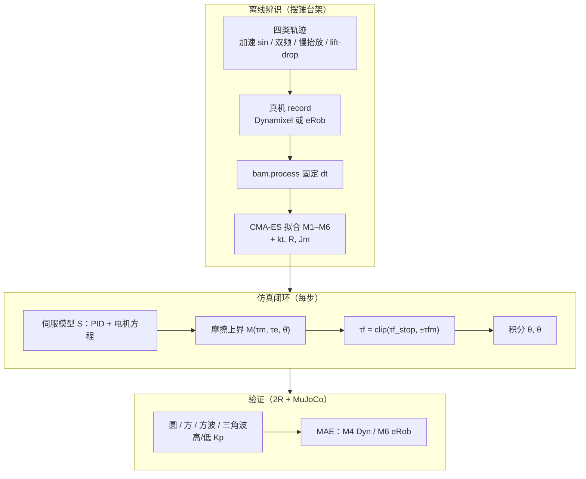
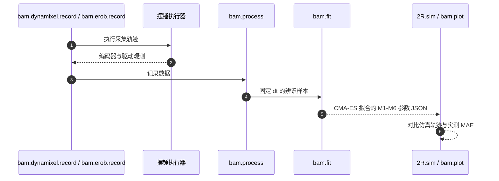
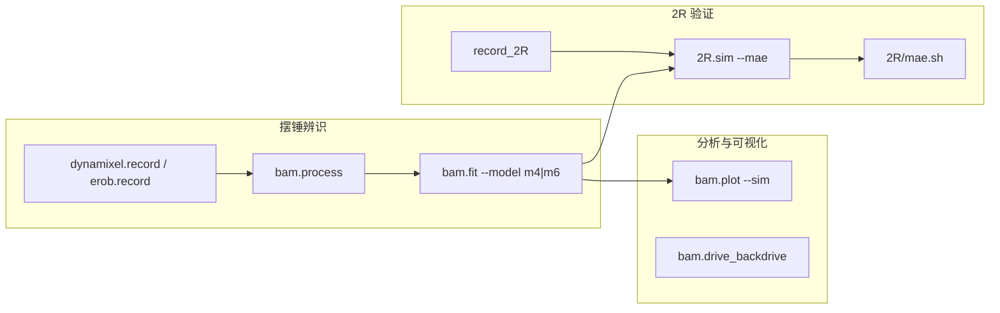

# 扩展摩擦模型：舵机物理仿真（BAM 论文）

**Extended Friction Models for the Physics Simulation of Servo Actuators**（arXiv [2410.08650](https://arxiv.org/abs/2410.08650v1)，ICRA 2025）针对 **MuJoCo / Isaac Gym 等默认 Coulomb–Viscous 摩擦** 在舵机减速箱上失真的问题，给出 **M1–M6 递进解析模型**、**摆锤台架辨识流程** 与 **物理引擎在线更新摩擦参数** 的方法，并在 **Dynamixel MX-64/106** 与 **eRob80 谐波减速** 上验证。

## 英文缩写速查

| 缩写 | 英文全称 | 简要说明 |
|------|----------|----------|
| Sim2Real | Simulation to Real | 把仿真中学到的策略迁移落地真机的工程主线 |
| MuJoCo | Multi-Joint dynamics with Contact | 接触丰富的刚体物理仿真引擎 |
| RL | Reinforcement Learning | 通过与环境交互最大化长期回报来学习策略的范式 |
| Isaac Gym | NVIDIA Isaac Gym | GPU 并行刚体仿真训练环境 |
| MLP | Multi-Layer Perceptron | 多层感知机，处理本体向量等低维输入 |
| PD | Proportional–Derivative | 关节位置/阻抗底层控制，策略输出常为其 setpoint |

| URDF | Unified Robot Description Format | 统一机器人描述格式 |

## 为什么重要

- **执行器 gap 的可解释分解：** 与纯数据驱动的 [Actuator Network](../methods/actuator-network.md) 互补，用 **Stribeck、负载相关、方向性与二次项** 覆盖 RL 低增益下常见的「粘滞–滑动」与 **drive/backdrive 不对称**。
- **与 gap 度量工具链衔接：** 辨识前可用 [SAGE](./sage-sim2real-actuator-gap-estimator.md) 等先量化关节跟踪误差，再决定是否需要 M4/M6 级摩擦扩展。

## 流程总览

```mermaid
flowchart TB
  subgraph id["离线辨识（摆锤台架）"]
    T["四类轨迹<br/>加速 sin / 双频 / 慢抬放 / lift-drop"]
    R["真机 record<br/>Dynamixel 或 eRob"]
    P["bam.process 固定 dt"]
    F["CMA-ES 拟合 M1–M6<br/>+ kt, R, Jm"]
    T --> R --> P --> F
  end
  subgraph sim["仿真闭环（每步）"]
    S["伺服模型 S：PID + 电机方程"]
    M["摩擦上界 M(τm, τe, θ̇)"]
    C["τf = clip(τf_stop, ±τfm)"]
    I["积分 θ, θ̇"]
    S --> M --> C --> I
  end
  subgraph val["验证（2R + MuJoCo）"]
    U["圆 / 方 / 方波 / 三角波<br/>高/低 Kp"]
    E["MAE：M4 Dyn / M6 eRob"]
    U --> E
  end
  F --> sim
  sim --> val
```

## 方法

### 摩擦模型族（M1 → M6）

| 模型 | 参数规模 | 主要效应 | 典型最优场景（论文） |
|------|----------|----------|----------------------|
| M1 | 2 | Coulomb + 粘性 | 基线（仿真器默认） |
| M2 | 5 | + Stribeck 静→动过渡 | Dynamixel 摆锤辨识递进 |
| M3 | 3 | + 负载相关 $K_l\|\tau_m-\tau_e\|$ | eRob80:50 摆锤可止步于此 |
| M4 | 7 | Stribeck × 负载相关 | **Dynamixel 2R 验证最优** |
| M5 | 9 | 电机/外载方向分解 | 摆锤辨识好但 2R 易过拟合 |
| M6 | 11 | + 谐波二次负载项 | **eRob80:100 2R 最优** |

仿真实现要点：用 **上界** $\tau_f^m$ 与「下一步速度归零所需力矩」$\tau_{f,stop}$ 取 **clip**，避免 $\dot\theta=0$ 不连续；在 MuJoCo 中 **每步用上一时刻 $\tau_e$** 更新关节 `frictionloss` / 粘性项（Section IV-E）。

### 伺服与控制律

- **电压控制（Dynamixel 厂商 PID）：** $U=\mathrm{clip}(\mathrm{PID})$，$\tau_m = \frac{k_t}{R}U - \frac{k_t^2}{R}\dot\theta$
- **电流控制（eRob 自定义）：** $I=\mathrm{clip}(\mathrm{PID})$，$\tau_m=k_t I$，含 $I_{emf}$、$I_{heat}$ 限幅

### 辨识协议

- 设备：MX-64、MX-106、eRob80:50、eRob80:100；约 **100 条 × 6 s** 日志 / 舵机
- 优化：**CMA-ES（optuna）**，目标为验证集 **MAE**；相对 M1，摆锤 MAE 约 **1.5×–2.9×** 降低
- 2R：低增益 mimics RL；相对 M1，MAE **>2×** 改善（M4 / M6）

## 评测

- **摆锤：** 多质量、摆长、$K_p$ 组合；报告各模型验证 MAE（Fig.5）
- **2R 操作臂：** circle / square / square_wave / triangular_wave；HG / LG 两组增益（Fig.7）
- **定性：** drive/backdrive 图显示 M1 无法拟合负载相关边界（Fig.3）

## 结论

**用 M1–M6 可辨识扩展摩擦与摆锤 CMA-ES 标定，显著压低舵机仿真相对 Coulomb–Viscous 的轨迹误差，服务 RL 低增益 sim2real。**

1. **按传动选型模型阶数** — Dynamixel 2R 优选 M4；eRob80:100 优选 M6；eRob80:50 摆锤辨识可止于 M3。
2. **辨识最优 ≠ 2R 最优** — M5 在摆锤上更好，但 Dynamixel 2R 上 M4 更稳；复杂模型易过拟合。
3. **仿真用摩擦上界并每步更新** — 以 clip($\tau_{f,stop}$, $\pm\tau_f^m$) 避免零速不连续；MuJoCo 每步用上一时刻 $\tau_e$ 更新 `frictionloss` / 粘性项。
4. **相对 M1 改善可量化复用** — 摆锤 MAE 约 1.5×–2.9× 降低；2R 低增益下 MAE >2× 改善。
5. **与 ActuatorNet / SAGE 互补，勿只调静态两参数** — BAM 给可解释摩擦公式；未建模温升、径向力与 dwell time。

## 对比

| 路线 | 可解释性 | 数据需求 | 与 MuJoCo 原生摩擦关系 |
|------|----------|----------|------------------------|
| **BAM M1–M6** | 高（参数有物理含义） | 摆锤 + 少量轨迹 | **扩展** 每步更新的 $K_c,K_v$ 等 |
| **ActuatorNet** | 低（黑箱 MLP） | 大量真机激励 | **替代** PD 力矩映射 |
| **SAGE** | 中（统计 gap） | 成对 sim/real 重放 | **度量** gap，不直接给摩擦公式 |
| **Domain Randomization** | 低 | 无单舵机标定 | **掩盖** 参数误差 |

## 常见误区

1. **「辨识最优模型 = 2R 最优」：** M5 在摆锤上更好，但 Dynamixel 2R 上 **M4 更稳**——复杂模型易过拟合。
2. **「只调仿真器默认 frictionloss 就够」：** 论文强调需 **负载与 Stribeck 的动态上界**，静态两参数不够。
3. **「仅适用于 Dynamixel」：** eRob 谐波减速需 **M6 二次项**；减速比与传动类型决定模型阶数。
4. **忽略控制律：** 摩擦与 **PID + 电压/电流限幅** 耦合；辨识同时估计 $k_t,R,J_m$。

## 局限（作者自述）

- 未建模 **温升**、**径向力**、**dwell time** 延迟；未来工作指向 **引擎原生集成** 与更复杂系统（人形）仿真。

## 源码运行时序图

```mermaid
sequenceDiagram
    autonumber
    participant R as bam.dynamixel.record / bam.erob.record
    participant A as 摆锤执行器
    participant P as bam.process
    participant F as bam.fit
    participant V as 2R.sim / bam.plot
    R->>A: 执行采集轨迹
    A-->>R: 编码器与驱动观测
    R->>P: 记录数据
    P->>F: 固定 dt 的辨识样本
    F-->>V: CMA-ES 拟合的 M1-M6 参数 JSON
    V-->>V: 对比仿真轨迹与实测 MAE
```

入口与参数文件对齐 [BAM 源码归档](../../sources/repos/rhoban_bam.md)；辨识与 2R 仿真分别使用各自依赖文件。

## 项目资源与工程补充

### 流程总览

```mermaid
flowchart LR
  subgraph pendulum["摆锤辨识"]
    A1["dynamixel.record / erob.record"]
    A2["bam.process"]
    A3["bam.fit --model m4|m6"]
    A1 --> A2 --> A3
  end
  subgraph tools["分析与可视化"]
    B1["bam.plot --sim"]
    B2["bam.drive_backdrive"]
  end
  subgraph twoR["2R 验证"]
    C1["record_2R"]
    C2["2R.sim --mae"]
    C3["2R/mae.sh"]
    C1 --> C2 --> C3
  end
  A3 --> B1
  A3 --> C2
```

### 核心用法（归纳）

| 阶段 | 典型命令 | 说明 |
|------|----------|------|
| 采集 | `python -m bam.dynamixel.record --trajectory sin_time_square ...` | `--mass`、`--length`、`--kp`、`--motor mx106` |
| 批采 | `bam.dynamixel.all_record` | 多轨迹 × 多 $K_p$ |
| 后处理 | `python -m bam.process --raw data_raw --dt 0.005` | 统一时间步 |
| 拟合 | `python -m bam.fit --actuator mx106 --model m6 --method cmaes` | 输出 `params/.../m*.json` |
| 2R 仿真 | `python -m 2R.sim --log ... --params m4.json,m4.json --mae` | `--testbench mx` 或 `erob` |

**轨迹名（摆锤）：** `sin_time_square`、`sin_sin`、`lift_and_drop`、`up_and_down`。
**轨迹名（2R）：** `circle`、`square`、`square_wave`、`triangular_wave`。

### 常见误区

1. **拟合用 m6、2R 也用 m6：** README 示例对 MX-106 拟合 m6，但 **Dynamixel 2R 论文推荐 m4** 参数对，避免过拟合。
2. **忽略 eRob 的 Etherban：** eRob 分支需先 `generate_protobuf.sh` 与 `etherban` 服务，并设置 `offset` 零点。
3. **与 ActuatorNet 二选一：** 可先 BAM 解析摩擦，残差再用数据驱动网络；也可对照 [SAGE](./sage-sim2real-actuator-gap-estimator.md) 看 gap 是否已足够小。

## 参考来源

- [扩展摩擦论文归档](../../sources/papers/bam_extended_friction_servos_arxiv_2410_08650.md)
- Duclusaud et al., *Extended Friction Models for the Physics Simulation of Servo Actuators*, ICRA 2025
- [Rhoban/bam](https://github.com/Rhoban/bam) — 代码与数据

- [Rhoban/bam 仓库归档](../../sources/repos/rhoban_bam.md)
- [BAM 文档站](../../sources/sites/bam-readthedocs.md)

## 关联页面

- [Sim2Real](../concepts/sim2real.md)、[System Identification](../concepts/system-identification.md)
- [关节执行器参数辨识](../methods/joint-actuator-parameter-identification.md) — 摆锤 CMA-ES 估 $J_m$ + 摩擦
- [Sim2Real Gap 缩减实战](../queries/sim2real-gap-reduction.md)、[SAGE](./sage-sim2real-actuator-gap-estimator.md)
- [NeuralActuator（数据驱动 + 可微仿真）](./paper-neuralactuator-neural-actuation-modeling.md) — 低成本臂多任务执行器/力感知
- [执行器驱动链选型闭环知识链](../queries/actuator-drive-chain-selection-loop.md) — BAM-extended 是③层伺服执行器摩擦辨识的方法来源

- [关节执行器参数辨识](../methods/joint-actuator-parameter-identification.md) — 摆锤 CMA-ES 在算法族里的位置；对照 [FloBaRoID](./flobaroid.md)
- [Actuator Network](../methods/actuator-network.md)、[SAGE](./sage-sim2real-actuator-gap-estimator.md)
- [Microduck RL](./pollen-microduck-rl.md) — 真机菜谱：BAM M6 XL330 + 摩擦 DR + 编码器侧背隙

## 推荐继续阅读

- [arXiv HTML 全文](https://arxiv.org/html/2410.08650v1) — 公式与 Algorithm 1
- [配套视频](https://youtu.be/P5-Ked8EoWk) — 实验协议演示
- [Google Drive 辨识数据](https://drive.google.com/drive/folders/1SwVCcpJko7ZBsmSTuu3G_ZipVQFGZ11N?usp=drive_link)

- [GitHub README](https://github.com/Rhoban/bam) — 完整 CLI 与 2R URDF 转换说明
- [教程视频](https://youtu.be/5XPEEKDnQEM) — 采集与拟合演示
- [arXiv:2410.08650](https://arxiv.org/abs/2410.08650v1)
