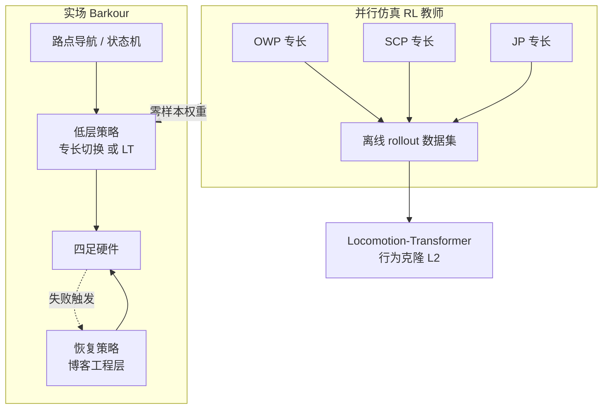

# Barkour（四足敏捷评测基准与开源生态）

**Barkour** 是 Google DeepMind 提出的 **四足敏捷 locomotion 基准**：把 **犬敏捷赛** 中的障碍序列与 **时间型评分** 压缩进 **约 5 m × 5 m** 的实验场地，用 **单一标量敏捷分** 同时压 **速度、可控性与多技能组合**（arXiv:2305.14654）。同一研究脉络下，团队后续开源了 **整机 CAD / 电子 / 固件与装配文档**（`barkour_robot`），并在 **MuJoCo Menagerie** 中维护 **MJCF** 资产。

## 一句话定义

**用一小套障碍课 + 犬赛式计时扣分，把「多primitive敏捷」压成一个可比分数；再用并行 RL 的专长教师与 Transformer 蒸馏通才，在自研四足上零样本跑完实场课。**

## 英文缩写速查

| 缩写 | 英文全称 | 简要说明 |
|------|----------|----------|
| Sim2Real | Simulation to Real | 把仿真中学到的策略迁移落地真机的工程主线 |
| PPO | Proximal Policy Optimization | 人形/足式 locomotion 中最常用的 on-policy 策略梯度算法 |
| Locomotion | Robot Locomotion | 足式/人形等无轮移动能力的总称 |
| MuJoCo | Multi-Joint dynamics with Contact | 接触丰富的刚体物理仿真引擎 |
| CAD | Computer-Aided Design | 计算机辅助设计，硬件结构建模 |
| MJCF | MuJoCo XML Format | MuJoCo 的模型与场景描述格式 |
| RL | Reinforcement Learning | 通过与环境交互最大化长期回报来学习策略的范式 |
| EtherCAT | Ethernet for Control Automation Technology | 高实时性工业以太网总线 |
| Isaac Gym | NVIDIA Isaac Gym | GPU 并行刚体仿真训练环境 |
| DR | Domain Randomization | 训练时随机化仿真参数以提升跨域鲁棒迁移 |
| SLAM | Simultaneous Localization and Mapping | 同步定位与建图 |
| Isaac Lab | NVIDIA Isaac Lab | 基于 Omniverse 的机器人学习训练框架 |

## 为什么重要

- **评测缺口：** 腿足论文长期依赖 **ad hoc 指标**；Barkour 提供 **可复现场地几何 + 明确扣分规则**，与 **ImageNet / Gym 式** 基准叙事一致（论文 Introduction）。
- **方法对照面宽：** 同时覆盖 **分层专长 + 状态机导航** 与 **单网络通才（Locomotion-Transformer）**，便于讨论 **切换边界平滑性 vs 峰值分数**（官方博客实验观察）。
- **工程闭环：** 开源 **EtherCAT 执行器链路 + Pigweed 固件** 与 **Menagerie MJCF**，把 **论文—仿真—硬件** 串到同一品牌线下。

## 核心结构

| 模块 | 作用 |
|------|------|
| **障碍课** | 起点台 → **绕杆** → **A 字坡** → **宽跳（论文写作 0.5 m 板）** → 终点台；全课名义长度约 **18 m**、规定时间约 **10.64 s**（目标平均速度 **1.69 m/s**，arXiv Table I）。 |
| **敏捷分** | \(R_{\text{agility}} = 1.0 - \max(t_{\text{run}}-t_{\text{allotted}},0)\times0.01 - \text{penalties}\)；失败/跳过障碍扣 **0.1**/次。 |
| **专长基线** | **OWP**（ uneven 全向行走）、**SCP**（爬坡课程）、**JP**（跳跃课程）；**PPO + LeggedGym（Isaac Gym）**；观测含 **高度场 + 0.3 s 本体历史**，动作为 **目标关节角**（相对名义站姿）。 |
| **通才基线** | rollout 收集多地形 **状态—动作** 数据集 → **因果 Transformer** 行为克隆（**L2**）为 **Locomotion-Transformer**；上下文 **W=15** 步。 |
| **导航** | **路点 + 容差**；专长模式需 **行为类型** 切换策略；通才主要跟踪 **速度指令**。 |
| **sim2real** | 在 Rudin 式 DR 上加强 **惯量、电机与关节静摩擦** 等随机化以支撑 **>1 m/s** 敏捷动作迁移（论文 Table II）。 |

### 流程总览（训练—部署）

## 版本脚注：v0 机体 / Menagerie 路径 vs 当前 vB

- **论文与早期开放资产** 多指向 **Menagerie `google_barkour_v0`**（障碍课 + 较早机体网格），并与 **Brax 实验性计分脚本** 同代际入口共存于官方 README。
- **`barkour_robot` 仓库当前主推** 的 CAD / 说明与 README 默认仿真链路指向 **`google_barkour_vb`**；复现论文图与数值时应 **核对 MJCF 代际** 是否与论文一致。

## 常见误区或局限

- **误区：「分数接近 1 就等于接近真实犬」。** 论文与博客都用 **小型犬敏捷 novice 速度量级** 设 \(t_{\text{allotted}}\)，但机体尺度、步态与场地版本不同，**只能作相对参照**，不能当作跨物种严格可比实验。
- **局限：** 论文基线 **依赖特权式高度场与仿真地形课程**；导航在基线中使用 **全状态/真位姿** 信息，和 **纯机载 SLAM 导航** 仍是不同问题层。
- **许可：** 硬件与设计资料为 **CC BY-NC**，商业复用需自行评估条款。

## 关联页面

- [Locomotion（任务总览）](../tasks/locomotion.md)
- [四足机器人（平台语境）](./quadruped-robot.md)
- [MuJoCo](./mujoco.md)
- [Legged Gym](./legged-gym.md)
- [Isaac Gym / Isaac Lab](./isaac-gym-isaac-lab.md)（论文训练栈语境）
- [Sim2Real](../concepts/sim2real.md)
- [Domain Randomization](../concepts/domain-randomization.md)
- [Terrain Adaptation](../concepts/terrain-adaptation.md)
- [RSS 2018 敏捷四足 sim2real](./paper-quadruped-agile-sim2real-rss2018.md)
- [Walk These Ways（MoB）](./paper-walk-these-ways-quadruped-mob.md)
- [具身大模型评测基准选型闭环](../queries/embodied-eval-benchmark-selection-loop.md) — 本页是其 ③ 策略任务成功率评测层的四足敏捷代表基准，双向回链

## 方法栈

见上文 **核心结构** 与 **流程总览**（`###` 小节）；完整机制与模块分工以原文为准。

## 实验与评测

- 论文报告 **benchmark 任务集** 上的成功率、速度与鲁棒性指标；具体数值与消融见原文表格（[参考来源](#参考来源)）。

## 与其他工作对比

- 正文已给出与相邻路线 / baseline 的 **定性对照**；定量表格与 ablation 见原文（[参考来源](#参考来源)）。

## 参考来源

- [Barkour 论文摘录（arXiv:2305.14654）](../../sources/papers/barkour_arxiv_2305_14654.md)
- [Google Research 官方博客（2023-05-26）](../../sources/blogs/google-research-barkour-quadruped-agility-2023-05-26.md)
- [barkour_robot 仓库索引](../../sources/repos/google_deepmind_barkour_robot.md)
- [MuJoCo Menagerie：google_barkour_v0 / vb](../../sources/repos/mujoco_menagerie_google_barkour_models.md)

## 推荐继续阅读

- 论文 PDF：<https://arxiv.org/pdf/2305.14654.pdf>
- 主仓库：<https://github.com/google-deepmind/barkour_robot>
- Menagerie v0：<https://github.com/google-deepmind/mujoco_menagerie/tree/main/google_barkour_v0>
- Menagerie vB：<https://github.com/google-deepmind/mujoco_menagerie/tree/main/google_barkour_vb>
- 官方博客：<https://research.google/blog/barkour-benchmarking-animal-level-agility-with-quadruped-robots/>
