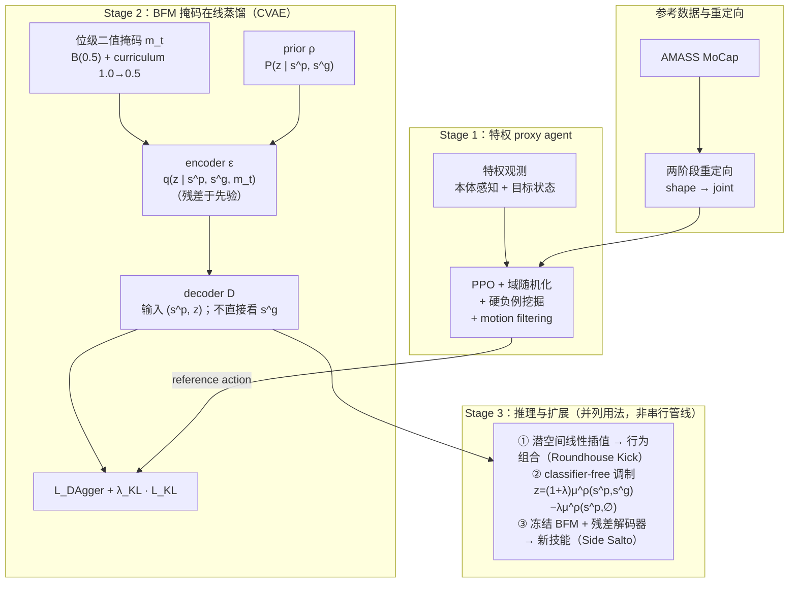

# BFM（Behavior Foundation Model for Humanoid Robots）

**BFM** 是北大、港中大（深圳）、上交、复旦与 **上海人工智能实验室** 合作的人形 **whole-body control（WBC）基础模型** 论文（arXiv:2509.13780，[项目页](https://bfm4humanoid.github.io/)）：作者把 motion tracking、VR 遥操作、locomotion 等不同 WBC 任务统一抽象为「**生成把机器人引向目标状态的合适行为**」，因此用一个 **CVAE 生成式策略 + 位级掩码控制接口 + 掩码在线蒸馏** 训练单一策略覆盖多种控制接口。

## 英文缩写速查

| 缩写 | 英文全称 | 简要说明 |
|------|----------|----------|
| BFM | Behavior Foundation Model for Humanoid Robots | 本文提出的人形全身行为基础模型 |
| WBC | Whole-Body Control | 预训练服务低层全身协调 |
| RL | Reinforcement Learning | 预训练与下游适应常用范式 |
| MoCap | Motion Capture | 大规模行为数据主要来源之一 |
| VLA | Vision-Language-Action | 可与 BFM 低层能力上下叠加 |

## 为什么重要

- **WBC 的「foundation policy」立场**：与 [Foundation Policy](../concepts/foundation-policy.md) 主流的 **VLA 操作向** 路线互补，BFM 关注 **人形低层全身控制** 的「一个 checkpoint 覆盖多接口」问题；不是为每种 mode 单独训一条 RL，而是 **预训练一个生成模型**。
- **位级掩码是关键抽象**：把 (i) 根平移/朝向/速度、(ii) 关节角、(iii) 关键点局部位置 共三类目标用 **位级二值掩码** 选择性激活，**告别每换 mode 就重写 reward**——这是与 [HOVER](https://hover-versatile-humanoid.github.io/) 等多模式 WBC 共同的工程动机，但 BFM 用 **生成式 CVAE** 而非多任务 RL 实现。
- **生成式潜空间可被「组合 / 调制」**：潜空间线性插值（Roundhouse Kick = root-only mode + keypoint-only mode）与 **classifier-free guidance** 风格的潜调制（恢复平衡时 λ≈0.5）给 WBC 一种 **运行时可塑性**，这是经典 QP-WBC 与多任务 RL 缺的旋钮。
- **新技能少样本路径**：**冻结预训练 BFM** 并训练 **残差解码器**（见下文「行为组合 / 调制 / 新技能」中的块级记法）给 Side Salto 等未见动作，比 RL from scratch 收敛更快、跟踪更准——把 BFM 的预训练价值落到「**新行为获取**」上。

## 流程总览

## 核心机制（归纳）

### 1）统一控制接口（masked control）

- **三类低层目标**：
  - **(i) 根**：平移、朝向、线/角速度。
  - **(ii) 关节**：23 DoF 目标关节角（Unitree G1 腕部冻结）。
  - **(iii) 关键点**：肢端 / 末端在 **根局部坐标系** 下的位置。
- **位级二值掩码**：每个目标元素一位，**任意子集组合**都可作为 mode。例如 locomotion 只激活根速度位、teleop 激活上身关键点位、tracking 激活全部。
- **工程价值**：训练阶段不必为每种接口手写 reward；推理阶段同一权重接 VR、摇杆、tracking 数据，**只切换掩码**。

### 2）CVAE 生成器

**prior ρ** 仅看可观测状态与目标：

$$
P(z \mid s^{p}, s^{g})
$$

**encoder ε** 以掩码为输入，作为 **prior 的残差**；训练时提供更紧的后验：

$$
q(z \mid s^{p}, s^{g}, m_{t})
$$

**decoder D** 输入 **(s^p, z)**，**不直接输入 s^g**——迫使 **z** 承载行为知识；推理时只需 prior 采样 **z** 与 decoder 即可执行。记法上可理解为从潜变量与特权状态生成动作（论文以网络 **D** 实现）：

$$
\hat{a} = D(s^{p}, z)
$$

**训练损失**：前者为相对 proxy 动作的 DAgger MSE，后者为加权 KL（encoder 后验 **q** 相对先验 **ρ**）：

$$
\mathcal{L} = \mathcal{L}_{\mathrm{DAgger}} + \lambda_{\mathrm{KL}}\, \mathcal{L}_{\mathrm{KL}}
$$

$$
\mathcal{L}_{\mathrm{KL}} = \mathrm{KL}\bigl(q(z \mid s^{p}, s^{g}, m_{t}) \,\|\, P(z \mid s^{p}, s^{g})\bigr)
$$

- **训练规模**：**IsaacGym 8192 并行环境**。

### 3）掩码在线蒸馏与冷启动 curriculum

**掩码采样**：直接对每位用 Bernoulli 采样，避开「两阶段 mask 训练」的复杂度：

$$
m_{t,i} \sim \mathrm{Bernoulli}(0.5)
$$

- **冷启动 curriculum**：前若干百回合内 mask 元素采样概率从 **1.0 退火到 0.5**，先让策略学到「**所有信息都给**」的稳定 baseline，再逐步引入信息缺失情形。
- **特权 proxy agent**：以 **PPO + 域随机化 + 硬负例挖掘 + motion filtering** 在仿真里把 AMASS 重定向运动 **完美跟踪**，作为蒸馏教师。

### 4）行为组合 / 调制 / 新技能

**潜空间线性插值**：把两种 mode 的潜变量 **z₁、z₂** 线性组合，可产出原始动捕中未出现的组合行为（Roundhouse Kick 见项目页）：

$$
z = \alpha z_{1} + (1-\alpha) z_{2}, \quad \alpha \in [0,1]
$$

**classifier-free 调制**：把「有目标条件」相对「无条件」先验均值的方向外推；Butterfly Kick 平衡恢复设置中取 **λ≈0.5** 时跟踪指标提升：

$$
z = (1+\lambda)\, \mu^{\rho}(s^{p}, s^{g}) - \lambda\, \mu^{\rho}(s^{p}, \emptyset)
$$

**残差解码器获取新技能**：冻结 BFM 主干，仅训下式，对 Side Salto 等 **稀有动作** 比 RL from scratch 收敛更快、跟踪更准；意义上把 BFM 作为 **行为先验**，新任务只需「补差」：

$$
\pi(\Delta a \mid s^{p}, z)
$$

## 主要量化结果（论文 Table III / IV，AMASS Test）

| 任务 | 指标 | BFM | Specialist | HOVER | RL from Scratch |
|------|------|-----|------------|-------|------------------|
| Motion Tracking | E_mpjpe (rad) | **0.2226** | 0.2247 | 0.2416 | 显著更差 |
| Motion Tracking | E_mpkpe (mm) | **61.12** | 73.63 | — | 显著更差 |
| VR Teleop | E_mpjpe (rad) | **0.2235** | 0.2555 | 0.3055 | 显著更差 |
| VR Teleop | E_mpkpe (mm) | **63.14** | 80.59 | — | 显著更差 |
| Locomotion | E_lin,xy (m/s) | **0.2116** | 0.2168 | — | 显著更差 |
| Locomotion | E_ang,z (rad/s) | **0.6744** | 0.6751 | — | 显著更差 |

- 与 specialist 平均持平或略优；相对 **同模型从零 RL**（不预训练）则在所有任务上显著领先 → **支持 BFM 的预训练价值**。
- HOVER 在固定模式上有竞争力，但 BFM 因 **位级掩码 + 生成式潜空间** 对 **任意 mode 组合** 更稳健。

## 与其他工作的关系

- **BFM-Zero**（[lecar-lab.github.io/BFM-Zero](https://lecar-lab.github.io/BFM-Zero/)，arXiv:2511.04131）：同名族，但用 **无监督 RL + Forward-Backward 表示** 学 dynamics-aware 潜空间，零样本支持目标到达、轨迹跟踪与奖励优化。与本论文的 **CVAE + 特权蒸馏** 路线形成方法谱系的两端。
- **BFM 综述与 taxonomy**（Yuan et al., arXiv:2506.20487，IEEE TPAMI 2025；配套 [awesome-bfm-papers](https://github.com/friedrichyuan/awesome-bfm-papers)）：把 BFM 作为 **next-generation WBC** 系统化梳理；本库归纳见 [Behavior Foundation Model 概念页](../concepts/behavior-foundation-model.md)。本论文列在综述 **goal-conditioned** 线的 **真机部署代表**（CVAE + 掩码控制接口）。
- 与 [SONIC](../methods/sonic-motion-tracking.md) 对照：SONIC 强调 **规模化 motion tracking** 单一目标下的数据/网络/算力 scaling；BFM 强调 **条件生成结构与多接口统一**。两者可作为「人形 WBC 基础模型」叙事的不同子分支。
- 与 [EGM](../methods/egm-efficient-general-mimic.md) 对照：EGM 走 **小高质量数据 + bin 级课程 + CDMoE** 的「精炼 tracking 单任务」路线；BFM 是「多接口生成器」。
- 与 [HOVER](https://hover-versatile-humanoid.github.io/) 对照：同为多模式 WBC，HOVER 强调 **multi-mode multi-task RL**；BFM 用 **生成式 + DAgger 蒸馏**，并显式支持 **潜空间运算**。
- 与 [Perceptive BFM](./paper-perceptive-bfm.md) 对照：同为 **开放 raw 参考 + 单策略多行为** 接口，但 Perceptive BFM 用 **TCRS 离线监督 + identity-gated 感知残差** 闭合 **操作者–环境失配**（楼梯/块/户外），弥补本文与 SONIC 类路线对 **地形兼容参考** 的隐含假设。
- 与 [ReactiveBFM](./paper-reactivebfm.md) 对照：本文 BFM 提供 **多接口低层生成/跟踪先验**；ReactiveBFM 在其上叠加 **闭环 AR 运动规划**（scheduled prefix sampling + 异步重规划），解决开环级联的 **exposure bias**，在 G1 真机实现文本条件 reactive WBC 与零样本移动目标到达。
- 与 [ScaleBFM](./paper-scaling-bfm-humanoid.md) 对照：同作者团队后续 **scaling 技术报告**（arXiv:2607.15163）；走 **PPO + Humanoid Transformer + 全局 integrated tracking** 并系统实证 on-policy 数量与参考多样性协同，而非本文 **CVAE + 掩码在线蒸馏** 生成式路线。

## 常见误区或局限

- **不是 VLA**：BFM 没有语言 / 视觉条件输入；它是 **低层全身控制基础模型**，需上层提供 mode 与目标状态（VR、规划器、VLA 等）。
- **proxy agent 仍要逐技能 RL**：BFM 的「免重写 reward」体现在 **下游 mode 切换**，不是说 motion tracking 教师本身没成本；论文 proxy 仍用 PPO + reward 工程。
- **代码未开源**：项目页仍标 *Code (In Coming)*（**2026-07-20** 再核）；复现需等待官方发布或自行实现 CVAE + 掩码蒸馏管线。

## 开源状态（项目页核查，2026-07-20）

| 资源 | 状态 |
|------|------|
| 项目页 | <https://bfm4humanoid.github.io/> |
| 代码 / 权重 | **未发布**（页面按钮文案 *Code (In Coming)*，无 GitHub / HF 权重链） |
| 源码运行时序图 | **不适用**（无官方可运行仓） |

## 关联页面

- [Foundation Policy](../concepts/foundation-policy.md)
- [Behavior Foundation Model（BFM 概念与综述 taxonomy）](../concepts/behavior-foundation-model.md)
- [Whole-Body Control](../concepts/whole-body-control.md)
- [Humanoid Policy Network Architecture](../concepts/humanoid-policy-network-architecture.md)
- [Privileged Training](../concepts/privileged-training.md)
- [DAgger](../methods/dagger.md)
- [Domain Randomization](../concepts/domain-randomization.md)
- [Curriculum Learning](../concepts/curriculum-learning.md)
- [SONIC（规模化运动跟踪）](../methods/sonic-motion-tracking.md)
- [EGM（数据高效通用模仿）](../methods/egm-efficient-general-mimic.md)
- [AMASS](./amass.md)
- [Unitree G1](./unitree-g1.md)
- [Isaac Gym / Isaac Lab](./isaac-gym-isaac-lab.md)
- [ReactiveBFM（闭环规划–控制）](./paper-reactivebfm.md)
- [ScaleBFM（BFM scaling 配方）](./paper-scaling-bfm-humanoid.md)

## 参考来源

- [sources/papers/bfm_humanoid_arxiv_2509_13780.md](../../sources/papers/bfm_humanoid_arxiv_2509_13780.md)
- [sources/papers/bfm_survey_arxiv_2506_20487.md](../../sources/papers/bfm_survey_arxiv_2506_20487.md)
- [sources/repos/awesome_bfm_papers.md](../../sources/repos/awesome_bfm_papers.md)
- [sources/sites/bfm4humanoid-github-io.md](../../sources/sites/bfm4humanoid-github-io.md)
- Zeng, Lu, Yin, Niu, Dai, Wang, Pang. *Behavior Foundation Model for Humanoid Robots*. arXiv:2509.13780, 2025. <https://arxiv.org/abs/2509.13780>
- Yuan et al., *A Survey of Behavior Foundation Model: Next-Generation Whole-Body Control System of Humanoid Robots*, arXiv:2506.20487, IEEE TPAMI 2025. <https://arxiv.org/abs/2506.20487>

## 推荐继续阅读

- [机器人论文阅读笔记：Behavior Foundation Model for Humanoid Robots](https://imchong.github.io/Humanoid_Robot_Learning_Paper_Notebooks/papers/03_High_Impact_Selection/Behavior_Foundation_Model_for_Humanoid_Robots/Behavior_Foundation_Model_for_Humanoid_Robots.html)
- [awesome-bfm-papers](https://github.com/friedrichyuan/awesome-bfm-papers) — BFM 论文/项目精选列表（与 TPAMI 综述同步维护）
- [BFM 项目主页](https://bfm4humanoid.github.io/) — 含 Roundhouse Kick / Side Salto / VR 遥操作演示视频
- [BFM-Zero（无监督 RL + FB 表示）](https://lecar-lab.github.io/BFM-Zero/) — 同名族但方法谱系另一端
- [HOVER 项目页](https://hover-versatile-humanoid.github.io/) — 多模式 WBC 强基线
