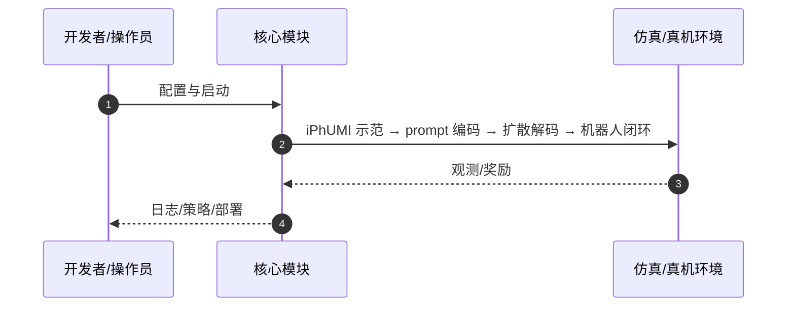

# Behavior Prompting Policy（arXiv:2606.30457）

**Behavior Prompting Policy**（Austin Patel, Ben Pekarek, Joel Enrique Castro Hernandez, Shuran Song；Stanford University; UC Berkeley；[arXiv:2606.30457](https://arxiv.org/abs/2606.30457)，[项目页](https://behavior-prompting.github.io/)）— 把单次人类示范当作测试时 prompt，与当前观测一起输入 Transformer 扩散策略，无需微调即可执行新任务或定义新能力。

## 一句话定义

把单次人类示范当作测试时 prompt，与当前观测一起输入 Transformer 扩散策略，无需微调即可执行新任务或定义新能力。

## 英文缩写速查

| 缩写 | 英文全称 | 简要说明 |
|------|----------|----------|
| BPP | Behavior Prompting Policy | 本文 in-context 策略 |
| iPhUMI | iPhone UMI | 手持采集与测试时 prompt 接口 |
| IL | Imitation Learning | 训练期 in-context 示范混合 |
| ICL | In-Context Learning | 测试时单示范条件化 |

## 为什么重要

为新任务重训或微调成本高；behavior prompting 借鉴 LLM 少样本适配到机器人 sensorimotor 空间。

## 核心原理（方法）

prompt 编码器 + 扩散动作解码器；训练数据任务多样性是关键；iPhUMI 无线传输测试示范。

## 实验与评测

DrawAnything 绘制与 LIBERO-Gen 桌面操作；测试时单示范泛化未知任务。

## 结论

BPP 把「示范即 prompt」做成可扩展教授接口，任务多样性比示范数量更驱动泛化。

- 测试时单示范即可切换任务
- iPhUMI 同时服务采集与部署 prompt
- LIBERO-Gen 支持程序化评测
- 依赖训练期见过足够多样的 prompt 分布

## 源码运行时序图

官方入口见 frontmatter `code` / 项目页。运行时主干：

- **最短路径：** 克隆官方仓库 → 按 README 安装依赖 → 运行训练/采集/部署入口脚本。

## 局限与风险

极长时程或高精度力控任务仍受限；iPhUMI 生态需单独安装。

## 与其他工作对比

相对 task-specific 微调，零梯度测试时适配；相对语言条件，示范同时定义任务与风格。

## 关联页面

- [paper-gated-memory-policy](./paper-gated-memory-policy.md)
- [manipulation](../tasks/manipulation.md)
- [teleoperation](../tasks/teleoperation.md)
- [REALab 14 篇技术地图](../overview/realab-14-papers-technology-map-2026.md)

## 参考来源

- [behavior_prompting_arxiv_2606_30457.md](../../sources/papers/behavior_prompting_arxiv_2606_30457.md)
- [wechat_shenlan_realab_14_papers_2026.md](../../sources/blogs/wechat_shenlan_realab_14_papers_2026.md)

## 推荐继续阅读

- 论文：<https://arxiv.org/abs/2606.30457>
- 项目页：<https://behavior-prompting.github.io/>
