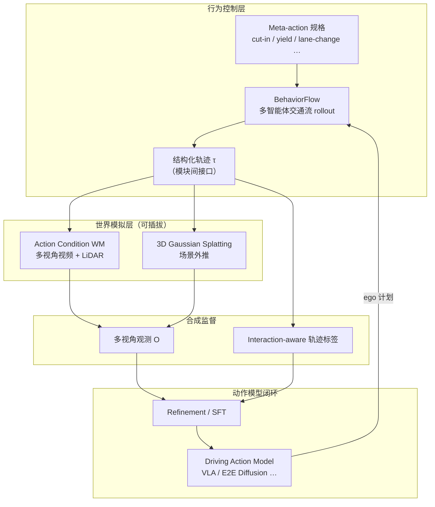

# BehaviorWorldGen（行为感知结构化世界生成闭环）

**BehaviorWorldGen**（*Closing the Loop between Action Models and World Simulators via Controllable Behavior-Aware Structured World Generation*，[arXiv:2608.22187](https://arxiv.org/abs/2608.22187)，[项目页](https://behaviorworldgen.github.io/)，2026-08）由 **AFARI / 千里科技（Qianli Technology）世界模型团队** 与 **旷视（MEGVII）** 联合提出：针对「**世界模拟器想象 → 合成数据 → 动作模型自改进**」闭环里 **周车交互不真实、分布失衡** 的瓶颈，插入 **BehaviorFlow**——在 **结构化轨迹** 层先做 **meta-action 可控的多智能体交通流 rollout**，再交给 **可插拔 world simulator** 渲染多视角观测，并与 **interaction-aware 轨迹标签** 配对微调策略。

## 一句话定义

**用 BehaviorFlow 在轨迹层生成行为一致的多车交互，再渲染成观测数据闭环 refine 驾驶 action model，而不是让像素 world model 独自承担周车逻辑。**

## 英文缩写速查

| 缩写 | 英文全称 | 简要说明 |
|------|----------|----------|
| BehaviorWorldGen | Behavior-Aware Structured World Generation | 本文总框架：行为感知结构化世界生成闭环 |
| BehaviorFlow | Meta-Action-Conditioned Traffic-Flow Model | 核心：可解释 meta-action 控制的多智能体轨迹生成 |
| AWM | Action Condition World Model | 项目页世界模拟器路径之一：动作条件多视角视频 WM |
| 3DGS | 3D Gaussian Splatting | 项目页另一渲染路径：高斯溅射场景外推 |
| PDMS | Predictive Driver Model Score | NAVSIM 综合规划评测分 |
| NAVSIM | Non-reactive Autonomous Vehicle Simulation | 本文策略微调主基准 |
| VLA | Vision-Language-Action Model | 动作模型族之一（如 ChainFlow-VLA） |
| E2E | End-to-End | 端到端驾驶规划模型族（如 DiffusionDrive） |

## 为什么重要

- **闭环仿真的真正短板是交互，不是像素。** 纯 learned world simulator 常把周车当成「背景纹理」，合成数据 **交互物理不可信 + 长尾场景欠采样**——aggregate PDMS 掩盖不了 `[0, 0.15)` 分桶 **0 分** 的崩溃。
- **轨迹接口解耦 action model 与 renderer。** 结构化 rollout 作为中间表示，可同时换 **ChainFlow-VLA / DiffusionDrive** 与 **AWM / 3DGS** 两类 simulator，避免「一个 monolithic WM 包打天下」。
- **meta-action 是可审计的数据增广旋钮。** cut-in 后跟车/变道/急避、路口互让等变体 **显式指定行为意图**，比黑盒 prompt 更适合 **难交互场景** 定向补数据。
- **增益集中在低分桶。** DiffusionDrive 在原始 PDMS `[0, 0.15)` 从 **0.0→34.8**，说明方法价值在 **修复策略闭环里的交互失败模式**，而非刷 aggregate 榜一位小数。

## 核心信息

| 项 | 内容 |
|----|------|
| **机构** | AFARI / 千里科技（Qianli Technology）；旷视（MEGVII） |
| **Venue** | arXiv 预印本（2026-08-23 投稿，v2 2026-08-27） |
| **任务轴** | 世界生成 / 场景外推 / **策略 refinement**（NAVSIM） |
| **开源** | **未开源** — 截至 **2026-09-18** 项目页无 GitHub / HF 链接（见下） |

## 开源状态

核查日：**2026-09-18**（[项目页](https://behaviorworldgen.github.io/) Hero、Footer、全站 HTML）。

| 产物 | 状态 |
|------|------|
| 论文 arXiv | **已发布** |
| 演示视频（BehaviorFlow、AWM、3DGS、Film Preview） | **已发布** |
| 训练 / 推理代码、权重、数据集 | **未列出** |

## 流程总览

## 核心原理

### BehaviorFlow：meta-action 条件交通流

| 机制 | 要点 |
|------|------|
| **输入** | 场景上下文 + **meta-action**（可解释高层行为，如 cut-in、让行、紧急避让） |
| **输出** | **多智能体联合 rollout** — 指定车执行目标行为，周车可对 ego / 彼此反应 |
| **与脚本回放区别** | 不是固定 NPC 轨迹；仍保留 **响应式交互** |
| **项目页样例** | 直道 cut-in 三变体（Follow / Change Lane / Emergency Avoidance）；路口左转 vs 对向 **互让** 两变体 |

### 结构化轨迹接口

- **轨迹 τ** 连接 BehaviorFlow、world simulator、action model **三方**。
- Action model 只负责 **ego 规划**；周车行为由 BehaviorFlow **显式生成** → 减轻 pixel WM 「猜 NPC 意图」负担。
- 渲染侧至少演示两条路：**动作条件世界模型（AWM）** 与 **3DGS 外推**。

### World Simulator 能力（项目页）

| 路径 | 展示能力 |
|------|----------|
| **AWM** | 长时域自回归 7 视角视频；**轨迹编辑**（直行↔转弯、变道、超车）；LiDAR；天气/雾迁移；动物合成 |
| **3DGS** | **Scene extrapolation** — 外推未观测区域的可漫游视频 |

## 源码运行时序图

**不适用** — 截至 **2026-09-18** [项目页](https://behaviorworldgen.github.io/) **未提供** GitHub / 可运行代码入口；仅有 arXiv 与托管演示视频。若官方后续发布仓库，应按 README 补 `sources/repos/` 与本节 **sequenceDiagram**。

## 工程实践

| 项 | 建议 |
|----|------|
| **闭环选型** | 若已有 pixel WM 但 **周车交互假**，优先在 **轨迹层** 补 BehaviorFlow 类模块，而非无限堆视频 diffusion 步数 |
| **meta-action 设计** | 从 **长尾交互**（cut-in、无保护左转、急刹）枚举可控变体，对齐 NAVSIM 低分桶 |
| **simulator 解耦** | AWM 负责 **传感器逼真**；3DGS 负责 **几何外推** — 按下游任务选 renderer，共享同一 τ |
| **评测读法** | 必看 **低 PDMS 分桶**；aggregate +0.9 掩盖 `[0,0.15)` **+34.8** 才是闭环价值 |
| **基线对照** | VLA 侧看 ChainFlow-VLA；E2E 侧看 [DiffusionDrive](./paper-diffusiondrive.md) 复现基线 |
| **开源边界** | 当前 **不可复现训练**；引用数字以项目页表格为准，勿臆造代码路径 |

## 评测与结果

**基准：** NAVSIM — **PDMS** 及 NC / DAC / EP / TTC / Comfort。

| 动作模型 | Baseline PDMS | + BehaviorWorldGen | Δ |
|----------|---------------|-------------------|---|
| ChainFlow-VLA | 93.1 | **93.3** | +0.2 |
| ReCogDrive | 86.5 | **87.3** | +0.8 |
| DiffusionDrive | 87.7 | **88.6** | +0.9 |

**DiffusionDrive 低分场景（按原始 PDMS 分桶）：**

| 分桶 | Baseline | Ours | Δ PDMS |
|------|----------|------|--------|
| [0, 0.15) | 0.0 | **34.8** | +34.8 |
| [0.15, 0.3) | 20.8 | **39.4** | +18.6 |
| [0.3, 0.45) | 38.2 | **60.0** | +21.8 |

## 与其他工作对比

> 下表做**定位对照**：本页 PDMS 数字取自论文 / 项目页表格，与下列各页的评测设定不通用；跨页搬运前须确认基准与基线模型。

| 对照 | 差异读法 |
|------|----------|
| [DiffusionDrive](./paper-diffusiondrive.md) | 被改进对象而非竞争者：DiffusionDrive 是 NAVSIM 上的 E2E 基线，本文给它补合成数据后 aggregate PDMS 87.7→88.6、`[0,0.15)` 分桶 0.0→34.8。读增益要看分桶，aggregate 会低估 |
| [M⁴World](./paper-m4world.md) | 同为驾驶世界模型，**周车逻辑由谁承担**不同：M⁴World 在多视角 + LiDAR 生成里处理物体级交互，本文把交互提前到**轨迹层**由 BehaviorFlow 显式生成，渲染器只负责像素。一个让 WM 兼职，一个把职责拆开 |
| [X-World](./paper-x-world.md) / [RISE 自适应想象 WAM](./paper-rise-adaptive-imagination-wam.md) | 同属「想象出数据再回灌策略」，控制旋钮不同：这两页的想象由模型自行展开，本文用可枚举的 meta-action（cut-in / 让行 / 急避）当旋钮。可审计性 vs 多样性 |
| [WorldScore](./paper-worldscore.md) | 正交而非对照：WorldScore 评世界模型自身（相机可控性、生成质量），本文锚的是**下游驾驶策略闭环分数**。世界模型好看不等于策略变好，两类指标要分开报 |
| [端到端自动驾驶十大算法](./../overview/e2e-autonomous-driving-top10-algorithms.md) | 产业 E2E 地图；本文不是一条新 E2E 算法，而是给这些算法补数据的上游件 |

## 结论

BehaviorWorldGen 说明驾驶 **action–world 自改进闭环** 的瓶颈往往在 **周车行为生成**，而非 ego 像素 imagination  alone；BehaviorFlow 把 **可解释 meta-action 交通流** 插入轨迹层，再用可插拔 simulator 渲染，是 **工程上可模块替换** 的闭环架构。

- **真影响指标：** NAVSIM **低 PDMS 分桶**（尤其 `[0, 0.15)` 从 0 恢复到可用规划分）— 难交互长尾才是合成数据主战场。
- **次要代价：** aggregate PDMS 增益 modest（VLA +0.2）— 高基线模型上不要期待大幅刷榜。
- **部署读法：** 优先服务 **已有 WM 但 NPC 假** 的团队；轨迹接口允许 **分阶段接入** AWM 或 3DGS。
- **数据策略：** meta-action 枚举（cut-in / yield / emergency）比 blind rollout 更可控地 **重平衡交互分布**。
- **评测习惯：** 报告必须带 **分桶表**，否则 aggregate 会低估方法价值。
- **开源：** 截至入库日 **无代码** — 当前适合 **架构与实验数字** 引用，不适合直接复现。

## 局限与风险

- **未开源：** 无官方训练 / 推理入口；BehaviorFlow 与 AWM 细节需等代码发布再审计。
- **NAVSIM 非反应式：** PDMS 提升 **不自动等于** 实车闭环安全；需与 reactive sim / 实车验证对照。
- **Renderer 域差：** AWM 合成观测与真实传感器仍有 gap；轨迹标签质量依赖 BehaviorFlow 本身误差。
- **meta-action 覆盖：** 项目页演示行为族有限；开放道路 **corner case** 仍需持续扩展 action 词汇表。
- **与开放域 WM 评测正交：** 不替代 [WorldScore](./paper-worldscore.md) 相机可控或 [HarnessEval-W](./paper-harnesseval-w.md) 交互探针 — 本文锚 **驾驶策略闭环**。

## 关联页面

- [生成式世界模型](../methods/generative-world-models.md) — 驾驶 / 多智能体实例总览
- [World Action Models](../concepts/world-action-models.md) — Cascaded 闭环与 control utility
- [DiffusionDrive](./paper-diffusiondrive.md) — NAVSIM E2E 基线与本文 +0.9 / 低分桶对照
- [M⁴World](./paper-m4world.md) — 多视角+LiDAR 驾驶 WM（物体级交互）
- [端到端自动驾驶十大算法](./../overview/e2e-autonomous-driving-top10-algorithms.md) — 产业 E2E 地图

## 参考来源

- [BehaviorWorldGen arXiv 归档](../../sources/papers/behaviorworldgen_arxiv_2608_22187.md)
- [BehaviorWorldGen 项目页归档](../../sources/sites/behaviorworldgen-github-io.md)

## 推荐继续阅读

- Wang et al., *BehaviorWorldGen: Closing the Loop between Action Models and World Simulators via Controllable Behavior-Aware Structured World Generation*, [arXiv:2608.22187](https://arxiv.org/abs/2608.22187)
- [BehaviorWorldGen 项目页演示](https://behaviorworldgen.github.io/) — BehaviorFlow 与双路径 world simulator 视频
