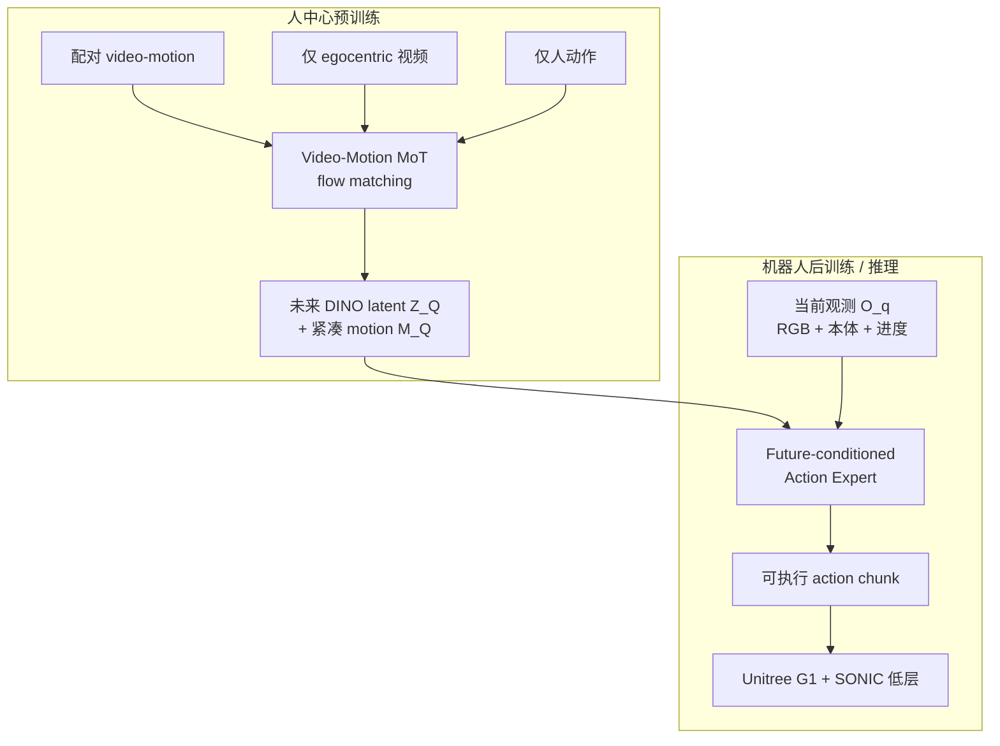

# Being-M0.7（人形潜空间 World–Action Model）

**Being-M0.7**（*Being-M0.7: A Latent World-Action Model for Humanoid Robots*，BeingBeyond Technical Report，2026-07-14）提出：可扩展人形 loco-manipulation 不应只依赖昂贵机器人示范或反应式动作模仿，而应先在大规模 **人中心混合模态** 数据上学 **video-motion 先验**，再用 **future-conditioned action expert** 将其接地为具身相关全身命令。先验在 **DINO 视觉 latent** 与 **紧凑全身 motion** 上联合预测未来，motion 充当 **粗粒度动作级计划**；轻量专家结合预测未来上下文与当前观测输出 **低层 action chunk**，形成完整 **世界–动作模型**。

## 一句话定义

**用人数据预训练 latent video-motion 先验，再用单向 action expert 在少量 G1 全身演示上接地**——把像素级世界建模换成 **DINO 语义 latent + 头根紧凑 motion**，以 **低频计划 / 高频 chunk 控制** 闭环人形 loco-manipulation。

## 英文缩写速查

| 缩写 | 英文全称 | 简要说明 |
|------|----------|----------|
| WAM | World Action Model | 联合环境演化预测与可执行控制的具身策略 |
| MoT | Mixture of Transformers | 模态专属计算 + 共享跨模态注意力 |
| G1 | Unitree G1 Humanoid | 本文真机与后训练平台 |
| VR | Virtual Reality | PICO 全身遥操作采集 |
| RGB | Red-Green-Blue | 头部 D435i egocentric 输入 |
| SMPL | Skinned Multi-Person Linear Model | VR 流估计的人体姿态中间表示 |

## 为什么重要

- **Cascaded WAM 的人形实例：** 显式分解 $P(Z_Q,M_Q\mid\cdot)\cdot P(a_q\mid Z_Q,M_Q,O_q,\cdot)$，先验负责 **场景演化 + 全身意图**，专家负责 **高频可执行命令**——与 [MotionWAM](./paper-motionwam-humanoid-loco-manipulation-wam.md) 的 **Joint 双 DiT** 形成 2026 人形 WAM **「人先验 + 后接地」vs「视频–动作联合端到端」** 对照轴。
- **缓解数据与算力双瓶颈：** **>10,000 h** 原始混合模态（三监督流：配对 / 仅视频 / 仅动作）把可用监督从「仅配对千小时级」扩到万小时级；**DINO latent** 避免像素重建，把容量集中在语义布局与场景演化。
- **统一人–机 motion 接口：** **head-root** 紧凑表示（头、双手、双脚）既可来自人动作也可经 **FK** 来自机器人轨迹，后训练除 action 标签外还提供 **vision + motion** 监督，推理时还有 **motion 级反馈路径**。
- **BeingBeyond 谱系延伸：** 与 [Being-H0.7](../methods/being-h07.md)（操作向潜空间 WAM + latent queries）同机构；M0.7 把同一「**不滚像素、用未来结构**」动机推到 **全身 loco-manipulation** 与 **SONIC/G1** 栈。

## 核心方法与结构

| 模块 | 作用 |
|------|------|
| **DINO 视觉编码** | 冻结 DINO 将帧映射为 $Z$；预测 **未来 image latent** 而非像素 |
| **紧凑 motion 表示** | head-root 规范化的头/双手/双脚向量 $M$；粗粒度全身计划 |
| **Video-Motion MoT prior** | 模态专属 LN/投影/FFN + **共享注意力**；DistilBERT 语言条件；**chunk 并行 flow matching** 去噪未来 |
| **Future-conditioned action expert** | 独立 flow Transformer；**单向**读取 prior 多层 $H^\theta(\tau)$ + 当前 $O_q$；输出 **action chunk** |
| **推理调度** | prior **周期性**刷新未来 video-motion 计划并缓存 KV；expert **高频**复用缓存 + 实时 $O_{cur}$ 更新 chunk |

### 流程总览

### 与 MotionWAM / Being-H0.7 的分界

| 维度 | Being-M0.7 | MotionWAM | Being-H0.7 |
|------|------------|-----------|------------|
| **WAM 族** | Cascaded（先验 → expert） | Joint（Video+Motion 双 DiT） | 潜空间策略内未来对齐 |
| **视觉接口** | DINO latent | Cosmos Video DiT latent | 紧凑未来嵌入 + latent queries |
| **动作接口** | 粗 motion + robot chunk | SONIC 统一 motion token | 直接 action chunk |
| **人数据角色** | **主预训练监督** | Stage 1–2 egocentric 视频 | 20 万 h 人视频 + 机演示 |
| **真机平台** | G1 + Linker O6 + VR 遥操作 | G1 + ALOHA2 + PICO VR | 多平台含 G1 |

## 实验要点（索引级）

| 轴 | 报告口径（以技术报告为准） |
|----|---------------------------|
| **平台** | Unitree G1；双 7-DoF 臂 + Linker Hand O6；头部 D435i；策略 **RTX 4090**；ZMQ 闭环 |
| **采集** | PICO VR + 踝 tracker + 手柄；XRoboToolkit→SMPL；**SONIC** 50 Hz 全身跟踪 |
| **任务** | Mirror Toy Grasping、Water-Tank Fish Scooping、Tabletop Organization、Obstacle-Avoidance Basket Carrying |
| **定量** | Mirror+Fish 共 **7/15** vs GR00T-N1.6 **2/15**、Ψ0 **3/15**；Mirror **4/10** vs 基线 **1/10**；Fish **3/5** vs **1/5** / **2/5** |
| **预训练规模** | 原始 **>10,226 h** 混合模态（8+ 数据集 + 内部数据） |

## 结论

**用人数据预训练 latent video-motion 先验，再用 future-conditioned action expert 在少量 G1 演示上接地，形成级联人形 loco-manipulation WAM。**

1. **Cascaded 分解计划与控制** — 先验预测未来 DINO latent 与紧凑 motion；expert 单向读取 prior 多层特征与当前观测，输出可执行 action chunk。
2. **万小时人中心数据破瓶颈** — 原始 >10,226 h 混合模态（配对 / 仅视频 / 仅动作）扩展监督；DINO latent 避免像素重建。
3. **head-root motion 统一人–机接口** — 头 / 双手 / 双脚既可来自人动作，也可经 FK 来自机器人轨迹；推理另有 motion 级反馈路径。
4. **真机相对反应式基线领先** — Mirror+Fish 共 7/15，对照 GR00T-N1.6 2/15、Ψ0 3/15。
5. **与 MotionWAM 对照选型** — 本文是「人先验 + 后接地」Cascaded；MotionWAM 是 Joint 视频–动作端到端；后训练依赖 VR 全身遥操作，任务规模仍有限。

## 常见误区或局限

- **误区：** 把 Being-M0.7 等同于 Being-H0.7 的「换名」；M0.7 是 **video-motion MoT 先验 + 独立 action expert** 的 **人形全身** 技术报告，训练目标与架构与 H 系 latent queries 不同。
- **误区：** 「latent」等于没有世界模型；本文仍 **显式预测未来视觉 latent 与 motion**，只是不做像素 rollout。
- **局限：** 真机定量任务数与试验规模仍有限；后训练数据依赖 **VR 全身遥操作**；技术报告未给出与 MotionWAM 同规模的九任务成功率表；分布偏移与跨场景鲁棒性待后续工作。

## 与其他页面的关系

- [World Action Models](../concepts/world-action-models.md) — **Cascaded** 族人形 loco-manip 实例
- [Loco-Manipulation](../tasks/loco-manipulation.md) — 评测语境与全身协调挑战
- [Being-H0.7](../methods/being-h07.md) — 同机构潜空间 WAM 操作线
- [MotionWAM](./paper-motionwam-humanoid-loco-manipulation-wam.md) — Joint 实时人形 WAM 对照
- [Teleoperation](../tasks/teleoperation.md) — VR 全身数据采集栈

## 推荐继续阅读

- 项目页与 PDF：[Being-M0.7](https://research.beingbeyond.com/being-m07) · [PDF](https://research.beingbeyond.com/being-m07/being-m07.pdf)
- 同机构前序：[Being-H0.7 项目页](https://research.beingbeyond.com/being-h07)（arXiv:2605.00078）

## 参考来源

- [sources/papers/being_m07.md](../../sources/papers/being_m07.md) — 本次 ingest 归档与摘录映射
- [Being-M0.7 项目页](https://research.beingbeyond.com/being-m07) — Overview、数据配方与演示视频
- Yue, J., et al. (2026). *Being-M0.7: A Latent World-Action Model for Humanoid Robots.* BeingBeyond Technical Report.

## 关联页面

- [World Action Models（WAM）](../concepts/world-action-models.md)
- [Loco-Manipulation（移动操作）](../tasks/loco-manipulation.md)
- [Being-H0.7（潜空间世界–动作模型）](../methods/being-h07.md)
- [MotionWAM（实时人形 WAM）](./paper-motionwam-humanoid-loco-manipulation-wam.md)
- [SONIC Motion Tracking](../methods/sonic-motion-tracking.md)
- [Teleoperation（遥操作）](../tasks/teleoperation.md)
- [Unitree G1](./unitree-g1.md)
- [Action Chunking](../methods/action-chunking.md)
- [Generative World Models](../methods/generative-world-models.md)
