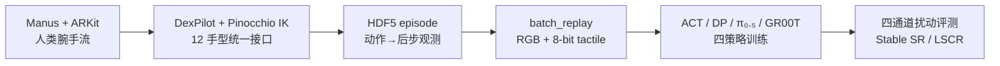
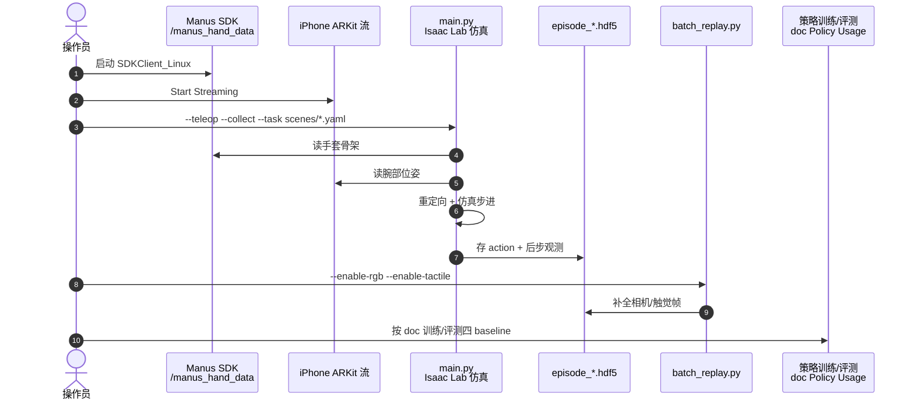

# Bench2Dex（arXiv:2609.15726）

**Bench2Dex**（*Bench2Dex: Benchmarking Visuo-Tactile Bimanual Dexterous Manipulation Across Dexterous Hands*，[arXiv:2609.15726](https://arxiv.org/abs/2609.15726)，[项目页](https://bench2dex.github.io/)，[代码](https://github.com/Bench2Dex/Bench2Dex)）由 **上海交通大学 / 复旦大学 / 香港大学** 等联合提出：在 **Isaac Lab** 上为 **12 种双臂灵巧手** 提供统一 visuotactile 观测格式与可执行长程任务评测。

## 一句话定义

**Isaac Lab 跨 12 灵巧手的 visuotactile 双臂基准：26 长程任务、~1.3K 遥操作 demo、共享 8-bit 触觉图、四通道七类扰动轴；训练 / 遥操作 / 四策略评测已开源。**

## 英文缩写速查

| 缩写 | 英文全称 | 简要说明 |
|------|----------|----------|
| SR | Success Rate | 稳定成功比例（终态 predicate dwell 后计） |
| LSCR | Latched Stage Completion Rate | 曾到达且有效的阶段里程碑完成率 |
| DP | Diffusion Policy | 扩散策略 baseline |
| VLA | Vision-Language-Action | 视觉–语言–动作（π₀.₅、GR00T N1.5 等） |

## 为什么重要

- **跨 hand morphology 缺统一 visuotactile 双臂底座**：多数 benchmark 优化单轴（单 gripper 多任务、或单手多 demo），Bench2Dex 同时覆盖 **embodiment 多样性 + 长程双臂 + 同步触觉 + 诊断式泛化**。
- **扰动轴可解释**：invariance（背景/纹理/光照等，正确动作不变）与 equivariance（物体位姿/桌高，动作应协同变化）分开报告，便于读 failure mode 而非只看 aggregate SR。
- **工程可复现**：官方开源采集、replay、四策略管线与 HF/ModelScope 资产（相对此前「待发布」状态已可跑通）。

## 核心信息

| 项 | 内容 |
|----|------|
| **机构** | 上海交通大学（SJTU）；复旦大学（Fudan）；香港大学（HKU）；Inspire Robots 等 |
| **平台** | Isaac Sim 5.1 + Isaac Lab v2.3.2 |
| **规模** | 12 embodiments × 26 tasks；~1.3K teleop demos |
| **开源** | **已开源**：[Bench2Dex/Bench2Dex](https://github.com/Bench2Dex/Bench2Dex)；数据/权重见 [HF](https://huggingface.co/Bench2Dex) / ModelScope |

## 流程总览

## 源码运行时序图

官方仓库 [Bench2Dex/Bench2Dex](https://github.com/Bench2Dex/Bench2Dex)（归档 [sources/repos/bench2dex.md](../../sources/repos/bench2dex.md)）：

- **最短复现路径：** 装 Isaac Sim 5.1 + Isaac Lab v2.3.2 → 下载 HF/ModelScope 资产 → 直接用 `teleopdata` + `policy_ckpt` 跑评测；自采需 Manus + iPhone。
- **数据裁剪：** 各策略管线按 `meta/homing_start_sim_step` 截断回 home 段，自定义管线应保持一致。

## 工程实践

| 项 | 读法 |
|----|------|
| **触觉** | 8-bit ray-cast 图是 **跨 hand 统一格式**，非特定 GelSight 输出；勿与真机触觉数值直接对齐 |
| **扰动** | 读 SR 必须带 **通道**（None/Equi./Inv./Full）；Full 为最难组合偏移 |
| **指标** | Stable SR ≠ 瞬时成功；长程任务看 **LSCR** 理解阶段进度 |
| **对比** | 26 任务与 12 手 **非完全 factorial**；task-level 对比不 isolate embodiment 效应（论文声明） |
| **文档** | 26 任务细节与 Policy Usage：[bench2dex.github.io/doc](https://bench2dex.github.io/doc/) |

## 实验与评测

- **Baselines：** ACT、Diffusion Policy、π₀.₅、GR00T N1.5；每 task–embodiment–channel **50 rollouts**（评估 episode，非独立重训 replicate）。
- **读法：** None 条件下 GR00T N1.5 aggregate stable success 最高；Full 通道全体退化；π₀.₅ 在 strict task-level leads 上仍有亮点。

## 与其他工作对比

| 维度 | 读法 |
|------|------|
| **LIBERO / RoboCasa / DROID** | 单 gripper 或缺 visuotactile + 多灵巧手横评 |
| **DexMimicGen / DexVerse** | 有灵巧手但缺 vision-based tactile 或双臂 visuotactile 统一轴 |
| **[HandEdit](./paper-handedit.md)** | 同团队：HandEdit 做人→机 **图像** embodiment 编辑；Bench2Dex 做 **仿真策略** visuotactile 双臂评测 |

## 结论

**Bench2Dex 把「跨灵巧手 visuotactile 双臂策略」从 anecdotal 对比拉成可复现 benchmark，扰动轴与 LSCR 比 headline SR 更值得先读。**

1. **已开源**：代码 + 数据/权重分发；部署前确认 Isaac 5.1 / Lab 2.3.2 版本钉死。
2. 先对齐 **任务 predicate、dwell、通道**，再解读四策略 SR/LSCR。
3. 仿真触觉是 **开发底座**，论文明确不替代真机触觉——Sim2Real 需另设计。
4. 自采 demo 成本高（Manus + ARKit）；多数研究者可直接用发布 `teleopdata`。
5. 与 [HandEdit](./paper-handedit.md) 组合：前者补 human-video→robot 视觉域，后者补 policy 级 visuotactile 双臂横评。

## 关联页面

- [isaac-lab](../entities/isaac-lab.md)
- [vla](../methods/vla.md)
- [manipulation](../tasks/manipulation.md)
- [paper-handedit](./paper-handedit.md)

## 参考来源

- [bench2dex_arxiv_2609_15726.md](../../sources/papers/bench2dex_arxiv_2609_15726.md)
- [bench2dex-github-io.md](../../sources/sites/bench2dex-github-io.md)
- [bench2dex.md](../../sources/repos/bench2dex.md)
- [wechat_senlanke_weekly_manipulation_2026-09-14_18.md](../../sources/blogs/wechat_senlanke_weekly_manipulation_2026-09-14_18.md)

## 推荐继续阅读

- [Bench2Dex Documentation](https://bench2dex.github.io/doc/)
- [arXiv PDF](https://arxiv.org/pdf/2609.15726)
