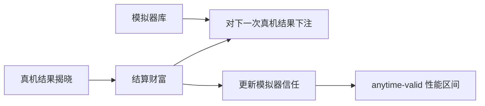
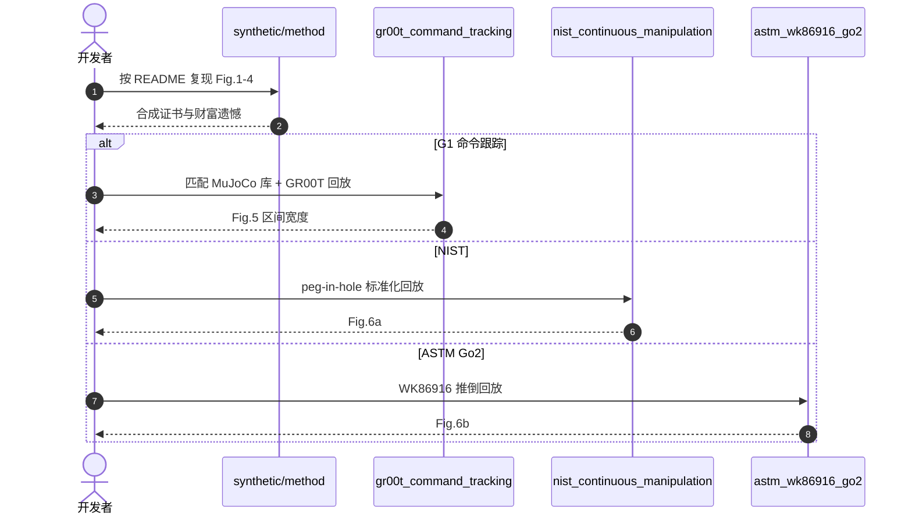

# Bet4Sim2Real：用仿真下注收紧真机证书

**Betting for Sim-to-Real Performance Certificates**（[arXiv:2608.21572](https://arxiv.org/abs/2608.21572)，[代码](https://github.com/ISUSAIL/Bet4Sim2Real-Certificate)）由 **艾奥瓦州立大学（Iowa State University）** 提出：在每次真机结果揭晓前，算法参考大规模模拟器库下注；真实结果结算财富并调整信任，再把累计财富转成覆盖真实均值的性能区间。

## 一句话定义

**仿真价值不只在训练策略，也能量化地减少现实评测不确定性——证书对任意模拟器库保持 anytime-valid。**

## 英文缩写速查

| 缩写 | 英文全称 | 简要说明 |
|------|----------|----------|
| S2R | Sim-to-Real | 仿真到真机；本文评测而非训练 |
| NIST | National Institute of Standards and Technology | 连续移动操作回放集 |
| ASTM | American Society for Testing and Materials | WK86916 Go2 推倒协议 |
| GR00T | Generalist Robot 00 Technology | G1 命令跟踪实验 |
| CI | Confidence Interval | 被下注证书收窄的经典对照 |

## 为什么重要

- **真机样本贵：** 经典区间过宽，证书没有决策价值。
- **不要求模拟器正确：** 理论对任意模拟器库成立；信任在结算中迁移。
- **可复现：** 合成图 + 三组标准化测试回放都在仓里。

## 核心信息

| 项 | 内容 |
|----|------|
| **机构** | 艾奥瓦州立大学（Iowa State University） |
| **机器人研究** | G1+GR00T 命令跟踪；NIST peg-in-hole；ASTM Go2 推倒 |
| **开源** | **已开源**（无 SPDX）：[ISUSAIL/Bet4Sim2Real-Certificate](https://github.com/ISUSAIL/Bet4Sim2Real-Certificate) |

## 核心原理（方法）

每次真实结果出现前，算子「偷看」模拟器库并下注真实结果会落在哪。结算后财富涨跌，同时调整对各模拟器的权重。财富过程映射为对真实均值的区间，并在任意停止时刻保持覆盖保证。财富遗憾界反过来指导如何配模拟器库与下注算法。

### 流程总览

## 源码运行时序图

节点对齐 [`sources/repos/bet4sim2real.md`](../../sources/repos/bet4sim2real.md)。

- **最短复现：** 先跑 `synthetic/`，确认证书实现与 Fig.1–4。
- **机器人图：** 三个子目录各有数据说明，不要混用配置。

## 工程实践

| 项 | 建议 |
|----|------|
| 模拟器库 | 多样性比「最像真机的一个」更重要；遗憾界按库配置 |
| 停止规则 | anytime-valid 允许看数据后停止，但仍按预定置信 |
| 不要当训练算法 | 这是评测证书，不生成策略 |
| 许可 | 仓内无 LICENSE，商用前自行确认 |

## 实验与评测

| 设定 | 结果 |
|------|------|
| 相对经典/SOTA 基线 | 证书平均收窄 **51.6% ± 16%** |
| ≤30 真机样本 | 仍收窄 **32.26% ± 8%** |
| 机器人 | 合成分布 + 回放标准化测试 + 在线运行时评测 |

## 结论

**少样本真机评测的第一件事不是再跑 100 次，而是把已有仿真库变成有效赌注。**

1. **真影响指标是区间宽度** — 不是点估计更漂亮。
2. **anytime-valid 是底线** — 偷看数据再停也不能破坏覆盖。
3. **模拟器可以全错** — 保证不依赖「有一个真模型」。
4. **标准化回放先于新策略** — 仓内三条机器人线都是评测，不是训练。
5. **无 SPDX** — 复现实验可以，产品集成先补许可。

## 与其他工作对比

| 对照 | 差异读法 |
|------|----------|
| 经典 t 区间 | 忽略仿真库，小样本必宽 |
| Rapid Policy Evaluation 等 | 仓内列为相关实现；本文强调下注 + 财富映射 |
| 用仿真直接当真值 | 本文从不假设仿真无偏 |

## 局限与风险

- 证书质量受模拟器库覆盖与下注算法配置影响；库太同质则收窄有限。
- 机器人实验以回放为主，在线部署需自己接数据采集。
- 无许可证文件。

## 关联页面

- [Sim2Real](../concepts/sim2real.md)
- [Sim2Real Gap 缩减](../queries/sim2real-gap-reduction.md)
- [Isaac GR00T](./isaac-gr00t.md)
- [具身评测基准枢纽](../overview/hub-embodied-eval-benchmark.md) — ④ 层：把真机评测结论的不确定性量化成证书
- [48ms WAM / 编排 10 篇地图](../overview/glancewam-vla-crew-10-papers-technology-map.md)

## 参考来源

- [bet4sim2real_arxiv_2608_21572](../../sources/papers/bet4sim2real_arxiv_2608_21572.md)
- [仓库归档](../../sources/repos/bet4sim2real.md)
- [具身智能小站 10 篇盘点](../../sources/blogs/wechat_embodied_station_10_papers_glancewam_vla_crew_2026-08-30.md)

## 推荐继续阅读

- [arXiv:2608.21572](https://arxiv.org/abs/2608.21572)
- [GitHub](https://github.com/ISUSAIL/Bet4Sim2Real-Certificate)
