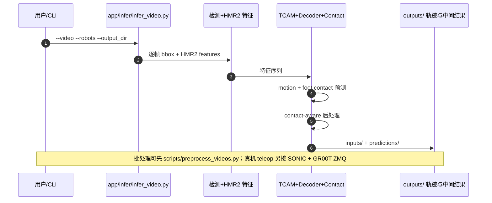

# BeyondRetarget（单目视频 → 可执行人形 motion）

**BeyondRetarget**（*Learning Executable Humanoid Motions Directly from Monocular Video*，[arXiv:2609.29850](https://arxiv.org/abs/2609.29850)，[项目页](https://bear-ty.github.io/Beyondretarget_page/)）来自 **南京大学** 与 **江苏移动 / 中国移动紫金创新研究院** 等：跳过推理期 **显式 SMPL 人体中间态**，从单目 RGB 直接学 **面向机器人的隐式共享 motion 特征**，解码到 **八款人形** 的根轨迹与关节，并以 **接触感知后处理** 提升时序一致性与物理可信度；支持 **~50 FPS 级流式推理** 与 **单目视觉全身遥操作**（需另接 SONIC 等执行栈）。

## 一句话定义

单目人类视频不经「人体重建→重定向」两阶段，而是端到端输出多机种人形可执行 motion，并用接触约束 refine 降低 collapse 与延迟。

## 英文缩写速查

| 缩写 | 英文全称 | 简要说明 |
|------|----------|----------|
| HMR | Human Mesh Recovery | 单目人体 mesh/姿态估计（本工作用 HMR2.0 作冻结视觉骨干） |
| IK | Inverse Kinematics | 接触 refine 阶段的约束腿 IK |
| GMR | General Motion Retargeting | 两阶段对照：优化式重定向 |
| NMR | Neural Motion Retargeting | 两阶段对照：学习式重定向 |
| SR | Success Rate | 仿真/执行成功率 |
| TCAM | Temporal Context Aggregation Module | BiGRU + RoPE + cross-window 时序编码 |

## 为什么重要

- **把 retargeting 从「SMPL 后处理」改成「机器人空间直接监督」。** 人与 humanoid 在 DoF、比例与动力学上差异大；两阶段还把 **视频估计误差** 原样灌进重定向且 **无法端到端反传**。
- **多机共享 encoder、轻量换 decoder。** 相对「新机整套重训 NMR」或论文对照里 **GVHMR/WHAM→优化式 retargeting** 报告的 **motion collapse**，共享 $\mathbf{u}_t$ + robot-specific 残差头更利于 **跨形态扩展**（页内八机 RAMPJPE 表）；**不否定** [GMR](../methods/motion-retargeting-gmr.md) 作为离线运动学工具的价值。
- **实时 teleop 证据。** 同 GPU 上 **~192.8 ms median latency** vs GVHMR→GMR **~1369 ms**；项目页演示 **仅单目 1080p@30Hz** 驱动真机（背景 mocap 未开）。
- **与 [Retargeting Matters](./paper-hrl-stack-01-retargeting_matters.md) 同命题不同解：** 仍关心 **可执行参考质量**，但路线是 **绕过显式 human representation** 而非只优化 GMR 目标。

## 流程总览

## 核心机制（详细）

| 模块 | 职责 |
|------|------|
| 冻结视觉 | 人体检测 + **HMR2.0** 提帧级 human-centric 特征（训练侧仍可用 SMPL 数据做 **统一 human–robot 监督**，推理 **不需** SMPL 文件） |
| TCAM | BiGRU、RoPE self-attention、cross-window attention 建模局部与长程上下文 |
| 解码 | 各机器人 **残差** 预测 root 平移、连续 root 旋转、$d_r$ 维关节 |
| Contact-aware | 足端接触/support 识别 → 时序滤波、root 修正、约束 IK |
| 多机 | G1、R1、H1、T1、Tienkung、GR1-T1、GR2-V3、Atlas 等 |

**两阶段对照（项目页主表，固定相机设定）：** BeyondRetarget **RAMPJPE 26.36 mm**、**Simulation SR 95.86%**；GVHMR→GMR **39.46 mm / 86.46%**；WHAM→GMR **45.88 mm / 81.49%** 且 **Jitter/Accel 显著更差**；qualitative 上两阶段在 **双手抱腰/背后/大画圆/深蹲** 等出现 **motion collapse**。

## 评测与结果

- **精度与鲁棒：** 相对 GVHMR/WHAM→NMR/GMR 与 GT→NMR/GMR，报告更低 RAMPJPE、更低 failure rate（>65 mm / >100 mm）与更低 foot slide；仿真 SR 与 sim RAMPJPE 列见项目页表格。
- **八机泛化：** 共享特征 + 各机 decoder；GMR 未支持机型在表中为「—」。
- **实时：** Latency **192.8 ms**、throughput **~50 FPS**、peak VRAM **7.03 GiB**（同 GPU 流式管线，对照 GVHMR→GMR **1369.4 ms**）。
- **真机：** 项目页含单臂大圆、深蹲抬腿、侧 stretch、双手背后等 **真机 vs 两阶段** 视频；teleop 段声明 **仅单目相机**。

## 源码运行时序图

## 工程实践（含开源状态）

| 项 | 结论 |
|----|------|
| arXiv | <https://arxiv.org/abs/2609.29850> |
| 项目页 | <https://bear-ty.github.io/Beyondretarget_page/> |
| 代码 | **已开源** [bear-ty/BeyondRetarget](https://github.com/bear-ty/BeyondRetarget)；`scripts/setup_rgb2robo.sh` + Google Drive checkpoint |
| Demo | [HF Space bear-ty/BeyondRetarget](https://huggingface.co/spaces/bear-ty/BeyondRetarget) |
| 版本 | 当前 **base 版**：实时 teleop；**不支持** moving camera / 大尺度 global trajectory（**performance 版** 计划后续开源） |
| 依赖 | Linux x86_64、CUDA 12.1、Python 3.10、PyTorch 2.3；HMR2/YOLOv8x 权重随 setup 下载 |
| 真机闭环 | README：**SONIC 单独安装**，经本项目 **GR00T ZMQ** 接口接视觉遥操作 |

## 结论

**BeyondRetarget 用「共享 robot-oriented 视觉 motion 特征 + 接触 refine」把单目视频→人形可执行轨迹做成可实时、可扩展的多机 pipeline，核心增益来自消除两阶段信息瓶颈而非把 GMR 调参做到极致。**

1. **主指标：** 项目页报告 **Sim SR 95.86%**、**RAMPJPE 26.36 mm**，且 **failure rate（>65 mm）0%** 相对两阶段 GVHMR/WHAM 管线显著更低。
2. **collapse 是硬差异：** 双手背后/大画圆等场景两阶段 **GT SMPL 仍失败** 的 qualitative 说明瓶颈不只在估计噪声，而在 **human-centric 中间表示**。
3. **部署读法：** 选型 **base 版** 时默认 **固定相机、无大全局轨迹**；户外/跟拍需等 **performance 版** 或自研后处理。
4. **工程入口：** 复现从 `infer_video.py` 与 Drive checkpoint 开始；真机 teleop 预算 **SONIC + ZMQ** 集成时间。
5. **与 GMR、NMR 对照：** 仍可把输出轨迹接 **whole-body tracking / IL**；上游质量逻辑与 [Retargeting Matters](./paper-hrl-stack-01-retargeting_matters.md) 一致，但 **生成路径** 不同。

## 与其他工作对比

| 对照 | 差异读法 |
|------|----------|
| GVHMR/WHAM → GMR/NMR | 经典 **human mesh 中间态 + 重定向**；BeyondRetarget 在论文表中 **更低 RAMPJPE / 更高 Sim SR**，qualitative 上少 **collapse** |
| [GMR](../methods/motion-retargeting-gmr.md) | GMR 仍是 **运动学层 IK/QP 重定向工具**；BeyondRetarget 批评的是 **串联 SMPL 估计误差** 的两阶段 **管线**，不是 GMR 单独模块 |
| [NMR](../methods/neural-motion-retargeting-nmr.md) | NMR 学习 human→robot 映射但常 **绑定训练机形**；BeyondRetarget 用 **共享视觉 motion 特征 + 轻量 decoder** 扩八机 |
| [HTD-Refine](../entities/paper-htd-refine-monocular-hmr.md) | 在 SMPL 轨迹上 **后处理 refine**；BeyondRetarget **推理期不要 SMPL** |
| [MotionWAM](./paper-motionwam-humanoid-loco-manipulation-wam.md) | 下游 **WAM 闭环 loco-manip**；BeyondRetarget 解决 **上游单目→参考 motion / teleop** |

## 关联页面

- [Motion Retargeting Pipeline](../concepts/motion-retargeting-pipeline.md)
- [GMR](../methods/motion-retargeting-gmr.md)
- [NMR](../methods/neural-motion-retargeting-nmr.md)
- [Teleoperation](../tasks/teleoperation.md)
- [SONIC](../methods/sonic-motion-tracking.md)

## 参考来源

- [beyondretarget_arxiv_2609_29850.md](../../sources/papers/beyondretarget_arxiv_2609_29850.md)
- [beyondretarget-github-io.md](../../sources/sites/beyondretarget-github-io.md)
- [beyondretarget.md](../../sources/repos/beyondretarget.md)

## 推荐继续阅读

- [arXiv PDF](https://arxiv.org/pdf/2609.29850)
- [GitHub README 推理入口](https://github.com/bear-ty/BeyondRetarget/blob/main/README.md)
- [Retargeting Matters（两阶段质量命题）](./paper-hrl-stack-01-retargeting_matters.md)
