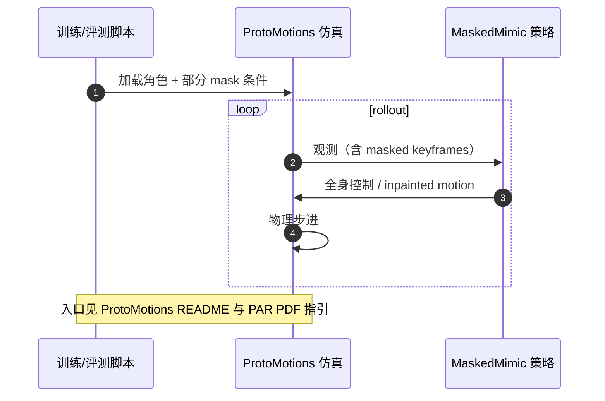

---

type: entity
tags: [paper, bfm, behavior-foundation-model, awesome-bfm-papers, nvidia]
status: complete
updated: 2026-09-27
venue: "SIGGRAPH Asia 2024 · ACM TOG"
code: https://github.com/NVlabs/ProtoMotions
summary: "MaskedMimic（TOG 2024）：masked motion inpainting 统一物理角色控制；稀疏/部分约束下补全全身轨迹；官方实现经 ProtoMotions 开源。"
related:
  - ../overview/humanoid-motion-cerebellum-technology-map.md
  - ../overview/motion-cerebellum-category-02-motion-imitation.md
  - ../concepts/behavior-foundation-model.md
  - ../overview/bfm-41-papers-technology-map.md
  - ../overview/bfm-category-02-goal-conditioned-learning.md
  - ./protomotions.md
  - ./paper-loco-manip-161-097-harmon.md
sources:
  - ../../sources/sites/maskedmimic-nvidia-par.md
  - ../../sources/papers/bfm_awesome_maskedmimic_tog_2024.md
  - ../../sources/repos/protomotions.md
  - ../../sources/papers/bfm_awesome_41_catalog.md
  - ../../sources/blogs/wechat_embodied_ai_lab_bfm_41_papers_survey.md
  - ../../sources/papers/motion_cerebellum_64_catalog.md
  - ../../sources/blogs/wechat_embodied_ai_lab_humanoid_motion_cerebellum_survey.md
---

# MaskedMimic

**MaskedMimic** 收录于 [awesome-bfm-papers](https://github.com/friedrichyuan/awesome-bfm-papers) **第 17/41** 篇，归类为 **02 Goal-conditioned 学习**（2024 · TOG）。

## 一句话定义

稀疏/遮蔽条件下补全全身轨迹；贴近语言只给部分约束的现实。

## 英文缩写速查

| 缩写 | 英文全称 | 简要说明 |
|------|----------|----------|
| BFM | Behavior Foundation Model | 大规模行为数据预训练的可复用全身行为先验 |
| AMP | Adversarial Motion Prior | 用对抗判别约束状态转移接近专家运动分布的先验 |

## 为什么重要

- 稀疏/遮蔽条件下补全全身轨迹；贴近语言只给部分约束的现实。
- 在 [BFM 41 篇技术地图](../overview/bfm-41-papers-technology-map.md) 中属于 **02 Goal-conditioned 学习**（#17/41）。

## 核心信息

| 字段 | 内容 |
|------|------|
| 编号 | 17/41 |
| 分组 | 02 Goal-conditioned 学习 |
| 出处 | 2024 · TOG |
| 论文 | <https://research.nvidia.com/labs/par/maskedmimic/assets/SIGGRAPHAsia2024_MaskedMimic.pdf> |
- **代码/项目：** <https://github.com/NVlabs/ProtoMotions>

## 核心机制（归纳）

### Masked motion inpainting

在 **部分 body / keyframe 被 mask** 时，模型 **inpaint** 剩余自由度，使 **物理仿真角色** 仍满足目标条件（稀疏 keyframe、局部 command 等）。这与「整条参考轨迹跟踪」不同：上层接口常只约束 **子集**（类似语言只描述手势片段）。

### 与 ProtoMotions 栈

官方 **代码入口** 为 [NVlabs/ProtoMotions](https://github.com/NVlabs/ProtoMotions)（Apache-2.0）：大规模 GPU 仿真 + RL/模仿模块。MaskedMimic 作为 **TOG 2024** 方法挂在此框架生态，而非独立小仓库。

### 与 Harmon 的对读

[Harmon](./paper-loco-manip-161-097-harmon.md) 用语言 + VLM **生成/编辑** 人形 reference motion；MaskedMimic 在 **物理角色** 上做 **条件补全**。二者都扩大「全身行为」，但 Harmon 偏 **语义生成**，MaskedMimic 偏 **部分观测下的物理控制**。

## 源码运行时序图

## 结论

**MaskedMimic 把「上层只给得出部分约束」变成默认设定：在稀疏/遮蔽条件下补全全身轨迹，而不是要求一条完整参考——这正对应语言等上层接口的现实形态。**

- 它归在 **goal / reference / command 条件化** 一族：目标是扩展人形可执行动作库，数据侧融合 MoCap、视频、遥操作与 HOI，控制侧看抗扰、恢复与跨参考泛化。
- 它回答的是 BFM taxonomy 里「身体能覆盖多少目标条件技能」，而不是某条参考跟得多准；用单参考跟踪指标衡量会错配评价维度。
- 边界不变：条件形态更灵活不等于无限技能，仍受数据分布、接触建模与实机 Sim2Real 约束——遮蔽补全放宽的是 **输入约束**，不是物理可行域。
- 工程侧代码/项目指向 <https://github.com/NVlabs/ProtoMotions>（2024 · TOG）；本页为清单坐标（#17/41，**02 Goal-conditioned 学习**），量化 benchmark 与实机指标以原文 PDF 为准。

## 常见误区

1. Goal-conditioned 跟踪不等于 unlimited skills：仍受数据分布、接触建模与实机 Sim2Real 约束。

## 实验与评测

- 本页在公众号/survey **策展编译**基础上补充机制归纳；**量化 benchmark、消融与实机指标以原文 PDF / 项目页为准**（链接见 [参考来源](#参考来源)）。
- 与同栈姊妹篇对照时，请回到对应 **技术地图 / 42 篇栈 / BFM 地图 / VLN 地图** 总览中的实验段落。

## 与其他页面的关系

- 技术地图：[bfm-41-papers-technology-map.md](../overview/bfm-41-papers-technology-map.md)
- BFM 概念：[behavior-foundation-model.md](../concepts/behavior-foundation-model.md)
- 原始 source：[bfm_awesome_maskedmimic_tog_2024.md](../../sources/papers/bfm_awesome_maskedmimic_tog_2024.md)

## 参考来源

- [MaskedMimic 项目/PDF 归档](../../sources/sites/maskedmimic-nvidia-par.md)
- [ProtoMotions 仓库归档](../../sources/repos/protomotions.md)
- [bfm_awesome_maskedmimic_tog_2024.md](../../sources/papers/bfm_awesome_maskedmimic_tog_2024.md) — awesome-bfm 策展摘录
- [bfm_awesome_41_catalog.md](../../sources/papers/bfm_awesome_41_catalog.md) — 41+10 总表
- [wechat_embodied_ai_lab_bfm_41_papers_survey.md](../../sources/blogs/wechat_embodied_ai_lab_bfm_41_papers_survey.md) — 微信公众号编译导读
- 论文：<https://research.nvidia.com/labs/par/maskedmimic/assets/SIGGRAPHAsia2024_MaskedMimic.pdf>

## 推荐继续阅读

- [awesome-bfm-papers](https://github.com/friedrichyuan/awesome-bfm-papers) — 完整列表与数据集表
- [A Survey of Behavior Foundation Model](https://arxiv.org/abs/2506.20487) — TPAMI 2025 综述
