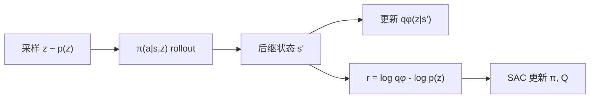
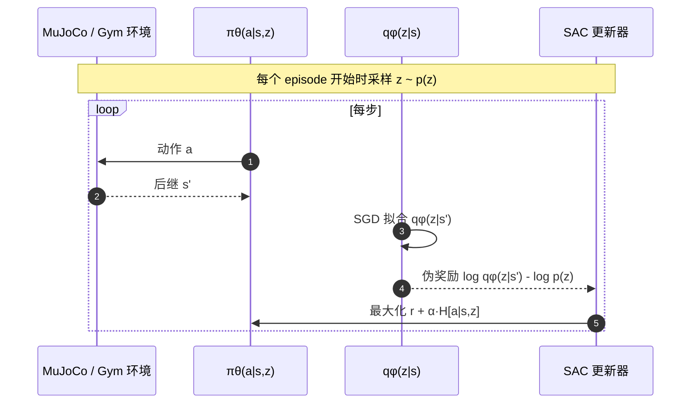

# Diversity is All You Need（DIAYN）

**DIAYN**（*Diversity is All You Need: Learning Skills without a Reward Function*；Eysenbach et al.；[arXiv:1802.06070](https://arxiv.org/abs/1802.06070)，ICLR 2018）提出 **无任务奖励** 的技能发现：用 **互信息** 让 latent skill $z$ 与访问状态 $s'$ 相关，并用 **最大熵 SAC** 保持探索。在 Ant 等环境 **自动涌现** 走、跳、翻、滑；多个 benchmark 上 **某一技能零-shot 即高回报**，并可 **warm-start** 下游任务、**分层 RL** 与 **模仿**。

## 一句话定义

**把「学技能」改写成「让不同 $z$ 访问可区分状态分区 + 动作用最大熵变随机」，从而在零外部奖励下得到可组合、可迁移的 low-level 行为库。**

## 英文缩写速查

| 缩写 | 英文全称 | 简要说明 |
|------|----------|----------|
| DIAYN | Diversity Is All You Need | 本文无监督技能发现方法 |
| SAC | Soft Actor-Critic | 带熵正则的 off-policy RL，作 DIAYN 优化器 |
| BFM | Behavior Foundation Model | 行为预训练/技能先验范式（taxonomy #03 intrinsic） |
| MI | Mutual Information | $I(S';Z)$ 驱动技能与状态绑定 |
| RL | Reinforcement Learning | 策略与 discriminator 的学习框架 |

## 为什么重要

- **BFM 03 类原型：** 「先无监督学 diverse skills，再服务任务」在 [BFM 41 篇地图](../overview/bfm-41-papers-technology-map.md) 中占 **#30/41** intrinsic 预训练位。
- **探索与稀疏奖励：** 技能库缩短 effective horizon，缓解 **纯 task reward 冷启动**。
- **理论干净：** 合作式（非 adversarial min-max）目标；gridworld 上可证 **均匀分区** 为最优。

## 核心信息

| 字段 | 内容 |
|------|------|
| **机构** | 谷歌（Google Brain）；加州大学伯克利分校（UC Berkeley） |
| **算法** | SAC + discriminator $q_\phi(z|s)$；categorical $p(z)$ |
| **伪奖励** | $r_z(s)=\log q_\phi(z|s)-\log p(z)$ |
| **超参** | 熵系数 $\alpha=0.1$；网络 300 hidden（较 SAC 原文加大容量） |
| **开源** | **已开源** — [DIAYN.md](https://github.com/ben-eysenbach/sac/blob/master/DIAYN.md)（归档 [diayn_sac.md](../../sources/repos/diayn_sac.md)） |

## 核心原理

### 1) 信息论目标

最大化：
$$
\mathcal{G}=\mathbb{E}_{z\sim p(z),\,\pi}[\log q_\phi(z|s')-\log p(z)] + \mathcal{H}[a|s,z]
$$

- **第一项：** 让后继状态 **携带 skill 信息**（discriminator 可猜 $z$）。
- **第二项：** 策略 **高熵** → 同 skill 内随机探索 → 技能必须 **远离** 彼此状态占用，否则无法保持可区分。

### 2) 三设计原则

1. **Skill 决定状态分布**，不是动作标签。
2. **用状态区分 skill**（动作对观察者不可见时仍有效，如抓杯施力但杯不动）。
3. **最大熵** 驱动 **多样性**，避免 collapse 到同一轨迹。

### 3) 训练循环

## 源码运行时序图

官方 [ben-eysenbach/sac · DIAYN.md](https://github.com/ben-eysenbach/sac/blob/master/DIAYN.md)（归档 [diayn_sac.md](../../sources/repos/diayn_sac.md)）：

- **下游微调：** 固定或继续 $z$，用 **真实 task reward** 替换伪奖励，从 **最高预训回报技能** warm-start。

## 工程实践

| 项 | 建议 |
|----|------|
| 技能数 $|Z|$ | 过少 collapse；过多难训 discriminator；Ant 实验常用 **10–50** 量级（见原文附录） |
| 熵系数 $\alpha$ | 论文 **0.1** 平衡探索 vs 可区分；过高 skill 糊成一片 |
| 网络容量 | 多技能需 **更大 Q/V/π**（300 units vs SAC 默认 128） |
| 下游 | 优先 **挑最高 zero-shot 技能** 再 finetune，而非随机 init |
| 分层 | meta 随机选 $z$ 预训阶段；任务阶段学 **选 skill** 或 **sequential composition** |
| 现代栈 | 官方 TF1 年代码；新项可用 PyTorch 复现对照语义 |

## 实验与评测

### 技能质量

- **2D navigation：** 6 skills **均匀分区** 状态空间（Fig.2a）。
- **Ant locomotion：** **走 / 跳 / 翻 / 滑** 等无名称奖励涌现（Fig.3）。
- **Classic control：** Inverted pendulum、Mountain car **多种 distinct 解**。

### 下游能力

- **Zero-shot task：** 多 benchmark **某一技能** 在未见 task reward 训练下 **直接高回报**（§4.1 Question 4）。
- **Policy initialization：** 较随机 init **明显加速** 收敛（Fig.5，5 seeds 平均）。
- **Hierarchy / Imitation：** 稀疏奖励与专家匹配任务上 **优于** 部分 baselines（§4.2）。

### 稳定性

- vs adversarial unsupervised RL：**合作目标**，训练更稳。
- **Seed 鲁棒：** 技能形态与下游性能对 seed **不敏感**（Fig.4/6/13）。

## 与其他工作对比

DIAYN 与另两条「给策略一个 motor prior」的路线放在一起才看得清它的取舍——差别在 **先验从哪来**，而不是算法复杂度：

| 维度 | DIAYN（本文） | [AMP / 对抗动作先验](../methods/amp-reward.md) | 纯任务奖励 RL（从零训） |
|------|---------------|-----------------------------------------------|--------------------------|
| 先验来源 | 无任何外部数据，互信息 $I(S';Z)$ 自造 | 专家动捕 / 参考动作分布 | 无，全靠 reward shaping |
| 博弈结构 | **合作式**：discriminator 与策略同向优化 | **对抗式** min-max | 不适用 |
| 产出物 | 可区分状态分区的 low-level 技能库 | 风格受参考约束的单策略/风格项 | 单任务策略 |
| 下游用法 | 挑 zero-shot 最优技能 / warm-start / 分层 | 作为风格正则叠加任务奖励 | 直接部署 |
| 典型失效 | 技能多样但 **对任务无用** | 参考数据覆盖不到的动作学不出来 | 稀疏奖励冷启动 |

- **「多样」和「有用」是两件事：** 本文的 zero-shot 高回报是 **在若干 benchmark 上命中**，不是每个 $z$ 都对下游有价值；把 DIAYN 当预训练用时，**技能选择/微调这一步不能省**。
- **在 BFM 分类学中的位置：** 属 [#03 intrinsic reward 预训练](../overview/bfm-category-03-intrinsic-reward-pretraining.md) 一支，与探索 bonus 同为「不依赖任务奖励的行为来源」；与依赖专家数据的模仿式 BFM 分属两个供给侧，不能直接比样本效率（谱系见 [BFM 41 篇地图](../overview/bfm-41-papers-technology-map.md)）。
- **横比注意：** 原文实验在 MuJoCo **低维 state** 上完成；与人形/视觉输入的技能发现工作对照时，$|Z|$、熵系数与网络容量都需重标定，不能照搬 Ant 超参当作方法差异的证据。

## 结论

**DIAYN 证明：一个极简互信息 + 熵目标，足以在连续控制里「无师自通」出一库可区分技能，并当 BFM 式预训练用。**

1. **伪奖励 $ \log q_\phi(z|s)-\log p(z)$** 是核心接口 — 减 baseline $\log p(z)$ 非可有可无（Appendix A：非负奖励 + 吸收态解释）。
2. **状态分区** 比 **动作聚类** 更符合「技能」语义，对 manipulation 外力不可见场景尤其重要。
3. **多样性 ≠ 任务有用** — zero-shot 偶尔命中 benchmark，但 **不保证** 每个 $z$ 都对下游有用；仍需 **skill 选择 / finetune**。
4. **合作博弈** 相对 GAN 式 unsupervised RL 更稳，是后续 VIC/VALOR 等线的起点。
5. **BFM 读法：** 属 **03 Intrinsic reward 预训练** — 与 AMP、探索 bonus 等并列，提供 **可迁移 motor prior**。
6. **工程边界：** MuJoCo 低维；上人形需重新标定 $|Z|$、奖励尺度与 sim2real，**勿照搬 Ant 超参**。

## 局限与风险

- **无任务对齐** 时技能可能 **多样但无用**（如原地抖动可区分但无部署价值）。
- **Discriminator 过拟合** 短轨迹 → 伪奖励 hacking；需足够状态覆盖。
- **连续高维视觉** 需 CNN discriminator — 原文以 **低维 state** 为主。
- **与 AMP 对比：** DIAYN **无** 专家动作先验；探索更广但 **任务相关性弱**。

## 关联页面

- [behavior-foundation-model.md](../concepts/behavior-foundation-model.md)
- [bfm-category-03-intrinsic-reward-pretraining.md](../overview/bfm-category-03-intrinsic-reward-pretraining.md)
- [bfm-41-papers-technology-map.md](../overview/bfm-41-papers-technology-map.md)

## 参考来源

- [bfm_awesome_diayn_iclr_2018.md](../../sources/papers/bfm_awesome_diayn_iclr_2018.md)
- [diayn_sac.md](../../sources/repos/diayn_sac.md)
- [bfm_awesome_41_catalog.md](../../sources/papers/bfm_awesome_41_catalog.md)
- 论文：<https://arxiv.org/abs/1802.06070>

## 推荐继续阅读

- 项目页（视频）：<https://sites.google.com/view/diayn/>
- 官方代码：<https://github.com/ben-eysenbach/sac/blob/master/DIAYN.md>
- BFM 综述：[A Survey of Behavior Foundation Model](https://arxiv.org/abs/2506.20487)
